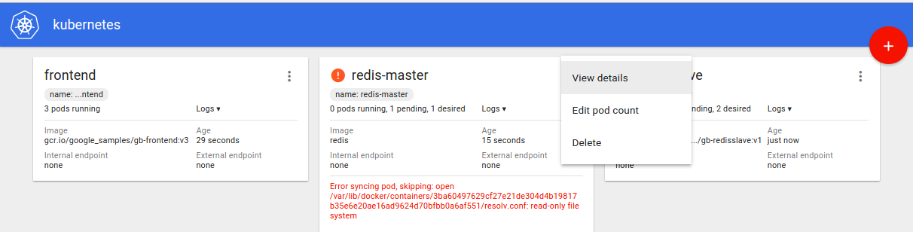

<!-- BEGIN MUNGE: GENERATED_TOC -->

- [v1.3.6](#v136)
  - [Downloads](#downloads)
  - [Changelog since v1.3.5](#changelog-since-v135)
    - [Other notable changes](#other-notable-changes)
- [v1.4.0-alpha.3](#v140-alpha3)
  - [Downloads](#downloads-1)
  - [Changelog since v1.4.0-alpha.2](#changelog-since-v140-alpha2)
    - [Action Required](#action-required)
    - [Other notable changes](#other-notable-changes-1)
- [v1.3.5](#v135)
  - [Downloads](#downloads-2)
  - [Changelog since v1.3.4](#changelog-since-v134)
    - [Other notable changes](#other-notable-changes-2)
- [v1.3.4](#v134)
  - [Downloads](#downloads-3)
  - [Changelog since v1.3.3](#changelog-since-v133)
    - [Other notable changes](#other-notable-changes-3)
- [v1.4.0-alpha.2](#v140-alpha2)
  - [Downloads](#downloads-4)
  - [Changelog since v1.4.0-alpha.1](#changelog-since-v140-alpha1)
    - [Action Required](#action-required-1)
    - [Other notable changes](#other-notable-changes-4)
- [v1.3.3](#v133)
  - [Downloads](#downloads-5)
  - [Changelog since v1.3.2](#changelog-since-v132)
    - [Other notable changes](#other-notable-changes-5)
  - [Known Issues](#known-issues)
- [v1.3.2](#v132)
  - [Downloads](#downloads-6)
  - [Changelog since v1.3.1](#changelog-since-v131)
    - [Other notable changes](#other-notable-changes-6)
- [v1.3.1](#v131)
  - [Downloads](#downloads-7)
  - [Changelog since v1.3.0](#changelog-since-v130)
    - [Other notable changes](#other-notable-changes-7)
- [v1.2.6](#v126)
  - [Downloads](#downloads-8)
  - [Changelog since v1.2.5](#changelog-since-v125)
    - [Other notable changes](#other-notable-changes-8)
- [v1.4.0-alpha.1](#v140-alpha1)
  - [Downloads](#downloads-9)
  - [Changelog since v1.3.0](#changelog-since-v130-1)
    - [Experimental Features](#experimental-features)
    - [Action Required](#action-required-2)
    - [Other notable changes](#other-notable-changes-9)
- [v1.3.0](#v130)
  - [Downloads](#downloads-10)
  - [Highlights](#highlights)
  - [Known Issues and Important Steps before Upgrading](#known-issues-and-important-steps-before-upgrading)
      - [ThirdPartyResource](#thirdpartyresource)
      - [kubectl](#kubectl)
      - [kubernetes Core Known Issues](#kubernetes-core-known-issues)
      - [Docker runtime Known Issues](#docker-runtime-known-issues)
      - [Rkt runtime Known Issues](#rkt-runtime-known-issues)
  - [Provider-specific Notes](#provider-specific-notes)
  - [Previous Releases Included in v1.3.0](#previous-releases-included-in-v130)
- [v1.3.0-beta.3](#v130-beta3)
  - [Downloads](#downloads-11)
  - [Changelog since v1.3.0-beta.2](#changelog-since-v130-beta2)
    - [Action Required](#action-required-3)
    - [Other notable changes](#other-notable-changes-10)
- [v1.2.5](#v125)
  - [Downloads](#downloads-12)
  - [Changes since v1.2.4](#changes-since-v124)
    - [Other notable changes](#other-notable-changes-11)
- [v1.3.0-beta.2](#v130-beta2)
  - [Downloads](#downloads-13)
  - [Changes since v1.3.0-beta.1](#changes-since-v130-beta1)
    - [Experimental Features](#experimental-features-1)
    - [Other notable changes](#other-notable-changes-12)
- [v1.3.0-beta.1](#v130-beta1)
  - [Downloads](#downloads-14)
  - [Changes since v1.3.0-alpha.5](#changes-since-v130-alpha5)
    - [Action Required](#action-required-4)
    - [Other notable changes](#other-notable-changes-13)
- [v1.3.0-alpha.5](#v130-alpha5)
  - [Downloads](#downloads-15)
  - [Changes since v1.3.0-alpha.4](#changes-since-v130-alpha4)
    - [Action Required](#action-required-5)
    - [Other notable changes](#other-notable-changes-14)
- [v1.3.0-alpha.4](#v130-alpha4)
  - [Downloads](#downloads-16)
  - [Changes since v1.3.0-alpha.3](#changes-since-v130-alpha3)
    - [Action Required](#action-required-6)
    - [Other notable changes](#other-notable-changes-15)
- [v1.2.4](#v124)
  - [Downloads](#downloads-17)
  - [Changes since v1.2.3](#changes-since-v123)
    - [Other notable changes](#other-notable-changes-16)
- [v1.3.0-alpha.3](#v130-alpha3)
  - [Downloads](#downloads-18)
  - [Changes since v1.3.0-alpha.2](#changes-since-v130-alpha2)
    - [Action Required](#action-required-7)
    - [Other notable changes](#other-notable-changes-17)
- [v1.2.3](#v123)
  - [Downloads](#downloads-19)
  - [Changes since v1.2.2](#changes-since-v122)
    - [Action Required](#action-required-8)
    - [Other notable changes](#other-notable-changes-18)
- [v1.3.0-alpha.2](#v130-alpha2)
  - [Downloads](#downloads-20)
  - [Changes since v1.3.0-alpha.1](#changes-since-v130-alpha1)
    - [Other notable changes](#other-notable-changes-19)
- [v1.2.2](#v122)
  - [Downloads](#downloads-21)
  - [Changes since v1.2.1](#changes-since-v121)
    - [Other notable changes](#other-notable-changes-20)
- [v1.2.1](#v121)
  - [Downloads](#downloads-22)
  - [Changes since v1.2.0](#changes-since-v120)
    - [Other notable changes](#other-notable-changes-21)
- [v1.3.0-alpha.1](#v130-alpha1)
  - [Downloads](#downloads-23)
  - [Changes since v1.2.0](#changes-since-v120-1)
    - [Action Required](#action-required-9)
    - [Other notable changes](#other-notable-changes-22)
- [v1.2.0](#v120)
  - [Downloads](#downloads-24)
  - [Changes since v1.1.1](#changes-since-v111)
    - [Major Themes](#major-themes)
    - [Other notable improvements](#other-notable-improvements)
    - [Experimental Features](#experimental-features-2)
    - [Action required](#action-required-10)
    - [Known Issues](#known-issues-1)
      - [Docker Known Issues](#docker-known-issues)
        - [1.9.1](#191)
    - [Provider-specific Notes](#provider-specific-notes-1)
      - [Various](#various)
      - [AWS](#aws)
      - [GCE](#gce)

<!-- END MUNGE: GENERATED_TOC -->

<!-- NEW RELEASE NOTES ENTRY -->

# v1.3.6

[Documentation](http://kubernetes.github.io) & [Examples](http://releases.k8s.io/release-1.3/examples)

## Downloads

binary | sha256 hash
------ | -----------
[kubernetes.tar.gz](https://storage.googleapis.com/kubernetes-release/release/v1.3.6/kubernetes.tar.gz) | `2db7ace2f72a2e162329a6dc969a5a158bb8c5d0f8054c5b1b2b1063aa22020d`

## Changelog since v1.3.5

### Other notable changes

* Addresses vSphere Volume Attach limits ([#29881](https://github.com/kubernetes/kubernetes/pull/29881), [@dagnello](https://github.com/dagnello))
* Increase request timeout based on termination grace period ([#31275](https://github.com/kubernetes/kubernetes/pull/31275), [@dims](https://github.com/dims))
* Skip safe to detach check if node API object no longer exists ([#30737](https://github.com/kubernetes/kubernetes/pull/30737), [@saad-ali](https://github.com/saad-ali))
* Nodecontroller doesn't flip readiness on pods if kubeletVersion < 1.2.0 ([#30828](https://github.com/kubernetes/kubernetes/pull/30828), [@bprashanth](https://github.com/bprashanth))
* Update cadvisor to v0.23.9 to fix a problem where attempting to gather container filesystem usage statistics could result in corrupted devicemapper thin pool storage for Docker. ([#30307](https://github.com/kubernetes/kubernetes/pull/30307), [@sjenning](https://github.com/sjenning))

# v1.4.0-alpha.3

[Documentation](http://kubernetes.github.io) & [Examples](http://releases.k8s.io/master/examples)

## Downloads

binary | sha256 hash
------ | -----------
[kubernetes.tar.gz](https://storage.googleapis.com/kubernetes-release/release/v1.4.0-alpha.3/kubernetes.tar.gz) | `8055f0373e3b6bdee865749ef9bcfc765396a40f39ec2fa3cd31b675d1bbf5d9`

## Changelog since v1.4.0-alpha.2

### Action Required

* Moved init-container feature from alpha to beta. ([#31026](https://github.com/kubernetes/kubernetes/pull/31026), [@erictune](https://github.com/erictune))
    * Security Action Required:
    * This only applies to you if you use the PodSecurityPolicy feature.  You are using that feature if `kubectl get podsecuritypolicy` returns one or more objects.  If it returns an error, you are not using it.
    * If there are any pods with the key `pods.beta.kubernetes.io/init-containers`, then that pod may not have been filtered by the PodSecurityPolicy.  You should find such pods and either delete them or audit them to ensure they do not use features that you intend to be blocked by PodSecurityPolicy.
    * Explanation of Feature
    * In 1.3, an init container is specified with this annotation key
    * on the pod or pod template: `pods.alpha.kubernetes.io/init-containers`.
    * In 1.4, either that key or this key: `pods.beta.kubernetes.io/init-containers`,
    * can be used.
    * When you GET an object, you will see both annotation keys with the same values.
    * You can safely roll back from 1.4 to 1.3, and things with init-containers
    * will still work (pods, deployments, etc).
    * If you are running 1.3, only use the alpha annotation, or it may be lost when
    * rolling forward.
    * The status has moved from annotation key
    * `pods.beta.kubernetes.io/init-container-statuses` to
    * `pods.beta.kubernetes.io/init-container-statuses`.
    * Any code that inspects this annotation should be changed to use the new key.
    * State of Initialization will continue to be reported in both pods.alpha.kubernetes.io/initialized
    * and in `podStatus.conditions.{status: "True", type: Initialized}`
* Action required: federation-only: Please update your cluster name to be a valid DNS label. ([#30956](https://github.com/kubernetes/kubernetes/pull/30956), [@nikhiljindal](https://github.com/nikhiljindal))
    * Updating federation.v1beta1.Cluster API to disallow subdomains as valid cluster names. Only DNS labels are allowed as valid cluster names now.
* [Kubelet] Rename `--config` to `--pod-manifest-path`. `--config` is deprecated. ([#29999](https://github.com/kubernetes/kubernetes/pull/29999), [@mtaufen](https://github.com/mtaufen))

### Other notable changes

* rkt: Improve support for privileged pod (pod whose all containers are privileged)  ([#31286](https://github.com/kubernetes/kubernetes/pull/31286), [@yifan-gu](https://github.com/yifan-gu))
* The pod annotation `security.alpha.kubernetes.io/sysctls` now allows customization of namespaced and well isolated kernel parameters (sysctls), starting with `kernel.shm_rmid_forced`, `net.ipv4.ip_local_port_range` and `net.ipv4.tcp_syncookies` for Kubernetes 1.4. ([#27180](https://github.com/kubernetes/kubernetes/pull/27180), [@sttts](https://github.com/sttts))
    * The pod annotation  `security.alpha.kubernetes.io/unsafe-sysctls` allows customization of namespaced sysctls where isolation is unclear. Unsafe sysctls must be enabled at-your-own-risk on the kubelet with the `--experimental-allowed-unsafe-sysctls` flag. Future versions will improve on resource isolation and more sysctls will be considered safe.
* Increase request timeout based on termination grace period ([#31275](https://github.com/kubernetes/kubernetes/pull/31275), [@dims](https://github.com/dims))
* Fixed two issues of kubectl bash completion. ([#31135](https://github.com/kubernetes/kubernetes/pull/31135), [@xingzhou](https://github.com/xingzhou))
* Reduced size of fluentd images. ([#31239](https://github.com/kubernetes/kubernetes/pull/31239), [@aledbf](https://github.com/aledbf))
* support Azure data disk volume ([#29836](https://github.com/kubernetes/kubernetes/pull/29836), [@rootfs](https://github.com/rootfs))
* fix Openstack provider to allow more than one service port for lbaas v2 ([#30649](https://github.com/kubernetes/kubernetes/pull/30649), [@dagnello](https://github.com/dagnello))
* Add kubelet --network-plugin-mtu flag for MTU selection ([#30376](https://github.com/kubernetes/kubernetes/pull/30376), [@justinsb](https://github.com/justinsb))
* Let Services preserve client IPs and not double-hop from external LBs (alpha) ([#29409](https://github.com/kubernetes/kubernetes/pull/29409), [@girishkalele](https://github.com/girishkalele))
* [Kubelet] Optionally consume configuration from <node-name> named config maps ([#30090](https://github.com/kubernetes/kubernetes/pull/30090), [@mtaufen](https://github.com/mtaufen))
* [GarbageCollector] Allow per-resource default garbage collection behavior ([#30838](https://github.com/kubernetes/kubernetes/pull/30838), [@caesarxuchao](https://github.com/caesarxuchao))
* Action required: If you have a running federation control plane, you will have to ensure that for all federation resources, the corresponding namespace exists in federation control plane. ([#31139](https://github.com/kubernetes/kubernetes/pull/31139), [@nikhiljindal](https://github.com/nikhiljindal))
    * federation-apiserver now supports NamespaceLifecycle admission control, which is enabled by default. Set the --admission-control flag on the server to change that.
* Configure webhook ([#30923](https://github.com/kubernetes/kubernetes/pull/30923), [@Q-Lee](https://github.com/Q-Lee))
* Federated Ingress Controller ([#30419](https://github.com/kubernetes/kubernetes/pull/30419), [@quinton-hoole](https://github.com/quinton-hoole))
* Federation replicaset controller ([#29741](https://github.com/kubernetes/kubernetes/pull/29741), [@jianhuiz](https://github.com/jianhuiz))
* AWS: More ELB attributes via service annotations ([#30695](https://github.com/kubernetes/kubernetes/pull/30695), [@krancour](https://github.com/krancour))
* Impersonate user extra ([#30881](https://github.com/kubernetes/kubernetes/pull/30881), [@deads2k](https://github.com/deads2k))
* DNS, Heapster and UI are critical addons ([#30995](https://github.com/kubernetes/kubernetes/pull/30995), [@piosz](https://github.com/piosz))
* AWS: Support HTTP->HTTP mode for ELB ([#30563](https://github.com/kubernetes/kubernetes/pull/30563), [@knarz](https://github.com/knarz))
* kube-up: Allow IP restrictions for SSH and HTTPS API access on AWS. ([#27061](https://github.com/kubernetes/kubernetes/pull/27061), [@Naddiseo](https://github.com/Naddiseo))
* Add readyReplicas to replica sets ([#29481](https://github.com/kubernetes/kubernetes/pull/29481), [@kargakis](https://github.com/kargakis))
* The implicit registration of Prometheus metrics for request count and latency have been removed, and a plug-able interface was added. If you were using our client libraries in your own binaries and want these metrics, add the following to your imports in the main package: "k8s.io/pkg/client/metrics/prometheus".  ([#30638](https://github.com/kubernetes/kubernetes/pull/30638), [@krousey](https://github.com/krousey))
* Add support for --image-pull-policy to 'kubectl run' ([#30614](https://github.com/kubernetes/kubernetes/pull/30614), [@AdoHe](https://github.com/AdoHe))
* x509 authenticator: get groups from subject's organization field ([#30392](https://github.com/kubernetes/kubernetes/pull/30392), [@ericchiang](https://github.com/ericchiang))
* Add initial support for TokenFile to to the client config file. ([#29696](https://github.com/kubernetes/kubernetes/pull/29696), [@brendandburns](https://github.com/brendandburns))
* update kubectl help output for better organization ([#25524](https://github.com/kubernetes/kubernetes/pull/25524), [@AdoHe](https://github.com/AdoHe))
* daemonset controller should respect taints ([#31020](https://github.com/kubernetes/kubernetes/pull/31020), [@mikedanese](https://github.com/mikedanese))
* Implement TLS bootstrap for kubelet using `--experimental-bootstrap-kubeconfig`  (2nd take) ([#30922](https://github.com/kubernetes/kubernetes/pull/30922), [@yifan-gu](https://github.com/yifan-gu))
* rkt: Support subPath volume mounts feature ([#30934](https://github.com/kubernetes/kubernetes/pull/30934), [@yifan-gu](https://github.com/yifan-gu))
* Return container command exit codes in kubectl run/exec ([#26541](https://github.com/kubernetes/kubernetes/pull/26541), [@sttts](https://github.com/sttts))
* Fix kubectl describe to display a container's resource limit env vars as node allocatable when the limits are not set ([#29849](https://github.com/kubernetes/kubernetes/pull/29849), [@aveshagarwal](https://github.com/aveshagarwal))
* The `valueFrom.fieldRef.name` field on environment variables in pods and objects with pod templates now allows two additional fields to be used: ([#27880](https://github.com/kubernetes/kubernetes/pull/27880), [@smarterclayton](https://github.com/smarterclayton))
        * `spec.nodeName` will return the name of the node this pod is running on
        * `spec.serviceAccountName` will return the name of the service account this pod is running under
* Adding ImagePolicyWebhook admission controller. ([#30631](https://github.com/kubernetes/kubernetes/pull/30631), [@ecordell](https://github.com/ecordell))
* Validate involvedObject.Namespace matches event.Namespace ([#30533](https://github.com/kubernetes/kubernetes/pull/30533), [@liggitt](https://github.com/liggitt))
* allow group impersonation ([#30803](https://github.com/kubernetes/kubernetes/pull/30803), [@deads2k](https://github.com/deads2k))
* Always return command output for exec probes and kubelet RunInContainer ([#30731](https://github.com/kubernetes/kubernetes/pull/30731), [@ncdc](https://github.com/ncdc))
* Enable the garbage collector by default ([#30480](https://github.com/kubernetes/kubernetes/pull/30480), [@caesarxuchao](https://github.com/caesarxuchao))
* NONE ([#30599](https://github.com/kubernetes/kubernetes/pull/30599), [@therc](https://github.com/therc))
* use valid_resources to replace kubectl.PossibleResourceTypes ([#30955](https://github.com/kubernetes/kubernetes/pull/30955), [@lojies](https://github.com/lojies))
* oidc auth provider: don't trim issuer URL ([#30944](https://github.com/kubernetes/kubernetes/pull/30944), [@ericchiang](https://github.com/ericchiang))
* Add a short `-n` for `kubectl --namespace` ([#30630](https://github.com/kubernetes/kubernetes/pull/30630), [@silasbw](https://github.com/silasbw))
* Federated secret controller ([#30669](https://github.com/kubernetes/kubernetes/pull/30669), [@kshafiee](https://github.com/kshafiee))
* Add Events for operation_executor to show status of mounts, failed/successful to show in describe events ([#27778](https://github.com/kubernetes/kubernetes/pull/27778), [@screeley44](https://github.com/screeley44))
* Alpha support for OpenAPI (aka. Swagger 2.0) specification served on /swagger.json (enabled by default)  ([#30233](https://github.com/kubernetes/kubernetes/pull/30233), [@mbohlool](https://github.com/mbohlool))
* Disable linux/ppc64le compilation by default ([#30659](https://github.com/kubernetes/kubernetes/pull/30659), [@ixdy](https://github.com/ixdy))
* Implement dynamic provisioning (beta) of PersistentVolumes via StorageClass ([#29006](https://github.com/kubernetes/kubernetes/pull/29006), [@jsafrane](https://github.com/jsafrane))
* Allow setting permission mode bits on secrets, configmaps and downwardAPI files ([#28936](https://github.com/kubernetes/kubernetes/pull/28936), [@rata](https://github.com/rata))
* Skip safe to detach check if node API object no longer exists ([#30737](https://github.com/kubernetes/kubernetes/pull/30737), [@saad-ali](https://github.com/saad-ali))
* The Kubelet now supports the `--require-kubeconfig` option which reads all client config from the provided `--kubeconfig` file and will cause the Kubelet to exit with error code 1 on error.  It also forces the Kubelet to use the server URL from the kubeconfig file rather than the  `--api-servers` flag.  Without this flag set, a failure to read the kubeconfig file would only result in a warning message. ([#30798](https://github.com/kubernetes/kubernetes/pull/30798), [@smarterclayton](https://github.com/smarterclayton))
    * In a future release, the value of this flag will be defaulted to `true`.
* Adding container image verification webhook API. ([#30241](https://github.com/kubernetes/kubernetes/pull/30241), [@Q-Lee](https://github.com/Q-Lee))
* Nodecontroller doesn't flip readiness on pods if kubeletVersion < 1.2.0 ([#30828](https://github.com/kubernetes/kubernetes/pull/30828), [@bprashanth](https://github.com/bprashanth))
* AWS: Handle kube-down case where the LaunchConfig is dangling ([#30816](https://github.com/kubernetes/kubernetes/pull/30816), [@zmerlynn](https://github.com/zmerlynn))
* kubectl will no longer do client-side defaulting on create and replace. ([#30250](https://github.com/kubernetes/kubernetes/pull/30250), [@krousey](https://github.com/krousey))
* Added warning msg for `kubectl get` ([#28352](https://github.com/kubernetes/kubernetes/pull/28352), [@vefimova](https://github.com/vefimova))
* Removed support for HPA in extensions client. ([#30504](https://github.com/kubernetes/kubernetes/pull/30504), [@piosz](https://github.com/piosz))
* Implement DisruptionController. ([#25921](https://github.com/kubernetes/kubernetes/pull/25921), [@mml](https://github.com/mml))
* [Kubelet] Check if kubelet is running as uid 0 ([#30466](https://github.com/kubernetes/kubernetes/pull/30466), [@vishh](https://github.com/vishh))
* Fix third party APIResource reporting ([#29724](https://github.com/kubernetes/kubernetes/pull/29724), [@brendandburns](https://github.com/brendandburns))
* speed up RC scaler ([#30383](https://github.com/kubernetes/kubernetes/pull/30383), [@deads2k](https://github.com/deads2k))
* Set pod state as "unknown" when CNI plugin fails ([#30137](https://github.com/kubernetes/kubernetes/pull/30137), [@nhlfr](https://github.com/nhlfr))
* Cluster Federation components can now be built and deployed using the make command. Please see federation/README.md for details. ([#29515](https://github.com/kubernetes/kubernetes/pull/29515), [@madhusudancs](https://github.com/madhusudancs))
* Adding events to federation control plane ([#30421](https://github.com/kubernetes/kubernetes/pull/30421), [@nikhiljindal](https://github.com/nikhiljindal))
* [kubelet] Introduce --protect-kernel-defaults flag to make the tunable behaviour configurable ([#27874](https://github.com/kubernetes/kubernetes/pull/27874), [@ingvagabund](https://github.com/ingvagabund))
* Add support for kube-up.sh to deploy Calico network policy to GCI masters ([#29037](https://github.com/kubernetes/kubernetes/pull/29037), [@matthewdupre](https://github.com/matthewdupre))
* Added 'kubectl top' command showing the resource usage metrics. ([#28844](https://github.com/kubernetes/kubernetes/pull/28844), [@mksalawa](https://github.com/mksalawa))
* Add basic audit logging ([#27087](https://github.com/kubernetes/kubernetes/pull/27087), [@soltysh](https://github.com/soltysh))
* Marked NodePhase deprecated. ([#30005](https://github.com/kubernetes/kubernetes/pull/30005), [@dchen1107](https://github.com/dchen1107))
* Name the job created by scheduledjob (sj) deterministically with sj's name and a hash of job's scheduled time. ([#30420](https://github.com/kubernetes/kubernetes/pull/30420), [@janetkuo](https://github.com/janetkuo))
* add metrics for workqueues ([#30296](https://github.com/kubernetes/kubernetes/pull/30296), [@deads2k](https://github.com/deads2k))
* Adding ingress resource to federation apiserver ([#30112](https://github.com/kubernetes/kubernetes/pull/30112), [@nikhiljindal](https://github.com/nikhiljindal))
* Update Dashboard UI to version v1.1.1 ([#30273](https://github.com/kubernetes/kubernetes/pull/30273), [@bryk](https://github.com/bryk))
* Update etcd 2.2 references to use 3.0.x ([#29399](https://github.com/kubernetes/kubernetes/pull/29399), [@timothysc](https://github.com/timothysc))
* HPA: ignore scale targets whose replica count is 0 ([#29212](https://github.com/kubernetes/kubernetes/pull/29212), [@sjenning](https://github.com/sjenning))
* Add total inodes to kubelet summary api ([#30231](https://github.com/kubernetes/kubernetes/pull/30231), [@derekwaynecarr](https://github.com/derekwaynecarr))
* Updates required for juju kubernetes to use the tls-terminated etcd charm. ([#30104](https://github.com/kubernetes/kubernetes/pull/30104), [@mbruzek](https://github.com/mbruzek))
* Fix PVC.Status.Capacity and AccessModes after binding ([#29982](https://github.com/kubernetes/kubernetes/pull/29982), [@jsafrane](https://github.com/jsafrane))
* allow a read-only rbd image mounted by multiple pods ([#29622](https://github.com/kubernetes/kubernetes/pull/29622), [@rootfs](https://github.com/rootfs))
* [kubelet] Auto-discover node IP if neither cloud provider exists and IP is not explicitly specified ([#29907](https://github.com/kubernetes/kubernetes/pull/29907), [@luxas](https://github.com/luxas))
* kubectl config set-crentials: add arguments for auth providers ([#30007](https://github.com/kubernetes/kubernetes/pull/30007), [@ericchiang](https://github.com/ericchiang))
* Scheduledjob controller ([#29137](https://github.com/kubernetes/kubernetes/pull/29137), [@janetkuo](https://github.com/janetkuo))
* add subjectaccessreviews resource ([#20573](https://github.com/kubernetes/kubernetes/pull/20573), [@deads2k](https://github.com/deads2k))
* AWS/GCE: Rework use of master name ([#30047](https://github.com/kubernetes/kubernetes/pull/30047), [@zmerlynn](https://github.com/zmerlynn))
* Add density (batch pods creation latency and resource) and resource performance tests to `test-e2e-node' built for Linux only ([#30026](https://github.com/kubernetes/kubernetes/pull/30026), [@coufon](https://github.com/coufon))
* Clean up items from moving local cluster setup guides ([#30035](https://github.com/kubernetes/kubernetes/pull/30035), [@pwittrock](https://github.com/pwittrock))
* federation: Adding secret API ([#29138](https://github.com/kubernetes/kubernetes/pull/29138), [@kshafiee](https://github.com/kshafiee))
* Introducing ScheduledJobs as described in [the proposal](docs/proposals/scheduledjob.md) as part of `batch/v2alpha1` version (experimental feature). ([#25816](https://github.com/kubernetes/kubernetes/pull/25816), [@soltysh](https://github.com/soltysh))
* Node disk pressure should induce image gc ([#29880](https://github.com/kubernetes/kubernetes/pull/29880), [@derekwaynecarr](https://github.com/derekwaynecarr))
* oidc authentication plugin: don't trim issuer URLs with trailing slashes ([#29860](https://github.com/kubernetes/kubernetes/pull/29860), [@ericchiang](https://github.com/ericchiang))
* Allow leading * in ingress hostname ([#29204](https://github.com/kubernetes/kubernetes/pull/29204), [@aledbf](https://github.com/aledbf))
* Rewrite service controller to apply best controller pattern ([#25189](https://github.com/kubernetes/kubernetes/pull/25189), [@mfanjie](https://github.com/mfanjie))
* Fix issue with kubectl annotate when --resource-version is provided. ([#29319](https://github.com/kubernetes/kubernetes/pull/29319), [@juanvallejo](https://github.com/juanvallejo))
* Reverted conversion of influx-db to Pet Set, it is now a Replication Controller. ([#30080](https://github.com/kubernetes/kubernetes/pull/30080), [@jszczepkowski](https://github.com/jszczepkowski))
* rbac validation: rules can't combine non-resource URLs and regular resources ([#29930](https://github.com/kubernetes/kubernetes/pull/29930), [@ericchiang](https://github.com/ericchiang))
* VSAN support for VSphere Volume Plugin ([#29172](https://github.com/kubernetes/kubernetes/pull/29172), [@abrarshivani](https://github.com/abrarshivani))
* Addresses vSphere Volume Attach limits ([#29881](https://github.com/kubernetes/kubernetes/pull/29881), [@dagnello](https://github.com/dagnello))
* allow restricting subresource access ([#29988](https://github.com/kubernetes/kubernetes/pull/29988), [@deads2k](https://github.com/deads2k))
* Add density (batch pods creation latency and resource) and resource performance tests to `test-e2e-node' ([#29764](https://github.com/kubernetes/kubernetes/pull/29764), [@coufon](https://github.com/coufon))
* Allow Secret & ConfigMap keys to contain caps, dots, and underscores ([#25458](https://github.com/kubernetes/kubernetes/pull/25458), [@errm](https://github.com/errm))
* allow watching old resources with kubectl ([#27392](https://github.com/kubernetes/kubernetes/pull/27392), [@sjenning](https://github.com/sjenning))
* azure: kube-up respects AZURE_RESOURCE_GROUP ([#28700](https://github.com/kubernetes/kubernetes/pull/28700), [@colemickens](https://github.com/colemickens))
* Modified influxdb petset to provision persistent  volume. ([#28840](https://github.com/kubernetes/kubernetes/pull/28840), [@jszczepkowski](https://github.com/jszczepkowski))
* Allow service names up to 63 characters (RFC 1035) ([#29523](https://github.com/kubernetes/kubernetes/pull/29523), [@fraenkel](https://github.com/fraenkel))
* Change eviction policies in NodeController: ([#28897](https://github.com/kubernetes/kubernetes/pull/28897), [@gmarek](https://github.com/gmarek))
    * - add a "partialDisruption" mode, when more than 33% of Nodes in the zone are not Ready
    * - add "fullDisruption" mode, when all Nodes in the zone are not Ready
    * Eviction behavior depends on the mode in which NodeController is operating:
    * - if the new state is "partialDisruption" or "fullDisruption" we call a user defined function that returns a new QPS to use (default 1/10 of the default rate, and the default rate respectively),
    * - if the new state is "normal" we resume normal operation (go back to default limiter settings),
    * - if all zones in the cluster are in "fullDisruption" state we stop all evictions.
* Add a flag for `kubectl expose`to set ClusterIP and allow headless services ([#28239](https://github.com/kubernetes/kubernetes/pull/28239), [@ApsOps](https://github.com/ApsOps))
* Add support to quota pvc storage requests ([#28636](https://github.com/kubernetes/kubernetes/pull/28636), [@derekwaynecarr](https://github.com/derekwaynecarr))

# v1.3.5

[Documentation](http://kubernetes.github.io) & [Examples](http://releases.k8s.io/release-1.3/examples)

## Downloads

binary | sha256 hash
------ | -----------
[kubernetes.tar.gz](https://storage.googleapis.com/kubernetes-release/release/v1.3.5/kubernetes.tar.gz) | `46be88ce927124f7cef7e280720b42c63051086880b7ebdba298b561dbe19f82`

## Changelog since v1.3.4

### Other notable changes

* Update Dashboard UI to version v1.1.1 ([#30273](https://github.com/kubernetes/kubernetes/pull/30273), [@bryk](https://github.com/bryk))
* allow restricting subresource access ([#30001](https://github.com/kubernetes/kubernetes/pull/30001), [@deads2k](https://github.com/deads2k))
* Fix PVC.Status.Capacity and AccessModes after binding ([#29982](https://github.com/kubernetes/kubernetes/pull/29982), [@jsafrane](https://github.com/jsafrane))
* oidc authentication plugin: don't trim issuer URLs with trailing slashes ([#29860](https://github.com/kubernetes/kubernetes/pull/29860), [@ericchiang](https://github.com/ericchiang))
* network/cni: Bring up the `lo` interface for rkt ([#29310](https://github.com/kubernetes/kubernetes/pull/29310), [@euank](https://github.com/euank))
* Fixing kube-up for CVM masters. ([#29140](https://github.com/kubernetes/kubernetes/pull/29140), [@maisem](https://github.com/maisem))

# v1.3.4

[Documentation](http://kubernetes.github.io) & [Examples](http://releases.k8s.io/release-1.3/examples)

## Downloads

binary | sha256 hash
------ | -----------
[kubernetes.tar.gz](https://storage.googleapis.com/kubernetes-release/release/v1.3.4/kubernetes.tar.gz) | `818acc1a8ba61cff434d4c0c5aa3d342d06e6907b565cfd8651b8cfcf3f0a1e6`

## Changelog since v1.3.3

### Other notable changes

* NetworkPolicy cherry-pick 1.3 ([#29556](https://github.com/kubernetes/kubernetes/pull/29556), [@caseydavenport](https://github.com/caseydavenport))
* Allow mounts to run in parallel for non-attachable volumes ([#28939](https://github.com/kubernetes/kubernetes/pull/28939), [@saad-ali](https://github.com/saad-ali))
* add enhanced volume and mount logging for block devices ([#24797](https://github.com/kubernetes/kubernetes/pull/24797), [@screeley44](https://github.com/screeley44))
* kube-up: increase download timeout for kubernetes.tar.gz ([#29426](https://github.com/kubernetes/kubernetes/pull/29426), [@justinsb](https://github.com/justinsb))
* Fix RBAC authorizer of ServiceAccount ([#29071](https://github.com/kubernetes/kubernetes/pull/29071), [@albatross0](https://github.com/albatross0))
* Update docker engine-api to dea108d3aa ([#29144](https://github.com/kubernetes/kubernetes/pull/29144), [@ronnielai](https://github.com/ronnielai))
* Assume volume is detached if node doesn't exist ([#29485](https://github.com/kubernetes/kubernetes/pull/29485), [@saad-ali](https://github.com/saad-ali))
* Make PD E2E Tests Wait for Detach to Prevent Kernel Errors ([#29031](https://github.com/kubernetes/kubernetes/pull/29031), [@saad-ali](https://github.com/saad-ali))
* Fix "PVC Volume not detached if pod deleted via namespace deletion" issue ([#29077](https://github.com/kubernetes/kubernetes/pull/29077), [@saad-ali](https://github.com/saad-ali))
* append an abac rule for $KUBE_USER. ([#29164](https://github.com/kubernetes/kubernetes/pull/29164), [@cjcullen](https://github.com/cjcullen))

# v1.4.0-alpha.2

[Documentation](http://kubernetes.github.io) & [Examples](http://releases.k8s.io/master/examples)

## Downloads

binary | sha256 hash
------ | -----------
[kubernetes.tar.gz](https://storage.googleapis.com/kubernetes-release/release/v1.4.0-alpha.2/kubernetes.tar.gz) | `787ce63a5149a1cb47d14c55450172e3a045d85349682d2e17ff492de9e415b9`

## Changelog since v1.4.0-alpha.1

### Action Required

* Federation API server kubeconfig secret consumed by federation-controller-manager has a new name. ([#28938](https://github.com/kubernetes/kubernetes/pull/28938), [@madhusudancs](https://github.com/madhusudancs))
    * If you are upgrading your Cluster Federation components from v1.3.x, please run this command to migrate the federation-apiserver-secret to federation-apiserver-kubeconfig serect;
    * $ kubectl --namespace=federation get secret federation-apiserver-secret -o json | sed 's/federation-apiserver-secret/federation-apiserver-kubeconfig/g' | kubectl create -f -
    * You might also want to delete the old secret using this command:
    * $ kubectl delete secret --namespace=federation federation-apiserver-secret
* Stop eating panics ([#28800](https://github.com/kubernetes/kubernetes/pull/28800), [@lavalamp](https://github.com/lavalamp))

### Other notable changes

* Add API for StorageClasses ([#29694](https://github.com/kubernetes/kubernetes/pull/29694), [@childsb](https://github.com/childsb))
* Fix kubectl help command ([#29737](https://github.com/kubernetes/kubernetes/pull/29737), [@andreykurilin](https://github.com/andreykurilin))
* add shorthand cm for configmaps ([#29652](https://github.com/kubernetes/kubernetes/pull/29652), [@lojies](https://github.com/lojies))
* Bump cadvisor dependencies to latest head.  ([#29492](https://github.com/kubernetes/kubernetes/pull/29492), [@Random-Liu](https://github.com/Random-Liu))
* If a service of type node port declares multiple ports, quota on "services.nodeports" will charge for each port in the service. ([#29457](https://github.com/kubernetes/kubernetes/pull/29457), [@derekwaynecarr](https://github.com/derekwaynecarr))
* Add an Azure CloudProvider Implementation ([#28821](https://github.com/kubernetes/kubernetes/pull/28821), [@colemickens](https://github.com/colemickens))
* Add support for kubectl create quota command ([#28351](https://github.com/kubernetes/kubernetes/pull/28351), [@sttts](https://github.com/sttts))
* Assume volume is detached if node doesn't exist ([#29485](https://github.com/kubernetes/kubernetes/pull/29485), [@saad-ali](https://github.com/saad-ali))
* kube-up: increase download timeout for kubernetes.tar.gz ([#29426](https://github.com/kubernetes/kubernetes/pull/29426), [@justinsb](https://github.com/justinsb))
* Allow multiple APIs to register for the same API Group ([#28414](https://github.com/kubernetes/kubernetes/pull/28414), [@brendandburns](https://github.com/brendandburns))
* Fix a problem with multiple APIs clobbering each other in registration. ([#28431](https://github.com/kubernetes/kubernetes/pull/28431), [@brendandburns](https://github.com/brendandburns))
* Removing images with multiple tags ([#29316](https://github.com/kubernetes/kubernetes/pull/29316), [@ronnielai](https://github.com/ronnielai))
* add enhanced volume and mount logging for block devices ([#24797](https://github.com/kubernetes/kubernetes/pull/24797), [@screeley44](https://github.com/screeley44))
* append an abac rule for $KUBE_USER. ([#29164](https://github.com/kubernetes/kubernetes/pull/29164), [@cjcullen](https://github.com/cjcullen))
* add tokenreviews endpoint to implement webhook ([#28788](https://github.com/kubernetes/kubernetes/pull/28788), [@deads2k](https://github.com/deads2k))
* Fix "PVC Volume not detached if pod deleted via namespace deletion" issue ([#29077](https://github.com/kubernetes/kubernetes/pull/29077), [@saad-ali](https://github.com/saad-ali))
* Allow mounts to run in parallel for non-attachable volumes ([#28939](https://github.com/kubernetes/kubernetes/pull/28939), [@saad-ali](https://github.com/saad-ali))
* Fix working_set calculation in kubelet ([#29153](https://github.com/kubernetes/kubernetes/pull/29153), [@vishh](https://github.com/vishh))
* Fix RBAC authorizer of ServiceAccount ([#29071](https://github.com/kubernetes/kubernetes/pull/29071), [@albatross0](https://github.com/albatross0))
* kubectl proxy changed to now allow urls to pods with "attach" or "exec" in the pod name ([#28765](https://github.com/kubernetes/kubernetes/pull/28765), [@nhlfr](https://github.com/nhlfr))
* AWS: Added experimental option to skip zone check ([#28417](https://github.com/kubernetes/kubernetes/pull/28417), [@kevensen](https://github.com/kevensen))
* Ubuntu: Enable ssh compression when downloading binaries during cluster creation ([#26746](https://github.com/kubernetes/kubernetes/pull/26746), [@MHBauer](https://github.com/MHBauer))
* Add extensions/replicaset to federation-apiserver ([#24764](https://github.com/kubernetes/kubernetes/pull/24764), [@jianhuiz](https://github.com/jianhuiz))
* federation: Adding namespaces API ([#26298](https://github.com/kubernetes/kubernetes/pull/26298), [@nikhiljindal](https://github.com/nikhiljindal))
* Improve quota controller performance by eliminating unneeded list calls ([#29134](https://github.com/kubernetes/kubernetes/pull/29134), [@derekwaynecarr](https://github.com/derekwaynecarr))
* Make Daemonset use GeneralPredicates ([#28803](https://github.com/kubernetes/kubernetes/pull/28803), [@lukaszo](https://github.com/lukaszo))
* Update docker engine-api to dea108d3aa ([#29144](https://github.com/kubernetes/kubernetes/pull/29144), [@ronnielai](https://github.com/ronnielai))
* Fixing kube-up for CVM masters. ([#29140](https://github.com/kubernetes/kubernetes/pull/29140), [@maisem](https://github.com/maisem))
* Fix logrotate config on GCI ([#29139](https://github.com/kubernetes/kubernetes/pull/29139), [@adityakali](https://github.com/adityakali))
* GCE bring-up: Differentiate NODE_TAGS from NODE_INSTANCE_PREFIX ([#29141](https://github.com/kubernetes/kubernetes/pull/29141), [@zmerlynn](https://github.com/zmerlynn))
* hyperkube: fix build for 3rd party registry (again) ([#28489](https://github.com/kubernetes/kubernetes/pull/28489), [@liyimeng](https://github.com/liyimeng))
* Detect flakes in PR builder e2e runs ([#27898](https://github.com/kubernetes/kubernetes/pull/27898), [@lavalamp](https://github.com/lavalamp))
* Remove examples moved to docs site ([#23513](https://github.com/kubernetes/kubernetes/pull/23513), [@erictune](https://github.com/erictune))
* Do not query the metadata server to find out if running on GCE.  Retry metadata server query for gcr if running on gce. ([#28871](https://github.com/kubernetes/kubernetes/pull/28871), [@vishh](https://github.com/vishh))
* Change maxsize to size in logrotate. ([#29128](https://github.com/kubernetes/kubernetes/pull/29128), [@bprashanth](https://github.com/bprashanth))
* Change setting "kubectl --record=false" to stop updating the change-cause when a previous change-cause is found. ([#28234](https://github.com/kubernetes/kubernetes/pull/28234), [@damemi](https://github.com/damemi))
* Add "kubectl --overwrite" flag to automatically resolve conflicts between the modified and live configuration using values from the modified configuration. ([#26136](https://github.com/kubernetes/kubernetes/pull/26136), [@AdoHe](https://github.com/AdoHe))
* Make discovery summarizer call servers in parallel ([#26705](https://github.com/kubernetes/kubernetes/pull/26705), [@nebril](https://github.com/nebril))
* Don't recreate lb cloud resources on kcm restart ([#29082](https://github.com/kubernetes/kubernetes/pull/29082), [@bprashanth](https://github.com/bprashanth))
* List all nodes and occupy cidr map before starting allocations ([#29062](https://github.com/kubernetes/kubernetes/pull/29062), [@bprashanth](https://github.com/bprashanth))
* Fix GPU resource validation ([#28743](https://github.com/kubernetes/kubernetes/pull/28743), [@therc](https://github.com/therc))
* Make PD E2E Tests Wait for Detach to Prevent Kernel Errors ([#29031](https://github.com/kubernetes/kubernetes/pull/29031), [@saad-ali](https://github.com/saad-ali))
* Scale kube-proxy conntrack limits by cores (new default behavior) ([#28876](https://github.com/kubernetes/kubernetes/pull/28876), [@thockin](https://github.com/thockin))
* [Kubelet] Improving QOS in kubelet by introducing QoS level Cgroups - `--cgroups-per-qos` ([#27853](https://github.com/kubernetes/kubernetes/pull/27853), [@dubstack](https://github.com/dubstack))
* AWS: Add ap-south-1 to list of known AWS regions ([#28428](https://github.com/kubernetes/kubernetes/pull/28428), [@justinsb](https://github.com/justinsb))
* Add RELEASE_INFRA_PUSH related code to support pushes from kubernetes/release. ([#28922](https://github.com/kubernetes/kubernetes/pull/28922), [@david-mcmahon](https://github.com/david-mcmahon))
* Fix watch cache filtering ([#28966](https://github.com/kubernetes/kubernetes/pull/28966), [@liggitt](https://github.com/liggitt))
* Deprecate deleting-pods-burst ControllerManager flag ([#28882](https://github.com/kubernetes/kubernetes/pull/28882), [@gmarek](https://github.com/gmarek))
* Add support for terminal resizing for exec, attach, and run. Note that for Docker, exec sessions ([#25273](https://github.com/kubernetes/kubernetes/pull/25273), [@ncdc](https://github.com/ncdc))
    * inherit the environment from the primary process, so if the container was created with tty=false,
    * that means the exec session's TERM variable will default to "dumb". Users can override this by
    * setting TERM=xterm (or whatever is appropriate) to get the correct "smart" terminal behavior.
* Implement alpha version of PreferAvoidPods ([#20699](https://github.com/kubernetes/kubernetes/pull/20699), [@jiangyaoguo](https://github.com/jiangyaoguo))
* Retry when apiserver fails to listen on insecure port ([#28797](https://github.com/kubernetes/kubernetes/pull/28797), [@aaronlevy](https://github.com/aaronlevy))
* Add SSH_OPTS to config ssh and scp port ([#28872](https://github.com/kubernetes/kubernetes/pull/28872), [@lojies](https://github.com/lojies))
* kube-up: install new Docker pre-requisite (libltdl7) when not in image ([#28745](https://github.com/kubernetes/kubernetes/pull/28745), [@justinsb](https://github.com/justinsb))
* Separate rate limiters for Pod evictions for different zones in NodeController ([#28843](https://github.com/kubernetes/kubernetes/pull/28843), [@gmarek](https://github.com/gmarek))
* Add --quiet to hide the 'waiting for pods to be running' message in kubectl run ([#28801](https://github.com/kubernetes/kubernetes/pull/28801), [@janetkuo](https://github.com/janetkuo))
* Controllers doesn't take any actions when being deleted. ([#27438](https://github.com/kubernetes/kubernetes/pull/27438), [@gmarek](https://github.com/gmarek))
* Add "deploy" abbrev for deployments to kubectl ([#24087](https://github.com/kubernetes/kubernetes/pull/24087), [@Frostman](https://github.com/Frostman))
* --no-header available now for custom-column ([#26696](https://github.com/kubernetes/kubernetes/pull/26696), [@gitfred](https://github.com/gitfred))

# v1.3.3

[Documentation](http://kubernetes.github.io) & [Examples](http://releases.k8s.io/release-1.3/examples)

## Downloads

binary | sha256 hash
------ | -----------
[kubernetes.tar.gz](https://storage.googleapis.com/kubernetes-release/release/v1.3.3/kubernetes.tar.gz) | `a92a74a0d3f7d02d01ac2c8dfb5ee2e97b0485819e77b2110eb7c6b7c782478c`

## Changelog since v1.3.2

### Other notable changes

* Removing images with multiple tags ([#29316](https://github.com/kubernetes/kubernetes/pull/29316), [@ronnielai](https://github.com/ronnielai))
* kubectl: don't display an empty list when trying to get a single resource that isn't found ([#28294](https://github.com/kubernetes/kubernetes/pull/28294), [@ncdc](https://github.com/ncdc))
* Fix working_set calculation in kubelet ([#29154](https://github.com/kubernetes/kubernetes/pull/29154), [@vishh](https://github.com/vishh))
* Don't delete affinity when endpoints are empty ([#28655](https://github.com/kubernetes/kubernetes/pull/28655), [@freehan](https://github.com/freehan))
* GCE bring-up: Differentiate NODE_TAGS from NODE_INSTANCE_PREFIX ([#29141](https://github.com/kubernetes/kubernetes/pull/29141), [@zmerlynn](https://github.com/zmerlynn))
* Fix logrotate config on GCI ([#29139](https://github.com/kubernetes/kubernetes/pull/29139), [@adityakali](https://github.com/adityakali))
* Do not query the metadata server to find out if running on GCE.  Retry metadata server query for gcr if running on gce. ([#28871](https://github.com/kubernetes/kubernetes/pull/28871), [@vishh](https://github.com/vishh))
* Fix GPU resource validation ([#28743](https://github.com/kubernetes/kubernetes/pull/28743), [@therc](https://github.com/therc))
* Scale kube-proxy conntrack limits by cores (new default behavior) ([#28876](https://github.com/kubernetes/kubernetes/pull/28876), [@thockin](https://github.com/thockin))
* Don't recreate lb cloud resources on kcm restart ([#29082](https://github.com/kubernetes/kubernetes/pull/29082), [@bprashanth](https://github.com/bprashanth))

## Known Issues

There are a number of known issues that have been found and are being worked on.
Please be aware of them as you test your workloads.

* PVC Volume not detached if pod deleted via namespace deletion ([29051](https://github.com/kubernetes/kubernetes/issues/29051))
* Google Compute Engine PD Detach fails if node no longer exists ([29358](https://github.com/kubernetes/kubernetes/issues/29358))
* Mounting (only 'default-token') volume takes a long time when creating a batch of pods  (parallelization issue) ([28616](https://github.com/kubernetes/kubernetes/issues/28616))
* Error while tearing down pod, "device or resource busy" on service account secret ([28750](https://github.com/kubernetes/kubernetes/issues/28750))

# v1.3.2

[Documentation](http://kubernetes.github.io) & [Examples](http://releases.k8s.io/release-1.3/examples)

## Downloads

binary | sha1 hash | md5 hash
------ | --------- | --------
[kubernetes.tar.gz](https://storage.googleapis.com/kubernetes-release/release/v1.3.2/kubernetes.tar.gz) | `f46664d04dc2966c77d8727bba57f57b5f917572` | `1a5b0639941054585d0432dd5ce3abc7`

## Changelog since v1.3.1

### Other notable changes

* List all nodes and occupy cidr map before starting allocations ([#29062](https://github.com/kubernetes/kubernetes/pull/29062), [@bprashanth](https://github.com/bprashanth))
* Fix watch cache filtering ([#28968](https://github.com/kubernetes/kubernetes/pull/28968), [@liggitt](https://github.com/liggitt))
* Lock all possible kubecfg files at the beginning of ModifyConfig. ([#28232](https://github.com/kubernetes/kubernetes/pull/28232), [@cjcullen](https://github.com/cjcullen))

# v1.3.1

[Documentation](http://kubernetes.github.io) & [Examples](http://releases.k8s.io/release-1.3.0/examples)

## Downloads

binary | sha1 hash | md5 hash
------ | --------- | --------
[kubernetes.tar.gz](https://storage.googleapis.com/kubernetes-release/release/v1.3.1/kubernetes.tar.gz) | `5645b12beda22137204439de8260c62c9925f89b` | `ae6e9902ec70c1322d9a0a29ef385190`

## Changelog since v1.3.0

### Other notable changes

* Fix watch cache filtering ([#29046](https://github.com/kubernetes/kubernetes/pull/29046), [@liggitt](https://github.com/liggitt))

# v1.2.6

[Documentation](http://kubernetes.github.io) & [Examples](http://releases.k8s.io/release-1.2/examples)

## Downloads

binary | sha1 hash | md5 hash
------ | --------- | --------
[kubernetes.tar.gz](https://storage.googleapis.com/kubernetes-release/release/v1.2.6/kubernetes.tar.gz) | `50023455d00af52c41a7158b4bd117b2dfd4a100` | `cf0411bcb620eb13b08b93578efffc43`

## Changelog since v1.2.5

### Other notable changes

* Fix watch cache filtering ([#28967](https://github.com/kubernetes/kubernetes/pull/28967), [@liggitt](https://github.com/liggitt))
* Fix problems with container restarts and flocker ([#25874](https://github.com/kubernetes/kubernetes/pull/25874), [@simonswine](https://github.com/simonswine))

# v1.4.0-alpha.1

[Documentation](http://kubernetes.github.io) & [Examples](http://releases.k8s.io/master/examples)

## Downloads

binary | sha1 hash | md5 hash
------ | --------- | --------
[kubernetes.tar.gz](https://storage.googleapis.com/kubernetes-release/release/v1.4.0-alpha.1/kubernetes.tar.gz) | `11a199208c5164a291c1767a1b9e64e45fdea747` | `334f349daf9268d8ac091d7fcc8e4626`

## Changelog since v1.3.0

### Experimental Features

* An alpha implementation of the TLS bootstrap API described in docs/proposals/kubelet-tls-bootstrap.md. ([#25562](https://github.com/kubernetes/kubernetes/pull/25562), [@gtank](https://github.com/gtank))

### Action Required

* [kubelet] Allow opting out of automatic cloud provider detection in kubelet. By default kubelet will auto-detect cloud providers ([#28258](https://github.com/kubernetes/kubernetes/pull/28258), [@vishh](https://github.com/vishh))
* If you use one of the kube-dns replication controller manifest in `cluster/saltbase/salt/kube-dns`, i.e. `cluster/saltbase/salt/kube-dns/{skydns-rc.yaml.base,skydns-rc.yaml.in}`, either substitute one of `__PILLAR__FEDERATIONS__DOMAIN__MAP__` or `{{ pillar['federations_domain_map'] }}` with the corresponding federation name to domain name value or remove them if you do not support cluster federation at this time. If you plan to substitute the parameter with its value, here is an example for `{{ pillar['federations_domain_map'] }` ([#28132](https://github.com/kubernetes/kubernetes/pull/28132), [@madhusudancs](https://github.com/madhusudancs))
    * pillar['federations_domain_map'] = "- --federations=myfederation=federation.test"
    * where `myfederation` is the name of the federation and `federation.test` is the domain name registered for the federation.
* Proportionally scale paused and rolling deployments ([#20273](https://github.com/kubernetes/kubernetes/pull/20273), [@kargakis](https://github.com/kargakis))

### Other notable changes

* Support --all-namespaces in kubectl describe ([#26315](https://github.com/kubernetes/kubernetes/pull/26315), [@dims](https://github.com/dims))
* Add checks in Create and Update Cgroup methods ([#28566](https://github.com/kubernetes/kubernetes/pull/28566), [@dubstack](https://github.com/dubstack))
* Update coreos node e2e image to a version that uses cgroupfs ([#28661](https://github.com/kubernetes/kubernetes/pull/28661), [@dubstack](https://github.com/dubstack))
* Don't delete affinity when endpoints are empty ([#28655](https://github.com/kubernetes/kubernetes/pull/28655), [@freehan](https://github.com/freehan))
* Enable memory based pod evictions by default on the kubelet.   ([#28607](https://github.com/kubernetes/kubernetes/pull/28607), [@derekwaynecarr](https://github.com/derekwaynecarr))
    * Trigger pod eviction when available memory falls below 100Mi.
* Enable extensions/v1beta1/NetworkPolicy by default ([#28549](https://github.com/kubernetes/kubernetes/pull/28549), [@caseydavenport](https://github.com/caseydavenport))
* MESOS: Support a pre-installed km binary at a well known, agent-local path ([#28447](https://github.com/kubernetes/kubernetes/pull/28447), [@k82cn](https://github.com/k82cn))
* kubectl should print usage at the bottom ([#25640](https://github.com/kubernetes/kubernetes/pull/25640), [@dims](https://github.com/dims))
* A new command "kubectl config get-contexts" has been added. ([#25463](https://github.com/kubernetes/kubernetes/pull/25463), [@asalkeld](https://github.com/asalkeld))
* kubectl: ignore only update conflicts in the scaler ([#27048](https://github.com/kubernetes/kubernetes/pull/27048), [@kargakis](https://github.com/kargakis))
* Declare out of disk when there is no free inodes ([#28176](https://github.com/kubernetes/kubernetes/pull/28176), [@ronnielai](https://github.com/ronnielai))
* Includes the number of free inodes in stat summary ([#28173](https://github.com/kubernetes/kubernetes/pull/28173), [@ronnielai](https://github.com/ronnielai))
* kubectl: don't display an empty list when trying to get a single resource that isn't found ([#28294](https://github.com/kubernetes/kubernetes/pull/28294), [@ncdc](https://github.com/ncdc))
* Graceful deletion bumps object's generation ([#27269](https://github.com/kubernetes/kubernetes/pull/27269), [@gmarek](https://github.com/gmarek))
* Allow specifying secret data using strings ([#28263](https://github.com/kubernetes/kubernetes/pull/28263), [@liggitt](https://github.com/liggitt))
* kubectl help now provides "Did you mean this?" suggestions for typo/invalid command names. ([#27049](https://github.com/kubernetes/kubernetes/pull/27049), [@andreykurilin](https://github.com/andreykurilin))
* Lock all possible kubecfg files at the beginning of ModifyConfig. ([#28232](https://github.com/kubernetes/kubernetes/pull/28232), [@cjcullen](https://github.com/cjcullen))
* Enable HTTP2 by default ([#28114](https://github.com/kubernetes/kubernetes/pull/28114), [@timothysc](https://github.com/timothysc))
* Influxdb migrated to PetSet and PersistentVolumes. ([#28109](https://github.com/kubernetes/kubernetes/pull/28109), [@jszczepkowski](https://github.com/jszczepkowski))
* Change references to gs://kubernetes-release/ci ([#28193](https://github.com/kubernetes/kubernetes/pull/28193), [@zmerlynn](https://github.com/zmerlynn))
* Build: Add KUBE_GCS_RELEASE_BUCKET_MIRROR option to push-ci-build.sh ([#28172](https://github.com/kubernetes/kubernetes/pull/28172), [@zmerlynn](https://github.com/zmerlynn))
* Skip multi-zone e2e tests unless provider is GCE, GKE or AWS ([#27871](https://github.com/kubernetes/kubernetes/pull/27871), [@lukaszo](https://github.com/lukaszo))
* Making DHCP_OPTION_SET_ID creation optional ([#27278](https://github.com/kubernetes/kubernetes/pull/27278), [@activars](https://github.com/activars))
* Convert service account token controller to use a work queue ([#23858](https://github.com/kubernetes/kubernetes/pull/23858), [@liggitt](https://github.com/liggitt))
* Adding OWNERS for federation ([#28042](https://github.com/kubernetes/kubernetes/pull/28042), [@nikhiljindal](https://github.com/nikhiljindal))
* Modifying the default container GC policy parameters ([#27881](https://github.com/kubernetes/kubernetes/pull/27881), [@ronnielai](https://github.com/ronnielai))
* Kubelet can retrieve host IP even when apiserver has not been contacted ([#27508](https://github.com/kubernetes/kubernetes/pull/27508), [@aaronlevy](https://github.com/aaronlevy))
* Add the Patch method to the generated clientset. ([#27293](https://github.com/kubernetes/kubernetes/pull/27293), [@caesarxuchao](https://github.com/caesarxuchao))
* let patch use --local flag like `kubectl set image` ([#26722](https://github.com/kubernetes/kubernetes/pull/26722), [@deads2k](https://github.com/deads2k))
* enable recursive processing in kubectl edit ([#25085](https://github.com/kubernetes/kubernetes/pull/25085), [@metral](https://github.com/metral))
* Image GC logic should compensate for reserved blocks ([#27996](https://github.com/kubernetes/kubernetes/pull/27996), [@ronnielai](https://github.com/ronnielai))
* Bump minimum API version for docker to 1.21 ([#27208](https://github.com/kubernetes/kubernetes/pull/27208), [@yujuhong](https://github.com/yujuhong))
* Adding lock files for kubeconfig updating ([#28034](https://github.com/kubernetes/kubernetes/pull/28034), [@krousey](https://github.com/krousey))

# v1.3.0

[Documentation](http://kubernetes.github.io) & [Examples](http://releases.k8s.io/release-1.3/examples)

## Downloads

binary | sha1 hash | md5 hash
------ | --------- | --------
[kubernetes.tar.gz](https://storage.googleapis.com/kubernetes-release/release/v1.3.0/kubernetes.tar.gz) | `88249c443d438666928379aa7fe865b389ed72ea` | `9270f001aef8c03ff5db63456ca9eecc`

## Highlights

* Authorization:
  * **Alpha** RBAC authorization API group
* Federation
  * federation api group is now **beta**
  * Services from all federated clusters are now registered in Cloud DNS (AWS and GCP).
* Stateful Apps:
  * **alpha** PetSets manage stateful apps
  * **alpha** Init containers provide one-time setup for stateful containers
* Updating:
  * Retry Pod/RC updates in kubectl rolling-update.
  * Stop 'kubectl drain' deleting pods with local storage.
  * Add `kubectl rollout status`
* Security/Auth
  * L7 LB controller and disk attach controllers run on master, so nodes do not need those privileges.
  * Setting TLS1.2 minimum
  * `kubectl create secret tls` command
  * Webhook Token Authenticator
  * **beta** PodSecurityPolicy objects limits use of security-sensitive features by pods.
* Kubectl
  * Display line number on JSON errors
  * Add flag -t as shorthand for --tty
* Resources
  * Improved node stability by *optionally* evicting pods upon memory pressure - [Design Doc](https://github.com/kubernetes/kubernetes/blob/release-1.3/docs/proposals/kubelet-eviction.md)
  * **alpha**: NVIDIA GPU support ([#24836](https://github.com/kubernetes/kubernetes/pull/24836), [@therc](https://github.com/therc))
  * Adding loadBalancer services and nodeports services to quota system

## Known Issues and Important Steps before Upgrading

The following versions of Docker Engine are supported - *[v1.10](https://github.com/kubernetes/kubernetes/issues/19720)*, *[v1.11](https://github.com/kubernetes/kubernetes/issues/23397)*
Although *v1.9* is still compatible, we recommend upgrading to one of the supported versions.
All prior versions of docker will not be supported.

#### ThirdPartyResource

If you use ThirdPartyResource objects, they have moved from being namespaced-scoped to be cluster-scoped. Before upgrading to 1.3.0, export and delete any existing ThirdPartyResource objects using a 1.2.x client:

kubectl get thirdpartyresource --all-namespaces -o yaml > tprs.yaml
kubectl delete -f tprs.yaml

After upgrading to 1.3.0, re-register the third party resource objects at the root scope (using a 1.3 server and client):

kubectl create -f tprs.yaml

#### kubectl

Kubectl flag `--container-port` flag is deprecated: it will be removed in the future, please use `--target-port` instead.

#### kubernetes Core Known Issues

- Kube Proxy crashes infrequently due to a docker bug ([#24000](https://github.com/docker/docker/issues/24000))
  - This issue can be resolved by restarting docker daemon
- CORS works only in insecure mode ([#24086](https://github.com/kubernetes/kubernetes/issues/24086))
- Persistent volume claims gets added incorrectly after being deleted under stress. Happens very infrequently. ([#26082](https://github.com/kubernetes/kubernetes/issues/26082))

#### Docker runtime Known Issues

- Kernel crash with Aufs storage driver on Debian Jessie ([#27885](https://github.com/kubernetes/kubernetes/issues/27885))
  - Consider running the *new* [kubernetes node problem detector](https://github.com/kubernetes/node-problem-detector) to identify this (and other) kernel issues automatically.

- File descriptors are leaked in docker v1.11 ([#275](https://github.com/docker/containerd/issues/275))
- Additional memory overhead per container in docker v1.11 ([#21737](https://github.com/docker/docker/issues/21737))
- [List of upstream fixes](https://github.com/docker/docker/compare/v1.10.3...runcom:docker-1.10.3-stable) for docker v1.10 identified by RedHat

#### Rkt runtime Known Issues

- A detailed list of known issues can be found [here](https://github.com/kubernetes/kubernetes.github.io/blob/release-1.3/docs/getting-started-guides/rkt/notes.md)

*More Instructions coming soon*

## Provider-specific Notes

* AWS
  * Support for ap-northeast-2 region (Seoul)
  * Allow cross-region image pulling with ECR
  * More reliable kube-up/kube-down
  * Enable ICMP Type 3 Code 4 for ELBs
  * ARP caching fix
  * Use /dev/xvdXX names
  * ELB:
    * ELB proxy protocol support
    * mixed plaintext/encrypted ports support in ELBs
    * SSL support for ELB listeners
  * Allow VPC CIDR to be specified (experimental)
  * Fix problems with >2 security groups
* GCP:
  * Enable using gcr.io as a Docker registry mirror.
  * Make bigger master root disks in GCE for large clusters.
  * Change default clusterCIDRs from /16 to /14 allowing 1000 Node clusters by default.
  * Allow Debian Jessie on GCE.
  * Node problem detector addon pod detects and reports kernel deadlocks.
* OpenStack
  * Provider added.
* VSphere:
  * Provider updated.

## Previous Releases Included in v1.3.0

- [v1.3.0-beta.3](CHANGELOG.md#v130-beta3)
- [v1.3.0-beta.2](CHANGELOG.md#v130-beta2)
- [v1.3.0-beta.1](CHANGELOG.md#v130-beta1)
- [v1.3.0-alpha.5](CHANGELOG.md#v130-alpha5)
- [v1.3.0-alpha.4](CHANGELOG.md#v130-alpha4)
- [v1.3.0-alpha.3](CHANGELOG.md#v130-alpha3)
- [v1.3.0-alpha.2](CHANGELOG.md#v130-alpha2)
- [v1.3.0-alpha.1](CHANGELOG.md#v130-alpha1)

# v1.3.0-beta.3

[Documentation](http://kubernetes.github.io) & [Examples](http://releases.k8s.io/release-1.3/examples)

## Downloads

binary | sha1 hash | md5 hash
------ | --------- | --------
[kubernetes.tar.gz](https://storage.googleapis.com/kubernetes-release/release/v1.3.0-beta.3/kubernetes.tar.gz) | `9d18964a294f356bfdc841957dcad8ff35ed909c` | `ee5fcdf86645135ed132663967876dd6`

## Changelog since v1.3.0-beta.2

### Action Required

* [kubelet] Allow opting out of automatic cloud provider detection in kubelet. By default kubelet will auto-detect cloud providers ([#28258](https://github.com/kubernetes/kubernetes/pull/28258), [@vishh](https://github.com/vishh))
* If you use one of the kube-dns replication controller manifest in `cluster/saltbase/salt/kube-dns`, i.e. `cluster/saltbase/salt/kube-dns/{skydns-rc.yaml.base,skydns-rc.yaml.in}`, either substitute one of `__PILLAR__FEDERATIONS__DOMAIN__MAP__` or `{{ pillar['federations_domain_map'] }}` with the corresponding federation name to domain name value or remove them if you do not support cluster federation at this time. If you plan to substitute the parameter with its value, here is an example for `{{ pillar['federations_domain_map'] }` ([#28132](https://github.com/kubernetes/kubernetes/pull/28132), [@madhusudancs](https://github.com/madhusudancs))
    * pillar['federations_domain_map'] = "- --federations=myfederation=federation.test"
    * where `myfederation` is the name of the federation and `federation.test` is the domain name registered for the federation.
* federation: Upgrading the groupversion to v1beta1 ([#28186](https://github.com/kubernetes/kubernetes/pull/28186), [@nikhiljindal](https://github.com/nikhiljindal))
* Set Dashboard UI version to v1.1.0 ([#27869](https://github.com/kubernetes/kubernetes/pull/27869), [@bryk](https://github.com/bryk))

### Other notable changes

* Build: Add KUBE_GCS_RELEASE_BUCKET_MIRROR option to push-ci-build.sh ([#28172](https://github.com/kubernetes/kubernetes/pull/28172), [@zmerlynn](https://github.com/zmerlynn))
* Image GC logic should compensate for reserved blocks ([#27996](https://github.com/kubernetes/kubernetes/pull/27996), [@ronnielai](https://github.com/ronnielai))
* Bump minimum API version for docker to 1.21 ([#27208](https://github.com/kubernetes/kubernetes/pull/27208), [@yujuhong](https://github.com/yujuhong))
* Adding lock files for kubeconfig updating ([#28034](https://github.com/kubernetes/kubernetes/pull/28034), [@krousey](https://github.com/krousey))
* federation service controller: fixing the logic to update DNS records ([#27999](https://github.com/kubernetes/kubernetes/pull/27999), [@quinton-hoole](https://github.com/quinton-hoole))
* federation: Updating KubeDNS to try finding a local service first for federation query ([#27708](https://github.com/kubernetes/kubernetes/pull/27708), [@nikhiljindal](https://github.com/nikhiljindal))
* Support journal logs in fluentd-gcp on GCI ([#27981](https://github.com/kubernetes/kubernetes/pull/27981), [@a-robinson](https://github.com/a-robinson))
* Copy and display source location prominently on Kubernetes instances ([#27985](https://github.com/kubernetes/kubernetes/pull/27985), [@maisem](https://github.com/maisem))
* Federation e2e support for AWS ([#27791](https://github.com/kubernetes/kubernetes/pull/27791), [@colhom](https://github.com/colhom))
* Copy and display source location prominently on Kubernetes instances ([#27840](https://github.com/kubernetes/kubernetes/pull/27840), [@zmerlynn](https://github.com/zmerlynn))
* AWS/GCE: Spread PetSet volume creation across zones, create GCE volumes in non-master zones ([#27553](https://github.com/kubernetes/kubernetes/pull/27553), [@justinsb](https://github.com/justinsb))
* GCE provider: Create TargetPool with 200 instances, then update with rest ([#27829](https://github.com/kubernetes/kubernetes/pull/27829), [@zmerlynn](https://github.com/zmerlynn))
* Add sources to server tarballs. ([#27830](https://github.com/kubernetes/kubernetes/pull/27830), [@david-mcmahon](https://github.com/david-mcmahon))
* Retry Pod/RC updates in kubectl rolling-update ([#27509](https://github.com/kubernetes/kubernetes/pull/27509), [@janetkuo](https://github.com/janetkuo))
* AWS kube-up: Authorize route53 in the IAM policy ([#27794](https://github.com/kubernetes/kubernetes/pull/27794), [@justinsb](https://github.com/justinsb))
* Allow conformance tests to run on non-GCE providers ([#26932](https://github.com/kubernetes/kubernetes/pull/26932), [@aaronlevy](https://github.com/aaronlevy))
* AWS kube-up: move to Docker 1.11.2 ([#27676](https://github.com/kubernetes/kubernetes/pull/27676), [@justinsb](https://github.com/justinsb))
* Fixed an issue that Deployment may be scaled down further than allowed by maxUnavailable when minReadySeconds is set. ([#27728](https://github.com/kubernetes/kubernetes/pull/27728), [@janetkuo](https://github.com/janetkuo))

# v1.2.5

[Documentation](http://kubernetes.github.io) & [Examples](http://releases.k8s.io/release-1.2/examples)

## Downloads

binary | sha1 hash | md5 hash
------ | --------- | --------
[kubernetes.tar.gz](https://storage.googleapis.com/kubernetes-release/release/v1.2.5/kubernetes.tar.gz) | `ddf12d7f37dfef25308798d71ad547761d0785ac` | `69d770df8fa4eceb57167e34df3962ca`

## Changes since v1.2.4

### Other notable changes

* Retry Pod/RC updates in kubectl rolling-update ([#27509](https://github.com/kubernetes/kubernetes/pull/27509), [@janetkuo](https://github.com/janetkuo))
* GCE provider: Create TargetPool with 200 instances, then update with rest ([#27865](https://github.com/kubernetes/kubernetes/pull/27865), [@zmerlynn](https://github.com/zmerlynn))
* GCE provider: Limit Filter calls to regexps rather than large blobs ([#27741](https://github.com/kubernetes/kubernetes/pull/27741), [@zmerlynn](https://github.com/zmerlynn))
* Fix strategic merge diff list diff bug ([#26418](https://github.com/kubernetes/kubernetes/pull/26418), [@AdoHe](https://github.com/AdoHe))
* AWS: Fix long-standing bug in stringSetToPointers ([#26331](https://github.com/kubernetes/kubernetes/pull/26331), [@therc](https://github.com/therc))
* AWS kube-up: Increase timeout waiting for docker start ([#25405](https://github.com/kubernetes/kubernetes/pull/25405), [@justinsb](https://github.com/justinsb))
* Fix hyperkube flag parsing ([#25512](https://github.com/kubernetes/kubernetes/pull/25512), [@colhom](https://github.com/colhom))
* kubectl rolling-update support for same image ([#24645](https://github.com/kubernetes/kubernetes/pull/24645), [@jlowdermilk](https://github.com/jlowdermilk))
* Return "410 Gone" errors via watch stream when using watch cache ([#25369](https://github.com/kubernetes/kubernetes/pull/25369), [@liggitt](https://github.com/liggitt))

# v1.3.0-beta.2

[Documentation](http://kubernetes.github.io) & [Examples](http://releases.k8s.io/release-1.3/examples)

## Downloads

binary | sha1 hash | md5 hash
------ | --------- | --------
[kubernetes.tar.gz](https://storage.googleapis.com/kubernetes-release/release/v1.3.0-beta.2/kubernetes.tar.gz) | `9c95762970b943d6c6547f0841c1e5471148b0e3` | `dc9e8560f24459b2313317b15910bee7`

## Changes since v1.3.0-beta.1

### Experimental Features

* Init containers enable pod authors to perform tasks before their normal containers start. Each init container is started in order, and failing containers will prevent the application from starting. ([#23666](https://github.com/kubernetes/kubernetes/pull/23666), [@smarterclayton](https://github.com/smarterclayton))

### Other notable changes

* GCE provider: Limit Filter calls to regexps rather than large blobs ([#27741](https://github.com/kubernetes/kubernetes/pull/27741), [@zmerlynn](https://github.com/zmerlynn))
* Show LASTSEEN, the sorting key, as the first column in `kubectl get event` output ([#27549](https://github.com/kubernetes/kubernetes/pull/27549), [@therc](https://github.com/therc))
* GCI: fix kubectl permission issue [#27643](https://github.com/kubernetes/kubernetes/pull/27643) ([#27740](https://github.com/kubernetes/kubernetes/pull/27740), [@andyzheng0831](https://github.com/andyzheng0831))
* Add federation api and cm servers to hyperkube ([#27586](https://github.com/kubernetes/kubernetes/pull/27586), [@colhom](https://github.com/colhom))
* federation: Creating kubeconfig files to be used for creating secrets for clusters on aws and gke ([#27332](https://github.com/kubernetes/kubernetes/pull/27332), [@nikhiljindal](https://github.com/nikhiljindal))
* AWS: Enable ICMP Type 3 Code 4 for ELBs ([#27677](https://github.com/kubernetes/kubernetes/pull/27677), [@justinsb](https://github.com/justinsb))
* Bumped Heapster to v1.1.0. ([#27542](https://github.com/kubernetes/kubernetes/pull/27542), [@piosz](https://github.com/piosz))
    * More details about the release https://github.com/kubernetes/heapster/releases/tag/v1.1.0
* Deleting federation-push.sh ([#27400](https://github.com/kubernetes/kubernetes/pull/27400), [@nikhiljindal](https://github.com/nikhiljindal))
* Validate-cluster finishes shortly after at most ALLOWED_NOTREADY_NODE… ([#26778](https://github.com/kubernetes/kubernetes/pull/26778), [@gmarek](https://github.com/gmarek))
* AWS kube-down: Issue warning if VPC not found ([#27518](https://github.com/kubernetes/kubernetes/pull/27518), [@justinsb](https://github.com/justinsb))
* gce/kube-down: Parallelize IGM deletion, batch more ([#27302](https://github.com/kubernetes/kubernetes/pull/27302), [@zmerlynn](https://github.com/zmerlynn))
* Enable dynamic allocation of heapster/eventer cpu request/limit ([#27185](https://github.com/kubernetes/kubernetes/pull/27185), [@gmarek](https://github.com/gmarek))
* 'kubectl describe pv' now shows events ([#27431](https://github.com/kubernetes/kubernetes/pull/27431), [@jsafrane](https://github.com/jsafrane))
* AWS kube-up: set net.ipv4.neigh.default.gc_thresh1=0 to avoid ARP over-caching ([#27682](https://github.com/kubernetes/kubernetes/pull/27682), [@justinsb](https://github.com/justinsb))
* AWS volumes: Use /dev/xvdXX names with EC2 ([#27628](https://github.com/kubernetes/kubernetes/pull/27628), [@justinsb](https://github.com/justinsb))
* Add a test config variable to specify desired Docker version to run on GCI. ([#26813](https://github.com/kubernetes/kubernetes/pull/26813), [@wonderfly](https://github.com/wonderfly))
* Check for thin_is binary in path for devicemapper when using ThinPoolWatcher and fix uint64 overflow issue for CPU stats ([#27591](https://github.com/kubernetes/kubernetes/pull/27591), [@dchen1107](https://github.com/dchen1107))
* Change default value of deleting-pods-burst to 1 ([#27606](https://github.com/kubernetes/kubernetes/pull/27606), [@gmarek](https://github.com/gmarek))
* MESOS: fix race condition in contrib/mesos/pkg/queue/delay ([#24916](https://github.com/kubernetes/kubernetes/pull/24916), [@jdef](https://github.com/jdef))
* including federation binaries in the list of images we push during release ([#27396](https://github.com/kubernetes/kubernetes/pull/27396), [@nikhiljindal](https://github.com/nikhiljindal))
* fix updatePod() of RS and RC controllers ([#27415](https://github.com/kubernetes/kubernetes/pull/27415), [@caesarxuchao](https://github.com/caesarxuchao))
* Change default value of deleting-pods-burst to 1 ([#27422](https://github.com/kubernetes/kubernetes/pull/27422), [@gmarek](https://github.com/gmarek))
* A new volume manager was introduced in kubelet that synchronizes volume mount/unmount (and attach/detach, if attach/detach controller is not enabled). ([#26801](https://github.com/kubernetes/kubernetes/pull/26801), [@saad-ali](https://github.com/saad-ali))
    * This eliminates the race conditions between the pod creation loop and the orphaned volumes loops. It also removes the unmount/detach from the `syncPod()` path so volume clean up never blocks the `syncPod` loop.

# v1.3.0-beta.1

[Documentation](http://kubernetes.github.io) & [Examples](http://releases.k8s.io/release-1.3/examples)

## Downloads

binary | sha1 hash | md5 hash
------ | --------- | --------
[kubernetes.tar.gz](https://storage.googleapis.com/kubernetes-release/release/v1.3.0-beta.1/kubernetes.tar.gz) | `2b54995ee8f52d78dc31c3d7291e8dfa5c809fe7` | `f1022a84c3441cae4ebe1d295470be8f`

## Changes since v1.3.0-alpha.5

### Action Required

* Fixing logic to generate ExternalHost in genericapiserver ([#26796](https://github.com/kubernetes/kubernetes/pull/26796), [@nikhiljindal](https://github.com/nikhiljindal))
* federation: Updating federation-controller-manager to use secret to get federation-apiserver's kubeconfig ([#26819](https://github.com/kubernetes/kubernetes/pull/26819), [@nikhiljindal](https://github.com/nikhiljindal))

### Other notable changes

* federation: fix dns provider initialization issues ([#27252](https://github.com/kubernetes/kubernetes/pull/27252), [@mfanjie](https://github.com/mfanjie))
* Updating federation up scripts to work in non e2e setup ([#27260](https://github.com/kubernetes/kubernetes/pull/27260), [@nikhiljindal](https://github.com/nikhiljindal))
* version bump for gci to milestone 53 ([#27210](https://github.com/kubernetes/kubernetes/pull/27210), [@adityakali](https://github.com/adityakali))
* kubectl apply: retry applying a patch if a version conflict error is encountered ([#26557](https://github.com/kubernetes/kubernetes/pull/26557), [@AdoHe](https://github.com/AdoHe))
* Revert "Wait for arc.getArchive() to complete before running tests" ([#27130](https://github.com/kubernetes/kubernetes/pull/27130), [@pwittrock](https://github.com/pwittrock))
* ResourceQuota BestEffort scope aligned with Pod level QoS ([#26969](https://github.com/kubernetes/kubernetes/pull/26969), [@derekwaynecarr](https://github.com/derekwaynecarr))
* The AWS cloudprovider will cache results from DescribeInstances() if the set of nodes hasn't changed ([#26900](https://github.com/kubernetes/kubernetes/pull/26900), [@therc](https://github.com/therc))
* GCE provider: Log full contents of long operations ([#26962](https://github.com/kubernetes/kubernetes/pull/26962), [@zmerlynn](https://github.com/zmerlynn))
* Fix system container detection in kubelet on systemd. ([#26586](https://github.com/kubernetes/kubernetes/pull/26586), [@derekwaynecarr](https://github.com/derekwaynecarr))
    * This fixed environments where CPU and Memory Accounting were not enabled on the unit that launched the kubelet or docker from reporting the root cgroup when monitoring usage stats for those components.
* New default horizontalpodautoscaler/v1 generator for kubectl autoscale. ([#26775](https://github.com/kubernetes/kubernetes/pull/26775), [@piosz](https://github.com/piosz))
    * Use autoscaling/v1 in kubectl by default.
* federation: Adding dnsprovider flags to federation-controller-manager ([#27158](https://github.com/kubernetes/kubernetes/pull/27158), [@nikhiljindal](https://github.com/nikhiljindal))
* federation service controller: fixing a bug so that existing services are created in newly registered clusters ([#27028](https://github.com/kubernetes/kubernetes/pull/27028), [@mfanjie](https://github.com/mfanjie))
* Rename environment variables (KUBE_)ENABLE_NODE_AUTOSCALER to (KUBE_)ENABLE_CLUSTER_AUTOSCALER.  ([#27117](https://github.com/kubernetes/kubernetes/pull/27117), [@mwielgus](https://github.com/mwielgus))
* support for mounting local-ssds on GCI ([#27143](https://github.com/kubernetes/kubernetes/pull/27143), [@adityakali](https://github.com/adityakali))
* AWS: support mixed plaintext/encrypted ports in ELBs via service.beta.kubernetes.io/aws-load-balancer-ssl-ports annotation ([#26976](https://github.com/kubernetes/kubernetes/pull/26976), [@therc](https://github.com/therc))
* Updating e2e docs with instructions on running federation tests ([#27072](https://github.com/kubernetes/kubernetes/pull/27072), [@colhom](https://github.com/colhom))
* LBaaS v2 Support for Openstack Cloud Provider Plugin ([#25987](https://github.com/kubernetes/kubernetes/pull/25987), [@dagnello](https://github.com/dagnello))
* GCI: add support for network plugin ([#27027](https://github.com/kubernetes/kubernetes/pull/27027), [@andyzheng0831](https://github.com/andyzheng0831))
* Bump cAdvisor to v0.23.3 ([#27065](https://github.com/kubernetes/kubernetes/pull/27065), [@timstclair](https://github.com/timstclair))
* Stop 'kubectl drain' deleting pods with local storage. ([#26667](https://github.com/kubernetes/kubernetes/pull/26667), [@mml](https://github.com/mml))
* Networking e2es: Wait for all nodes to be schedulable in kubeproxy and networking tests ([#27008](https://github.com/kubernetes/kubernetes/pull/27008), [@zmerlynn](https://github.com/zmerlynn))
* change clientset of service controller to versioned ([#26694](https://github.com/kubernetes/kubernetes/pull/26694), [@mfanjie](https://github.com/mfanjie))
* Use gcr.io as a Docker registry mirror when setting up a cluster in GCE. ([#25841](https://github.com/kubernetes/kubernetes/pull/25841), [@ojarjur](https://github.com/ojarjur))
* correction on rbd volume object and defaults ([#25490](https://github.com/kubernetes/kubernetes/pull/25490), [@rootfs](https://github.com/rootfs))
* Bump GCE debian image to container-v1-3-v20160604 ([#26851](https://github.com/kubernetes/kubernetes/pull/26851), [@zmerlynn](https://github.com/zmerlynn))
* Option to enable http2 on client connections. ([#25280](https://github.com/kubernetes/kubernetes/pull/25280), [@timothysc](https://github.com/timothysc))
* kubectl get ingress output remove rules ([#26684](https://github.com/kubernetes/kubernetes/pull/26684), [@AdoHe](https://github.com/AdoHe))
* AWS kube-up: Remove SecurityContextDeny admission controller (to mirror GCE) ([#25381](https://github.com/kubernetes/kubernetes/pull/25381), [@zquestz](https://github.com/zquestz))
* Fix third party ([#25894](https://github.com/kubernetes/kubernetes/pull/25894), [@brendandburns](https://github.com/brendandburns))
* AWS Route53 dnsprovider ([#26049](https://github.com/kubernetes/kubernetes/pull/26049), [@quinton-hoole](https://github.com/quinton-hoole))
* GCI/Trusty: support the Docker registry mirror ([#26745](https://github.com/kubernetes/kubernetes/pull/26745), [@andyzheng0831](https://github.com/andyzheng0831))
* Kubernetes v1.3 introduces a new Attach/Detach Controller. This controller manages attaching and detaching of volumes on-behalf of nodes.  ([#26351](https://github.com/kubernetes/kubernetes/pull/26351), [@saad-ali](https://github.com/saad-ali))
    * This ensures that attachment and detachment of volumes is independent of any single nodes’ availability. Meaning, if a node or kubelet becomes unavailable for any reason, the volumes attached to that node will be detached so they are free to be attached to other nodes.
    * Specifically the new controller watches the API server for scheduled pods. It processes each pod and ensures that any volumes that implement the volume Attacher interface are attached to the node their pod is scheduled to.
    * When a pod is deleted, the controller waits for the volume to be safely unmounted by kubelet. It does this by waiting for the volume to no longer be present in the nodes Node.Status.VolumesInUse list. If the volume is not safely unmounted by kubelet within a pre-configured duration (3 minutes in Kubernetes v1.3), the controller unilaterally detaches the volume (this prevents volumes from getting stranded on nodes that become unavailable).
    * In order to remain backwards compatible, the new controller only manages attach/detach of volumes that are scheduled to nodes that opt-in to controller management. Nodes running v1.3 or higher of Kubernetes opt-in to controller management by default by setting the "volumes.kubernetes.io/controller-managed-attach-detach" annotation on the Node object on startup. This behavior is gated by a new kubelet flag, "enable-controller-attach-detach,” (default true).
    * In order to safely upgrade an existing Kubernetes cluster without interruption of volume attach/detach logic:
        * First upgrade the master to Kubernetes v1.3.
            * This will start the new attach/detach controller.
            * The new controller will initially ignore volumes for all nodes since they lack the "volumes.kubernetes.io/controller-managed-attach-detach" annotation.
        * Then upgrade nodes to Kubernetes v1.3.
            * As nodes are upgraded, they will automatically, by default, opt-in to attach/detach controller management, which will cause the controller to start managing attaches/detaches for volumes that get scheduled to those nodes.
* Added DNS Reverse Record logic for service IPs ([#26226](https://github.com/kubernetes/kubernetes/pull/26226), [@ArtfulCoder](https://github.com/ArtfulCoder))
* read gluster log to surface glusterfs plugin errors properly in describe events ([#24808](https://github.com/kubernetes/kubernetes/pull/24808), [@screeley44](https://github.com/screeley44))

# v1.3.0-alpha.5

[Documentation](http://kubernetes.github.io) & [Examples](http://releases.k8s.io/master/examples)

## Downloads

binary | sha1 hash | md5 hash
------ | --------- | --------
[kubernetes.tar.gz](https://storage.googleapis.com/kubernetes-release/release/v1.3.0-alpha.5/kubernetes.tar.gz) | `724bf5a4437ca9dc75d9297382f47a179e8dc5a6` | `2a8b4a5297df3007fce69f1e344fd87e`

## Changes since v1.3.0-alpha.4

### Action Required

* Add direct serializer ([#26251](https://github.com/kubernetes/kubernetes/pull/26251), [@caesarxuchao](https://github.com/caesarxuchao))
* Add a NodeCondition "NetworkUnavailable" to prevent scheduling onto a node until the routes have been created  ([#26415](https://github.com/kubernetes/kubernetes/pull/26415), [@wojtek-t](https://github.com/wojtek-t))
* Add garbage collector into kube-controller-manager ([#26341](https://github.com/kubernetes/kubernetes/pull/26341), [@caesarxuchao](https://github.com/caesarxuchao))
* Add orphaning finalizer logic to GC ([#25599](https://github.com/kubernetes/kubernetes/pull/25599), [@caesarxuchao](https://github.com/caesarxuchao))
* GCI-backed masters mount srv/kubernetes and srv/sshproxy in the right place ([#26238](https://github.com/kubernetes/kubernetes/pull/26238), [@ihmccreery](https://github.com/ihmccreery))
* Updaing QoS policy to be at the pod level ([#14943](https://github.com/kubernetes/kubernetes/pull/14943), [@vishh](https://github.com/vishh))
* add CIDR allocator for NodeController ([#19242](https://github.com/kubernetes/kubernetes/pull/19242), [@mqliang](https://github.com/mqliang))
* Adding garbage collector controller ([#24509](https://github.com/kubernetes/kubernetes/pull/24509), [@caesarxuchao](https://github.com/caesarxuchao))

### Other notable changes

* Fix a bug with pluralization of third party resources ([#25374](https://github.com/kubernetes/kubernetes/pull/25374), [@brendandburns](https://github.com/brendandburns))
* Run l7 controller on master  ([#26048](https://github.com/kubernetes/kubernetes/pull/26048), [@bprashanth](https://github.com/bprashanth))
* AWS: ELB proxy protocol support via annotation service.beta.kubernetes.io/aws-load-balancer-proxy-protocol ([#24569](https://github.com/kubernetes/kubernetes/pull/24569), [@williamsandrew](https://github.com/williamsandrew))
* kubectl run --restart=Never creates pods ([#25253](https://github.com/kubernetes/kubernetes/pull/25253), [@soltysh](https://github.com/soltysh))
* Add LabelSelector to PersistentVolumeClaimSpec ([#25917](https://github.com/kubernetes/kubernetes/pull/25917), [@pmorie](https://github.com/pmorie))
* Removed metrics api group ([#26073](https://github.com/kubernetes/kubernetes/pull/26073), [@piosz](https://github.com/piosz))
* Fixed check in kubectl autoscale: cpu consumption can be higher than 100%. ([#26162](https://github.com/kubernetes/kubernetes/pull/26162), [@jszczepkowski](https://github.com/jszczepkowski))
* Add support for 3rd party objects to kubectl label ([#24882](https://github.com/kubernetes/kubernetes/pull/24882), [@brendandburns](https://github.com/brendandburns))
* Move shell completion generation into 'kubectl completion' command ([#23801](https://github.com/kubernetes/kubernetes/pull/23801), [@sttts](https://github.com/sttts))
* Fix strategic merge diff list diff bug ([#26418](https://github.com/kubernetes/kubernetes/pull/26418), [@AdoHe](https://github.com/AdoHe))
* Setting TLS1.2 minimum because TLS1.0 and TLS1.1 are vulnerable ([#26169](https://github.com/kubernetes/kubernetes/pull/26169), [@victorgp](https://github.com/victorgp))
* Kubelet: Periodically reporting image pulling progress in log ([#26145](https://github.com/kubernetes/kubernetes/pull/26145), [@Random-Liu](https://github.com/Random-Liu))
* Federation service controller is one key component of federation controller manager, it watches federation service, creates/updates services to all registered clusters, and update DNS records to global DNS server. ([#26034](https://github.com/kubernetes/kubernetes/pull/26034), [@mfanjie](https://github.com/mfanjie))
* Stabilize map order in kubectl describe ([#26046](https://github.com/kubernetes/kubernetes/pull/26046), [@timoreimann](https://github.com/timoreimann))
* Google Cloud DNS dnsprovider - replacement for [#25389](https://github.com/kubernetes/kubernetes/pull/25389) ([#26020](https://github.com/kubernetes/kubernetes/pull/26020), [@quinton-hoole](https://github.com/quinton-hoole))
* Fix system container detection in kubelet on systemd. ([#25982](https://github.com/kubernetes/kubernetes/pull/25982), [@derekwaynecarr](https://github.com/derekwaynecarr))
    * This fixed environments where CPU and Memory Accounting were not enabled on the unit
    * that launched the kubelet or docker from reporting the root cgroup when
    * monitoring usage stats for those components.
* Added pods-per-core to kubelet. [#25762](https://github.com/kubernetes/kubernetes/pull/25762) ([#25813](https://github.com/kubernetes/kubernetes/pull/25813), [@rrati](https://github.com/rrati))
* promote sourceRange into service spec ([#25826](https://github.com/kubernetes/kubernetes/pull/25826), [@freehan](https://github.com/freehan))
* kube-controller-manager: Add configure-cloud-routes option ([#25614](https://github.com/kubernetes/kubernetes/pull/25614), [@justinsb](https://github.com/justinsb))
* kubelet: reading cloudinfo from cadvisor ([#21373](https://github.com/kubernetes/kubernetes/pull/21373), [@enoodle](https://github.com/enoodle))
* Disable cAdvisor event storage by default ([#24771](https://github.com/kubernetes/kubernetes/pull/24771), [@timstclair](https://github.com/timstclair))
* Remove docker-multinode ([#26031](https://github.com/kubernetes/kubernetes/pull/26031), [@luxas](https://github.com/luxas))
* nodecontroller: Fix log message on successful update ([#26207](https://github.com/kubernetes/kubernetes/pull/26207), [@zmerlynn](https://github.com/zmerlynn))
* remove deprecated generated typed clients ([#26336](https://github.com/kubernetes/kubernetes/pull/26336), [@caesarxuchao](https://github.com/caesarxuchao))
* Kubenet host-port support through iptables ([#25604](https://github.com/kubernetes/kubernetes/pull/25604), [@freehan](https://github.com/freehan))
* Add metrics support for a GCE PD, EC2 EBS & Azure File volumes ([#25852](https://github.com/kubernetes/kubernetes/pull/25852), [@vishh](https://github.com/vishh))
* Bump cAdvisor to v0.23.2 - See [changelog](https://github.com/google/cadvisor/blob/master/CHANGELOG.md) for details ([#25914](https://github.com/kubernetes/kubernetes/pull/25914), [@timstclair](https://github.com/timstclair))
* Alpha version of "Role Based Access Control" API. ([#25634](https://github.com/kubernetes/kubernetes/pull/25634), [@ericchiang](https://github.com/ericchiang))
* Add Seccomp API ([#25324](https://github.com/kubernetes/kubernetes/pull/25324), [@jfrazelle](https://github.com/jfrazelle))
* AWS: Fix long-standing bug in stringSetToPointers ([#26331](https://github.com/kubernetes/kubernetes/pull/26331), [@therc](https://github.com/therc))
* Add dnsmasq as a DNS cache in kube-dns pod ([#26114](https://github.com/kubernetes/kubernetes/pull/26114), [@ArtfulCoder](https://github.com/ArtfulCoder))
* routecontroller: Add wait.NonSlidingUntil, use it ([#26301](https://github.com/kubernetes/kubernetes/pull/26301), [@zmerlynn](https://github.com/zmerlynn))
* Attempt 2: Bump GCE containerVM to container-v1-3-v20160517 (Docker 1.11.1) again. ([#26001](https://github.com/kubernetes/kubernetes/pull/26001), [@dchen1107](https://github.com/dchen1107))
* Downward API implementation for resources limits and requests ([#24179](https://github.com/kubernetes/kubernetes/pull/24179), [@aveshagarwal](https://github.com/aveshagarwal))
* GCE clusters start using GCI as the default OS image for masters ([#26197](https://github.com/kubernetes/kubernetes/pull/26197), [@wonderfly](https://github.com/wonderfly))
* Add a 'kubectl clusterinfo dump' option ([#20672](https://github.com/kubernetes/kubernetes/pull/20672), [@brendandburns](https://github.com/brendandburns))
* Fixing heapster memory requirements. ([#26109](https://github.com/kubernetes/kubernetes/pull/26109), [@Q-Lee](https://github.com/Q-Lee))
* Handle federated service name lookups in kube-dns. ([#25727](https://github.com/kubernetes/kubernetes/pull/25727), [@madhusudancs](https://github.com/madhusudancs))
* Support sort-by timestamp in kubectl get ([#25600](https://github.com/kubernetes/kubernetes/pull/25600), [@janetkuo](https://github.com/janetkuo))
* vSphere Volume Plugin Implementation ([#24947](https://github.com/kubernetes/kubernetes/pull/24947), [@abithap](https://github.com/abithap))
* ResourceQuota controller uses rate limiter to prevent hot-loops in error situations ([#25748](https://github.com/kubernetes/kubernetes/pull/25748), [@derekwaynecarr](https://github.com/derekwaynecarr))
* Fix hyperkube flag parsing ([#25512](https://github.com/kubernetes/kubernetes/pull/25512), [@colhom](https://github.com/colhom))
* Add a kubectl create secret tls command ([#24719](https://github.com/kubernetes/kubernetes/pull/24719), [@bprashanth](https://github.com/bprashanth))
* Introduce a new add-on pod NodeProblemDetector. ([#25986](https://github.com/kubernetes/kubernetes/pull/25986), [@Random-Liu](https://github.com/Random-Liu))
    * NodeProblemDetector is a DaemonSet running on each node, monitoring node health and reporting
    * node problems as NodeCondition and Event. Currently it already supports kernel log monitoring, and
    * will support more problem detection in the future. It is enabled by default on gce now.
* Handle cAdvisor partial failures ([#25933](https://github.com/kubernetes/kubernetes/pull/25933), [@timstclair](https://github.com/timstclair))
* Use SkyDNS as a library for a more integrated kube DNS ([#23930](https://github.com/kubernetes/kubernetes/pull/23930), [@ArtfulCoder](https://github.com/ArtfulCoder))
* Introduce node memory pressure condition to scheduler ([#25531](https://github.com/kubernetes/kubernetes/pull/25531), [@ingvagabund](https://github.com/ingvagabund))
* Fix detection of docker cgroup on RHEL ([#25907](https://github.com/kubernetes/kubernetes/pull/25907), [@ncdc](https://github.com/ncdc))
* Kubelet evicts pods when available memory falls below configured eviction thresholds ([#25772](https://github.com/kubernetes/kubernetes/pull/25772), [@derekwaynecarr](https://github.com/derekwaynecarr))
* Use protobufs by default to communicate with apiserver (still store JSONs in etcd) ([#25738](https://github.com/kubernetes/kubernetes/pull/25738), [@wojtek-t](https://github.com/wojtek-t))
* Implement NetworkPolicy v1beta1 API object / client support. ([#25638](https://github.com/kubernetes/kubernetes/pull/25638), [@caseydavenport](https://github.com/caseydavenport))
* Only expose top N images in `NodeStatus` ([#25328](https://github.com/kubernetes/kubernetes/pull/25328), [@resouer](https://github.com/resouer))
* Extend secrets volumes with path control ([#25285](https://github.com/kubernetes/kubernetes/pull/25285), [@ingvagabund](https://github.com/ingvagabund))
* With this PR, kubectl and other RestClient's using the AuthProvider framework can make OIDC authenticated requests, and, if there is a refresh token present, the tokens will be refreshed as needed. ([#25270](https://github.com/kubernetes/kubernetes/pull/25270), [@bobbyrullo](https://github.com/bobbyrullo))
* Make addon-manager cross-platform and use it with hyperkube ([#25631](https://github.com/kubernetes/kubernetes/pull/25631), [@luxas](https://github.com/luxas))
* kubelet: Optionally, have kubelet exit if lock file contention is observed, using --exit-on-lock-contention flag ([#25596](https://github.com/kubernetes/kubernetes/pull/25596), [@derekparker](https://github.com/derekparker))
* Bump up glbc version to 0.6.2 ([#25446](https://github.com/kubernetes/kubernetes/pull/25446), [@bprashanth](https://github.com/bprashanth))
* Add "kubectl set image" for easier updating container images (for pods or resources with pod templates).  ([#25509](https://github.com/kubernetes/kubernetes/pull/25509), [@janetkuo](https://github.com/janetkuo))
* NodeController doesn't evict Pods if no Nodes are Ready ([#25571](https://github.com/kubernetes/kubernetes/pull/25571), [@gmarek](https://github.com/gmarek))
* Incompatible change of kube-up.sh:  ([#25734](https://github.com/kubernetes/kubernetes/pull/25734), [@jszczepkowski](https://github.com/jszczepkowski))
    * when turning on cluster autoscaler by setting KUBE_ENABLE_NODE_AUTOSCALER=true,
    * KUBE_AUTOSCALER_MIN_NODES and KUBE_AUTOSCALER_MAX_NODES need to be set.
* systemd node spec proposal ([#17688](https://github.com/kubernetes/kubernetes/pull/17688), [@derekwaynecarr](https://github.com/derekwaynecarr))
* Bump GCE ContainerVM to container-v1-3-v20160517 (Docker 1.11.1) ([#25843](https://github.com/kubernetes/kubernetes/pull/25843), [@zmerlynn](https://github.com/zmerlynn))
* AWS: Move enforcement of attached AWS device limit from kubelet to scheduler ([#23254](https://github.com/kubernetes/kubernetes/pull/23254), [@jsafrane](https://github.com/jsafrane))
* Refactor persistent volume controller ([#24331](https://github.com/kubernetes/kubernetes/pull/24331), [@jsafrane](https://github.com/jsafrane))
* Add support for running GCI on the GCE cloud provider ([#25425](https://github.com/kubernetes/kubernetes/pull/25425), [@andyzheng0831](https://github.com/andyzheng0831))
* Implement taints and tolerations ([#24134](https://github.com/kubernetes/kubernetes/pull/24134), [@kevin-wangzefeng](https://github.com/kevin-wangzefeng))
* Add init containers to pods ([#23567](https://github.com/kubernetes/kubernetes/pull/23567), [@smarterclayton](https://github.com/smarterclayton))

# v1.3.0-alpha.4

[Documentation](http://kubernetes.github.io) & [Examples](http://releases.k8s.io/master/examples)

## Downloads

binary | sha1 hash | md5 hash
------ | --------- | --------
[kubernetes.tar.gz](https://storage.googleapis.com/kubernetes-release/release/v1.3.0-alpha.4/kubernetes.tar.gz) | `758e97e7e50153840379ecd9f8fda1869543539f` | `4e18ae6a428c99fcc30e2137d7c41854`

## Changes since v1.3.0-alpha.3

### Action Required

* validate third party resources ([#25007](https://github.com/kubernetes/kubernetes/pull/25007), [@liggitt](https://github.com/liggitt))
* Automatically create the kube-system namespace ([#25196](https://github.com/kubernetes/kubernetes/pull/25196), [@luxas](https://github.com/luxas))
* Make ThirdPartyResource a root scoped object ([#25006](https://github.com/kubernetes/kubernetes/pull/25006), [@liggitt](https://github.com/liggitt))
* mark container-port flag as deprecated ([#25072](https://github.com/kubernetes/kubernetes/pull/25072), [@AdoHe](https://github.com/AdoHe))
* Provide flags to use etcd3 backed storage ([#24455](https://github.com/kubernetes/kubernetes/pull/24455), [@hongchaodeng](https://github.com/hongchaodeng))

### Other notable changes

* Fix hyperkube's layer caching, and remove --make-symlinks at build time ([#25693](https://github.com/kubernetes/kubernetes/pull/25693), [@luxas](https://github.com/luxas))
* AWS: More support for ap-northeast-2 region ([#24464](https://github.com/kubernetes/kubernetes/pull/24464), [@matthewrudy](https://github.com/matthewrudy))
* Make bigger master root disks in GCE for large clusters ([#25670](https://github.com/kubernetes/kubernetes/pull/25670), [@gmarek](https://github.com/gmarek))
* AWS kube-down: don't fail if ELB not in VPC - [#23784](https://github.com/kubernetes/kubernetes/pull/23784) ([#23785](https://github.com/kubernetes/kubernetes/pull/23785), [@ajohnstone](https://github.com/ajohnstone))
* Build hyperkube in hack/local-up-cluster instead of separate binaries ([#25627](https://github.com/kubernetes/kubernetes/pull/25627), [@luxas](https://github.com/luxas))
* enable recursive processing in kubectl rollout ([#25110](https://github.com/kubernetes/kubernetes/pull/25110), [@metral](https://github.com/metral))
* Support struct,array,slice types when sorting kubectl output ([#25022](https://github.com/kubernetes/kubernetes/pull/25022), [@zhouhaibing089](https://github.com/zhouhaibing089))
* federated api servers: Adding a discovery summarizer server ([#20358](https://github.com/kubernetes/kubernetes/pull/20358), [@nikhiljindal](https://github.com/nikhiljindal))
* AWS: Allow cross-region image pulling with ECR ([#24369](https://github.com/kubernetes/kubernetes/pull/24369), [@therc](https://github.com/therc))
* Automatically add node labels beta.kubernetes.io/{os,arch} ([#23684](https://github.com/kubernetes/kubernetes/pull/23684), [@luxas](https://github.com/luxas))
* kubectl "rm" will suggest using "delete"; "ps" and "list" will suggest "get". ([#25181](https://github.com/kubernetes/kubernetes/pull/25181), [@janetkuo](https://github.com/janetkuo))
* Add IPv6 address support for pods - does NOT include services ([#23090](https://github.com/kubernetes/kubernetes/pull/23090), [@tgraf](https://github.com/tgraf))
* Use local disk for ConfigMap volume instead of tmpfs ([#25306](https://github.com/kubernetes/kubernetes/pull/25306), [@pmorie](https://github.com/pmorie))
* Alpha support for scheduling pods on machines with NVIDIA GPUs whose kubelets use the `--experimental-nvidia-gpus` flag, using the alpha.kubernetes.io/nvidia-gpu resource  ([#24836](https://github.com/kubernetes/kubernetes/pull/24836), [@therc](https://github.com/therc))
* AWS: SSL support for ELB listeners through annotations ([#23495](https://github.com/kubernetes/kubernetes/pull/23495), [@therc](https://github.com/therc))
* Implement `kubectl rollout status` that can be used to watch a deployment's rollout status ([#19946](https://github.com/kubernetes/kubernetes/pull/19946), [@janetkuo](https://github.com/janetkuo))
* Webhook Token Authenticator ([#24902](https://github.com/kubernetes/kubernetes/pull/24902), [@cjcullen](https://github.com/cjcullen))
* Update PodSecurityPolicy types and add admission controller that could enforce them ([#24600](https://github.com/kubernetes/kubernetes/pull/24600), [@pweil-](https://github.com/pweil-))
* Introducing ScheduledJobs as described in [the proposal](docs/proposals/scheduledjob.md) as part of `batch/v2alpha1` version (experimental feature). ([#24970](https://github.com/kubernetes/kubernetes/pull/24970), [@soltysh](https://github.com/soltysh))
* kubectl now supports validation of nested objects with different ApiGroups (e.g. objects in a List) ([#25172](https://github.com/kubernetes/kubernetes/pull/25172), [@pwittrock](https://github.com/pwittrock))
* Change default clusterCIDRs from /16 to /14 in GCE configs allowing 1000 Node clusters by default. ([#25350](https://github.com/kubernetes/kubernetes/pull/25350), [@gmarek](https://github.com/gmarek))
* Add 'kubectl set' ([#25444](https://github.com/kubernetes/kubernetes/pull/25444), [@janetkuo](https://github.com/janetkuo))
* vSphere Cloud Provider Implementation  ([#24703](https://github.com/kubernetes/kubernetes/pull/24703), [@dagnello](https://github.com/dagnello))
* Added JobTemplate, a preliminary step for ScheduledJob and Workflow ([#21675](https://github.com/kubernetes/kubernetes/pull/21675), [@soltysh](https://github.com/soltysh))
* Openstack provider ([#21737](https://github.com/kubernetes/kubernetes/pull/21737), [@zreigz](https://github.com/zreigz))
* AWS kube-up: Allow VPC CIDR to be specified (experimental) ([#23362](https://github.com/kubernetes/kubernetes/pull/23362), [@miguelfrde](https://github.com/miguelfrde))
* Return "410 Gone" errors via watch stream when using watch cache ([#25369](https://github.com/kubernetes/kubernetes/pull/25369), [@liggitt](https://github.com/liggitt))
* GKE provider: Add cluster-ipv4-cidr and arbitrary flags ([#25437](https://github.com/kubernetes/kubernetes/pull/25437), [@zmerlynn](https://github.com/zmerlynn))
* AWS kube-up: Increase timeout waiting for docker start ([#25405](https://github.com/kubernetes/kubernetes/pull/25405), [@justinsb](https://github.com/justinsb))
* Sort resources in quota errors to avoid duplicate events ([#25161](https://github.com/kubernetes/kubernetes/pull/25161), [@derekwaynecarr](https://github.com/derekwaynecarr))
* Display line number on JSON errors ([#25038](https://github.com/kubernetes/kubernetes/pull/25038), [@mfojtik](https://github.com/mfojtik))
* If the cluster node count exceeds the GCE TargetPool maximum (currently 1000), ([#25178](https://github.com/kubernetes/kubernetes/pull/25178), [@zmerlynn](https://github.com/zmerlynn))
    * randomly select which nodes are members of Kubernetes External Load Balancers.
* Clarify supported version skew between masters, nodes, and clients ([#25087](https://github.com/kubernetes/kubernetes/pull/25087), [@ihmccreery](https://github.com/ihmccreery))
* Move godeps to vendor/ ([#24242](https://github.com/kubernetes/kubernetes/pull/24242), [@thockin](https://github.com/thockin))
* Introduce events flag for describers ([#24554](https://github.com/kubernetes/kubernetes/pull/24554), [@ingvagabund](https://github.com/ingvagabund))
* run kube-addon-manager in a static pod ([#23600](https://github.com/kubernetes/kubernetes/pull/23600), [@mikedanese](https://github.com/mikedanese))
* Reimplement 'pause' in C - smaller footprint all around ([#23009](https://github.com/kubernetes/kubernetes/pull/23009), [@uluyol](https://github.com/uluyol))
* Add subPath to mount a child dir or file of a volumeMount ([#22575](https://github.com/kubernetes/kubernetes/pull/22575), [@MikaelCluseau](https://github.com/MikaelCluseau))
* Handle image digests in node status and image GC ([#25088](https://github.com/kubernetes/kubernetes/pull/25088), [@ncdc](https://github.com/ncdc))
* PLEG: reinspect pods that failed prior inspections ([#25077](https://github.com/kubernetes/kubernetes/pull/25077), [@ncdc](https://github.com/ncdc))
* Fix kubectl create secret/configmap to allow = values ([#24989](https://github.com/kubernetes/kubernetes/pull/24989), [@derekwaynecarr](https://github.com/derekwaynecarr))
* Upgrade installed packages when building hyperkube to improve the security profile ([#25114](https://github.com/kubernetes/kubernetes/pull/25114), [@aaronlevy](https://github.com/aaronlevy))
* GCI/Trusty: Support ABAC authorization ([#24950](https://github.com/kubernetes/kubernetes/pull/24950), [@andyzheng0831](https://github.com/andyzheng0831))
* fix cinder volume dir umount issue [#24717](https://github.com/kubernetes/kubernetes/pull/24717) ([#24718](https://github.com/kubernetes/kubernetes/pull/24718), [@chengyli](https://github.com/chengyli))
* Inter pod topological affinity and anti-affinity implementation ([#22985](https://github.com/kubernetes/kubernetes/pull/22985), [@kevin-wangzefeng](https://github.com/kevin-wangzefeng))
* start etcd compactor in background ([#25010](https://github.com/kubernetes/kubernetes/pull/25010), [@hongchaodeng](https://github.com/hongchaodeng))
* GCI: Add two GCI specific metadata pairs ([#25105](https://github.com/kubernetes/kubernetes/pull/25105), [@andyzheng0831](https://github.com/andyzheng0831))
* Ensure status is not changed during an update of PV, PVC, HPA objects ([#24924](https://github.com/kubernetes/kubernetes/pull/24924), [@mqliang](https://github.com/mqliang))
* GCE: Prefer preconfigured node tags for firewalls, if available ([#25148](https://github.com/kubernetes/kubernetes/pull/25148), [@a-robinson](https://github.com/a-robinson))
* kubectl rolling-update support for same image ([#24645](https://github.com/kubernetes/kubernetes/pull/24645), [@jlowdermilk](https://github.com/jlowdermilk))
* Add an entry to the salt config to allow Debian jessie on GCE. ([#25123](https://github.com/kubernetes/kubernetes/pull/25123), [@jlewi](https://github.com/jlewi))
    * As with the existing Wheezy image on GCE, docker is expected
    * to already be installed in the image.
* Mark kube-push.sh as broken ([#25095](https://github.com/kubernetes/kubernetes/pull/25095), [@ihmccreery](https://github.com/ihmccreery))
* AWS: Add support for ap-northeast-2 region (Seoul) ([#24457](https://github.com/kubernetes/kubernetes/pull/24457), [@leokhoa](https://github.com/leokhoa))
* GCI: Update the command to get the image ([#24987](https://github.com/kubernetes/kubernetes/pull/24987), [@andyzheng0831](https://github.com/andyzheng0831))
* Port-forward: use out and error streams instead of glog ([#17030](https://github.com/kubernetes/kubernetes/pull/17030), [@csrwng](https://github.com/csrwng))
* Promote Pod Hostname & Subdomain to fields (were annotations) ([#24362](https://github.com/kubernetes/kubernetes/pull/24362), [@ArtfulCoder](https://github.com/ArtfulCoder))
* Validate deletion timestamp doesn't change on update ([#24839](https://github.com/kubernetes/kubernetes/pull/24839), [@liggitt](https://github.com/liggitt))
* Add flag -t as shorthand for --tty ([#24365](https://github.com/kubernetes/kubernetes/pull/24365), [@janetkuo](https://github.com/janetkuo))
* Add support for running clusters on GCI ([#24893](https://github.com/kubernetes/kubernetes/pull/24893), [@andyzheng0831](https://github.com/andyzheng0831))
* Switch to ABAC authorization from AllowAll ([#24210](https://github.com/kubernetes/kubernetes/pull/24210), [@cjcullen](https://github.com/cjcullen))
* Fix DeletingLoadBalancer event generation. ([#24833](https://github.com/kubernetes/kubernetes/pull/24833), [@a-robinson](https://github.com/a-robinson))

# v1.2.4

[Documentation](http://kubernetes.github.io) & [Examples](http://releases.k8s.io/release-1.2/examples)

## Downloads

binary | sha1 hash | md5 hash
------ | --------- | --------
[kubernetes.tar.gz](https://storage.googleapis.com/kubernetes-release/release/v1.2.4/kubernetes.tar.gz) | `f3aea83f8f0e16b2b41998a2edc09eb42fd8d945` | `ab0aca3a20e8eba43c8ff9d672793618`

## Changes since v1.2.3

### Other notable changes

* Ensure status is not changed during an update of PV, PVC, HPA objects ([#24924](https://github.com/kubernetes/kubernetes/pull/24924), [@mqliang](https://github.com/mqliang))
* GCI: Add two GCI specific metadata pairs ([#25105](https://github.com/kubernetes/kubernetes/pull/25105), [@andyzheng0831](https://github.com/andyzheng0831))
* Add an entry to the salt config to allow Debian jessie on GCE. ([#25123](https://github.com/kubernetes/kubernetes/pull/25123), [@jlewi](https://github.com/jlewi))
    * As with the existing Wheezy image on GCE, docker is expected
    * to already be installed in the image.
* Fix DeletingLoadBalancer event generation. ([#24833](https://github.com/kubernetes/kubernetes/pull/24833), [@a-robinson](https://github.com/a-robinson))
* GCE: Prefer preconfigured node tags for firewalls, if available ([#25148](https://github.com/kubernetes/kubernetes/pull/25148), [@a-robinson](https://github.com/a-robinson))
* Drain pods created from ReplicaSets in 'kubectl drain' ([#23689](https://github.com/kubernetes/kubernetes/pull/23689), [@maclof](https://github.com/maclof))
* GCI: Update the command to get the image ([#24987](https://github.com/kubernetes/kubernetes/pull/24987), [@andyzheng0831](https://github.com/andyzheng0831))
* Validate deletion timestamp doesn't change on update ([#24839](https://github.com/kubernetes/kubernetes/pull/24839), [@liggitt](https://github.com/liggitt))
* Add support for running clusters on GCI ([#24893](https://github.com/kubernetes/kubernetes/pull/24893), [@andyzheng0831](https://github.com/andyzheng0831))
* Trusty: Add retry in curl commands ([#24749](https://github.com/kubernetes/kubernetes/pull/24749), [@andyzheng0831](https://github.com/andyzheng0831))

# v1.3.0-alpha.3

[Documentation](http://kubernetes.github.io) & [Examples](http://releases.k8s.io/master/examples)

## Downloads

binary | sha1 hash | md5 hash
------ | --------- | --------
[kubernetes.tar.gz](https://storage.googleapis.com/kubernetes-release/release/v1.3.0-alpha.3/kubernetes.tar.gz) | `01e0dc68653173614dc99f44875173478f837b38` | `ae22c35f3a963743d21daa17683e0288`

## Changes since v1.3.0-alpha.2

### Action Required

* Updating go-restful to generate "type":"object" instead of "type":"any" in swagger-spec (breaks kubectl 1.1) ([#22897](https://github.com/kubernetes/kubernetes/pull/22897), [@nikhiljindal](https://github.com/nikhiljindal))
* Make watch cache treat resourceVersion consistent with uncached watch ([#24008](https://github.com/kubernetes/kubernetes/pull/24008), [@liggitt](https://github.com/liggitt))

### Other notable changes

* Trusty: Add retry in curl commands ([#24749](https://github.com/kubernetes/kubernetes/pull/24749), [@andyzheng0831](https://github.com/andyzheng0831))
* Collect and expose runtime's image storage usage via Kubelet's /stats/summary endpoint ([#23595](https://github.com/kubernetes/kubernetes/pull/23595), [@vishh](https://github.com/vishh))
* Adding loadBalancer services to quota system ([#24247](https://github.com/kubernetes/kubernetes/pull/24247), [@sdminonne](https://github.com/sdminonne))
* Enforce --max-pods in kubelet admission; previously was only enforced in scheduler ([#24674](https://github.com/kubernetes/kubernetes/pull/24674), [@gmarek](https://github.com/gmarek))
* All clients under ClientSet share one RateLimiter. ([#24166](https://github.com/kubernetes/kubernetes/pull/24166), [@gmarek](https://github.com/gmarek))
* Remove requirement that Endpoints IPs be IPv4 ([#23317](https://github.com/kubernetes/kubernetes/pull/23317), [@aanm](https://github.com/aanm))
* Fix unintended change of Service.spec.ports[].nodePort during kubectl apply ([#24180](https://github.com/kubernetes/kubernetes/pull/24180), [@AdoHe](https://github.com/AdoHe))
* Don't log private SSH key ([#24506](https://github.com/kubernetes/kubernetes/pull/24506), [@timstclair](https://github.com/timstclair))
* Incremental improvements to kubelet e2e tests ([#24426](https://github.com/kubernetes/kubernetes/pull/24426), [@pwittrock](https://github.com/pwittrock))
* Bridge off-cluster traffic into services by masquerading. ([#24429](https://github.com/kubernetes/kubernetes/pull/24429), [@cjcullen](https://github.com/cjcullen))
* Flush conntrack state for removed/changed UDP Services ([#22573](https://github.com/kubernetes/kubernetes/pull/22573), [@freehan](https://github.com/freehan))
* Allow setting the Host header in a httpGet probe ([#24292](https://github.com/kubernetes/kubernetes/pull/24292), [@errm](https://github.com/errm))
* Fix goroutine leak in ssh-tunnel healthcheck. ([#24487](https://github.com/kubernetes/kubernetes/pull/24487), [@cjcullen](https://github.com/cjcullen))
* Fix gce.getDiskByNameUnknownZone logic. ([#24452](https://github.com/kubernetes/kubernetes/pull/24452), [@a-robinson](https://github.com/a-robinson))
* Make etcd cache size configurable ([#23914](https://github.com/kubernetes/kubernetes/pull/23914), [@jsravn](https://github.com/jsravn))
* Drain pods created from ReplicaSets in 'kubectl drain' ([#23689](https://github.com/kubernetes/kubernetes/pull/23689), [@maclof](https://github.com/maclof))
* Make kubectl edit not convert GV on edits ([#23437](https://github.com/kubernetes/kubernetes/pull/23437), [@DirectXMan12](https://github.com/DirectXMan12))
* don't ship kube-registry-proxy and pause images in tars. ([#23605](https://github.com/kubernetes/kubernetes/pull/23605), [@mikedanese](https://github.com/mikedanese))
* Do not throw creation errors for containers that fail immediately after being started ([#23894](https://github.com/kubernetes/kubernetes/pull/23894), [@vishh](https://github.com/vishh))
* Add a client flag to delete "--now" for grace period 0 ([#23756](https://github.com/kubernetes/kubernetes/pull/23756), [@smarterclayton](https://github.com/smarterclayton))
* add act-as powers ([#23549](https://github.com/kubernetes/kubernetes/pull/23549), [@deads2k](https://github.com/deads2k))
* Build Kubernetes, etcd and flannel for arm64 and ppc64le ([#23931](https://github.com/kubernetes/kubernetes/pull/23931), [@luxas](https://github.com/luxas))
* Honor starting resourceVersion in watch cache ([#24208](https://github.com/kubernetes/kubernetes/pull/24208), [@ncdc](https://github.com/ncdc))
* Update the pause image to build for arm64 and ppc64le ([#23697](https://github.com/kubernetes/kubernetes/pull/23697), [@luxas](https://github.com/luxas))
* Return more useful error information when a persistent volume fails to mount ([#23122](https://github.com/kubernetes/kubernetes/pull/23122), [@screeley44](https://github.com/screeley44))
* Trusty: Avoid unnecessary in-memory temp files ([#24144](https://github.com/kubernetes/kubernetes/pull/24144), [@andyzheng0831](https://github.com/andyzheng0831))
* e2e: fix error checking in kubelet stats ([#24205](https://github.com/kubernetes/kubernetes/pull/24205), [@yujuhong](https://github.com/yujuhong))
* Fixed mounting with containerized kubelet ([#23435](https://github.com/kubernetes/kubernetes/pull/23435), [@jsafrane](https://github.com/jsafrane))
* Adding nodeports services to quota ([#22154](https://github.com/kubernetes/kubernetes/pull/22154), [@sdminonne](https://github.com/sdminonne))
* e2e: adapt kubelet_perf.go to use the new summary metrics API ([#24003](https://github.com/kubernetes/kubernetes/pull/24003), [@yujuhong](https://github.com/yujuhong))
* kubelet: add RSS memory to the summary API ([#24015](https://github.com/kubernetes/kubernetes/pull/24015), [@yujuhong](https://github.com/yujuhong))

# v1.2.3

[Documentation](http://kubernetes.github.io) & [Examples](http://releases.k8s.io/release-1.2/examples)

## Downloads

binary | sha1 hash | md5 hash
------ | --------- | --------
[kubernetes.tar.gz](https://storage.googleapis.com/kubernetes-release/release/v1.2.3/kubernetes.tar.gz) | `b2ce4e0c72562d09ba06e3c0913f0bd78da0285e` | `69e75650de30d5a52d144799e94a168d`

## Changes since v1.2.2

### Action Required

* Make watch cache treat resourceVersion consistent with uncached watch ([#24008](https://github.com/kubernetes/kubernetes/pull/24008), [@liggitt](https://github.com/liggitt))

### Other notable changes

* Fix unintended change of Service.spec.ports[].nodePort during kubectl apply ([#24180](https://github.com/kubernetes/kubernetes/pull/24180), [@AdoHe](https://github.com/AdoHe))
* Flush conntrack state for removed/changed UDP Services ([#22573](https://github.com/kubernetes/kubernetes/pull/22573), [@freehan](https://github.com/freehan))
* Allow setting the Host header in a httpGet probe ([#24292](https://github.com/kubernetes/kubernetes/pull/24292), [@errm](https://github.com/errm))
* Bridge off-cluster traffic into services by masquerading. ([#24429](https://github.com/kubernetes/kubernetes/pull/24429), [@cjcullen](https://github.com/cjcullen))
* Version-guard Kubectl client Guestbook application test against deployments ([#24478](https://github.com/kubernetes/kubernetes/pull/24478), [@ihmccreery](https://github.com/ihmccreery))
* Fix goroutine leak in ssh-tunnel healthcheck. ([#24487](https://github.com/kubernetes/kubernetes/pull/24487), [@cjcullen](https://github.com/cjcullen))
* Fixed mounting with containerized kubelet ([#23435](https://github.com/kubernetes/kubernetes/pull/23435), [@jsafrane](https://github.com/jsafrane))
* Do not throw creation errors for containers that fail immediately after being started ([#23894](https://github.com/kubernetes/kubernetes/pull/23894), [@vishh](https://github.com/vishh))
* Honor starting resourceVersion in watch cache ([#24208](https://github.com/kubernetes/kubernetes/pull/24208), [@ncdc](https://github.com/ncdc))
* Fix TerminationMessagePath ([#23658](https://github.com/kubernetes/kubernetes/pull/23658), [@Random-Liu](https://github.com/Random-Liu))
* Fix gce.getDiskByNameUnknownZone logic. ([#24452](https://github.com/kubernetes/kubernetes/pull/24452), [@a-robinson](https://github.com/a-robinson))
* kubelet: add RSS memory to the summary API ([#24015](https://github.com/kubernetes/kubernetes/pull/24015), [@yujuhong](https://github.com/yujuhong))
* e2e: adapt kubelet_perf.go to use the new summary metrics API ([#24003](https://github.com/kubernetes/kubernetes/pull/24003), [@yujuhong](https://github.com/yujuhong))
* e2e: fix error checking in kubelet stats ([#24205](https://github.com/kubernetes/kubernetes/pull/24205), [@yujuhong](https://github.com/yujuhong))
* Trusty: Avoid unnecessary in-memory temp files ([#24144](https://github.com/kubernetes/kubernetes/pull/24144), [@andyzheng0831](https://github.com/andyzheng0831))
* Allowing type object in kubectl swagger validation ([#24054](https://github.com/kubernetes/kubernetes/pull/24054), [@nikhiljindal](https://github.com/nikhiljindal))
* Add ClusterUpgrade tests ([#24150](https://github.com/kubernetes/kubernetes/pull/24150), [@ihmccreery](https://github.com/ihmccreery))
* Trusty: Do not create the docker-daemon cgroup ([#23996](https://github.com/kubernetes/kubernetes/pull/23996), [@andyzheng0831](https://github.com/andyzheng0831))

# v1.3.0-alpha.2

[Documentation](http://kubernetes.github.io) & [Examples](http://releases.k8s.io/master/examples)

## Downloads

binary | sha1 hash | md5 hash
------ | --------- | --------
[kubernetes.tar.gz](https://storage.googleapis.com/kubernetes-release/release/v1.3.0-alpha.2/kubernetes.tar.gz) | `305c8c2af7e99d463dbbe4208ecfe2b50585e796` | `aadb8d729d855e69212008f8fda628c0`

## Changes since v1.3.0-alpha.1

### Other notable changes

* Make kube2sky and skydns docker images cross-platform ([#19376](https://github.com/kubernetes/kubernetes/pull/19376), [@luxas](https://github.com/luxas))
* Allowing type object in kubectl swagger validation ([#24054](https://github.com/kubernetes/kubernetes/pull/24054), [@nikhiljindal](https://github.com/nikhiljindal))
* Fix TerminationMessagePath ([#23658](https://github.com/kubernetes/kubernetes/pull/23658), [@Random-Liu](https://github.com/Random-Liu))
* Trusty: Do not create the docker-daemon cgroup ([#23996](https://github.com/kubernetes/kubernetes/pull/23996), [@andyzheng0831](https://github.com/andyzheng0831))
* Make ConfigMap volume readable as non-root ([#23793](https://github.com/kubernetes/kubernetes/pull/23793), [@pmorie](https://github.com/pmorie))
* only include running and pending pods in daemonset should place calculation ([#23929](https://github.com/kubernetes/kubernetes/pull/23929), [@mikedanese](https://github.com/mikedanese))
* Upgrade to golang 1.6 ([#22149](https://github.com/kubernetes/kubernetes/pull/22149), [@luxas](https://github.com/luxas))
* Cross-build hyperkube and debian-iptables for ARM. Also add a flannel image ([#21617](https://github.com/kubernetes/kubernetes/pull/21617), [@luxas](https://github.com/luxas))
* Add a timeout to the sshDialer to prevent indefinite hangs. ([#23843](https://github.com/kubernetes/kubernetes/pull/23843), [@cjcullen](https://github.com/cjcullen))
* Ensure object returned by volume getCloudProvider incorporates cloud config ([#23769](https://github.com/kubernetes/kubernetes/pull/23769), [@saad-ali](https://github.com/saad-ali))
* Update Dashboard UI addon to v1.0.1 ([#23724](https://github.com/kubernetes/kubernetes/pull/23724), [@maciaszczykm](https://github.com/maciaszczykm))
* Add zsh completion for kubectl ([#23797](https://github.com/kubernetes/kubernetes/pull/23797), [@sttts](https://github.com/sttts))
* AWS kube-up: tolerate a lack of ephemeral volumes ([#23776](https://github.com/kubernetes/kubernetes/pull/23776), [@justinsb](https://github.com/justinsb))
* duplicate kube-apiserver to federated-apiserver ([#23509](https://github.com/kubernetes/kubernetes/pull/23509), [@jianhuiz](https://github.com/jianhuiz))
* Kubelet: Start using the official docker engine-api ([#23506](https://github.com/kubernetes/kubernetes/pull/23506), [@Random-Liu](https://github.com/Random-Liu))
* Fix so setup-files don't recreate/invalidate certificates that already exist ([#23550](https://github.com/kubernetes/kubernetes/pull/23550), [@luxas](https://github.com/luxas))
* A pod never terminated if a container image registry was unavailable ([#23746](https://github.com/kubernetes/kubernetes/pull/23746), [@derekwaynecarr](https://github.com/derekwaynecarr))
* Fix jsonpath to handle maps with key of nonstring types ([#23358](https://github.com/kubernetes/kubernetes/pull/23358), [@aveshagarwal](https://github.com/aveshagarwal))
* Trusty: Regional release .tar.gz support ([#23558](https://github.com/kubernetes/kubernetes/pull/23558), [@andyzheng0831](https://github.com/andyzheng0831))
* Add support for 3rd party objects to kubectl ([#18835](https://github.com/kubernetes/kubernetes/pull/18835), [@brendandburns](https://github.com/brendandburns))
* Remove unnecessary override of /etc/init.d/docker on containervm image. ([#23593](https://github.com/kubernetes/kubernetes/pull/23593), [@dchen1107](https://github.com/dchen1107))
* make docker-checker more robust ([#23662](https://github.com/kubernetes/kubernetes/pull/23662), [@ArtfulCoder](https://github.com/ArtfulCoder))
* Change kube-proxy & fluentd CPU request to 20m/80m. ([#23646](https://github.com/kubernetes/kubernetes/pull/23646), [@cjcullen](https://github.com/cjcullen))
* Create a new Deployment in kube-system for every version. ([#23512](https://github.com/kubernetes/kubernetes/pull/23512), [@Q-Lee](https://github.com/Q-Lee))
* IngressTLS: allow secretName to be blank for SNI routing ([#23500](https://github.com/kubernetes/kubernetes/pull/23500), [@tam7t](https://github.com/tam7t))
* don't sync deployment when pod selector is empty ([#23467](https://github.com/kubernetes/kubernetes/pull/23467), [@mikedanese](https://github.com/mikedanese))
* AWS: Fix problems with >2 security groups ([#23340](https://github.com/kubernetes/kubernetes/pull/23340), [@justinsb](https://github.com/justinsb))

# v1.2.2

[Documentation](http://kubernetes.github.io) & [Examples](http://releases.k8s.io/release-1.2/examples)

## Downloads

binary | sha1 hash | md5 hash
------ | --------- | --------
[kubernetes.tar.gz](https://storage.googleapis.com/kubernetes-release/release/v1.2.2/kubernetes.tar.gz) | `8dede5833a1986434adea80749624f81a0db7bb4` | `72a5389f22827fb5133fdc3b7bfb9b3a`

## Changes since v1.2.1

### Other notable changes

* Trusty: Update heapster manifest handling code ([#23434](https://github.com/kubernetes/kubernetes/pull/23434), [@andyzheng0831](https://github.com/andyzheng0831))
* Support addon Deployments, make heapster a deployment with a nanny. ([#22893](https://github.com/kubernetes/kubernetes/pull/22893), [@Q-Lee](https://github.com/Q-Lee))
* Create a new Deployment in kube-system for every version. ([#23512](https://github.com/kubernetes/kubernetes/pull/23512), [@Q-Lee](https://github.com/Q-Lee))
* Use SCP to dump logs and parallelize a bit. ([#22835](https://github.com/kubernetes/kubernetes/pull/22835), [@spxtr](https://github.com/spxtr))
* Trusty: Regional release .tar.gz support ([#23558](https://github.com/kubernetes/kubernetes/pull/23558), [@andyzheng0831](https://github.com/andyzheng0831))
* Make ConfigMap volume readable as non-root ([#23793](https://github.com/kubernetes/kubernetes/pull/23793), [@pmorie](https://github.com/pmorie))
* only include running and pending pods in daemonset should place calculation ([#23929](https://github.com/kubernetes/kubernetes/pull/23929), [@mikedanese](https://github.com/mikedanese))
* A pod never terminated if a container image registry was unavailable ([#23746](https://github.com/kubernetes/kubernetes/pull/23746), [@derekwaynecarr](https://github.com/derekwaynecarr))
* Update Dashboard UI addon to v1.0.1 ([#23724](https://github.com/kubernetes/kubernetes/pull/23724), [@maciaszczykm](https://github.com/maciaszczykm))
* Ensure object returned by volume getCloudProvider incorporates cloud config ([#23769](https://github.com/kubernetes/kubernetes/pull/23769), [@saad-ali](https://github.com/saad-ali))
* Add a timeout to the sshDialer to prevent indefinite hangs. ([#23843](https://github.com/kubernetes/kubernetes/pull/23843), [@cjcullen](https://github.com/cjcullen))
* AWS kube-up: tolerate a lack of ephemeral volumes ([#23776](https://github.com/kubernetes/kubernetes/pull/23776), [@justinsb](https://github.com/justinsb))
* Fix so setup-files don't recreate/invalidate certificates that already exist ([#23550](https://github.com/kubernetes/kubernetes/pull/23550), [@luxas](https://github.com/luxas))

# v1.2.1

[Documentation](http://kubernetes.github.io) & [Examples](http://releases.k8s.io/release-1.2/examples)

## Downloads

binary | sha1 hash | md5 hash
------ | --------- | --------
[kubernetes.tar.gz](https://storage.googleapis.com/kubernetes-release/release/v1.2.1/kubernetes.tar.gz) | `1639807c5788e1c6b1ab51fd30b723fb5debd865` | `235a1da47972c96a560d718d3256ca4f`

## Changes since v1.2.0

### Other notable changes

* AWS: Fix problems with >2 security groups ([#23340](https://github.com/kubernetes/kubernetes/pull/23340), [@justinsb](https://github.com/justinsb))
* IngressTLS: allow secretName to be blank for SNI routing ([#23500](https://github.com/kubernetes/kubernetes/pull/23500), [@tam7t](https://github.com/tam7t))
* Heapster patch release to 1.0.2 ([#23487](https://github.com/kubernetes/kubernetes/pull/23487), [@piosz](https://github.com/piosz))
* Remove unnecessary override of /etc/init.d/docker on containervm image. ([#23593](https://github.com/kubernetes/kubernetes/pull/23593), [@dchen1107](https://github.com/dchen1107))
* Change kube-proxy & fluentd CPU request to 20m/80m. ([#23646](https://github.com/kubernetes/kubernetes/pull/23646), [@cjcullen](https://github.com/cjcullen))
* make docker-checker more robust ([#23662](https://github.com/kubernetes/kubernetes/pull/23662), [@ArtfulCoder](https://github.com/ArtfulCoder))
* validate that daemonsets don't have empty selectors on creation ([#23530](https://github.com/kubernetes/kubernetes/pull/23530), [@mikedanese](https://github.com/mikedanese))
* don't sync deployment when pod selector is empty ([#23467](https://github.com/kubernetes/kubernetes/pull/23467), [@mikedanese](https://github.com/mikedanese))
* Support differentiation of OS distro in e2e tests ([#23466](https://github.com/kubernetes/kubernetes/pull/23466), [@andyzheng0831](https://github.com/andyzheng0831))
* don't sync daemonsets with selectors that match all pods ([#23223](https://github.com/kubernetes/kubernetes/pull/23223), [@mikedanese](https://github.com/mikedanese))
* Trusty: Avoid reaching GCE custom metadata size limit ([#22818](https://github.com/kubernetes/kubernetes/pull/22818), [@andyzheng0831](https://github.com/andyzheng0831))
* Update kubectl help for 1.2 resources ([#23305](https://github.com/kubernetes/kubernetes/pull/23305), [@janetkuo](https://github.com/janetkuo))
* Removing URL query param from swagger UI to fix the XSS issue ([#23234](https://github.com/kubernetes/kubernetes/pull/23234), [@nikhiljindal](https://github.com/nikhiljindal))
* Fix hairpin mode ([#23325](https://github.com/kubernetes/kubernetes/pull/23325), [@MurgaNikolay](https://github.com/MurgaNikolay))
* Bump to container-vm-v20160321 ([#23313](https://github.com/kubernetes/kubernetes/pull/23313), [@zmerlynn](https://github.com/zmerlynn))
* Remove the restart-kube-proxy and restart-apiserver functions ([#23180](https://github.com/kubernetes/kubernetes/pull/23180), [@roberthbailey](https://github.com/roberthbailey))
* Copy annotations back from RS to Deployment on rollback ([#23160](https://github.com/kubernetes/kubernetes/pull/23160), [@janetkuo](https://github.com/janetkuo))
* Trusty: Support hybrid cluster with nodes on ContainerVM ([#23079](https://github.com/kubernetes/kubernetes/pull/23079), [@andyzheng0831](https://github.com/andyzheng0831))
* update expose command description to add deployment ([#23246](https://github.com/kubernetes/kubernetes/pull/23246), [@AdoHe](https://github.com/AdoHe))
* Add a rate limiter to the GCE cloudprovider ([#23019](https://github.com/kubernetes/kubernetes/pull/23019), [@alex-mohr](https://github.com/alex-mohr))
* Add a Deployment example for kubectl expose. ([#23222](https://github.com/kubernetes/kubernetes/pull/23222), [@madhusudancs](https://github.com/madhusudancs))
* Use versioned object when computing patch ([#23145](https://github.com/kubernetes/kubernetes/pull/23145), [@liggitt](https://github.com/liggitt))
* kubelet: send all recevied pods in one update ([#23141](https://github.com/kubernetes/kubernetes/pull/23141), [@yujuhong](https://github.com/yujuhong))
* Add a SSHKey sync check to the master's healthz (when using SSHTunnels). ([#23167](https://github.com/kubernetes/kubernetes/pull/23167), [@cjcullen](https://github.com/cjcullen))
* Validate minimum CPU limits to be >= 10m ([#23143](https://github.com/kubernetes/kubernetes/pull/23143), [@vishh](https://github.com/vishh))
* Fix controller-manager race condition issue which cause endpoints flush during restart ([#23035](https://github.com/kubernetes/kubernetes/pull/23035), [@xinxiaogang](https://github.com/xinxiaogang))
* MESOS: forward globally declared cadvisor housekeeping flags ([#22974](https://github.com/kubernetes/kubernetes/pull/22974), [@jdef](https://github.com/jdef))
* Trusty: support developer workflow on base image ([#22960](https://github.com/kubernetes/kubernetes/pull/22960), [@andyzheng0831](https://github.com/andyzheng0831))

# v1.3.0-alpha.1

[Documentation](http://kubernetes.github.io) & [Examples](http://releases.k8s.io/HEAD/examples)

## Downloads

binary | sha1 hash | md5 hash
------ | --------- | --------
[kubernetes.tar.gz](https://storage.googleapis.com/kubernetes-release/release/v1.3.0-alpha.1/kubernetes.tar.gz) | `e0041b08e220a4704ea2ad90a6ec7c8f2120c2d3` | `7bb2df32aea94678f72a8d1f43a12098`

## Changes since v1.2.0

### Action Required

* Disabling swagger ui by default on apiserver. Adding a flag that can enable it ([#23025](https://github.com/kubernetes/kubernetes/pull/23025), [@nikhiljindal](https://github.com/nikhiljindal))
* restore ability to run against secured etcd ([#21535](https://github.com/kubernetes/kubernetes/pull/21535), [@AdoHe](https://github.com/AdoHe))

### Other notable changes

* validate that daemonsets don't have empty selectors on creation ([#23530](https://github.com/kubernetes/kubernetes/pull/23530), [@mikedanese](https://github.com/mikedanese))
* Trusty: Update heapster manifest handling code ([#23434](https://github.com/kubernetes/kubernetes/pull/23434), [@andyzheng0831](https://github.com/andyzheng0831))
* Support differentiation of OS distro in e2e tests ([#23466](https://github.com/kubernetes/kubernetes/pull/23466), [@andyzheng0831](https://github.com/andyzheng0831))
* don't sync daemonsets with selectors that match all pods ([#23223](https://github.com/kubernetes/kubernetes/pull/23223), [@mikedanese](https://github.com/mikedanese))
* Trusty: Avoid reaching GCE custom metadata size limit ([#22818](https://github.com/kubernetes/kubernetes/pull/22818), [@andyzheng0831](https://github.com/andyzheng0831))
* Update kubectl help for 1.2 resources ([#23305](https://github.com/kubernetes/kubernetes/pull/23305), [@janetkuo](https://github.com/janetkuo))
* Support addon Deployments, make heapster a deployment with a nanny. ([#22893](https://github.com/kubernetes/kubernetes/pull/22893), [@Q-Lee](https://github.com/Q-Lee))
* Removing URL query param from swagger UI to fix the XSS issue ([#23234](https://github.com/kubernetes/kubernetes/pull/23234), [@nikhiljindal](https://github.com/nikhiljindal))
* Fix hairpin mode ([#23325](https://github.com/kubernetes/kubernetes/pull/23325), [@MurgaNikolay](https://github.com/MurgaNikolay))
* Bump to container-vm-v20160321 ([#23313](https://github.com/kubernetes/kubernetes/pull/23313), [@zmerlynn](https://github.com/zmerlynn))
* Remove the restart-kube-proxy and restart-apiserver functions ([#23180](https://github.com/kubernetes/kubernetes/pull/23180), [@roberthbailey](https://github.com/roberthbailey))
* Copy annotations back from RS to Deployment on rollback ([#23160](https://github.com/kubernetes/kubernetes/pull/23160), [@janetkuo](https://github.com/janetkuo))
* Trusty: Support hybrid cluster with nodes on ContainerVM ([#23079](https://github.com/kubernetes/kubernetes/pull/23079), [@andyzheng0831](https://github.com/andyzheng0831))
* update expose command description to add deployment ([#23246](https://github.com/kubernetes/kubernetes/pull/23246), [@AdoHe](https://github.com/AdoHe))
* Add a rate limiter to the GCE cloudprovider ([#23019](https://github.com/kubernetes/kubernetes/pull/23019), [@alex-mohr](https://github.com/alex-mohr))
* Add a Deployment example for kubectl expose. ([#23222](https://github.com/kubernetes/kubernetes/pull/23222), [@madhusudancs](https://github.com/madhusudancs))
* Use versioned object when computing patch ([#23145](https://github.com/kubernetes/kubernetes/pull/23145), [@liggitt](https://github.com/liggitt))
* kubelet: send all recevied pods in one update ([#23141](https://github.com/kubernetes/kubernetes/pull/23141), [@yujuhong](https://github.com/yujuhong))
* Add a SSHKey sync check to the master's healthz (when using SSHTunnels). ([#23167](https://github.com/kubernetes/kubernetes/pull/23167), [@cjcullen](https://github.com/cjcullen))
* Validate minimum CPU limits to be >= 10m ([#23143](https://github.com/kubernetes/kubernetes/pull/23143), [@vishh](https://github.com/vishh))
* Fix controller-manager race condition issue which cause endpoints flush during restart ([#23035](https://github.com/kubernetes/kubernetes/pull/23035), [@xinxiaogang](https://github.com/xinxiaogang))
* MESOS: forward globally declared cadvisor housekeeping flags ([#22974](https://github.com/kubernetes/kubernetes/pull/22974), [@jdef](https://github.com/jdef))
* Trusty: support developer workflow on base image ([#22960](https://github.com/kubernetes/kubernetes/pull/22960), [@andyzheng0831](https://github.com/andyzheng0831))
* Bumped Heapster to stable version 1.0.0 ([#22993](https://github.com/kubernetes/kubernetes/pull/22993), [@piosz](https://github.com/piosz))
* Deprecating --api-version flag ([#22410](https://github.com/kubernetes/kubernetes/pull/22410), [@nikhiljindal](https://github.com/nikhiljindal))
* allow resource.version.group in kubectl ([#22853](https://github.com/kubernetes/kubernetes/pull/22853), [@deads2k](https://github.com/deads2k))
* Use SCP to dump logs and parallelize a bit. ([#22835](https://github.com/kubernetes/kubernetes/pull/22835), [@spxtr](https://github.com/spxtr))
* update wide option output ([#22772](https://github.com/kubernetes/kubernetes/pull/22772), [@AdoHe](https://github.com/AdoHe))
* Change scheduler logic from random to round-robin ([#22430](https://github.com/kubernetes/kubernetes/pull/22430), [@gmarek](https://github.com/gmarek))

# v1.2.0

[Documentation](http://kubernetes.github.io) & [Examples](http://releases.k8s.io/release-1.2/examples)

## Downloads

binary | sha1 hash | md5 hash
------ | --------- | --------
[kubernetes.tar.gz](https://storage.googleapis.com/kubernetes-release/release/v1.2.0/kubernetes.tar.gz) | `52dd998e1191f464f581a9b87017d70ce0b058d9` | `c0ce9e6150e9d7a19455db82f3318b4c`

## Changes since v1.1.1

### Major Themes

  * <strong>Significant scale improvements</strong>. Increased cluster scale by 400% to 1000 nodes with 30,000 pods per cluster.
Kubelet supports 100 pods per node with 4x reduced system overhead.
  * <strong>Simplified application deployment and management. </strong>
     * Dynamic Configuration (ConfigMap API in the core API group) enables application
configuration to be stored as a Kubernetes API object and pulled dynamically on
container startup, as an alternative to baking in command-line flags when a
container is built.
     * Turnkey Deployments (Deployment API (Beta) in the Extensions API group)
automate deployment and rolling updates of applications, specified
declaratively. It handles versioning, multiple simultaneous rollouts,
aggregating status across all pods, maintaining application availability, and
rollback.
  * <strong>Automated cluster management: </strong>
     * Kubernetes clusters can now span zones within a cloud provider. Pods from a
service will be automatically spread across zones, enabling applications to
tolerate zone failure.
     * Simplified way to run a container on every node (DaemonSet API (Beta) in the
Extensions API group): Kubernetes can schedule a service (such as a logging
agent) that runs one, and only one, pod per node.
     * TLS and L7 support (Ingress API (Beta) in the Extensions API group): Kubernetes
is now easier to integrate into custom networking environments by supporting
TLS for secure communication and L7 http-based traffic routing.
     * Graceful Node Shutdown (aka drain) - The new “kubectl drain” command gracefully
evicts pods from nodes in preparation for disruptive operations like kernel
upgrades or maintenance.
     * Custom Metrics for Autoscaling (HorizontalPodAutoscaler API in the Autoscaling
API group): The Horizontal Pod Autoscaling feature now supports custom metrics
(Alpha), allowing you to specify application-level metrics and thresholds to
trigger scaling up and down the number of pods in your application.
  * <strong>New GUI</strong> (dashboard) allows you to get started quickly and enables the same
functionality found in the CLI as a more approachable and discoverable way of
interacting with the system. Note: the GUI is enabled by default in 1.2 clusters.

### Other notable improvements

  * Job was Beta in 1.1 and is GA in 1.2 .
     * <code>apiVersion: batch/v1 </code>is now available.  You now do not need to specify the <code>.spec.selector</code> field — a [unique selector is automatically generated ](http://kubernetes.io/docs/user-guide/jobs/#pod-selector)for you.
     * The previous version, <code>apiVersion: extensions/v1beta1</code>, is still supported.  Even if you roll back to 1.1, the objects created using
the new apiVersion will still be accessible, using the old version.   You can
continue to use your existing JSON and YAML files until you are ready to switch
to <code>batch/v1</code>.  We may remove support for Jobs with  <code>apiVersion: extensions/v1beta1 </code>in 1.3 or 1.4.
  *  HorizontalPodAutoscaler was Beta in 1.1 and is GA in 1.2 .
     * <code>apiVersion: autoscaling/v1 </code>is now available.  Changes in this version are:
        * Field CPUUtilization which was a nested structure CPUTargetUtilization in
HorizontalPodAutoscalerSpec was replaced by TargetCPUUtilizationPercentage
which is an integer.
        * ScaleRef of type SubresourceReference in HorizontalPodAutoscalerSpec which
referred to scale subresource of the resource being scaled was replaced by
ScaleTargetRef which points just to the resource being scaled.
        * In extensions/v1beta1 if CPUUtilization in HorizontalPodAutoscalerSpec was not
specified it was set to 80 by default while in autoscaling/v1 HPA object
without TargetCPUUtilizationPercentage specified is a valid object. Pod
autoscaler controller will apply a default scaling policy in this case which is
equivalent to the previous one but may change in the future.
     * The previous version, <code>apiVersion: extensions/v1beta1</code>, is still supported.  Even if you roll back to 1.1, the objects created using
the new apiVersions will still be accessible, using the old version.  You can
continue to use your existing JSON and YAML files until you are ready to switch
to <code>autoscaling/v1</code>.  We may remove support for HorizontalPodAutoscalers with  <code>apiVersion: extensions/v1beta1 </code>in 1.3 or 1.4.
  * Kube-Proxy now defaults to an iptables-based proxy. If the --proxy-mode flag is
specified while starting kube-proxy (‘userspace’ or ‘iptables’), the flag value
will be respected. If the flag value is not specified, the kube-proxy respects
the Node object annotation: ‘net.beta.kubernetes.io/proxy-mode’. If the
annotation is not specified, then ‘iptables’ mode is the default. If kube-proxy
is unable to start in iptables mode because system requirements are not met
(kernel or iptables versions are insufficient), the kube-proxy will fall-back
to userspace mode. Kube-proxy is much more performant and less
resource-intensive in ‘iptables’ mode.
  * Node stability can be improved by reserving [resources](https://github.com/kubernetes/kubernetes/blob/release-1.2/docs/proposals/node-allocatable.md) for the base operating system using --system-reserved and --kube-reserved Kubelet flags
  * Liveness and readiness probes now support more configuration parameters:
periodSeconds, successThreshold, failureThreshold
  * The new ReplicaSet API (Beta) in the Extensions API group is similar to
ReplicationController, but its [selector](http://kubernetes.io/docs/user-guide/labels/#label-selectors) is more general (supports set-based selector; whereas ReplicationController
only supports equality-based selector).
  * Scale subresource support is now expanded to ReplicaSets along with
ReplicationControllers and Deployments. Scale now supports two different types
of selectors to accommodate both [equality-based selectors](http://kubernetes.io/docs/user-guide/labels/#equality-based-requirement) supported by ReplicationControllers and [set-based selectors](http://kubernetes.io/docs/user-guide/labels/#set-based-requirement) supported by Deployments and ReplicaSets.
  * “kubectl run” now produces Deployments (instead of ReplicationControllers) and
Jobs (instead of Pods) by default.
  * Pods can now consume Secret data in environment variables and inject those
environment variables into a container’s command-line args.
  * Stable version of Heapster which scales up to 1000 nodes: more metrics, reduced
latency, reduced cpu/memory consumption (~4mb per monitored node).
  * Pods now have a security context which allows users to specify:
     * attributes which apply to the whole pod:
        * User ID
        * Whether all containers should be non-root
        * Supplemental Groups
        * FSGroup - a special supplemental group
        * SELinux options
     * If a pod defines an FSGroup, that Pod’s system (emptyDir, secret, configMap,
etc) volumes and block-device volumes will be owned by the FSGroup, and each
container in the pod will run with the FSGroup as a supplemental group
  * Volumes that support SELinux labelling are now automatically relabeled with the
Pod’s SELinux context, if specified
  * A stable client library release\_1\_2 is added. The library is [here](pkg/client/clientset_generated/release_1_2/), and detailed doc is [here](docs/devel/generating-clientset.md#released-clientsets). We will keep the interface of this go client stable.
  * New Azure File Service Volume Plugin enables mounting Microsoft Azure File
Volumes (SMB 2.1 and 3.0) into a Pod. See [example](https://github.com/kubernetes/kubernetes/blob/release-1.2/examples/azure_file/README.md) for details.
  * Logs usage and root filesystem usage of a container, volumes usage of a pod and node disk usage are exposed through Kubelet new metrics API.

### Experimental Features

  * Dynamic Provisioning of PersistentVolumes: Kubernetes previously required all
volumes to be manually provisioned by a cluster administrator before use. With
this feature, volume plugins that support it (GCE PD, AWS EBS, and Cinder) can
automatically provision a PersistentVolume to bind to an unfulfilled
PersistentVolumeClaim.
  * Run multiple schedulers in parallel, e.g. one or more custom schedulers
alongside the default Kubernetes scheduler, using pod annotations to select
among the schedulers for each pod. Documentation is [here](http://kubernetes.io/docs/admin/multiple-schedulers.md), design doc is [here](docs/proposals/multiple-schedulers.md).
  * More expressive node affinity syntax, and support for “soft” node affinity.
Node selectors (to constrain pods to schedule on a subset of nodes) now support
the operators {<code>In, NotIn, Exists, DoesNotExist, Gt, Lt</code>}  instead of just conjunction of exact match on node label values. In
addition, we’ve introduced a new “soft” kind of node selector that is just a
hint to the scheduler; the scheduler will try to satisfy these requests but it
does not guarantee they will be satisfied. Both the “hard” and “soft” variants
of node affinity use the new syntax. Documentation is [here](http://kubernetes.io/docs/user-guide/node-selection/) (see section “Alpha feature in Kubernetes v1.2: Node Affinity“). Design doc is [here](https://github.com/kubernetes/kubernetes/blob/release-1.2/docs/design/nodeaffinity.md).
  * A pod can specify its own Hostname and Subdomain via annotations (<code>pod.beta.kubernetes.io/hostname, pod.beta.kubernetes.io/subdomain)</code>. If the Subdomain matches the name of a [headless service](http://kubernetes.io/docs/user-guide/services/#headless-services) in the same namespace, a DNS A record is also created for the pod’s FQDN. More
details can be found in the [DNS README](https://github.com/kubernetes/kubernetes/blob/release-1.2/cluster/saltbase/salt/kube-dns/README.md#a-records-and-hostname-based-on-pod-annotations---a-beta-feature-in-kubernetes-v12). Changes were introduced in PR [#20688](https://github.com/kubernetes/kubernetes/pull/20688).
  * New SchedulerExtender enables users to implement custom
out-of-(the-scheduler)-process scheduling predicates and priority functions,
for example to schedule pods based on resources that are not directly managed
by Kubernetes. Changes were introduced in PR [#13580](https://github.com/kubernetes/kubernetes/pull/13580). Example configuration and documentation is available [here](docs/design/scheduler_extender.md). This is an alpha feature and may not be supported in its current form at beta
or GA.
  * New Flex Volume Plugin enables users to use out-of-process volume plugins that
are installed to “/usr/libexec/kubernetes/kubelet-plugins/volume/exec/” on
every node, instead of being compiled into the Kubernetes binary. See [example](examples/volumes/flexvolume/README.md) for details.
  * vendor volumes into a pod. It expects vendor drivers are installed in the
volume plugin path on each kubelet node. This is an alpha feature and may
change in future.
  * Kubelet exposes a new Alpha metrics API - /stats/summary in a user friendly format with reduced system overhead. The measurement is done in PR [#22542](https://github.com/kubernetes/kubernetes/pull/22542).

### Action required

  * Docker v1.9.1 is officially recommended. Docker v1.8.3 and Docker v1.10 are
supported. If you are using an older release of Docker, please upgrade. Known
issues with Docker 1.9.1 can be found below.
  * CPU hardcapping will be enabled by default for containers with CPU limit set,
if supported by the kernel. You should either adjust your CPU limit, or set CPU
request only, if you want to avoid hardcapping. If the kernel does not support
CPU Quota, NodeStatus will contain a warning indicating that CPU Limits cannot
be enforced.
  * The following applies only if you use the Go language client (<code>/pkg/client/unversioned</code>) to create Job by defining Go variables of type "<code>k8s.io/kubernetes/pkg/apis/extensions".Job</code>).  We think <strong>this is not common</strong>, so if you are not sure what this means, you probably aren't doing this.  If
you do this, then, at the time you re-vendor the "<code>k8s.io/kubernetes/"</code> code, you will need to set <code>job.Spec.ManualSelector = true</code>, or else set <code>job.Spec.Selector = nil.  </code>Otherwise, the jobs you create may be rejected.  See [Specifying your own pod selector](http://kubernetes.io/docs/user-guide/jobs/#specifying-your-own-pod-selector).
  * Deployment was Alpha in 1.1 (though it had apiVersion extensions/v1beta1) and
was disabled by default. Due to some non-backward-compatible API changes, any
Deployment objects you created in 1.1 won’t work with in the 1.2 release.
     * Before upgrading to 1.2, <strong>delete all Deployment alpha-version resources</strong>, including the Replication Controllers and Pods the Deployment manages. Then
create Deployment Beta resources after upgrading to 1.2. Not deleting the
Deployment objects may cause the deployment controller to mistakenly match
other pods and delete them, due to the selector API change.
     * Client (kubectl) and server versions must match (both 1.1 or both 1.2) for any
Deployment-related operations.
     * Behavior change:
        * Deployment creates ReplicaSets instead of ReplicationControllers.
        * Scale subresource now has a new <code>targetSelector</code> field in its status. This field supports the new set-based selectors supported
by Deployments, but in a serialized format.
     * Spec change:
        * Deployment’s [selector](http://kubernetes.io/docs/user-guide/labels/#label-selectors) is now more general (supports set-based selector; it only supported
equality-based selector in 1.1).
        * .spec.uniqueLabelKey is removed -- users can’t customize unique label key --
and its default value is changed from
“deployment.kubernetes.io/podTemplateHash” to “pod-template-hash”.
        * .spec.strategy.rollingUpdate.minReadySeconds is moved to .spec.minReadySeconds
  * DaemonSet was Alpha in 1.1 (though it had apiVersion extensions/v1beta1) and
was disabled by default. Due to some non-backward-compatible API changes, any
DaemonSet objects you created in 1.1 won’t work with in the 1.2 release.
     * Before upgrading to 1.2, <strong>delete all DaemonSet alpha-version resources</strong>. If you do not want to disrupt the pods, use kubectl delete daemonset <name>
--cascade=false. Then create DaemonSet Beta resources after upgrading to 1.2.
     * Client (kubectl) and server versions must match (both 1.1 or both 1.2) for any
DaemonSet-related operations.
     * Behavior change:
        * DaemonSet pods will be created on nodes with .spec.unschedulable=true and will
not be evicted from nodes whose Ready condition is false.
        * Updates to the pod template are now permitted. To perform a rolling update of a
DaemonSet, update the pod template and then delete its pods one by one; they
will be replaced using the updated template.
     * Spec change:
        * DaemonSet’s [selector](http://kubernetes.io/docs/user-guide/labels/#label-selectors) is now more general (supports set-based selector; it only supported
equality-based selector in 1.1).
  * Running against a secured etcd requires these flags to be passed to
kube-apiserver (instead of --etcd-config):
     * --etcd-certfile, --etcd-keyfile (if using client cert auth)
     * --etcd-cafile (if not using system roots)
  * As part of preparation in 1.2 for adding support for protocol buffers (and the
direct YAML support in the API available today), the Content-Type and Accept
headers are now properly handled as per the HTTP spec.  As a consequence, if
you had a client that was sending an invalid Content-Type or Accept header to
the API, in 1.2 you will either receive a 415 or 406 error.
The only client
this is known to affect is curl when you use -d with JSON but don't set a
content type, helpfully sends "application/x-www-urlencoded", which is not
correct.
Other client authors should double check that you are sending proper
accept and content type headers, or set no value (in which case JSON is the
default).
An example using curl:
<code>curl -H "Content-Type: application/json" -XPOST -d
'{"apiVersion":"v1","kind":"Namespace","metadata":{"name":"kube-system"}}' "[http://127.0.0.1:8080/api/v1/namespaces](http://127.0.0.1:8080/api/v1/namespaces)"</code>
  * The version of InfluxDB is bumped from 0.8 to 0.9 which means storage schema
change. More details [here](https://docs.influxdata.com/influxdb/v0.9/administration/upgrading/).
  * We have renamed “minions” to “nodes”.  If you were specifying NUM\_MINIONS or
MINION\_SIZE to kube-up, you should now specify NUM\_NODES or NODE\_SIZE.

### Known Issues

  * Paused deployments can't be resized and don't clean up old ReplicaSets.
  * Minimum memory limit is 4MB. This is a docker limitation
  * Minimum CPU limits is 10m. This is a Linux Kernel limitation
  * “kubectl rollout undo” (i.e. rollback) will hang on paused deployments, because
paused deployments can’t be rolled back (this is expected), and the command
waits for rollback events to return the result. Users should use “kubectl
rollout resume” to resume a deployment before rolling back.
  * “kubectl edit <list>” will open the editor multiple times, once for each
resource in the list.
  * If you create HPA object using autoscaling/v1 API without specifying
targetCPUUtilizationPercentage and read it using kubectl it will print default
value as specified in extensions/v1beta1 (see details in [#23196](https://github.com/kubernetes/kubernetes/issues/23196)).
  * If a node or kubelet crashes with a volume attached, the volume will remain
attached to that node. If that volume can only be attached to one node at a
time (GCE PDs attached in RW mode, for example), then the volume must be
manually detached before Kubernetes can attach it to other nodes.
  * If a volume is already attached to a node any subsequent attempts to attach it
again (due to kubelet restart, for example) will fail. The volume must either
be manually detached first or the pods referencing it deleted (which would
trigger automatic volume detach).
  * In very large clusters it may happen that a few nodes won’t register in API
server in a given timeframe for whatever reasons (networking issue, machine
failure, etc.). Normally when kube-up script will encounter even one NotReady
node it will fail, even though the cluster most likely will be working. We
added an environmental variable to kube-up ALLOWED\_NOTREADY\_NODES that
defines the number of nodes that if not Ready in time won’t cause kube-up
failure.
  * “kubectl rolling-update” only supports Replication Controllers (it doesn’t
support Replica Sets). It’s recommended to use Deployment 1.2 with “kubectl
rollout” commands instead, if you want to rolling update Replica Sets.
  * When live upgrading Kubelet to 1.2 without draining the pods running on the node,
the containers will be restarted by Kubelet (see details in [#23104](https://github.com/kubernetes/kubernetes/issues/23104)).

#### Docker Known Issues

##### 1.9.1

  * Listing containers can be slow at times which will affect kubelet performance.
More information [here](https://github.com/docker/docker/issues/17720)
  * Docker daemon restarts can fail. Docker checkpoints have to deleted between
restarts. More information [here](https://github.com/kubernetes/kubernetes/issues/20995)
  * Pod IP allocation-related issues. Deleting the docker checkpoint prior to
restarting the daemon alleviates this issue, but hasn’t been verified to
completely eliminate the IP allocation issue. More information [here](https://github.com/kubernetes/kubernetes/issues/21523#issuecomment-191498969)
  * Daemon becomes unresponsive (rarely) due to kernel deadlocks. More information [here](https://github.com/kubernetes/kubernetes/issues/21866#issuecomment-189492391)

### Provider-specific Notes

#### Various

   Core changes:

  * Support for load balancers with source ranges

#### AWS

Core changes:

  * Support for ELBs with complex configurations: better subnet selection with
multiple subnets, and internal ELBs
  * Support for VPCs with private dns names
  * Multiple fixes to EBS volume mounting code for robustness, and to support
mounting the full number of AWS recommended volumes.
  * Multiple fixes to avoid hitting AWS rate limits, and to throttle if we do
  * Support for the EC2 Container Registry (currently in us-east-1 only)

With kube-up:

  * Automatically install updates on boot & reboot
  * Use optimized image based on Jessie by default
  * Add support for Ubuntu Wily
  * Master is configured with automatic restart-on-failure, via CloudWatch
  * Bootstrap reworked to be more similar to GCE; better supports reboots/restarts
  * Use an elastic IP for the master by default
  * Experimental support for node spot instances (set NODE\_SPOT\_PRICE=0.05)

#### GCE

  * Ubuntu Trusty support added

Please see the [Releases Page](https://github.com/kubernetes/kubernetes/releases) for older releases.

