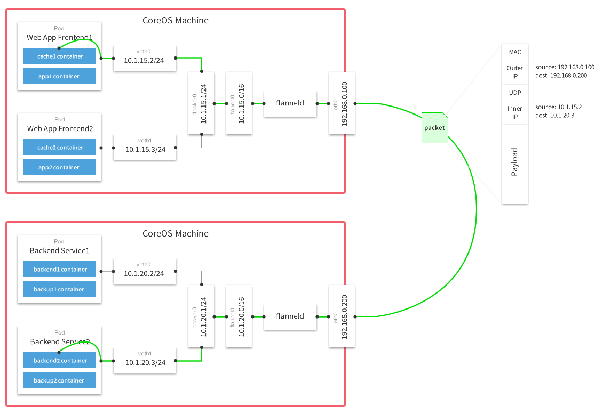

# flannel


flannel is a virtual network that gives a subnet to each host for use with container runtimes.

Platforms like Google's Kubernetes assume that each container (pod) has a unique, routable IP inside the cluster.
The advantage of this model is that it reduces the complexity of doing port mapping.

## Theory of Operation

flannel runs an agent, flanneld, on each host and is responsible for allocating a subnet lease out of a preconfigured address space.
flannel uses [etcd](https://github.com/coreos/etcd) to store the network configuration, allocated subnets, and auxiliary data (such as host's IP).
The forwarding of packets is achieved using one of several strategies that are known as backends.
The simplest backend is `udp` and uses a TUN device to encapsulate every IP fragment in a UDP packet, forming an overlay network.
The following diagram demonstrates the path a packet takes as it traverses the overlay network:



## Building flannel

* Step 1: Make sure you have required dependencies installed on your machine. On Ubuntu, run `sudo apt-get install linux-libc-dev golang gcc`.
On Fedora/Redhat, run `sudo yum install kernel-headers golang gcc`.
* Step 2: Git clone the flannel repo: `git clone https://github.com/coreos/flannel.git`
* Step 3: Run the build script: `cd flannel; ./build`

### Building in a Docker container

For quick testing, you can build flannel inside a Docker container (such container will retain its build environment):
```
docker build .
```

If you would like to build inside a Docker container but to produce a binary on your host:

```
# Replace $SRC with the absolute path to your flannel source code
docker run -v $SRC:/opt/flannel -i -t google/golang /bin/bash -c "cd /opt/flannel && ./build"
```

## Configuration

flannel reads its configuration from etcd.
By default, it will read the configuration from `/coreos.com/network/config` (can be overridden via `--etcd-prefix`).
You can use `etcdctl` utility to set values in etcd.
The value of the config is a JSON dictionary with the following keys:

* `Network` (string): IPv4 network in CIDR format to use for the entire flannel network.
This is the only mandatory key.

* `SubnetLen` (integer): The size of the subnet allocated to each host.
   Defaults to 24 (i.e. /24) unless the Network was configured to be smaller than a /24 in which case it is one less than the network.

* `SubnetMin` (string): The beginning of IP range which the subnet allocation should start with.
   Defaults to the first subnet of Network.

* `SubnetMax` (string): The end of the IP range at which the subnet allocation should end with.
   Defaults to the last subnet of Network.

* `Backend` (dictionary): Type of backend to use and specific configurations for that backend.
   The list of available backends and the keys that can be put into the this dictionary are listed below.
   Defaults to "udp" backend.

### Backends
* udp: use UDP to encapsulate the packets.
  * `Type` (string): `udp`
  * `Port` (number): UDP port to use for sending encapsulated packets. Defaults to 8285.

* vxlan: use in-kernel VXLAN to encapsulate the packets.
  * `Type` (string): `vxlan`
  * `VNI`  (number): VXLAN Identifier (VNI) to be used. Defaults to 1.

* host-gw: create IP routes to subnets via remote machine IPs.
  Note that this requires direct layer2 connectivity between hosts running flannel.
  * `Type` (string): `host-gw`

* aws-vpc: create IP routes in an [Amazon VPC route table](http://docs.aws.amazon.com/AmazonVPC/latest/UserGuide/VPC_Route_Tables.html).
  * Requirements:
	* Running on an EC2 instance that is in an Amazon VPC.
	* Permissions required: `CreateRoute`, `DeleteRoute`,`DescribeRouteTables`, `ModifyInstanceAttribute`, `DescribeInstances [optional]`
  * `Type` (string): `aws-vpc`
  * `RouteTableID` (string): [optional] The ID of the VPC route table to add routes to.
     The route table must be in the same region as the EC2 instance that flannel is running on.
     flannel can automatically detect the id of the route table if the optional `DescribeInstances` is granted to the EC2 instance.

  Authentication is handled via either environment variables or the node's IAM role.
  If the node has insufficient privileges to modify the VPC routing table specified, ensure that appropriate `AWS_ACCESS_KEY_ID`, `AWS_SECRET_ACCESS_KEY`, and optionally `AWS_SECURITY_TOKEN` environment variables are set when running the flanneld process. 
 
  Note: Currently, AWS [limits](http://docs.aws.amazon.com/AmazonVPC/latest/UserGuide/VPC_Appendix_Limits.html) the number of entries per route table to 50. 

* gce: create IP routes in a [Google Compute Engine Network](https://cloud.google.com/compute/docs/networking#networks)
  * Requirements:
    * [Enable IP forwarding for the instances](https://cloud.google.com/compute/docs/networking#canipforward).
    * [Instance service account](https://cloud.google.com/compute/docs/authentication#using) with read-write compute permissions. 
  * `Type` (string): `gce`  
  
  Command to create a compute instance with the correct permissions and IP forwarding enabled:  
  `$ gcloud compute instances create INSTANCE --can-ip-forward --scopes compute-rw`  
  
  Note: Currently, GCE [limits](https://cloud.google.com/compute/docs/resource-quotas) the number of routes for every *project* to 100.

* alloc: only perform subnet allocation (no forwarding of data packets).
  * `Type` (string): `alloc`

### Example configuration JSON

The following configuration illustrates the use of most options with `udp` backend.

```
{
	"Network": "10.0.0.0/8",
	"SubnetLen": 20,
	"SubnetMin": "10.10.0.0",
	"SubnetMax": "10.99.0.0",
	"Backend": {
		"Type": "udp",
		"Port": 7890
	}
}
```

### Firewalls
When using `udp` backend, flannel uses UDP port 8285 for sending encapsulated packets.
When using `vxlan` backend, kernel uses UDP port 8472 for sending encapsulated packets.
Make sure that your firewall rules allow this traffic for all hosts participating in the overlay network.

## Running

Once you have pushed configuration JSON to etcd, you can start flanneld.
If you published your config at the default location, you can start flanneld with no arguments.
flannel will acquire a subnet lease, configure its routes based on other leases in the overlay network and start routing packets.
Additionally it will monitor etcd for new members of the network and adjust the routes accordingly.

After flannel has acquired the subnet and configured backend, it will write out an environment variable file (`/run/flannel/subnet.env` by default) with subnet address and MTU that it supports.

## Client/Server mode (EXPERIMENTAL)

Please see [Documentation/client-server.md](https://github.com/coreos/flannel/tree/master/Documentation/client-server.md).

## Multi-network mode (EXPERIMENTAL)

Multi-network mode allows a single flannel daemon to join multiple networks.
Each network is independent from each other and has its own configuration, IP space, interfaces.
To configure three networks -- in this example named `blue`, `green`, and `red` -- start by publishing their configurations to etcd in different locations:
```
$ etcdctl set /coreos.com/network/blue/config  '{ "Network": "10.1.0.0/16", "Backend": { "Type": "vxlan", "VNI": 1 } }'
$ etcdctl set /coreos.com/network/green/config '{ "Network": "10.2.0.0/16", "Backend": { "Type": "vxlan", "VNI": 2 } }'
$ etcdctl set /coreos.com/network/red/config   '{ "Network": "10.3.0.0/16", "Backend": { "Type": "vxlan", "VNI": 3 } }'
```

Next, start the flannel daemon, specifying the networks to join:
```
$ flanneld --networks=blue,green,red
```

Instead of writing out a single `/run/flannel/subnet.env` file with flannel parameters, it will create a .env file for each network in the directory `/run/flannel/networks`:
```
$ ls /run/flannel/networks/
blue.env  green.env  red.env
```

**Important**: In multi-network mode, flannel will not notify systemd that it is ready upon initialization.
This is because some networks may initialize slower than others (or never).
Use systemd.path files for unit synchronization.

**Note**: Multi-network mode can work in conjunction with the client/server mode.
The `--networks` flag is only passed to the client:

```
# Server daemon
$ flanneld --listen=0.0.0.0:8888

# Client daemon
$ flanneld --remote=10.0.0.3:8888 --networks=blue,green
```

## Key command line options

```
--public-ip="": IP accessible by other nodes for inter-host communication. Defaults to the IP of the interface being used for communication.
--etcd-endpoints=http://127.0.0.1:4001: a comma-delimited list of etcd endpoints.
--etcd-prefix=/coreos.com/network: etcd prefix.
--etcd-keyfile="": SSL key file used to secure etcd communication.
--etcd-certfile="": SSL certification file used to secure etcd communication.
--etcd-cafile="": SSL Certificate Authority file used to secure etcd communication.
--iface="": interface to use (IP or name) for inter-host communication. Defaults to the interface for the default route on the machine.
--subnet-file=/run/flannel/subnet.env: filename where env variables (subnet and MTU values) will be written to.
--ip-masq=false: setup IP masquerade for traffic destined for outside the flannel network.
--listen="": if specified, will run in server mode. Value is IP and port (e.g. `0.0.0.0:8888`) to listen on or `fd://` for [socket activation](http://www.freedesktop.org/software/systemd/man/systemd.socket.html).
--remote="": if specified, will run in client mode. Value is IP and port of the server.
--remote-keyfile="": SSL key file used to secure client/server communication.
--remote-certfile="": SSL certification file used to secure client/server communication.
--remote-cafile="": SSL Certificate Authority file used to secure client/server communication.
--networks="": if specified, will run in multi-network mode. Value is comma separate list of networks to join.
-v=0: log level for V logs. Set to 1 to see messages related to data path.
--version: print version and exit
```

## Environment variables
The command line options outlined above can also be specified via environment variables.
For example `--etcd-endpoints=http://10.0.0.2:2379` is equivalent to `FLANNELD_ETCD_ENDPOINTS=http://10.0.0.2:2379` environment variable.
Any command line option can be turned into an environment variable by prefixing it with `FLANNELD_`, stripping leading dashes, converting to uppercase and replacing all other dashes to underscores.

## Zero-downtime restarts

When running with a backend other than `udp`, the kernel is providing the data path with flanneld acting as the control plane.
As such, flanneld can be restarted (even to do an upgrade) without disturbing existing flows.
However in the case of `vxlan` backend, this needs to be done within a few seconds as ARP entries can start to timeout requiring the flannel daemon to refresh them.
Also, to avoid interruptions during restart, the configuration must not be changed (e.g. VNI, --iface values).

## Docker integration

Docker daemon accepts `--bip` argument to configure the subnet of the docker0 bridge.
It also accepts `--mtu` to set the MTU for docker0 and veth devices that it will be creating.
Since flannel writes out the acquired subnet and MTU values into a file, the script starting Docker can source in the values and pass them to Docker daemon:

```bash
source /run/flannel/subnet.env
docker -d --bip=${FLANNEL_SUBNET} --mtu=${FLANNEL_MTU}
```

Systemd users can use `EnvironmentFile` directive in the .service file to pull in `/run/flannel/subnet.env`

## CoreOS integration

CoreOS ships with flannel integrated into the distribution.
See https://coreos.com/docs/cluster-management/setup/flannel-config/ for more information.
