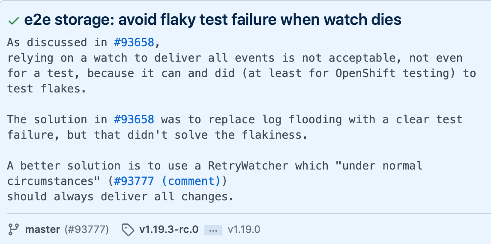

# Maintaining openshift/kubernetes

OpenShift is based on upstream Kubernetes. With every release of Kubernetes that is
intended to be shipped as OCP, it is necessary to incorporate the upstream changes
while ensuring that our downstream customizations are maintained.

## Rebasing for releases < 4.6

The instructions in this document apply to OpenShift releases 4.6 and
above. For previous releases, please see the [rebase
enhancement](https://github.com/openshift/enhancements/blob/master/enhancements/rebase.md).

## Maintaining this document

An openshift/kubernetes rebase is a complex process involving many manual and
potentially error-prone steps. If, while performing a rebase, you find areas where
the documented procedure is unclear or missing detail, please update this document
and include the change in the rebase PR. This will ensure that the instructions are
as comprehensive and accurate as possible for the person performing the next
rebase.

## Rebase Checklists

The checklists provided below highlight the key responsibilities of
someone performing an openshift/kubernetes rebase.

In preparation for submitting a PR to the [openshift fork of
kubernetes](https://github.com/openshift/kubernetes), the following
should be true:

- [ ] The new rebase branch has been created from the upstream tag
- [ ] The new rebase branch includes relevant carries from target branch
- [ ] Dependencies have been updated
- [ ] Hyperkube dockerfile version has been updated
- [ ] `make update` has been invoked and the results committed
- [ ] `make` executes without error
- [ ] `make verify` executes without error
- [ ] `make test` executes without error
- [ ] The upstream tag is pushed to `openshift/kubernetes` to ensure that
      build artifacts are versioned correctly
      - Upstream tooling uses the value of the most recent tag (e.g. `v1.25.0`)
        in the branch history as the version of the binaries it builds.
      - Pushing the tag is easy as
```
git push git@github.com:openshift/kubernetes.git refs/tags/v1.25.0
```

Details to include in the description of the PR:

- [ ] A link to the rebase spreadsheet for the benefit for reviewers

After the rebase PR has merged to `openshift/kubernetes`, vendor the changes
into `openshift/origin` to ensure that the openshift-tests binary reflects
the upstream test changes introduced by the rebase:

- [ ] Find the SHA of the merge commit after your PR lands in `openshift/kubernetes`
- [ ] Run `hack/update-kube-vendor.sh <o/k SHA>` in a clone of the `origin`
      repo and commit the results
- [ ] Run `make update` and commit the results
- [ ] Submit as a PR to `origin`

As a final step, send an email to the aos-devel mailing list announcing the
rebase. Make sure to include:

- [ ] The new version of upstream Kubernetes that OpenShift is now based on
- [ ] Link(s) to upstream changelog(s) detailing what has changed since the last rebase landed
- [ ] A reminder to component maintainers to bump their dependencies
- [ ] Relevant details of the challenges involved in landing the rebase that
      could benefit from a wider audience.

## Getting started

Before incorporating upstream changes you may want to:

- Read this document
- Get familiar with tig (text-mode interface for git)
- Find the best tool for resolving merge conflicts
- Use diff3 conflict resolution strategy
   (https://blog.nilbus.com/take-the-pain-out-of-git-conflict-resolution-use-diff3/)

## Send email announcing you're starting work

To better spread the information send the following email:

```
Title: k8s <version> bump is starting...

I'm starting the process of updating our fork to bring in
the latest available version of kubernetes. This means that
every PR landing in openshift/kubernetes should go through
extra scrutiny and only 2 exceptions allow merging PRs in the
upcoming time:
1. High priority backports which require landing master first
to start the backport process.
2. Critical PRs unblocking the org.
In both cases make sure to reach out to me for final approval.

There is no ETA yet, but feel free to reach out to me with
any questions.
```

## Preparing the local repo clone

Clone from a personal fork of kubernetes via a pushable (ssh) url:

```
git clone git@github.com:<user id>/kubernetes
```

Add a remote for upstream and fetch its branches:

```
git remote add --fetch upstream https://github.com/kubernetes/kubernetes
```

Add a remote for the openshift fork and fetch its branches:

```
git remote add --fetch openshift https://github.com/openshift/kubernetes
```

## Creating a new local branch for the new rebase

- Branch the target `k8s.io/kubernetes` release tag (e.g. `v1.25.0`) to a new
  local branch

```
git checkout -b rebase-1.25.0 v1.25.0
```

- Merge `openshift(master)` branch into the `rebase-1.25.0` branch with merge
  strategy `ours`. It discards all changes from the other branch (`openshift/master`)
  and create a merge commit. This leaves the content of your branch unchanged,
  and when you next merge with the other branch, Git will only consider changes made
  from this point forward.  (Do not confuse this with `ours` conflict resolution
  strategy for `recursive` merge strategy, `-X` option.)

```
git merge -s ours openshift/master
```

## Creating a spreadsheet of carry commits from the previous release

Given the upstream tag (e.g. `v1.24.2`) of the most recent rebase and the name
of the branch that is targeted for rebase (e.g. `openshift/master`), generate a tsv file
containing the set of carry commits that need to be considered for picking:

```
echo 'Comment Sha\tAction\tClean\tSummary\tCommit link\tPR link' > ~/Documents/v1.24.2.tsv
```
```
git log $( git merge-base openshift/master v1.24.2 )..openshift/master --ancestry-path --reverse --no-merges --pretty='tformat:%x09%h%x09%x09%x09%s%x09https://github.com/openshift/kubernetes/commit/%h?w=1' | grep -E $'\t''UPSTREAM: .*'$'\t' | sed -E 's~UPSTREAM: ([0-9]+)(:.*)~UPSTREAM: \1\2\thttps://github.com/kubernetes/kubernetes/pull/\1~' >> ~/Documents/v1.24.2.tsv
```

This tsv file can be imported into a google sheets spreadsheet to track the
progress of picking commits to the new rebase branch. The spreadsheet can also
be a way of communicating with rebase reviewers. For an example of this
communication, please see the [the spreadsheet used for the 1.24
rebase](https://docs.google.com/spreadsheets/d/10KYptJkDB1z8_RYCQVBYDjdTlRfyoXILMa0Fg8tnNlY/edit).

## Picking commits from the previous rebase branch to the new branch

Go through the spreadsheet and for every commit set one of the appropriate actions:
 - `p`, to pick the commit
 - `s`, to squash it (add a comment with the sha of the target)
 - `d`, to drop the commit (if it is not obvious, comment why)

Set up conditional formatting in the google sheet to color these lines appropriately.

Commits carried on rebase branches have commit messages prefixed as follows:

- `UPSTREAM: <carry>:`
  - A persistent carry that should probably be picked for the subsequent rebase branch.
  - In general, these commits are used to modify behavior for consistency or
    compatibility with openshift.
- `UPSTREAM: <drop>:`
  - A carry that should probably not be picked for the subsequent rebase branch.
  - In general, these commits are used to maintain the codebase in ways that are
    branch-specific, like the update of generated files or dependencies.
- `UPSTREAM: 77870:`
  - The number identifies a PR in upstream kubernetes
    (i.e. `https://github.com/kubernetes/kubernetes/pull/<pr id>`)
  - A commit with this message should only be picked into the subsequent rebase branch
    if the commits of the referenced PR are not included in the upstream branch.
  - To check if a given commit is included in the upstream branch, open the referenced
    upstream PR and check any of its commits for the release tag (e.g. `v.1.25.0`)
    targeted by the new rebase branch. For example:
    - 

With these guidelines in mind, pick the appropriate commits from the previous rebase
branch into the new rebase branch. Create a new filter view in the spreadsheet to allow
you get a view where `Action==p || Action==s` and copy paste the shas to `git cherry-pick`
command. Use `tr '\n' ' ' <<< "<line_separated_commits>"` to get a space separated list
from the copy&paste.

Where it makes sense to do so, squash carried changes that are tightly coupled to
simplify future rebases. If the commit message of a carry does not conform to
expectations, feel free to revise and note the change in the spreadsheet row for the
commit.

If you first pick all the pick+squash commits first and push them for review it is easier for you
and your reviewers to check the code changes and you squash it at the end.

When filling in Clean column in the spreadsheet make sure to use the following
number to express the complexity of the pick:
- 0 - clean
- 1 - format fixups
- 2 - code fixups
- 3 - logic changes

Explicit commit rules:
- Anything touching `openshift-hack/`, openshift specific READMEs or similar files
  should be squashed to 1 commit named "UPSTREAM: <carry>: Add OpenShift specific files"
- Updating generated files coming from kubernetes should be `<drop>` commit
- Generated changes should never be mixed with non-generated changes. If a carry is
  ever seen to contain generated changes, those changes should be dropped.

## Update the hyperkube image version to the release tag

The [hyperkube image](openshift-hack/images/hyperkube/Dockerfile.rhel)
hard-codes the Kubernetes version in an image label. It's necessary to manually
set this label to the new release tag. Prefix the commit summary with
`UPSTREAM: <carry>: (squash)` and squash it before merging the rebase PR.

This value, among other things, is used by ART to inject appropriate version of
kubernetes during build process, so it always has to reflect correct level of
kubernetes.

## Update base-os and test images

To be able to use the latest kubelet from a pull request, the openshift/release
job layers the built RPM [on top of the `rhel-coreos` image](https://github.com/openshift/release/blob/78568fbde1ee9a15bc6ab08c7c49ae3539d3e302/ci-operator/config/openshift/kubernetes/openshift-kubernetes-master.yaml#L102-L113).
Make sure that the `FROM` uses the appropriate OCP version which corresponds
with what we have in the [hyperkube image](openshift-hack/images/hyperkube/Dockerfile.rhel).

Similarly, update `FROM` in [test image](openshift-hack/images/tests/Dockerfile.rhel)
to match the one from [hyperkube image](openshift-hack/images/hyperkube/Dockerfile.rhel).

## Updating dependencies

Once the commits are all picked from the previous rebase branch, and your PR
is mostly ready, each of the following repositories need to be updated to depend
on the upstream tag targeted by the rebase:

- https://github.com/openshift/api
- https://github.com/openshift/apiserver-library-go
- https://github.com/openshift/client-go
- https://github.com/openshift/library-go

Often these repositories are updated in parallel by other team members, so make
sure to ask around before starting the work of bumping their dependencies.

Once the above repos have been updated to depend on the target release,
it will be necessary to update `go.mod` to point to the appropriate revision
of these repos by running `hack/pin-dependency.sh` for each of them and then running
`hack/update-vendor.sh` (as per the [upstream documentation](https://github.com/kubernetes/community/blob/master/contributors/devel/sig-architecture/vendor.md#adding-or-updating-a-dependency)).

Make sure to commit the result of a vendoring update with `UPSTREAM: <drop>: bump(*)`.
If you have already bumped the dependencies to get the repo to compile,
don't forget to squash the commits before merging the PR.

### Updating dependencies for pending bumps

The upstream `hack/pin-dependency.sh` script only supports setting dependency
for the original repository. To pin to a fork branch that has not yet been
merged (i.e. to test a rebase ahead of shared library bumps having merged), the
following `go mod` invocations are suggested:

```
go mod edit -replace github.com/openshift/<lib>=github.com/<username>/<lib>@SHA
go mod tidy && go mod vendor
```

Alternatively, you can edit `go.mod` file manually with your favourite editor and use search&replace.

## Review test annotation rules

The names of upstream e2e tests are annotated according to the a set of
[declarative rules](openshift-hack/e2e/annotate/rules.go). These annotations
are used to group tests into suites and to skip tests that are known not to be
incompatible with some or all configurations of OpenShift.

When performing a rebase, it is important to review the rules to
ensure they are still relevant:

- [ ] Ensure that `[Disabled:Alpha]` rules are appropriate for the current kube
      level. Alpha features that are not enabled by default should be targeted
      by this annotation to ensure that tests of those features are skipped.
- [ ] Add new skips (along with a bz to track resolution) where e2e tests fail
      consistently.

Test failures representing major issues affecting cluster capability will
generally need to be addressed before merge of the rebase PR, but minor issues
(e.g. tests that fail to execute correctly but don't appear to reflect a
regression in behavior) can often be skipped and addressed post-merge.

## Updating generated files

- Update generated files by running `make update`
  - This step depends on etcd being installed in the path, which can be
    accomplished by running `hack/install-etcd.sh`.
  - Alternatively, run it in the same container as CI is using for build_root that already has
    the etcd at correct version
```
podman run -it --rm -v $( pwd ):/go/k8s.io/kubernetes:Z --workdir=/go/k8s.io/kubernetes registry.ci.openshift.org/openshift/release:rhel-9-release-golang-1.20-openshift-4.15 make update OS_RUN_WITHOUT_DOCKER=yes FORCE_HOST_GO=1
```
- Commit the resulting changes as `UPSTREAM: <drop>: make update`.

## Building and testing

- Build the code with `make`
- Test the code with `make test`
  - Where test failures are encountered and can't be trivially resolved, the
    spreadsheet can be used to track those failures to their resolution. The
    example spreadsheet should have a sheet that demonstrates this tracking.
  - Where a test failure proves challenging to fix without specialized knowledge,
    make sure to coordinate with the team(s) responsible for area(s) of focus
    exhibiting test failure. If in doubt, ask for help!
- Verify the code with `make verify`

## Reacting to new commits

Inevitably, a rebase will take long enough that new commits will end up being
merged to the targeted openshift/kubernetes branch after the rebase is
underway. The following strategy is suggested to minimize the cost of incorporating
these new commits:

- rename existing rebase branch (e.g. 1.25.0-beta.2 -> 1.25.0-beta.2-old)
- create new rebase branch from HEAD of master
- merge the target upstream tag (e.g. 1.25.0-beta.2) with strategy ours
- pick all carries from renamed rebase branch (e.g. 1.25.0-beta.2-old)
- pick new carries from the openshift/kubernetes target branch
- add details of the new carries to the spreadsheet
- update generated files

With good tooling, the cost of this procedure should be ~10 minutes at
most. Re-picking carries should not result in conflicts since the base of the
rebase branch will be the same as before. The only potential sources of conflict
will be the newly added commits.

## Ensuring the stability of the release

To ensure we don't regress the product by introducing a new level of kubernetes
it is required to create a new sheet in the following spreadsheet and pass all
the variants: https://docs.google.com/spreadsheets/d/1PBk3eqYaPbvY982k_a0W7EGx7CBCHTmKrN6FyNSTDeA/edit#gid=0

NOTE: Double check with TRT team if the current variants in that spreadsheet
are up-to-date.

## Send email announcing upcoming merge

Second email should be send close O(~3 days) to merging the bump:

```
Title: k8s <version> bump landing...

<URL to your o/k PR> is bumping k8s to version <version>.
The following repositories have been already bumped as well:

<URLs to api/client-go/library-go/apiserver-library-go/operators>

Followup work has been assigned to appropriate teams
through bugzillas linked in the code. Please treat
them as the highest priority after landing the bump.

Finally, this means we are blocking ALL PRs to our
kubernetes fork.
```

After sending the email block the merge queue, see below.

## Blocking the merge queue

Close to merging a rebase it is good practice to block any merges to openshift/kubernetes
fork. To do that follow these steps:

1. Open new issues in openshift/kubernetes
2. Use `Master Branch Frozen For Kubernetes Merging | branch:master` as issue title
3. Add `tide/merge-blocker` label to issues (you might need group lead for this)
4. All PR's  (including the rebase) are now forbidden to merge to master branch
5. Before landing the rebase PR, close this issue

## Send email announcing work done

Last email should be send after merging the bump as a
reply to previous:

```
<URL to your o/k PR> just merged.
It'll take some time to get newer kublet, but in the meantime we'll
continue to monitor CI. I encourage everyone to hold off from
merging any major changes to our kubernetes fork to provide clear CI
signal for the next 2-3 days.

The following bugs were opened during the process, please treat
them as the highest priority and release blockers for your team:

<list bugs and assigned team>
```

## Followup work

1. Update cluster-kube-apiserver-operator `pre-release-lifecycle` alert's
`removed_release` version similarly to https://github.com/openshift/cluster-kube-apiserver-operator/pull/1382.

## Updating with `git merge`

*This is the preferred way to update to patch releases of kubernetes*

After the initial bump as described above it is possible to update
to newer released version using `git merge`. To do that follow these steps:


1. Fetch latest upstream changes:
```
git fetch upstream
```
   where `upstream` points at https://github.com/kubernetes/kubernetes/, and check
   the incoming changes:
```
git log v1.25.0..v1.25.2 --ancestry-path --reverse --no-merges
```
2. (optional) Revert any commits that were merged into kubernetes between previous
   update and current one.

3. Fetch latest state of openshift fork, checkout the appropriate branch and
   create a new branch for the bump
```
git fetch openshift
git checkout openshift/release-4.12
git checkout -b bump-1.25.2
```
   where `openshift` points at https://github.com/openshift/kubernetes/.

4. Merge the changes from appropriate [released version](https://kubernetes.io/releases/patch-releases/#detailed-release-history-for-active-branches):
```
git merge v1.25.2
```
   Most likely you'll encounter conflicts, but most are around go.sum and go.mod
   files, coming from newer versions, but at this point in time leave the conflicts
   as they are and continue the merge.
```
git add --all
git merge --continue
```
   This should create a commit titled `Merge tag 'v1.25.2' into bump-1.25.2`.

5. Now return to the list of conflicts from previous step and fix all the files
   picking appropriate changes, in most cases picking the newer version.
   When done, commit all of them as another commit:
```
git add --all
git commit -m "UPSTREAM: <drop>: manually resolve conflicts"
```
   This ensures the person reviewing the bump can easily review all the conflicts
   and their resolution.

6. (optional) Update openshift dependencies and run `go mod tidy` to have the
   branch names resolved to proper go mod version. Remember to use the released
   versions matching the branch you're modifying.
   This is usually required ONLY if you know there has been changes in one of
   the libraries that need to be applied to our fork, which happens rarely.
   Also usually, this is done by the team introducing the changes in the libraries.

7. Run `/bin/bash` in a container using the command and image described in [Updating generated files](#updating-generated-files)
   section:
```
podman run -it --rm -v $( pwd ):/go/k8s.io/kubernetes:Z --workdir=/go/k8s.io/kubernetes registry.ci.openshift.org/openshift/release:rhel-9-release-golang-1.20-openshift-4.15 /bin/bash
```
   In the container run:
```
export OS_RUN_WITHOUT_DOCKER=yes
export FORCE_HOST_GO=1
hack/update-vendor.sh
make update
```

NOTE: Make sure to use the correct version of the image (both openshift and golang
versions must be appropriate), as a reference check `openshift-hack/images/hyperkube/Dockerfile.rhel`
file.

NOTE: You might encounter problems when running the above, make sure to check [Potential problems](#potential-problems)
section below.


8. Update kubernetes version in `openshift-hack/images/hyperkube/Dockerfile.rhel`
   and commit all of that as:
```
git commit -m "UPSTREAM: <drop>: hack/update-vendor.sh, make update and update image"
```

9. Congratulations, you can open a PR with updated k8s patch version!

### Potential problems

While running `make update` in step 7 above, you might encounter one of the following problems:

```
go: inconsistent vendoring in /go/k8s.io/kubernetes/_output/local/go/src/k8s.io/kubernetes/vendor/k8s.io/code-generator:
```
To solve it, edit `staging/src/k8s.io/code-generator/go.mod` removing this line: `k8s.io/code-generator => ../code-generator`.
Try re-running `make update`, if the problem re-appears change directory to `staging/src/k8s.io/code-generator`
and run `go mod tidy` and `go mod vendor`.

NOTE: Make sure to bring back this line: `k8s.io/code-generator => ../code-generator` in `staging/src/k8s.io/code-generator/go.mod`
after you've run `make update`, otherwise `verify` step will fail during submission.

```
etcd version 3.5.6 or greater required
```
Grab newer version of etcd from https://github.com/etcd-io/etcd/releases/ and place
it in `/usr/local/bin/etcd`.

## Updating with `rebase.sh` (experimental)

The above steps are available as a script that will merge and rebase along the happy path without automatic conflict
resolution and at the end will create a PR for you.

Here are the steps:
1. Create a new BugZilla with the respective OpenShift version to rebase (Target Release stays ---),
   Prio&Severity to High with a proper description of the change logs.
   See [BZ2021468](https://bugzilla.redhat.com/show_bug.cgi?id=2021468) as an example.
2. It's best to start off with a fresh fork of [openshift/kubernetes](https://github.com/openshift/kubernetes/). Stay on the master branch.
3. This script requires `jq`, `git`, `podman` and `bash`, `gh` is optional.
4. In the root dir of that fork run:
```
openshift-hack/rebase.sh --k8s-tag=v1.25.2 --openshift-release=release-4.12 --bugzilla-id=2003027
```

where `k8s-tag` is the [kubernetes/kubernetes](https://github.com/kubernetes/kubernetes/) release tag, the `openshift-release`
is the OpenShift release branch in [openshift/kubernetes](https://github.com/openshift/kubernetes/) and the `bugzilla-id` is the
BugZilla ID created in step (1).

5. In case of conflicts, it will ask you to step into another shell to resolve those. The script will continue by committing the resolution with `UPSTREAM: <drop>`.
6. At the end, there will be a "rebase-$VERSION" branch pushed to your fork.
7. If you have `gh` installed and are logged in, it will attempt to create a PR for you by opening a web browser.
