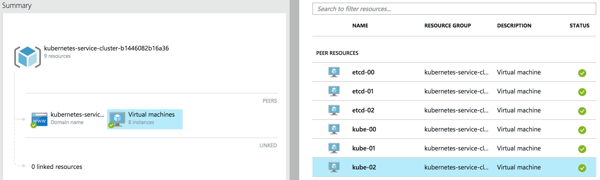

<!-- BEGIN MUNGE: UNVERSIONED_WARNING -->

<!-- END MUNGE: UNVERSIONED_WARNING -->
Kubernetes on Azure with CoreOS and [Weave](http://weave.works)
---------------------------------------------------------------

**Table of Contents**

- [Introduction](#introduction)
- [Prerequisites](#prerequisites)
- [Let's go!](#lets-go)
- [Deploying the workload](#deploying-the-workload)
- [Scaling](#scaling)
- [Exposing the app to the outside world](#exposing-the-app-to-the-outside-world)
- [Next steps](#next-steps)
- [Tear down...](#tear-down)

## Introduction

In this guide I will demonstrate how to deploy a Kubernetes cluster to Azure cloud. You will be using CoreOS with Weave, which implements simple and secure networking, in a transparent, yet robust way. The purpose of this guide is to provide an out-of-the-box implementation that can ultimately be taken into production with little change. It will demonstrate how to provision a dedicated Kubernetes master and etcd nodes, and show how to scale the cluster with ease.

### Prerequisites

1. You need an Azure account.

## Let's go!

To get started, you need to checkout the code:



git clone https://github.com/GoogleCloudPlatform/kubernetes
cd kubernetes/docs/getting-started-guides/coreos/azure/



You will need to have [Node.js installed](http://nodejs.org/download/) on you machine. If you have previously used Azure CLI, you should have it already.

First, you need to install some of the dependencies with



npm install



Now, all you need to do is:



./azure-login.js -u <your_username>
./create-kubernetes-cluster.js



This script will provision a cluster suitable for production use, where there is a ring of 3 dedicated etcd nodes: 1 kubernetes master and 2 kubernetes nodes. The `kube-00` VM will be the master, your work loads are only to be deployed on the nodes, `kube-01` and `kube-02`. Initially, all VMs are single-core, to ensure a user of the free tier can reproduce it without paying extra. I will show how to add more bigger VMs later.

Once the creation of Azure VMs has finished, you should see the following:



...
azure_wrapper/info: Saved SSH config, you can use it like so: `ssh -F  ./output/kube_1c1496016083b4_ssh_conf <hostname>`
azure_wrapper/info: The hosts in this deployment are:
 [ 'etcd-00', 'etcd-01', 'etcd-02', 'kube-00', 'kube-01', 'kube-02' ]
azure_wrapper/info: Saved state into `./output/kube_1c1496016083b4_deployment.yml`



Let's login to the master node like so:



ssh -F  ./output/kube_1c1496016083b4_ssh_conf kube-00



> Note: config file name will be different, make sure to use the one you see.

Check there are 2 nodes in the cluster:



core@kube-00 ~ $ kubectl get nodes
NAME                LABELS                   STATUS
kube-01             environment=production   Ready
kube-02             environment=production   Ready



## Deploying the workload

Let's follow the Guestbook example now:



cd guestbook-example
kubectl create -f examples/guestbook/redis-master-controller.yaml
kubectl create -f examples/guestbook/redis-master-service.yaml
kubectl create -f examples/guestbook/redis-slave-controller.yaml
kubectl create -f examples/guestbook/redis-slave-service.yaml
kubectl create -f examples/guestbook/frontend-controller.yaml
kubectl create -f examples/guestbook/frontend-service.yaml



You need to wait for the pods to get deployed, run the following and wait for `STATUS` to change from `Unknown`, through `Pending` to `Running`.



kubectl get pods --watch



> Note: the most time it will spend downloading Docker container images on each of the nodes.

Eventually you should see:



NAME                 READY     STATUS    RESTARTS   AGE
frontend-8anh8       1/1       Running   0          1m
frontend-8pq5r       1/1       Running   0          1m
frontend-v7tbq       1/1       Running   0          1m
redis-master-u0my3   1/1       Running   0          1m
redis-slave-4eznf    1/1       Running   0          1m
redis-slave-hf40f    1/1       Running   0          1m



## Scaling

Two single-core nodes are certainly not enough for a production system of today, and, as you can see, there is one _unassigned_ pod. Let's scale the cluster by adding a couple of bigger nodes.

You will need to open another terminal window on your machine and go to the same working directory (e.g. `~/Workspace/weave-demos/coreos-azure`).

First, lets set the size of new VMs:



export AZ_VM_SIZE=Large



Now, run scale script with state file of the previous deployment and number of nodes to add:



core@kube-00 ~ $ ./scale-kubernetes-cluster.js ./output/kube_1c1496016083b4_deployment.yml 2
...
azure_wrapper/info: Saved SSH config, you can use it like so: `ssh -F  ./output/kube_8f984af944f572_ssh_conf <hostname>`
azure_wrapper/info: The hosts in this deployment are:
 [ 'etcd-00',
  'etcd-01',
  'etcd-02',
  'kube-00',
  'kube-01',
  'kube-02',
  'kube-03',
  'kube-04' ]
azure_wrapper/info: Saved state into `./output/kube_8f984af944f572_deployment.yml`



> Note: this step has created new files in `./output`.

Back on `kube-00`:



core@kube-00 ~ $ kubectl get nodes
NAME        LABELS                   STATUS
kube-01     environment=production   Ready
kube-02     environment=production   Ready
kube-03     environment=production   Ready
kube-04     environment=production   Ready



You can see that two more nodes joined happily. Let's scale the number of Guestbook instances now.

First, double-check how many replication controllers there are:



core@kube-00 ~ $ kubectl get rc
CONTROLLER     CONTAINER(S)   IMAGE(S)                                    SELECTOR            REPLICAS
frontend       php-redis      kubernetes/example-guestbook-php-redis:v2   name=frontend       3
redis-master   master         redis                                       name=redis-master   1
redis-slave    slave          kubernetes/redis-slave:v2                   name=redis-slave    2



As there are 4 nodes, let's scale proportionally:



core@kube-00 ~ $  kubectl scale --replicas=4 rc redis-slave
scaled
core@kube-00 ~ $  kubectl scale --replicas=4 rc frontend
scaled



Check what you have now:



core@kube-00 ~ $ kubectl get rc
CONTROLLER     CONTAINER(S)   IMAGE(S)                                    SELECTOR            REPLICAS
frontend       php-redis      kubernetes/example-guestbook-php-redis:v2   name=frontend       4
redis-master   master         redis                                       name=redis-master   1
redis-slave    slave          kubernetes/redis-slave:v2                   name=redis-slave    4



You now will have more instances of front-end Guestbook apps and Redis slaves; and, if you look up all pods labeled `name=frontend`, you should see one running on each node.



core@kube-00 ~/guestbook-example $ kubectl get pods -l name=frontend
NAME             READY     STATUS    RESTARTS   AGE
frontend-8anh8   1/1       Running   0          3m
frontend-8pq5r   1/1       Running   0          3m
frontend-oz8uo   1/1       Running   0          51s
frontend-v7tbq   1/1       Running   0          3m



## Exposing the app to the outside world

To makes sure the app is working, you probably want to load it in the browser. For accessing the Guestbook service from the outside world, an Azure endpoint needs to be created like shown on the picture below.

You then should be able to access it from anywhere via the Azure virtual IP for `kube-01`, i.e. `http://104.40.211.194:8000/` as per screenshot.

## Next steps

You now have a full-blow cluster running in Azure, congrats!

You should probably try deploy other [example apps](../../../../examples/) or write your own ;)

## Tear down...

If you don't wish care about the Azure bill, you can tear down the cluster. It's easy to redeploy it, as you can see.



./destroy-cluster.js ./output/kube_8f984af944f572_deployment.yml



> Note: make sure to use the _latest state file_, as after scaling there is a new one.

By the way, with the scripts shown, you can deploy multiple clusters, if you like :)

<!-- BEGIN MUNGE: IS_VERSIONED -->
<!-- TAG IS_VERSIONED -->
<!-- END MUNGE: IS_VERSIONED -->

<!-- BEGIN MUNGE: GENERATED_ANALYTICS -->

<!-- END MUNGE: GENERATED_ANALYTICS -->

