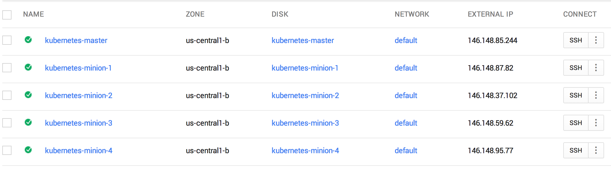
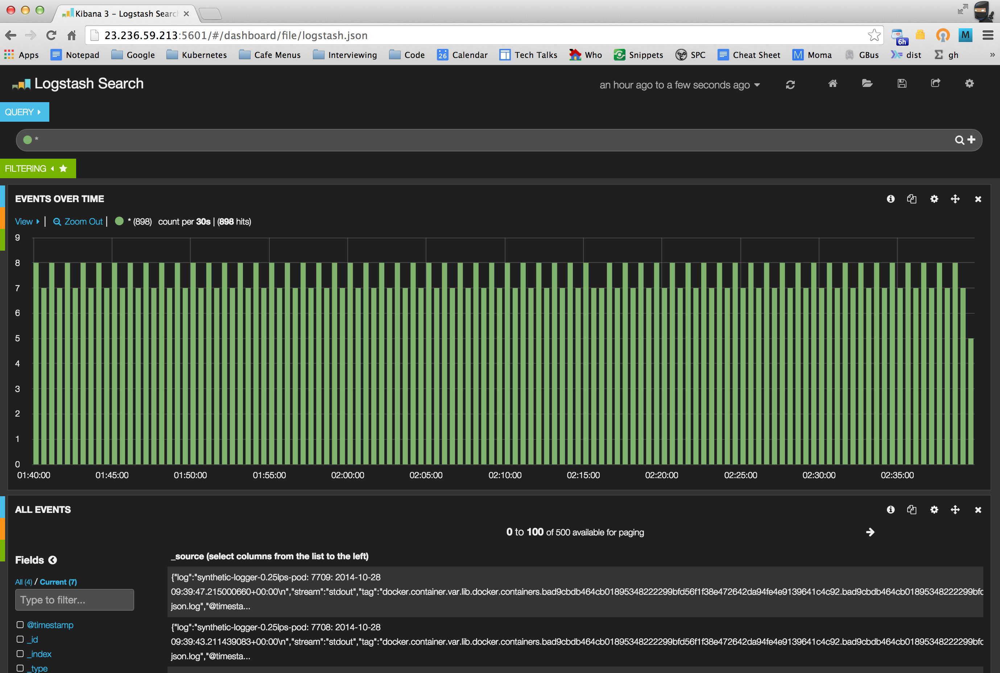

# Logging Pods in a Kubernetes Cluster using Fluentd, Elasticsearch and Kibana

To enable logging of the activity inside a [pod](../../../docs/pods.md) using Elasticsearch set ``FLUENTD_ELASTICSEARCH=true`` in ``config-default.sh`` before launching the cluster. When a cluster is created a Docker container will be placed on each node which uses the [Fluentd](http://www.fluentd.org/) log collector to shovel all the container logs to an instance of [Elasticsearch](http://www.elasticsearch.org/) (or anything else that will listen to [Logstash](http://logstash.net/docs/1.4.2/tutorials/getting-started-with-logstash) format JSON on port 9200).

We can verify that a Fluentd collector is running by ssh-ing into one of the nodes and looking at the running containers.



Let's take a look in minion 1 (i.e. node 1).

```shell
$ gcloud compute --project "kubernetes-elk" ssh --zone "us-central1-b" "kubernetes-minion-1"
...
$ sudo -s
$ docker ps
CONTAINER ID        IMAGE                                     COMMAND                CREATED             STATUS              PORTS                    NAMES
0e71c3db878a        google/cadvisor:0.4.1                     "/usr/bin/cadvisor /   7 hours ago         Up 7 hours                                   k8s_cadvisor.417cd83c_cadvisormanifes12uqn2ohido76855gdecd9roadm7l0.default.file_cadvisormanifes12uqn2ohido76855gdecd9roadm7l0_5f2d8a1c
6ea1901525c3        kubernetes/fluentd-elasticsearch:latest   "/run.sh"              7 hours ago         Up 7 hours                                   k8s_fluentd-es.1b9eab35_fluentdesmanife2u464h05heqcpotoddodpnehjaqsde.default.file_fluentdesmanife2u464h05heqcpotoddodpnehjaqsde_c22dca2a
95a3d765c82f        kubernetes/pause:go                       "/pause"               7 hours ago         Up 7 hours          0.0.0.0:4194->8080/tcp   k8s_net.f72d85c8_cadvisormanifes12uqn2ohido76855gdecd9roadm7l0.default.file_cadvisormanifes12uqn2ohido76855gdecd9roadm7l0_1d5ecdfa
95251be68df0        kubernetes/pause:go                       "/pause"               7 hours ago         Up 7 hours                                   k8s_net.fadb6b63_fluentdesmanife2u464h05heqcpotoddodpnehjaqsde.default.file_fluentdesmanife2u464h05heqcpotoddodpnehjaqsde_9517d2c0
```
There are two containers running running on this node. The container ```google/cadvisor``` provides monitoring support and the containers ```kubernetes/fluentd-elasticsearch``` is constantly looking at the logs files of Docker containers in the directories ```/var/lib/docker/containers/*``` and sending (tailing)
this information in Logstash format to port 9200 on the local node.

We can look at the pod specification used to launch the Fluentd Elasticsearch container which is stored as a manifest file on the node.

```shell
$ cd /etc/kubernetes/manifests/
$ ls
cadvisor.manifest  fluentd-es.manifest
$ cat fluentd-es.manifest
version: v1beta2
id: fluentd-to-elasticsearch
containers:
  - name: fluentd-es
    image: kubernetes/fluentd-elasticsearch
    volumeMounts:
      - name: containers
        mountPath: /var/lib/docker/containers
        readOnly: true
volumes:
  - name: containers
    source:
      hostDir:
        path: /var/lib/docker/containers
```

This is just a regular pod specification which you could have run using ```kubectl.sh```. However, what you could not have done yourself is run an instance of this pod specification on each node which is what is accomplished with the manifest file at cluster creation time. Notice that CAdvisor also has a manifest pod specification.

We can connect to a running Fluentd Elasticsearch container to inspect the Fluentd configuration.

```shell
$ docker exec -ti 3c3816c0cfc6 bash
$ cat /etc/td-agent/td-agent.conf
...
<source>
  type tail
  format json
  time_key time
  path /var/lib/docker/containers/*/*-json.log
  time_format %Y-%m-%dT%H:%M:%S
  tag docker.container.*
</source>

<match docker.container.**>
   type elasticsearch
   log_level info
   include_tag_key true
   host kubernetes-minion-2
   port 9200
   logstash_format true
   flush_interval 5s
</match>
```
This configures Fluentd to gather all the Docker container log files and send them in Logstash format to port 9200.

Once you have turned up a Kubernetes cluster with the environment variable``FLUENTD_ELASTICSEARCH=true`` you can use the ``Makefile`` in this GitHub directory to try out some logging experiments.

We need to create an instance of Elasticsearch which will run on the cluster (this is not done automatically as part of the manifest pod creation step). We only want to run one instance of Elasticsearch on the cluster but we want it to appear as if it is running on every node. We can accomplish this by writing a suitable pod specification and service specification since this "appear to run everywhere on the cluster" abstraction is one of the things that Kubernetes provides.

First, here is the pod specification for Elasticsearch [es-pod.yml](es.pod.yml):

```
apiVersion: v1beta1
kind: Pod
id: elasticsearch-pod
desiredState:
  manifest:
    version: v1beta1
    id: es
    containers:
      - name: elasticsearch
        image: dockerfile/elasticsearch
        ports:
          - name: es-port
            containerPort: 9200
          - name: es-transport-port
            containerPort: 9300
        volumeMounts:
          - name: es-persistent-storage
            mountPath: /data
    volumes:
      - name: es-persistent-storage
        source:
          emptyDir: {}
labels:
  app: elasticsearch
```

This runs the official Docker image for Elasticsearch and wires up ports 9200 (for submitting and querying information) and 9300 (a port used to compose multiple instances of Elasticsearch -- more about this elsewhere). Kubernetes may have to restart an Elasticsearch container if something goes wrong and it would be  shame to loose all the information (logs) that has been gathered when the original container dies and takes down all its information with it.  To avoid this problem we wire up some persistent storage for Elasticsearch so the gathered data persists between one invocation of the Elasticsearch container and another.

To allow us to query Elasticsearch from outside the cluster (e.g. from our laptop) and to allow other Kubernetes pods access to the Elasticsearch web interface we define a Kubernetes Elasticsearch service [es-service.yml](es-service.yml):

```
apiVersion: v1beta1
kind: Service
id: elasticsearch
containerPort: es-port
port: 9200
selector:
  app: elasticsearch
createExternalLoadBalancer: true
```
The service specification will group together all containers that have the label ```app=elasticsearch``` (we will only use one) and for these containers it will map their internal port (9200) to port 9200 for a service which will act as a proxy for all the identified containers. Furthermore, an external load balancer is created to allow external access to the pods that are encapsulated by this service. The container ports identified by the service description are proxied by a single IP address scoped within the cluster.

```shell
$ kubectl.sh get services
NAME                LABELS              SELECTOR            IP                  PORT
elasticsearch                           app=elasticsearch   10.0.0.1            9200
```
Inside the cluster, the Elasticsearch service is reached at http://10.0.0.1:9200 which is its service address.

We can see which node the Elasticsearch instance is actually running one e.g. in the example below it is running on minion-3.

``` shell
$ kubectl.sh get pods
NAME                           IMAGE(S)                   HOST                                                           LABELS                      STATUS
elasticsearch-pod              dockerfile/elasticsearch   kubernetes-minion-3.c.kubernetes-elk.internal/146.148.59.62    app=elasticsearch           Running
```
You can see that Elasticsearch can be reached on port 9200 on minion-1:

```shell
$ curl localhost:9200
{
  "status" : 200,
  "name" : "Elsie-Dee",
  "version" : {
    "number" : "1.3.2",
    "build_hash" : "dee175dbe2f254f3f26992f5d7591939aaefd12f",
    "build_timestamp" : "2014-08-13T14:29:30Z",
    "build_snapshot" : false,
    "lucene_version" : "4.9"
  },
  "tagline" : "You Know, for Search"
}
```

If we ran the same curl command on minion-2, minion-3, or minion-4 we would have got a response from the same instance of Elasticsearch. The actual instance is running on minion-3, but it appears to run on every node.

We can also contact the Elasticsearch instance from outside the cluster by finding its external IP address and port number.

```shell
$ gcutil getforwardingrule elasticsearch
+---------------+---------------------------------------+
| name          | elasticsearch                         |
| description   |                                       |
| creation-time | 2014-10-27T22:07:39.585-07:00         |
| region        | us-central1                           |
| ip            | 130.211.122.249                       |
| protocol      | TCP                                   |
| port-range    | 9200-9200                             |
| target        | us-central1/targetPools/elasticsearch |
+---------------+---------------------------------------+
$ curl http://130.211.122.249:9200
{
  "status" : 200,
  "name" : "Elsie-Dee",
  "version" : {
    "number" : "1.3.2",
    "build_hash" : "dee175dbe2f254f3f26992f5d7591939aaefd12f",
    "build_timestamp" : "2014-08-13T14:29:30Z",
    "build_snapshot" : false,
    "lucene_version" : "4.9"
  },
  "tagline" : "You Know, for Search"
}
```

A nice aspect of this architecture is that all the Docker container log files from all the nodes get automatically interleaved into the same Elasticsearch datastore. Each node thinks it is talking directly to Elasticsearch but in reality only one node has the instance and requests to Elasticsearch on other nodes are proxies to the actual instance. All of this is transparent to the Fluentd configuration.

To view the log information gathered inside Elasticsearch we can use the [Kibana](http://www.elasticsearch.org/overview/kibana/) viewer. Again, we will create one instance of this and run it on the cluster somewhere (Kubernetes will decide where) and this will be done with a Docker container. Here is the pod specification [kibana-pod.yml](kibana-pod.yml):

```
apiVersion: v1beta1
kind: Pod
id: kibana-pod
desiredState:
  manifest:
    version: v1beta1
    id: kibana-server
    containers:
      - name: kibana-image
        image: kubernetes/kibana:latest
        ports:
          - name: kibana-port
            containerPort: 80
labels:
  app: kibana-viewer
```

This runs a specially made Kibana Docker image which is tailored for use with Kubernetes. One reason for this is that this image needs to know how to contact the Elasticsearch server which it should do by contacting the internal cluster IP and port number for the service. This information is made available with environment variable. For a service called ``elasticsearch`` the environment variables ``ELASTICSEARCH_SERVICE_HOST`` and ``ELASTICSEARCH_SERVICE_PORT`` define the internal cluster IP address and port of the Elasticsearch service. This capability allows us to compose Kubernetes services. This pod wires up port 80 of the container which serves the Kibana dashboard web page.

The Kibana service is defined as follows [kibana-service.yml](kibana-service.yml):

```
apiVersion: v1beta1
kind: Service
id: kibana
containerPort: kibana-port
port: 5601
selector:
  app: kibana-viewer
createExternalLoadBalancer: true
```

This maps the internal container port 80 to an external port 5601 for the Kibana viewer service.

Finally, we need some pod that will produce some output which can be logged. We use a synthetic logger which periodically writes out the name of the pod that is is running in, a count and the date at a rate of 0.25 lines per second [synthetic_0_25lps.yml](synthetic_0_25lps.yml):

```
apiVersion: v1beta1
kind: Pod
id: synthetic-logger-0.25lps-pod
desiredState:
  manifest:
    version: v1beta1
    id: synth-logger-0.25lps
    containers:
      - name: synth-lgr
        image: ubuntu:14.04
        command: ["bash", "-c", "i=\"0\"; while true; do echo -n \"`hostname`: $i: \"; date --rfc-3339 ns; sleep 4; i=$[$i+1]; done"]
labels:
  name: synth-logging-source
```

Once Elasticsearch, Kibana and the synthetic logger are running we should see something like:

```shell
$ kubectl.sh get pods
NAME                           IMAGE(S)                   HOST                                                           LABELS                      STATUS
synthetic-logger-0.25lps-pod   ubuntu:14.04               kubernetes-minion-2.c.kubernetes-elk.internal/146.148.37.102   name=synth-logging-source   Running
elasticsearch-pod              dockerfile/elasticsearch   kubernetes-minion-3.c.kubernetes-elk.internal/146.148.59.62    app=elasticsearch           Running
kibana-pod                     kubernetes/kibana:latest   kubernetes-minion-2.c.kubernetes-elk.internal/146.148.37.102   app=kibana-viewer           Running
kubectl.sh get services
NAME                LABELS              SELECTOR            IP                  PORT
elasticsearch                           app=elasticsearch   10.0.0.1            9200
kibana                                  app=kibana-viewer   10.0.0.2            5601
$ gcutil getforwardingrule elasticsearch
+---------------+---------------------------------------+
| name          | elasticsearch                         |
| description   |                                       |
| creation-time | 2014-10-27T22:07:39.585-07:00         |
| region        | us-central1                           |
| ip            | 130.211.122.249                       |
| protocol      | TCP                                   |
| port-range    | 9200-9200                             |
| target        | us-central1/targetPools/elasticsearch |
+---------------+---------------------------------------+
$ gcutil getforwardingrule kibana
+---------------+--------------------------------+
| name          | kibana                         |
| description   |                                |
| creation-time | 2014-10-27T16:26:57.432-07:00  |
| region        | us-central1                    |
| ip            | 23.236.59.213                  |
| protocol      | TCP                            |
| port-range    | 5601-5601                      |
| target        | us-central1/targetPools/kibana |
+---------------+--------------------------------+
```
This tells us that inside the cluster the Elasticsearch service is known as 10.0.0.1:9200 and outside the cluster it is known as 130.211.122.249:9200. Inside the cluster the Kibana service is known as 10.0.0.1:5601 and outside the cluster it is known as 23.236.59.213:5601. Let's visit this web site and check that we can see some logs.



Note that in this example Kibana is running on minion-2. We can ssh into this machine and look at its log files to make sure it got the correct information about where to find Elasticsearch.

```shell
$ gcloud compute --project "kubernetes-elk" ssh --zone "us-central1-a"
$ sudo -s
$ docker ps
CONTAINER ID        IMAGE                                     COMMAND                CREATED             STATUS              PORTS                    NAMES
bae7cf093eba        kubernetes/kibana:latest                  "/usr/local/bin/run.   4 hours ago         Up 4 hours                                   k8s_kibana-image.7ece93f5_kibana-pod.default.etcd_1414472864_0d7d25bd
47cb11bf0f8f        kubernetes/pause:go                       "/pause"               4 hours ago         Up 4 hours                                   k8s_net.d5468756_kibana-pod.default.etcd_1414472864_8f3effbe
e98d629ca5f0        google/cadvisor:0.4.1                     "/usr/bin/cadvisor /   8 hours ago         Up 8 hours                                   k8s_cadvisor.417cd83c_cadvisormanifes12uqn2ohido76855gdecd9roadm7l0.default.file_cadvisormanifes12uqn2ohido76855gdecd9roadm7l0_daa00a70
3c3816c0cfc6        kubernetes/fluentd-elasticsearch:latest   "/run.sh"              8 hours ago         Up 8 hours                                   k8s_fluentd-es.1b9eab35_fluentdesmanife2u464h05heqcpotoddodpnehjaqsde.default.file_fluentdesmanife2u464h05heqcpotoddodpnehjaqsde_5a344730
bad9cbdb464c        ubuntu:14.04                              "\"bash -c 'i=\"0\";   8 hours ago         Up 8 hours                                   k8s_synth-lgr.c1f588c9_synthetic-logger-0.25lps-pod.default.etcd_1414458076_08a6b51a
4eff7c5e2c15        kubernetes/pause:go                       "/pause"               8 hours ago         Up 8 hours                                   k8s_net.fadb6b63_synthetic-logger-0.25lps-pod.default.etcd_1414458076_92f74236
25e6677155b0        kubernetes/pause:go                       "/pause"               8 hours ago         Up 8 hours                                   k8s_net.fadb6b63_fluentdesmanife2u464h05heqcpotoddodpnehjaqsde.default.file_fluentdesmanife2u464h05heqcpotoddodpnehjaqsde_bf6ed0e9
44a7db3c8e82        kubernetes/pause:go                       "/pause"               8 hours ago         Up 8 hours          0.0.0.0:4194->8080/tcp   k8s_net.f72d85c8_cadvisormanifes12uqn2ohido76855gdecd9roadm7l0.default.file_cadvisormanifes12uqn2ohido76855gdecd9roadm7l0_fc3e7475
$ docker logs bae7cf093eba
ELASTICSEARCH_PORT=tcp://10.0.0.1:9200
ELASTICSEARCH_PORT_9200_TCP=tcp://10.0.0.1:9200
ELASTICSEARCH_PORT_9200_TCP_ADDR=10.0.0.1
ELASTICSEARCH_PORT_9200_TCP_PORT=9200
ELASTICSEARCH_PORT_9200_TCP_PROTO=tcp
ELASTICSEARCH_SERVICE_HOST=10.0.0.1
ELASTICSEARCH_SERVICE_PORT=9200
```
As expected we see that ``ELASTICSEARCH_SERVICE_HOST`` has the value 10.0.0.1 and that ``ELASTICSEARCH_SERVICE_PORT`` has the value 9200.

## Summary and Other Things
* Kubernetes provides intrinsic support for various logging options including the collection of Docker log files using Fluentd.
* The storage of log files (using Elasticsearch) and the viewing of log files (using Kibana) can be performed by writing regular pod and service specifications.
* This example could be adapted to use multiple Elasticsearch instances. In this case the service address 10.0.0.1:9200 within the cluster (or the corresponding external address) will load balance requests automatically amongst several instances.
* Likewise, the number of Kibana instances may also be scaled up if required.
* The number of Elasticsearch instances and Kibana instances can be scaled up independently.


