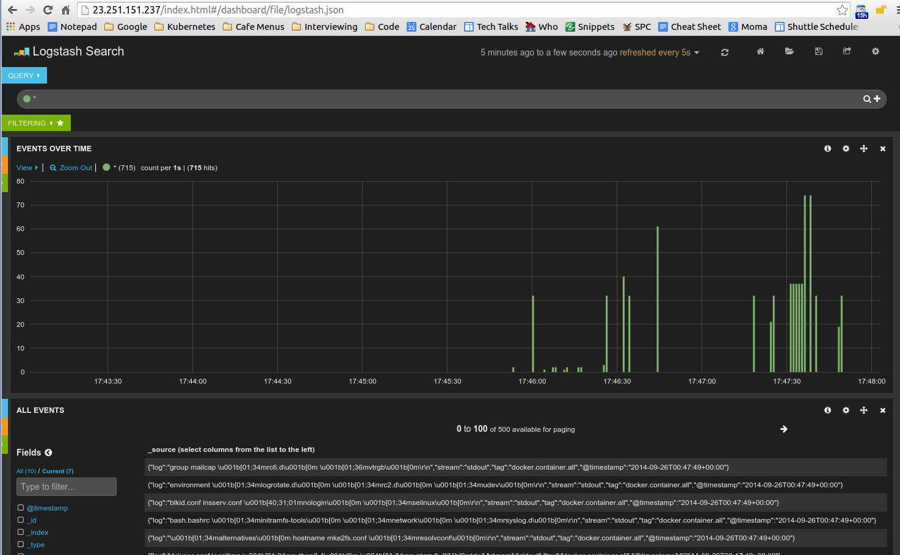

# Docker Container Log File Ingestion into Elasticsearch with fluentd
An example of how to set up fluentd colleciton of Docker container log files
for transmission to Elasticsearch.

Docker container log files live in ```/var/lib/docker/containers/...``` and contain the
output (stdout, stderr) of the running containers encoded as JSON. For example:
```
{"log":"2014/09/25 21:15:03 Got request with path wombat\n",
  "stream":"stderr",
   "time":"2014-09-25T21:15:03.499185026Z"}
```

[Elasticsearch](http://http://www.elasticsearch.org/) is set up as a target for the Docker container logs which we collect with [fluentd](http://http://www.fluentd.org/).

To produce a working demo an instance of Elasticsearch can be run from a Docker image:
```
$ sudo docker run -d --name elasticsearch -p 9200:9200 -p 9300:9300 -v /data:/data -v /etc/localtime:/etc/localtime:ro dockerfile/elasticsearch
```

Now Eleasticsearch is running and waiting for information to be submitted (or quiered) through port ```localhost:9200```.

We can configure fluentd to capture local Docker container log files and send them to elastic search. We do this in a container
and point the configuraiton to a host called ```elasticsearch``` which will correspond the the running Docker image from the previous
step. The Dockerfile builds such a collector and transmitter which can be run as:


```
$ sudo docker run --name docker-fluentd -d --link elasticsearch:elasticsearch -v /var/lib/docker/containers:/var/lib/docker/containers satnam6502/docker-fluentd satnamging/fluentd-elasticsearch
```

This image contains a fluentd configuraiton that collects log files under ```/var/lib/docker/containers/...```
and sends them to Elasticsearch running on a host ```elasticsearch``` on port 9200.
Here is the ```td-agent.conf``` file that is used to configure fluentd:

```
<source>
  type tail
  format json
  time_key time
  path /var/lib/docker/containers/*/*-json.log
  time_format %Y-%m-%dT%H:%M:%S
  tag docker.container.all
</source>

<match docker.container.*>
   type elasticsearch
   include_tag_key true
   host elasticsearch
   port 9200
   logstash_format true
   flush_interval 5s
</match>
```

To generate some log information we can run an interactive bash session using yet another container:

```
$ sudo docker run --name shell -t -i ubuntu /bin/bash
```

This reuslts in two linked running images and one image with a bash shell:

```
$ sudo docker ps
CONTAINER ID        IMAGE                              COMMAND                CREATED             STATUS              PORTS                                            NAMES
c1f24a21d508        ubuntu:latest                      "/bin/bash"            12 seconds ago      Up 11 seconds                                                        shell                              
2b60d04a38a5        satnam6502/docker-fluentd:latest   "/usr/sbin/td-agent    22 hours ago        Up 22 hours                                                          docker-fluentd                               
50da30feb565        dockerfile/elasticsearch:latest    "/elasticsearch/bin/   22 hours ago        Up 22 hours         0.0.0.0:9200->9200/tcp, 0.0.0.0:9300->9300/tcp   docker-fluentd/elasticsearch,elasticsearch   

```

Now as you type commands into the shell container its output will also be send it the corresponding log file for its container under ```/var/lib/docker/containers/c1f24a21d508...```. If an instance of [Kibana](http://www.elasticsearch.org/overview/kibana/) is configued on the node you can observe the logging activity:



