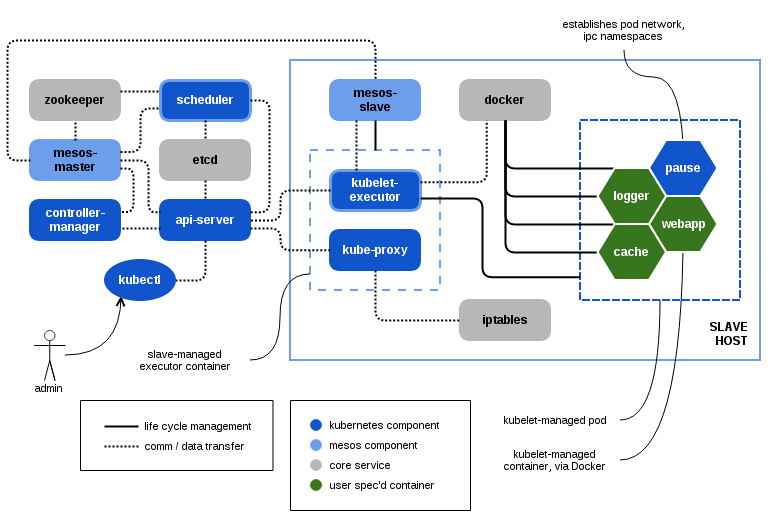

# Kubernetes-Mesos Architecture

An [Apache Mesos][1] cluster consists of one or more masters, and one or more slaves.
Kubernetes-Mesos (k8sm) operates as a Mesos framework that runs on the cluster.
As a framework, k8sm provides scheduler and executor components, both of which are hybrids of Kubernetes and Mesos:
the scheduler component integrates the Kubernetes scheduling API and the Mesos scheduler runtime, whereas;
the executor component integrates Kubernetes kubelet services and the Mesos executor runtime.

Multiple Mesos masters are typically configured to coordinate leadership election via Zookeeper.
Future releases of Mesos may implement leader election protocols [differently][2].
Kubernetes maintains its internal registry (pods, replication controllers, bindings, nodes, services) in etcd.
Users typically interact with Kubernetes using the `kubectl` command to manage Kubernetes primitives.

When a pod is created in Kubernetes, the k8sm scheduler creates an associated Mesos task and queues it for scheduling.
Upon pairing the pod/task with an acceptable resource offer, the scheduler binds the pod/task to the offer's slave.
As a result of binding the pod/task is launched and delivered to an executor (an executor is created by the Mesos slave if one is not already running).
The executor launches the pod/task, which registers the bound pod with the kubelet engine and the kubelet begins to manage the lifecycle of the pod instance.

## Scheduling

The scheduling of a pod on Kubernetes on Mesos is essentially a two-phase process:

1. A new pod is noticed by the k8sm-scheduler and possibly matched with a
   Mesos offer. Then:

   - The offer is *accepted*,
   - the pod is *annotated* with a number of annotation, especially `k8s.mesosphere.io/bindingHost`
   - the pod is *launched* on a Mesos slave.

   The existence of the `bindingHost` annotation tells the k8sm-scheduler that this pod has been launched. If it is not set, the pod is considered *new*.

2. The Mesos slave receives the task launch event and starts (if not running yet) the k8sm-executor (possibly via the km hyperkube binary). Then:

    - The k8sm-executor *binds* the tasks to the node via the apiserver, which means that the `NodeName` field is set by the apiserver.
    - The k8sm-executor sends the pod to the kubelet which is part of the k8sm-executor process.
    - The kubelet launches the containers using Docker.

## Networking

Kubernetes-Mesos uses "normal" Docker IPv4, host-private networking, rather than Kubernetes' SDN-based networking that assigns an IP per pod. This is mostly transparent to the user, especially when using the service abstraction to access pods. For details on some issues it creates, see [issues][3].

## Resource Accounting

Mesos is designed to handle resource accounting and enforcement across the cluster. Part of that enforcement involves "growing" and "shrinking" the pool of resources allocated for executor containers.

The implementation of the k8sm-executor launches pods as Docker containers (just like the upstream kubelet). The containers are resource limited (cpu and memory) with the means of `docker run` by the kubelet code. Moreover, all containers launched by the kubelet code are children of the k8sm-executor cgroup. This parent cgroup is assigned to the k8sm-executor by the Mesos slave.

To actually enforce the defined resource limit for the k8sm-executor and its pods, enable the cpu and memory isolator in your Mesos slaves.

The described resource allocation also applies to static pods which are run on every Mesos slave which runs a  k8sm-executor.

Kubernetes allows to define pods without resource limits for cpu and/or memory. The upstream kubelet will then run the containers without resource bounds. Because Mesos enforces resource accounting, it assign default container cpu and memory limits for those pods. By default these are 0.25 cpu shares and 64 MB of memory. These values can be customized via the `--default-container-cpu-limit` and `--default-container-mem-limit` of the k8sm-scheduler.

Note that currently static pods without cpu and memory limit are not allowed and will make the k8sm-scheduler refuse to start (compare the [k8sm issues](issues.md)).

[1]: http://mesos.apache.org/
[2]: https://issues.apache.org/jira/browse/MESOS-1806
[3]: issues.md#service-endpoints

