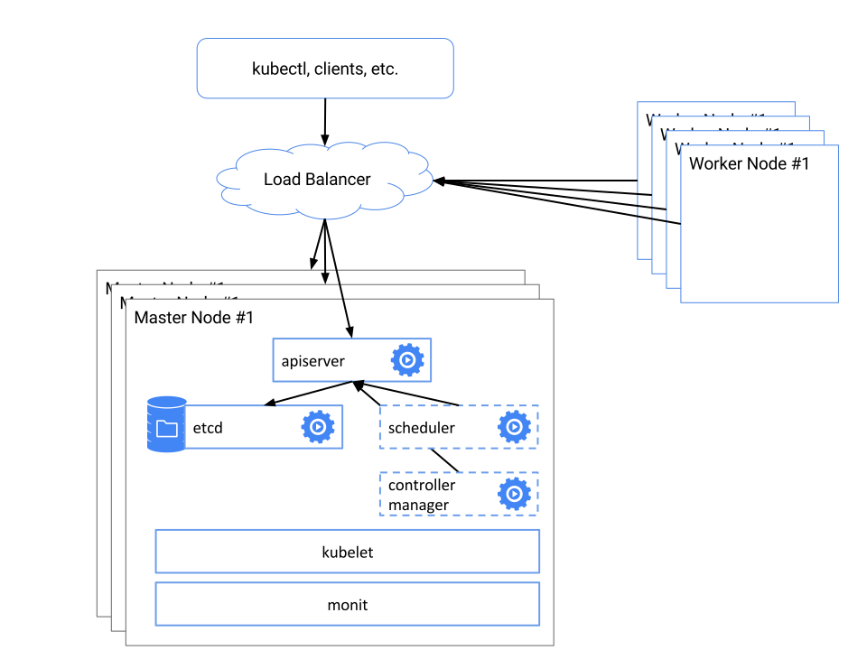

<!-- BEGIN MUNGE: UNVERSIONED_WARNING -->

<!-- BEGIN STRIP_FOR_RELEASE -->


<h2>PLEASE NOTE: This document applies to the HEAD of the source tree</h2>

If you are using a released version of Kubernetes, you should
refer to the docs that go with that version.

<strong>
The latest 1.0.x release of this document can be found
[here](http://releases.k8s.io/release-1.0/docs/admin/high-availability.md).

Documentation for other releases can be found at
[releases.k8s.io](http://releases.k8s.io).
</strong>
--

<!-- END STRIP_FOR_RELEASE -->

<!-- END MUNGE: UNVERSIONED_WARNING -->

# High Availability Kubernetes Clusters

**Table of Contents**
<!-- BEGIN MUNGE: GENERATED_TOC -->

- [High Availability Kubernetes Clusters](#high-availability-kubernetes-clusters)
  - [Introduction](#introduction)
  - [Overview](#overview)
  - [Initial set-up](#initial-set-up)
  - [Reliable nodes](#reliable-nodes)
  - [Establishing a redundant, reliable data storage layer](#establishing-a-redundant-reliable-data-storage-layer)
    - [Clustering etcd](#clustering-etcd)
      - [Validating your cluster](#validating-your-cluster)
    - [Even more reliable storage](#even-more-reliable-storage)
  - [Replicated API Servers](#replicated-api-servers)
    - [Installing configuration files](#installing-configuration-files)
    - [Starting the API Server](#starting-the-api-server)
    - [Load balancing](#load-balancing)
  - [Master elected components](#master-elected-components)
    - [Installing configuration files](#installing-configuration-files)
    - [Running the podmaster](#running-the-podmaster)
  - [Conclusion](#conclusion)
  - [Vagrant up!](#vagrant-up)

<!-- END MUNGE: GENERATED_TOC -->

## Introduction

This document describes how to build a high-availability (HA) Kubernetes cluster.  This is a fairly advanced topic.
Users who merely want to experiment with Kubernetes are encouraged to use configurations that are simpler to set up such as
the simple [Docker based single node cluster instructions](../../docs/getting-started-guides/docker.md),
or try [Google Container Engine](https://cloud.google.com/container-engine/) for hosted Kubernetes.

Also, at this time high availability support for Kubernetes is not continuously tested in our end-to-end (e2e) testing.  We will
be working to add this continuous testing, but for now the single-node master installations are more heavily tested.

## Overview

Setting up a truly reliable, highly available distributed system requires a number of steps, it is akin to
wearing underwear, pants, a belt, suspenders, another pair of underwear, and another pair of pants.  We go into each
of these steps in detail, but a summary is given here to help guide and orient the user.

The steps involved are as follows:
   * [Creating the reliable constituent nodes that collectively form our HA master implementation.](#reliable-nodes)
   * [Setting up a redundant, reliable storage layer with clustered etcd.](#establishing-a-redundant-reliable-data-storage-layer)
   * [Starting replicated, load balanced Kubernetes API servers](#replicated-api-servers)
   * [Setting up master-elected Kubernetes scheduler and controller-manager daemons](#master-elected-components)

Here's what the system should look like when it's finished:


Ready? Let's get started.

## Initial set-up

The remainder of this guide assumes that you are setting up a 3-node clustered master, where each machine is running some flavor of Linux.
Examples in the guide are given for Debian distributions, but they should be easily adaptable to other distributions.
Likewise, this set up should work whether you are running in a public or private cloud provider, or if you are running
on bare metal.

The easiest way to implement an HA Kubernetes cluster is to start with an existing single-master cluster.  The
instructions at [https://get.k8s.io](https://get.k8s.io)
describe easy installation for single-master clusters on a variety of platforms.

## Reliable nodes

On each master node, we are going to run a number of processes that implement the Kubernetes API.  The first step in making these reliable is
to make sure that each automatically restarts when it fails.  To achieve this, we need to install a process watcher.  We choose to use
the `kubelet` that we run on each of the worker nodes.  This is convenient, since we can use containers to distribute our binaries, we can
establish resource limits, and introspect the resource usage of each daemon.  Of course, we also need something to monitor the kubelet
itself (insert who watches the watcher jokes here).  For Debian systems, we choose monit, but there are a number of alternate
choices. For example, on systemd-based systems (e.g. RHEL, CentOS), you can run 'systemctl enable kubelet'.

If you are extending from a standard Kubernetes installation, the `kubelet` binary should already be present on your system.  You can run
`which kubelet` to determine if the binary is in fact installed.  If it is not installed,
you should install the [kubelet binary](https://storage.googleapis.com/kubernetes-release/release/v0.19.3/bin/linux/amd64/kubelet), the
[kubelet init file](http://releases.k8s.io/HEAD/cluster/saltbase/salt/kubelet/initd) and [high-availability/default-kubelet](high-availability/default-kubelet)
scripts.

If you are using monit, you should also install the monit daemon (`apt-get install monit`) and the [high-availability/monit-kubelet](high-availability/monit-kubelet) and
[high-availability/monit-docker](high-availability/monit-docker) configs.

On systemd systems you `systemctl enable kubelet` and `systemctl enable docker`.


## Establishing a redundant, reliable data storage layer

The central foundation of a highly available solution is a redundant, reliable storage layer.  The number one rule of high-availability is
to protect the data.  Whatever else happens, whatever catches on fire, if you have the data, you can rebuild.  If you lose the data, you're
done.

Clustered etcd already replicates your storage to all master instances in your cluster.  This means that to lose data, all three nodes would need
to have their physical (or virtual) disks fail at the same time.  The probability that this occurs is relatively low, so for many people
running a replicated etcd cluster is likely reliable enough.  You can add additional reliability by increasing the
size of the cluster from three to five nodes.  If that is still insufficient, you can add
[even more redundancy to your storage layer](#even-more-reliable-storage).

### Clustering etcd

The full details of clustering etcd are beyond the scope of this document, lots of details are given on the
[etcd clustering page](https://github.com/coreos/etcd/blob/master/Documentation/clustering.md).  This example walks through
a simple cluster set up, using etcd's built in discovery to build our cluster.

First, hit the etcd discovery service to create a new token:

```sh
curl https://discovery.etcd.io/new?size=3
```

On each node, copy the [etcd.yaml](high-availability/etcd.yaml) file into `/etc/kubernetes/manifests/etcd.yaml`

The kubelet on each node actively monitors the contents of that directory, and it will create an instance of the `etcd`
server from the definition of the pod specified in `etcd.yaml`.

Note that in `etcd.yaml` you should substitute the token URL you got above for `${DISCOVERY_TOKEN}` on all three machines,
and you should substitute a different name (e.g. `node-1`) for ${NODE_NAME} and the correct IP address
for `${NODE_IP}` on each machine.


#### Validating your cluster

Once you copy this into all three nodes, you should have a clustered etcd set up.  You can validate with

```sh
etcdctl member list
```

and

```sh
etcdctl cluster-health
```

You can also validate that this is working with `etcdctl set foo bar` on one node, and `etcd get foo`
on a different node.

### Even more reliable storage

Of course, if you are interested in increased data reliability, there are further options which makes the place where etcd
installs it's data even more reliable than regular disks (belts *and* suspenders, ftw!).

If you use a cloud provider, then they usually provide this
for you, for example [Persistent Disk](https://cloud.google.com/compute/docs/disks/persistent-disks) on the Google Cloud Platform.  These
are block-device persistent storage that can be mounted onto your virtual machine. Other cloud providers provide similar solutions.

If you are running on physical machines, you can also use network attached redundant storage using an iSCSI or NFS interface.
Alternatively, you can run a clustered file system like Gluster or Ceph.  Finally, you can also run a RAID array on each physical machine.

Regardless of how you choose to implement it, if you chose to use one of these options, you should make sure that your storage is mounted
to each machine.  If your storage is shared between the three masters in your cluster, you should create a different directory on the storage
for each node.  Throughout these instructions, we assume that this storage is mounted to your machine in `/var/etcd/data`


## Replicated API Servers

Once you have replicated etcd set up correctly, we will also install the apiserver using the kubelet.

### Installing configuration files

First you need to create the initial log file, so that Docker mounts a file instead of a directory:

```sh
touch /var/log/kube-apiserver.log
```

Next, you need to create a `/srv/kubernetes/` directory on each node.  This directory includes:
   * basic_auth.csv  - basic auth user and password
   * ca.crt - Certificate Authority cert
   * known_tokens.csv - tokens that entities (e.g. the kubelet) can use to talk to the apiserver
   * kubecfg.crt - Client certificate, public key
   * kubecfg.key - Client certificate, private key
   * server.cert - Server certificate, public key
   * server.key - Server certificate, private key

The easiest way to create this directory, may be to copy it from the master node of a working cluster, or you can manually generate these files yourself.

### Starting the API Server

Once these files exist, copy the [kube-apiserver.yaml](high-availability/kube-apiserver.yaml) into `/etc/kubernetes/manifests/` on each master node.

The kubelet monitors this directory, and will automatically create an instance of the `kube-apiserver` container using the pod definition specified
in the file.

### Load balancing

At this point, you should have 3 apiservers all working correctly.  If you set up a network load balancer, you should
be able to access your cluster via that load balancer, and see traffic balancing between the apiserver instances.  Setting
up a load balancer will depend on the specifics of your platform, for example instructions for the Google Cloud
Platform can be found [here](https://cloud.google.com/compute/docs/load-balancing/)

Note, if you are using authentication, you may need to regenerate your certificate to include the IP address of the balancer,
in addition to the IP addresses of the individual nodes.

For pods that you deploy into the cluster, the `kubernetes` service/dns name should provide a load balanced endpoint for the master automatically.

For external users of the API (e.g. the `kubectl` command line interface, continuous build pipelines, or other clients) you will want to configure
them to talk to the external load balancer's IP address.

## Master elected components

So far we have set up state storage, and we have set up the API server, but we haven't run anything that actually modifies
cluster state, such as the controller manager and scheduler.  To achieve this reliably, we only want to have one actor modifying state at a time, but we want replicated
instances of these actors, in case a machine dies.  To achieve this, we are going to use a lease-lock in etcd to perform
master election.  On each of the three apiserver nodes, we run a small utility application named `podmaster`. It's job is to implement a master
election protocol using etcd "compare and swap". If the apiserver node wins the election, it starts the master component it is managing (e.g. the scheduler), if it
loses the election, it ensures that any master components running on the node (e.g. the scheduler) are stopped.

In the future, we expect to more tightly integrate this lease-locking into the scheduler and controller-manager binaries directly, as described in the [high availability design proposal](../proposals/high-availability.md)

### Installing configuration files

First, create empty log files on each node, so that Docker will mount the files not make new directories:

```sh
touch /var/log/kube-scheduler.log
touch /var/log/kube-controller-manager.log
```

Next, set up the descriptions of the scheduler and controller manager pods on each node.
by copying [kube-scheduler.yaml](high-availability/kube-scheduler.yaml) and [kube-controller-manager.yaml](high-availability/kube-controller-manager.yaml) into the `/srv/kubernetes/`
 directory.

### Running the podmaster

Now that the configuration files are in place, copy the [podmaster.yaml](high-availability/podmaster.yaml) config file into `/etc/kubernetes/manifests/`

As before, the kubelet on the node monitors this directory, and will start an instance of the podmaster using the pod specification provided in `podmaster.yaml`.

Now you will have one instance of the scheduler process running on a single master node, and likewise one
controller-manager process running on a single (possibly different) master node.  If either of these processes fail,
the kubelet will restart them.  If any of these nodes fail, the process will move to a different instance of a master
node.

## Conclusion

At this point, you are done (yeah!) with the master components, but you still need to add worker nodes (boo!).

If you have an existing cluster, this is as simple as reconfiguring your kubelets to talk to the load-balanced endpoint, and
restarting the kubelets on each node.

If you are turning up a fresh cluster, you will need to install the kubelet and kube-proxy on each worker node, and
set the `--apiserver` flag to your replicated endpoint.

## Vagrant up!

We indeed have an initial proof of concept tester for this, which is available [here](../../examples/high-availability/).

It implements the major concepts (with a few minor reductions for simplicity), of the podmaster HA implementation alongside a quick smoke test using k8petstore.


<!-- BEGIN MUNGE: GENERATED_ANALYTICS -->
[]()
<!-- END MUNGE: GENERATED_ANALYTICS -->
