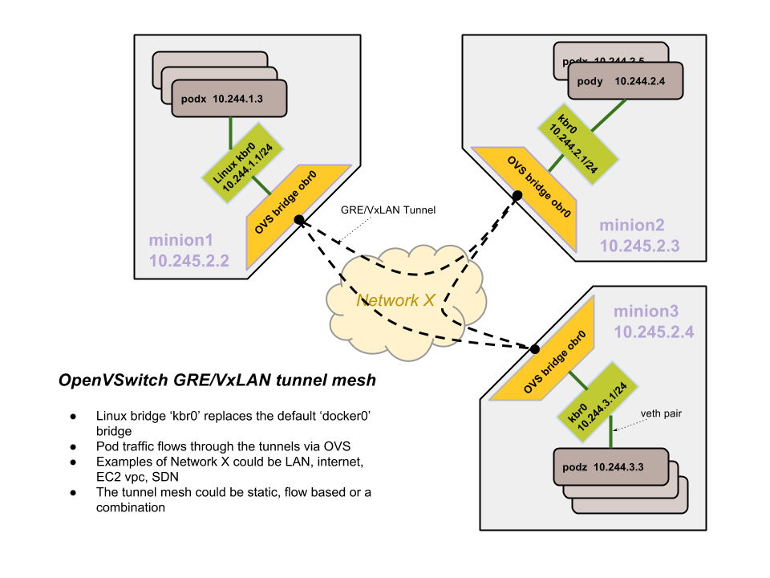

<!-- BEGIN MUNGE: UNVERSIONED_WARNING -->

<!-- END MUNGE: UNVERSIONED_WARNING -->

# Kubernetes OpenVSwitch GRE/VxLAN networking

This document describes how OpenVSwitch is used to setup networking between pods across nodes.
The tunnel type could be GRE or VxLAN. VxLAN is preferable when large scale isolation needs to be performed within the network.

The vagrant setup in Kubernetes does the following:

The docker bridge is replaced with a brctl generated linux bridge (kbr0) with a 256 address space subnet. Basically, a node gets 10.244.x.0/24 subnet and docker is configured to use that bridge instead of the default docker0 bridge.

Also, an OVS bridge is created(obr0) and added as a port to the kbr0 bridge. All OVS bridges across all nodes are linked with GRE tunnels. So, each node has an outgoing GRE tunnel to all other nodes. It does not need to be a complete mesh really, just meshier the better. STP (spanning tree) mode is enabled in the bridges to prevent loops.

Routing rules enable any 10.244.0.0/16 target to become reachable via the OVS bridge connected with the tunnels.

<!-- BEGIN MUNGE: IS_VERSIONED -->
<!-- TAG IS_VERSIONED -->
<!-- END MUNGE: IS_VERSIONED -->

<!-- BEGIN MUNGE: GENERATED_ANALYTICS -->

<!-- END MUNGE: GENERATED_ANALYTICS -->
