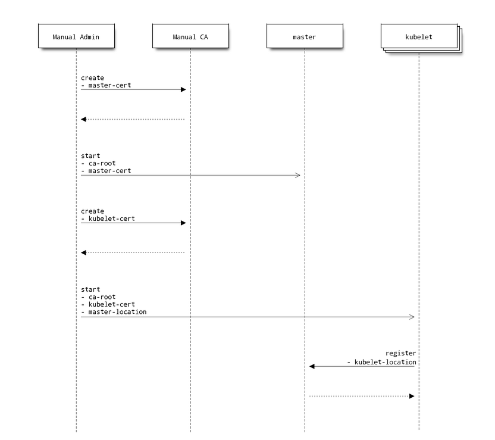
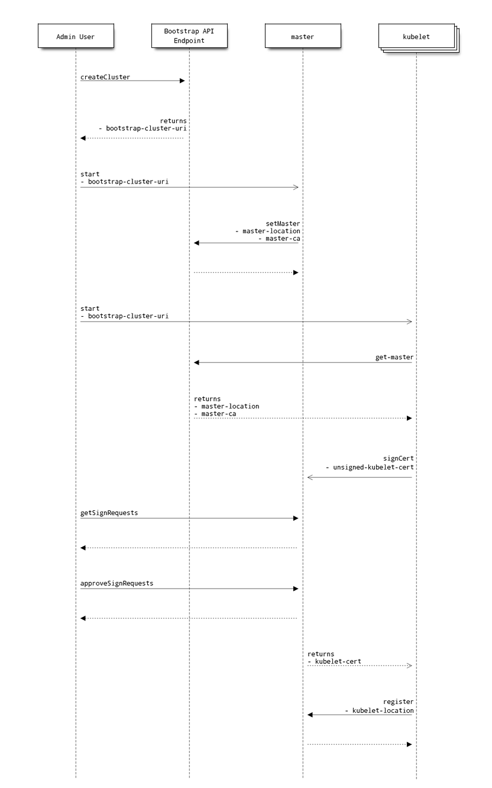

# Clustering in Kubernetes

## Overview

The term "clustering" refers to the process of having all members of the
Kubernetes cluster find and trust each other. There are multiple different ways
to achieve clustering with different security and usability profiles. This
document attempts to lay out the user experiences for clustering that Kubernetes
aims to address.

Once a cluster is established, the following is true:

1. **Master -> Node**  The master needs to know which nodes can take work and
what their current status is wrt capacity.
  1. **Location** The master knows the name and location of all of the nodes in
the cluster.
    * For the purposes of this doc, location and name should be enough
information so that the master can open a TCP connection to the Node. Most
probably we will make this either an IP address or a DNS name. It is going to be
important to be consistent here (master must be able to reach kubelet on that
DNS name) so that we can verify certificates appropriately.
  2. **Target AuthN** A way to securely talk to the kubelet on that node.
Currently we call out to the kubelet over HTTP. This should be over HTTPS and
the master should know what CA to trust for that node.
  3. **Caller AuthN/Z** This would be the master verifying itself (and
permissions) when calling the node. Currently, this is only used to collect
statistics as authorization isn't critical. This may change in the future
though.
2. **Node -> Master**  The nodes currently talk to the master to know which pods
have been assigned to them and to publish events.
  1. **Location** The nodes must know where the master is at.
  2. **Target AuthN** Since the master is assigning work to the nodes, it is
critical that they verify whom they are talking to.
  3. **Caller AuthN/Z** The nodes publish events and so must be authenticated to
the master. Ideally this authentication is specific to each node so that
authorization can be narrowly scoped. The details of the work to run (including
things like environment variables) might be considered sensitive and should be
locked down also.

**Note:** While the description here refers to a singular Master, in the future
we should enable multiple Masters operating in an HA mode. While the "Master" is
currently the combination of the API Server, Scheduler and Controller Manager,
we will restrict ourselves to thinking about the main API and policy engine --
the API Server.

## Current Implementation

A central authority (generally the master) is responsible for determining the
set of machines which are members of the cluster. Calls to create and remove
worker nodes in the cluster are restricted to this single authority, and any
other requests to add or remove worker nodes are rejected. (1.i.)

Communication from the master to nodes is currently over HTTP and is not secured
or authenticated in any way. (1.ii, 1.iii.)

The location of the master is communicated out of band to the nodes. For GCE,
this is done via Salt. Other cluster instructions/scripts use other methods.
(2.i.)

Currently most communication from the node to the master is over HTTP. When it
is done over HTTPS there is currently no verification of the cert of the master
(2.ii.)

Currently, the node/kubelet is authenticated to the master via a token shared
across all nodes. This token is distributed out of band (using Salt for GCE) and
is optional. If it is not present then the kubelet is unable to publish events
to the master. (2.iii.)

Our current mix of out of band communication doesn't meet all of our needs from
a security point of view and is difficult to set up and configure.

## Proposed Solution

The proposed solution will provide a range of options for setting up and
maintaining a secure Kubernetes cluster. We want to both allow for centrally
controlled systems (leveraging pre-existing trust and configuration systems) or
more ad-hoc automagic systems that are incredibly easy to set up.

The building blocks of an easier solution:

* **Move to TLS** We will move to using TLS for all intra-cluster communication.
We will explicitly identify the trust chain (the set of trusted CAs) as opposed
to trusting the system CAs. We will also use client certificates for all AuthN.
* [optional] **API driven CA** Optionally, we will run a CA in the master that
will mint certificates for the nodes/kubelets. There will be pluggable policies
that will automatically approve certificate requests here as appropriate.
  * **CA approval policy** This is a pluggable policy object that can
automatically approve CA signing requests. Stock policies will include
`always-reject`, `queue` and `insecure-always-approve`. With `queue` there would
be an API for evaluating and accepting/rejecting requests. Cloud providers could
implement a policy here that verifies other out of band information and
automatically approves/rejects based on other external factors.
* **Scoped Kubelet Accounts** These accounts are per-node and (optionally) give
a node permission to register itself.
  * To start with, we'd have the kubelets generate a cert/account in the form of
`kubelet:<host>`. To start we would then hard code policy such that we give that
particular account appropriate permissions. Over time, we can make the policy
engine more generic.
* [optional] **Bootstrap API endpoint** This is a helper service hosted outside
of the Kubernetes cluster that helps with initial discovery of the master.

### Static Clustering

In this sequence diagram there is out of band admin entity that is creating all
certificates and distributing them. It is also making sure that the kubelets
know where to find the master. This provides for a lot of control but is more
difficult to set up as lots of information must be communicated outside of
Kubernetes.

### Dynamic Clustering

This diagram shows dynamic clustering using the bootstrap API endpoint. This
endpoint is used to both find the location of the master and communicate the
root CA for the master.

This flow has the admin manually approving the kubelet signing requests. This is
the `queue` policy defined above. This manual intervention could be replaced by
code that can verify the signing requests via other means.

<!-- BEGIN MUNGE: GENERATED_ANALYTICS -->

<!-- END MUNGE: GENERATED_ANALYTICS -->
