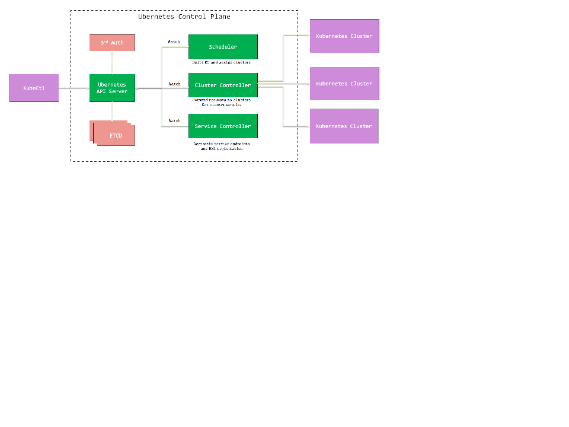
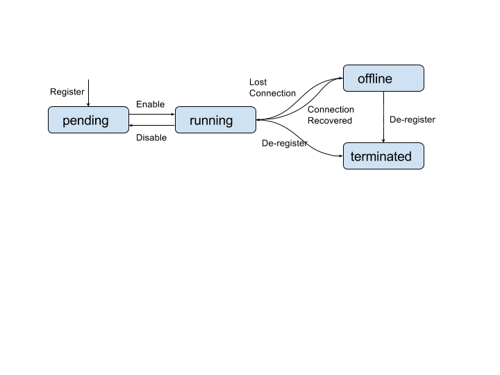
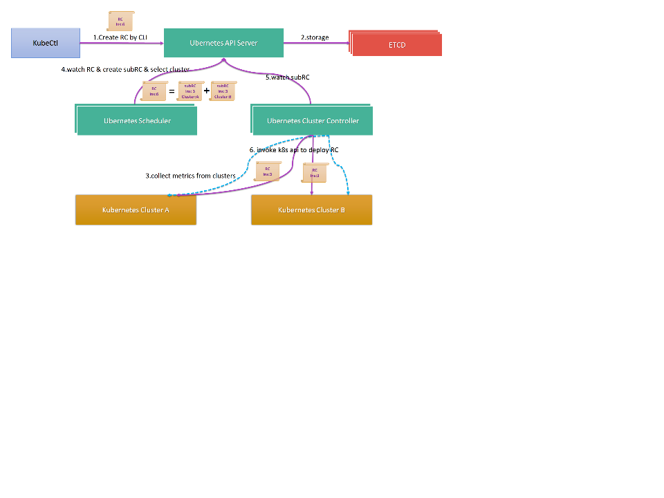

# Ubernetes Design Spec (phase one)

**Huawei PaaS Team**

## INTRODUCTION

In this document we propose a design for the “Control Plane” of
Kubernetes (K8S) federation (a.k.a. “Ubernetes”). For background of
this work please refer to
[this proposal](../../docs/proposals/federation.md).
The document is arranged as following. First we briefly list scenarios
and use cases that motivate K8S federation work. These use cases drive
the design and they also verify the design. We summarize the
functionality requirements from these use cases, and define the “in
scope” functionalities that will be covered by this design (phase
one). After that we give an overview of the proposed architecture, API
and building blocks. And also we go through several activity flows to
see how these building blocks work together to support use cases.

## REQUIREMENTS

There are many reasons why customers may want to build a K8S
federation:

+ **High Availability:** Customers want to be immune to the outage of
   a single availability zone, region or even a cloud provider.
+ **Sensitive workloads:** Some workloads can only run on a particular
   cluster. They cannot be scheduled to or migrated to other clusters.
+ **Capacity overflow:** Customers prefer to run workloads on a
   primary cluster. But if the capacity of the cluster is not
   sufficient, workloads should be automatically distributed to other
   clusters.
+ **Vendor lock-in avoidance:** Customers want to spread their
   workloads on different cloud providers, and can easily increase or
   decrease the workload proportion of a specific provider.
+ **Cluster Size Enhancement:** Currently K8S cluster can only support
a limited size. While the community is actively improving it, it can
be expected that cluster size will be a problem if K8S is used for
large workloads or public PaaS infrastructure. While we can separate
different tenants to different clusters, it would be good to have a
unified view.

Here are the functionality requirements derived from above use cases:

+ Clients of the federation control plane API server can register and deregister
clusters.
+ Workloads should be spread to different clusters according to the
   workload distribution policy.
+ Pods are able to discover and connect to services hosted in other
  clusters (in cases where inter-cluster networking is necessary,
  desirable and implemented).
+ Traffic to these pods should be spread across clusters (in a manner
  similar to load balancing, although it might not be strictly
  speaking balanced).
+ The control plane needs to know when a cluster is down, and migrate
   the workloads to other clusters.
+ Clients have a unified view and a central control point for above
   activities.

## SCOPE

It’s difficult to have a perfect design with one click that implements
all the above requirements. Therefore we will go with an iterative
approach to design and build the system. This document describes the
phase one of the whole work. In phase one we will cover only the
following objectives:

+ Define the basic building blocks and API objects of control plane
+ Implement a basic end-to-end workflow
   + Clients register federated clusters
   + Clients submit a workload
   + The workload is distributed to different clusters
   + Service discovery
   + Load balancing

The following parts are NOT covered in phase one:

+ Authentication and authorization (other than basic client
  authentication against the ubernetes API, and from ubernetes control
  plane to the underlying kubernetes clusters).
+ Deployment units other than replication controller and service
+ Complex distribution policy of workloads
+ Service affinity and migration

## ARCHITECTURE

The overall architecture of a control plane is shown as following:



Some design principles we are following in this architecture:

1. Keep the underlying K8S clusters independent. They should have no
   knowledge of control plane or of each other.
1. Keep the Ubernetes API interface compatible with K8S API as much as
   possible.
1. Re-use concepts from K8S as much as possible. This reduces
customers’ learning curve and is good for adoption.  Below is a brief
description of each module contained in above diagram.

## Ubernetes API Server

The API Server in the Ubernetes control plane works just like the API
Server in K8S. It talks to a distributed key-value store to persist,
retrieve and watch API objects. This store is completely distinct
from the kubernetes key-value stores (etcd) in the underlying
kubernetes clusters. We still use `etcd` as the distributed
storage so customers don’t need to learn and manage a different
storage system, although it is envisaged that other storage systems
(consol, zookeeper) will probably be developedand supported over
time.

## Ubernetes Scheduler

The Ubernetes Scheduler schedules resources onto the underlying
Kubernetes clusters. For example it watches for unscheduled Ubernetes
replication controllers (those that have not yet been scheduled onto
underlying Kubernetes clusters) and performs the global scheduling
work. For each unscheduled replication controller, it calls policy
engine to decide how to spit workloads among clusters. It creates a
Kubernetes Replication Controller on one ore more underlying cluster,
and post them back to `etcd` storage.

One sublety worth noting here is that the scheduling decision is arrived at by
combining the application-specific request from the user (which might
include, for example, placement constraints), and the global policy specified
by the federation administrator (for example, "prefer on-premise
clusters over AWS clusters" or "spread load equally across clusters").

## Ubernetes Cluster Controller

The cluster controller
performs the following two kinds of work:

1. It watches all the sub-resources that are created by Ubernetes
   components, like a sub-RC or a sub-service. And then it creates the
   corresponding API objects on the underlying K8S clusters.
1. It periodically retrieves the available resources metrics from the
   underlying K8S cluster, and updates them as object status of the
   `cluster` API object. An alternative design might be to run a pod
   in each underlying cluster that reports metrics for that cluster to
   the Ubernetes control plane. Which approach is better remains an
   open topic of discussion.

## Ubernetes Service Controller

The Ubernetes service controller is a federation-level implementation
of K8S service controller. It watches service resources created on
control plane, creates corresponding K8S services on each involved K8S
clusters.  Besides interacting with services resources on each
individual K8S clusters, the Ubernetes service controller also
performs some global DNS registration work.

## API OBJECTS

## Cluster

Cluster is a new first-class API object introduced in this design. For
each registered K8S cluster there will be such an API resource in
control plane. The way clients register or deregister a cluster is to
send corresponding REST requests to following URL:
`/api/{$version}/clusters`. Because control plane is behaving like a
regular K8S client to the underlying clusters, the spec of a cluster
object contains necessary properties like K8S cluster address and
credentials.  The status of a cluster API object will contain
following information:

1. Which phase of its lifecycle
1. Cluster resource metrics for scheduling decisions.
1. Other metadata like the version of cluster

$version.clusterSpec

<table style="border:1px solid #000000;border-collapse:collapse;">
<tbody>
<tr>
<td style="padding:5px;"><b>Name</b><br>
</td>
<td style="padding:5px;"><b>Description</b><br>
</td>
<td style="padding:5px;"><b>Required</b><br>
</td>
<td style="padding:5px;"><b>Schema</b><br>
</td>
<td style="padding:5px;"><b>Default</b><br>
</td>
</tr>
<tr>
<td style="padding:5px;">Address<br>
</td>
<td style="padding:5px;">address of the cluster<br>
</td>
<td style="padding:5px;">yes<br>
</td>
<td style="padding:5px;">address<br>
</td>
<td style="padding:5px;"><p></p></td>
</tr>
<tr>
<td style="padding:5px;">Credential<br>
</td>
<td style="padding:5px;">the type (e.g. bearer token, client
certificate etc) and data of the credential used to access cluster. It’s used for system routines (not behalf of users)<br>
</td>
<td style="padding:5px;">yes<br>
</td>
<td style="padding:5px;">string <br>
</td>
<td style="padding:5px;"><p></p></td>
</tr>
</tbody>
</table>

$version.clusterStatus

<table style="border:1px solid #000000;border-collapse:collapse;">
<tbody>
<tr>
<td style="padding:5px;"><b>Name</b><br>
</td>
<td style="padding:5px;"><b>Description</b><br>
</td>
<td style="padding:5px;"><b>Required</b><br>
</td>
<td style="padding:5px;"><b>Schema</b><br>
</td>
<td style="padding:5px;"><b>Default</b><br>
</td>
</tr>
<tr>
<td style="padding:5px;">Phase<br>
</td>
<td style="padding:5px;">the recently observed lifecycle phase of the cluster<br>
</td>
<td style="padding:5px;">yes<br>
</td>
<td style="padding:5px;">enum<br>
</td>
<td style="padding:5px;"><p></p></td>
</tr>
<tr>
<td style="padding:5px;">Capacity<br>
</td>
<td style="padding:5px;">represents the available resources of a cluster<br>
</td>
<td style="padding:5px;">yes<br>
</td>
<td style="padding:5px;">any<br>
</td>
<td style="padding:5px;"><p></p></td>
</tr>
<tr>
<td style="padding:5px;">ClusterMeta<br>
</td>
<td style="padding:5px;">Other cluster metadata like the version<br>
</td>
<td style="padding:5px;">yes<br>
</td>
<td style="padding:5px;">ClusterMeta<br>
</td>
<td style="padding:5px;"><p></p></td>
</tr>
</tbody>
</table>

**For simplicity we didn’t introduce a separate “cluster metrics” API
object here**. The cluster resource metrics are stored in cluster
status section, just like what we did to nodes in K8S. In phase one it
only contains available CPU resources and memory resources. The
cluster controller will periodically poll the underlying cluster API
Server to get cluster capability. In phase one it gets the metrics by
simply aggregating metrics from all nodes. In future we will improve
this with more efficient ways like leveraging heapster, and also more
metrics will be supported.  Similar to node phases in K8S, the “phase”
field includes following values:

+ pending: newly registered clusters or clusters suspended by admin
   for various reasons. They are not eligible for accepting workloads
+ running: clusters in normal status that can accept workloads
+ offline: clusters temporarily down or not reachable
+ terminated: clusters removed from federation

Below is the state transition diagram.



## Replication Controller

A global workload submitted to control plane is represented as a
 replication controller in the Cluster Federation control plane. When a replication controller
is submitted to control plane, clients need a way to express its
requirements or preferences on clusters. Depending on different use
cases it may be complex. For example:

+ This workload can only be scheduled to cluster Foo. It cannot be
   scheduled to any other clusters. (use case: sensitive workloads).
+ This workload prefers cluster Foo. But if there is no available
   capacity on cluster Foo, it’s OK to be scheduled to cluster Bar
   (use case: workload )
+ Seventy percent of this workload should be scheduled to cluster Foo,
    and thirty percent should be scheduled to cluster Bar (use case:
    vendor lock-in avoidance). In phase one, we only introduce a
    _clusterSelector_ field to filter acceptable clusters. In default
    case there is no such selector and it means any cluster is
    acceptable.

Below is a sample of the YAML to create such a replication controller.

``` 
apiVersion: v1
kind: ReplicationController
metadata:
  name: nginx-controller
spec:
  replicas: 5
  selector:
    app: nginx
  template:
    metadata:
      labels:
        app: nginx
    spec:
      containers:
      - name: nginx
        image: nginx
        ports:
        - containerPort: 80
      clusterSelector: 
      name in (Foo, Bar)
```

Currently clusterSelector (implemented as a
[LabelSelector](../../pkg/apis/extensions/v1beta1/types.go#L704))
only supports a simple list of acceptable clusters. Workloads will be
evenly distributed on these acceptable clusters in phase one. After
phase one we will define syntax to represent more advanced
constraints, like cluster preference ordering, desired number of
splitted workloads, desired ratio of workloads spread on different
clusters, etc.

Besides this explicit “clusterSelector” filter, a workload may have
some implicit scheduling restrictions. For example it defines
“nodeSelector” which can only be satisfied on some particular
clusters. How to handle this will be addressed after phase one.

## Federated Services

The Service API object exposed by the Cluster Federation is similar to service
objects on Kubernetes. It defines the access to a group of pods. The
federation service controller will create corresponding Kubernetes
service objects on underlying clusters. These are detailed in a
separate design document: [Federated Services](federated-services.md).

## Pod

In phase one we only support scheduling replication controllers. Pod
scheduling will be supported in later phase. This is primarily in
order to keep the Cluster Federation API compatible with the Kubernetes API.

## ACTIVITY FLOWS

## Scheduling

The below diagram shows how workloads are scheduled on the Cluster Federation control\
plane:

1. A replication controller is created by the client.
1. APIServer persists it into the storage.
1. Cluster controller periodically polls the latest available resource
   metrics from the underlying clusters.
1. Scheduler is watching all pending RCs. It picks up the RC, make
   policy-driven decisions and split it into different sub RCs.
1. Each cluster control is watching the sub RCs bound to its
   corresponding cluster. It picks up the newly created sub RC.
1. The cluster controller issues requests to the underlying cluster
API Server to create the RC.  In phase one we don’t support complex
distribution policies. The scheduling rule is basically:
    1. If a RC does not specify any nodeSelector, it will be scheduled
       to the least loaded K8S cluster(s) that has enough available
       resources.
    1. If a RC specifies _N_ acceptable clusters in the
       clusterSelector, all replica will be evenly distributed among
       these clusters.

There is a potential race condition here. Say at time _T1_ the control
plane learns there are _m_ available resources in a K8S cluster. As
the cluster is working independently it still accepts workload
requests from other K8S clients or even another Cluster Federation control
plane. The Cluster Federation scheduling decision is based on this data of
available resources. However when the actual RC creation happens to
the cluster at time _T2_, the cluster may don’t have enough resources
at that time. We will address this problem in later phases with some
proposed solutions like resource reservation mechanisms.



## Service Discovery

This part has been included in the section “Federated Service” of
document
“[Federated Cross-cluster Load Balancing and Service Discovery Requirements and System Design](federated-services.md))”.
Please refer to that document for details.


<!-- BEGIN MUNGE: GENERATED_ANALYTICS -->
[]()
<!-- END MUNGE: GENERATED_ANALYTICS -->
