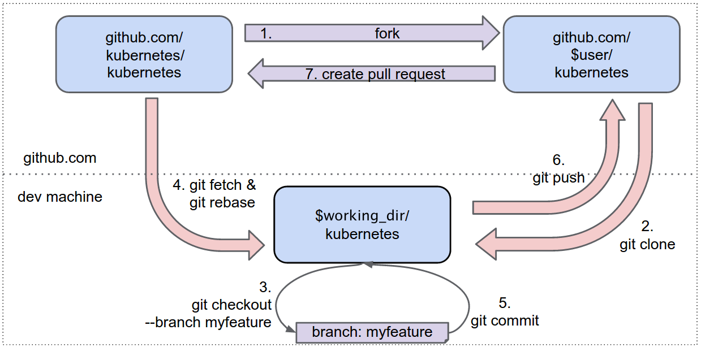

<!-- BEGIN MUNGE: UNVERSIONED_WARNING -->


<!-- END MUNGE: UNVERSIONED_WARNING -->

# Development Guide

# Releases and Official Builds

Official releases are built in Docker containers.  Details are [here](http://releases.k8s.io/v1.1.0/build/README.md).  You can do simple builds and development with just a local Docker installation.  If want to build go locally outside of docker, please continue below.

## Go development environment

Kubernetes is written in [Go](http://golang.org) programming language. If you haven't set up Go development environment, please follow [this instruction](http://golang.org/doc/code.html) to install go tool and set up GOPATH. Ensure your version of Go is at least 1.3.

## Git Setup

Below, we outline one of the more common git workflows that core developers use. Other git workflows are also valid.

### Visual overview



### Fork the main repository

1. Go to https://github.com/kubernetes/kubernetes
2. Click the "Fork" button (at the top right)

### Clone your fork

The commands below require that you have $GOPATH set ([$GOPATH docs](https://golang.org/doc/code.html#GOPATH)). We highly recommend you put Kubernetes' code into your GOPATH. Note: the commands below will not work if there is more than one directory in your `$GOPATH`.

```sh
mkdir -p $GOPATH/src/k8s.io
cd $GOPATH/src/k8s.io
# Replace "$YOUR_GITHUB_USERNAME" below with your github username
git clone https://github.com/$YOUR_GITHUB_USERNAME/kubernetes.git
cd kubernetes
git remote add upstream 'https://github.com/kubernetes/kubernetes.git'
```

### Create a branch and make changes

```sh
git checkout -b myfeature
# Make your code changes
```

### Keeping your development fork in sync

```sh
git fetch upstream
git rebase upstream/master
```

Note: If you have write access to the main repository at github.com/kubernetes/kubernetes, you should modify your git configuration so that you can't accidentally push to upstream:

```sh
git remote set-url --push upstream no_push
```

### Committing changes to your fork

```sh
git commit
git push -f origin myfeature
```

### Creating a pull request

1. Visit https://github.com/$YOUR_GITHUB_USERNAME/kubernetes
2. Click the "Compare and pull request" button next to your "myfeature" branch.
3. Check out the pull request [process](pull-requests.md) for more details

### When to retain commits and when to squash

Upon merge, all git commits should represent meaningful milestones or units of
work.  Use commits to add clarity to the development and review process.

Before merging a PR, squash any "fix review feedback", "typo", and "rebased"
sorts of commits.  It is not imperative that every commit in a PR compile and
pass tests independently, but it is worth striving for.  For mass automated
fixups (e.g. automated doc formatting), use one or more commits for the
changes to tooling and a final commit to apply the fixup en masse.  This makes
reviews much easier.

See [Faster Reviews](faster_reviews.md) for more details.

## godep and dependency management

Kubernetes uses [godep](https://github.com/tools/godep) to manage dependencies. It is not strictly required for building Kubernetes but it is required when managing dependencies under the Godeps/ tree, and is required by a number of the build and test scripts. Please make sure that ``godep`` is installed and in your ``$PATH``.

### Installing godep

There are many ways to build and host go binaries. Here is an easy way to get utilities like `godep` installed:

1) Ensure that [mercurial](http://mercurial.selenic.com/wiki/Download) is installed on your system. (some of godep's dependencies use the mercurial
source control system).  Use `apt-get install mercurial` or `yum install mercurial` on Linux, or [brew.sh](http://brew.sh) on OS X, or download
directly from mercurial.

2) Create a new GOPATH for your tools and install godep:

```sh
export GOPATH=$HOME/go-tools
mkdir -p $GOPATH
go get github.com/tools/godep
```

3) Add $GOPATH/bin to your path. Typically you'd add this to your ~/.profile:

```sh
export GOPATH=$HOME/go-tools
export PATH=$PATH:$GOPATH/bin
```

### Using godep

Here's a quick walkthrough of one way to use godeps to add or update a Kubernetes dependency into Godeps/_workspace. For more details, please see the instructions in [godep's documentation](https://github.com/tools/godep).

1) Devote a directory to this endeavor:

_Devoting a separate directory is not required, but it is helpful to separate dependency updates from other changes._

```sh
export KPATH=$HOME/code/kubernetes
mkdir -p $KPATH/src/k8s.io/kubernetes
cd $KPATH/src/k8s.io/kubernetes
git clone https://path/to/your/fork .
# Or copy your existing local repo here. IMPORTANT: making a symlink doesn't work.
```

2) Set up your GOPATH.

```sh
# Option A: this will let your builds see packages that exist elsewhere on your system.
export GOPATH=$KPATH:$GOPATH
# Option B: This will *not* let your local builds see packages that exist elsewhere on your system.
export GOPATH=$KPATH
# Option B is recommended if you're going to mess with the dependencies.
```

3) Populate your new GOPATH.

```sh
cd $KPATH/src/k8s.io/kubernetes
godep restore
```

4) Next, you can either add a new dependency or update an existing one.

```sh
# To add a new dependency, do:
cd $KPATH/src/k8s.io/kubernetes
go get path/to/dependency
# Change code in Kubernetes to use the dependency.
godep save ./...

# To update an existing dependency, do:
cd $KPATH/src/k8s.io/kubernetes
go get -u path/to/dependency
# Change code in Kubernetes accordingly if necessary.
godep update path/to/dependency/...
```

_If `go get -u path/to/dependency` fails with compilation errors, instead try `go get -d -u path/to/dependency`
to fetch the dependencies without compiling them.  This can happen when updating the cadvisor dependency._


5) Before sending your PR, it's a good idea to sanity check that your Godeps.json file is ok by running hack/verify-godeps.sh

_If hack/verify-godeps.sh fails after a `godep update`, it is possible that a transitive dependency was added or removed but not
updated by godeps.  It then may be necessary to perform a `godep save ./...` to pick up the transitive dependency changes._

It is sometimes expedient to manually fix the /Godeps/godeps.json file to minimize the changes.

Please send dependency updates in separate commits within your PR, for easier reviewing.

## Hooks

Before committing any changes, please link/copy these hooks into your .git
directory. This will keep you from accidentally committing non-gofmt'd go code.

```sh
cd kubernetes/.git/hooks/
ln -s ../../hooks/pre-commit .
```

## Unit tests

```sh
cd kubernetes
hack/test-go.sh
```

Alternatively, you could also run:

```sh
cd kubernetes
godep go test ./...
```

If you only want to run unit tests in one package, you could run ``godep go test`` under the package directory. For example, the following commands will run all unit tests in package kubelet:

```console
$ cd kubernetes # step into the kubernetes directory.
$ cd pkg/kubelet
$ godep go test
# some output from unit tests
PASS
ok      k8s.io/kubernetes/pkg/kubelet   0.317s
```

## Coverage

Currently, collecting coverage is only supported for the Go unit tests.

To run all unit tests and generate an HTML coverage report, run the following:

```sh
cd kubernetes
KUBE_COVER=y hack/test-go.sh
```

At the end of the run, an the HTML report will be generated with the path printed to stdout.

To run tests and collect coverage in only one package, pass its relative path under the `kubernetes` directory as an argument, for example:

```sh
cd kubernetes
KUBE_COVER=y hack/test-go.sh pkg/kubectl
```

Multiple arguments can be passed, in which case the coverage results will be combined for all tests run.

Coverage results for the project can also be viewed on [Coveralls](https://coveralls.io/r/kubernetes/kubernetes), and are continuously updated as commits are merged. Additionally, all pull requests which spawn a Travis build will report unit test coverage results to Coveralls. Coverage reports from before the Kubernetes Github organization was created can be found [here](https://coveralls.io/r/GoogleCloudPlatform/kubernetes).

## Integration tests

You need an [etcd](https://github.com/coreos/etcd/releases/tag/v2.0.0) in your path, please make sure it is installed and in your ``$PATH``.

```sh
cd kubernetes
hack/test-integration.sh
```

## End-to-End tests

You can run an end-to-end test which will bring up a master and two nodes, perform some tests, and then tear everything down. Make sure you have followed the getting started steps for your chosen cloud platform (which might involve changing the `KUBERNETES_PROVIDER` environment variable to something other than "gce".

```sh
cd kubernetes
hack/e2e-test.sh
```

Pressing control-C should result in an orderly shutdown but if something goes wrong and you still have some VMs running you can force a cleanup with this command:

```sh
go run hack/e2e.go --down
```

### Flag options

See the flag definitions in `hack/e2e.go` for more options, such as reusing an existing cluster, here is an overview:

```sh
# Build binaries for testing
go run hack/e2e.go --build

# Create a fresh cluster.  Deletes a cluster first, if it exists
go run hack/e2e.go --up

# Create a fresh cluster at a specific release version.
go run hack/e2e.go --up --version=0.7.0

# Test if a cluster is up.
go run hack/e2e.go --isup

# Push code to an existing cluster
go run hack/e2e.go --push

# Push to an existing cluster, or bring up a cluster if it's down.
go run hack/e2e.go --pushup

# Run all tests
go run hack/e2e.go --test

# Run tests matching the regex "Pods.*env"
go run hack/e2e.go -v -test --test_args="--ginkgo.focus=Pods.*env"

# Alternately, if you have the e2e cluster up and no desire to see the event stream, you can run ginkgo-e2e.sh directly:
hack/ginkgo-e2e.sh --ginkgo.focus=Pods.*env
```

### Combining flags

```sh
# Flags can be combined, and their actions will take place in this order:
# -build, -push|-up|-pushup, -test|-tests=..., -down
# e.g.:
go run hack/e2e.go -build -pushup -test -down

# -v (verbose) can be added if you want streaming output instead of only
# seeing the output of failed commands.

# -ctl can be used to quickly call kubectl against your e2e cluster. Useful for
# cleaning up after a failed test or viewing logs. Use -v to avoid suppressing
# kubectl output.
go run hack/e2e.go -v -ctl='get events'
go run hack/e2e.go -v -ctl='delete pod foobar'
```

## Conformance testing

End-to-end testing, as described above, is for [development
distributions](writing-a-getting-started-guide.md).  A conformance test is used on
a [versioned distro](writing-a-getting-started-guide.md).

The conformance test runs a subset of the e2e-tests against a manually-created cluster.  It does not
require support for up/push/down and other operations.  To run a conformance test, you need to know the
IP of the master for your cluster and the authorization arguments to use.  The conformance test is
intended to run against a cluster at a specific binary release of Kubernetes.
See [conformance-test.sh](http://releases.k8s.io/v1.1.0/hack/conformance-test.sh).

## Testing out flaky tests

[Instructions here](flaky-tests.md)

## Regenerating the CLI documentation

```sh
hack/update-generated-docs.sh
```


<!-- BEGIN MUNGE: IS_VERSIONED -->
<!-- TAG IS_VERSIONED -->
<!-- END MUNGE: IS_VERSIONED -->


<!-- BEGIN MUNGE: GENERATED_ANALYTICS -->
[]()
<!-- END MUNGE: GENERATED_ANALYTICS -->
