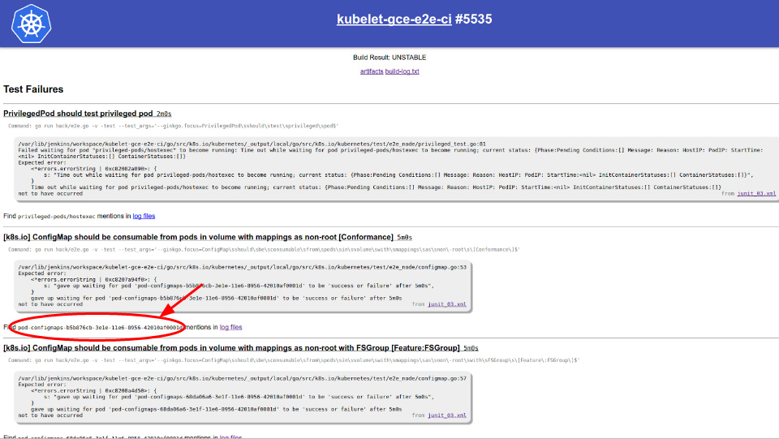
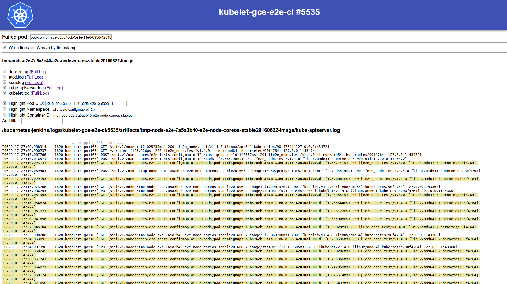
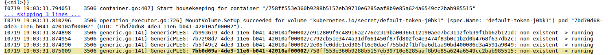
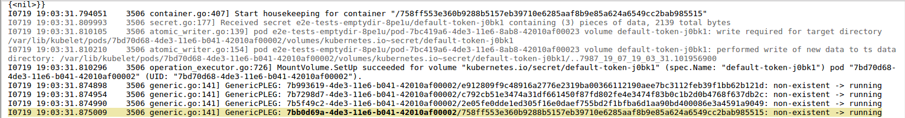
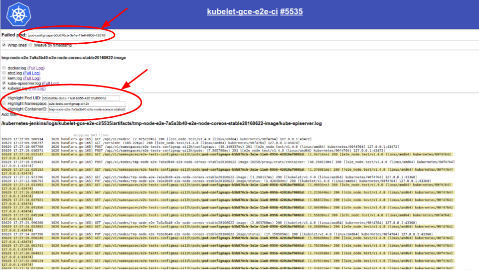
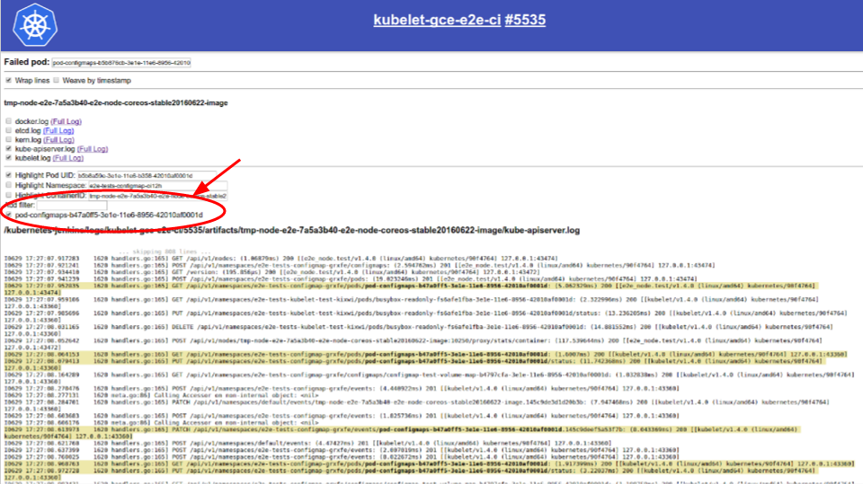
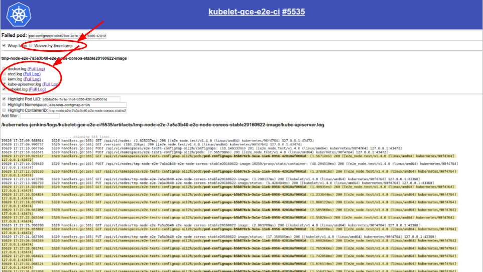

# Gubernator

*This document is oriented at developers who want to use Gubernator to debug while developing for Kubernetes.*

<!-- BEGIN MUNGE: GENERATED_TOC -->

- [Gubernator](#gubernator)
  - [What is Gubernator?](#what-is-gubernator)
  - [Gubernator Features](#gubernator-features)
    - [Test Failures list](#test-failures-list)
    - [Log Filtering](#log-filtering)
    - [Gubernator for Local Tests](#gubernator-for-local-tests)
  - [Future Work](#future-work)

<!-- END MUNGE: GENERATED_TOC -->

## What is Gubernator?

[Gubernator](https://k8s-gubernator.appspot.com/) is a webpage for viewing and filtering Kubernetes
test results.

Gubernator simplifies the debugging proccess and makes it easier to track down failures by automating many
steps commonly taken in searching through logs, and by offering tools to filter through logs to find relevant lines.
Gubernator automates the steps of finding the failed tests, displaying relevant logs, and determining the
failed pods and the corresponing pod UID, namespace, and container ID.
It also allows for filtering of the log files to display relevant lines based on selected keywords, and
allows for multiple logs to be woven together by timestamp.

Gubernator runs on Google App Engine and fetches logs stored on Google Cloud Storage.

## Gubernator Features

### Test Failures list

Issues made by k8s-merge-robot will post a link to a page listing the failed tests.
Each failed test comes with the corresponding error log from a junit file and a link
to filter logs for that test.

Based on the message logged in the junit file, the pod name may be displayed.



[Test Failures List Example](https://k8s-gubernator.appspot.com/build/kubernetes-jenkins/logs/kubernetes-e2e-gke/11721)

### Log Filtering

The log filtering page comes with checkboxes and textboxes to aid in filtering. Filtered keywords will be bolded
and lines including keywords will be highlighted. Up to four lines around the line of interest will also be displayed.



If less than 100 lines are skipped, the "... skipping xx lines ..." message can be clicked to expand and show
the hidden lines.

Before expansion:

After expansion:


If the pod name was displayed in the Test Failures list, it will automatically be included in the filters.
If it is not found in the error message, it can be manually entered into the textbox. Once a pod name
is entered, the Pod UID, Namespace, and ContainerID may be automatically filled in as well. These can be
altered as well. To apply the filter, check off the options corresponding to the filter.



To add a filter, type the term to be filtered into the textbox labeled "Add filter:" and press enter.
Additional filters will be displayed as checkboxes under the textbox.



To choose which logs to view check off the checkboxes corresponding to the logs of interest. If multiple logs are
included, the "Weave by timestamp" option can weave the selected logs together based on the timestamp in each line.



[Log Filtering Example 1](https://k8s-gubernator.appspot.com/build/kubernetes-jenkins/logs/kubelet-gce-e2e-ci/5535/nodelog?pod=pod-configmaps-b5b876cb-3e1e-11e6-8956-42010af0001d&junit=junit_03.xml&wrap=on&logfiles=%2Fkubernetes-jenkins%2Flogs%2Fkubelet-gce-e2e-ci%2F5535%2Fartifacts%2Ftmp-node-e2e-7a5a3b40-e2e-node-coreos-stable20160622-image%2Fkube-apiserver.log&logfiles=%2Fkubernetes-jenkins%2Flogs%2Fkubelet-gce-e2e-ci%2F5535%2Fartifacts%2Ftmp-node-e2e-7a5a3b40-e2e-node-coreos-stable20160622-image%2Fkubelet.log&UID=on&poduid=b5b8a59e-3e1e-11e6-b358-42010af0001d&ns=e2e-tests-configmap-oi12h&cID=tmp-node-e2e-7a5a3b40-e2e-node-coreos-stable20160622-image)

[Log Filtering Example 2](https://k8s-gubernator.appspot.com/build/kubernetes-jenkins/logs/kubernetes-e2e-gke/11721/nodelog?pod=client-containers-a53f813c-503e-11e6-88dd-0242ac110003&junit=junit_19.xml&wrap=on)


### Gubernator for Local Tests

*Currently Gubernator can only be used with remote node e2e tests.*

**NOTE: Using Gubernator with local tests will publically upload your test logs to Google Cloud Storage**

To use Gubernator to view logs from local test runs, set the GUBERNATOR tag to true.
A URL link to view the test results will be printed to the console.
Please note that running with the Gubernator tag will bypass the user confirmation for uploading to GCS.

```console

$ make test-e2e-node REMOTE=true GUBERNATOR=true
...
================================================================
Running gubernator.sh

Gubernator linked below:
k8s-gubernator.appspot.com/build/yourusername-g8r-logs/logs/e2e-node/timestamp
```

The gubernator.sh script can be run after running a remote node e2e test for the same effect.

```console
$ ./test/e2e_node/gubernator.sh
Do you want to run gubernator.sh and upload logs publicly to GCS? [y/n]y
...
Gubernator linked below:
k8s-gubernator.appspot.com/build/yourusername-g8r-logs/logs/e2e-node/timestamp
```

## Future Work

Gubernator provides a framework for debugging failures and introduces useful features.
There is still a lot of room for more features and growth to make the debugging process more efficient.

How to contribute (see https://github.com/kubernetes/test-infra/blob/master/gubernator/README.md)

* Extend GUBERNATOR flag to all local tests

* More accurate identification of pod name, container ID, etc.
	* Change content of logged strings for failures to include more information
	* Better regex in Gubernator

* Automate discovery of more keywords
	* Volume Name
	* Disk Name
	* Pod IP

* Clickable API objects in the displayed lines in order to add them as filters

* Construct story of pod's lifetime
	* Have concise view of what a pod went through from when pod was started to failure

* Improve UI
	* Have separate folders of logs in rows instead of in one long column
	* Improve interface for adding additional features (maybe instead of textbox and checkbox, have chips)

<!-- BEGIN MUNGE: GENERATED_ANALYTICS -->
[]()
<!-- END MUNGE: GENERATED_ANALYTICS -->
