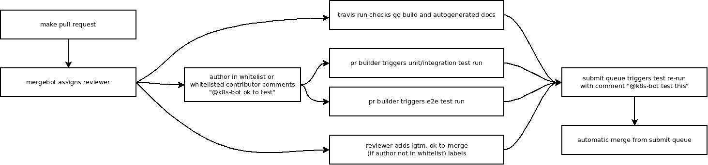

<!-- BEGIN MUNGE: UNVERSIONED_WARNING -->

<!-- BEGIN STRIP_FOR_RELEASE -->


<h2>PLEASE NOTE: This document applies to the HEAD of the source tree</h2>

If you are using a released version of Kubernetes, you should
refer to the docs that go with that version.

<!-- TAG RELEASE_LINK, added by the munger automatically -->
<strong>
The latest release of this document can be found
[here](http://releases.k8s.io/release-1.3/docs/devel/pull-requests.md).

Documentation for other releases can be found at
[releases.k8s.io](http://releases.k8s.io).
</strong>
--

<!-- END STRIP_FOR_RELEASE -->

<!-- END MUNGE: UNVERSIONED_WARNING -->

<!-- BEGIN MUNGE: GENERATED_TOC -->

- [Pull Request Process](#pull-request-process)
- [Life of a Pull Request](#life-of-a-pull-request)
  - [Before sending a pull request](#before-sending-a-pull-request)
  - [Release Notes](#release-notes)
    - [Reviewing pre-release notes](#reviewing-pre-release-notes)
  - [Visual overview](#visual-overview)
- [Other notes](#other-notes)
- [Automation](#automation)

<!-- END MUNGE: GENERATED_TOC -->

# Pull Request Process

An overview of how pull requests are managed for kubernetes. This document
assumes the reader has already followed the [development guide](development.md)
to set up their environment.

# Life of a Pull Request

Unless in the last few weeks of a milestone when we need to reduce churn and stabilize, we aim to be always accepting pull requests.

Either the [on call](on-call-rotations.md) manually or the [github "munger"](https://github.com/kubernetes/contrib/tree/master/mungegithub) submit-queue plugin automatically will manage merging PRs.

There are several requirements for the submit-queue to work:
* Author must have signed CLA ("cla: yes" label added to PR)
* No changes can be made since last lgtm label was applied
* k8s-bot must have reported the GCE E2E build and test steps passed (Jenkins unit/integration, Jenkins e2e)

Additionally, for infrequent or new contributors, we require the on call to apply the "ok-to-merge" label manually.  This is gated by the [whitelist](https://github.com/kubernetes/contrib/blob/master/mungegithub/whitelist.txt).

## Before sending a pull request

The following will save time for both you and your reviewer:

* Enable [pre-commit hooks](development.md#committing-changes-to-your-fork) and verify they pass.
* Verify `make verify` passes.
* Verify `make test` passes.
* Verify `make test-integration` passes.

## Release Notes

This section applies only to pull requests on the master branch.
For cherry-pick PRs, see the [Cherrypick instructions](cherry-picks.md)

1. All pull requests are initiated with a `release-note-label-needed` label.
1. For a PR to be ready to merge, the `release-note-label-needed` label must be removed and one of the other `release-note-*` labels must be added.
1. `release-note-none` is a valid option if the PR does not need to be mentioned
 at release time.
1. `release-note` labeled PRs generate a release note using the PR title by
   default OR the release-note block in the PR template if filled in.
  * See the [PR template](../../.github/PULL_REQUEST_TEMPLATE.md) for more
    details.
  * PR titles and body comments are mutable and can be modified at any time
    prior to the release to reflect a release note friendly message.

The only exception to these rules is when a PR is not a cherry-pick and is
targeted directly to the non-master branch.  In this case, a `release-note-*`
label is required for that non-master PR.

### Reviewing pre-release notes

At any time, you can see what the release notes will look like on any branch.
(NOTE: This only works on Linux for now)

```
$ git pull https://github.com/kubernetes/release
$ RELNOTES=$PWD/release/relnotes
$ cd /to/your/kubernetes/repo
$ $RELNOTES -man # for details on how to use the tool
# Show release notes from the last release on a branch to HEAD
$ $RELNOTES --branch=master
```

## Visual overview



# Other notes

Pull requests that are purely support questions will be closed and
redirected to [stackoverflow](http://stackoverflow.com/questions/tagged/kubernetes).
We do this to consolidate help/support questions into a single channel,
improve efficiency in responding to requests and make FAQs easier
to find.

Pull requests older than 2 weeks will be closed.  Exceptions can be made
for PRs that have active review comments, or that are awaiting other dependent PRs.
Closed pull requests are easy to recreate, and little work is lost by closing a pull
request that subsequently needs to be reopened. We want to limit the total number of PRs in flight to:
* Maintain a clean project
* Remove old PRs that would be difficult to rebase as the underlying code has changed over time
* Encourage code velocity


# Automation

We use a variety of automation to manage pull requests.  This automation is described in detail
[elsewhere.](automation.md)


<!-- BEGIN MUNGE: GENERATED_ANALYTICS -->
[]()
<!-- END MUNGE: GENERATED_ANALYTICS -->
