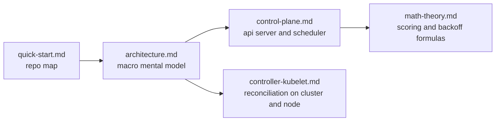

# Kubernetes Source Code Deep Dive

This series is for readers who want to understand the **real structure** of `kubernetes/kubernetes`, not just how to use Kubernetes from the outside.

If the repository feels overwhelming, that feeling is normal. Kubernetes ships an API server, a scheduler, a controller host, a node agent, a reusable API machinery stack, generated clients, tests, and a huge amount of compatibility code. The trick is to learn the system in layers.

## What you will get from this series

- a stable mental model of the repository layout
- a source-level map of the control plane
- a step-by-step trace from `kubectl apply` to running containers
- a plain-English explanation of the scheduler's core formulas
- a controller and kubelet guide that explains the reconciliation loops at node and cluster level

## Reading map

| File | Main question it answers | Best read after |
| --- | --- | --- |
| [`quick-start.md`](quick-start.md) | Where do I start in this giant repository? | none |
| [`architecture.md`](architecture.md) | What is the macro architecture of Kubernetes? | quick start |
| [`control-plane.md`](control-plane.md) | What exactly happens inside the API server and scheduler? | architecture |
| [`math-theory.md`](math-theory.md) | How do scheduler formulas really work? | control plane |
| [`controller-kubelet.md`](controller-kubelet.md) | How do controllers and kubelet continuously reconcile state? | architecture |

## Recommended path

## The five ideas to keep in your head

1. **The API server is the shared source of truth.** Almost every major component either writes to it, watches it, or both.
2. **Kubernetes is built around level-triggered reconciliation.** Components do not "perform one action and finish". They keep comparing desired state with current state.
3. **The control plane mostly decides; nodes mostly execute.** Scheduling and reconciliation decisions happen centrally, but containers are created on nodes by kubelet.
4. **Watches are the bloodstream of the system.** Informers, caches, workqueues, and the watch cache are how change propagates efficiently.
5. **Most smart behavior is surprisingly numeric.** Fit checks, balancing, priority sorting, and backoff all reduce to small formulas.

## Primary source anchors

These are the best entry files for the topics covered here:

- `cmd/kube-apiserver/app/server.go`
- `staging/src/k8s.io/apiserver/pkg/server/config.go`
- `pkg/scheduler/schedule_one.go`
- `pkg/scheduler/framework/plugins/noderesources/*.go`
- `pkg/controller/deployment/deployment_controller.go`
- `pkg/controller/deployment/sync.go`
- `pkg/kubelet/kubelet.go`
- `pkg/kubelet/pod_workers.go`

## One-sentence summary

If you remember only one thing, remember this:

> Kubernetes is a giant distributed state machine whose components keep reading from the API server, reasoning over cached state, and writing back corrections until reality matches intent.
