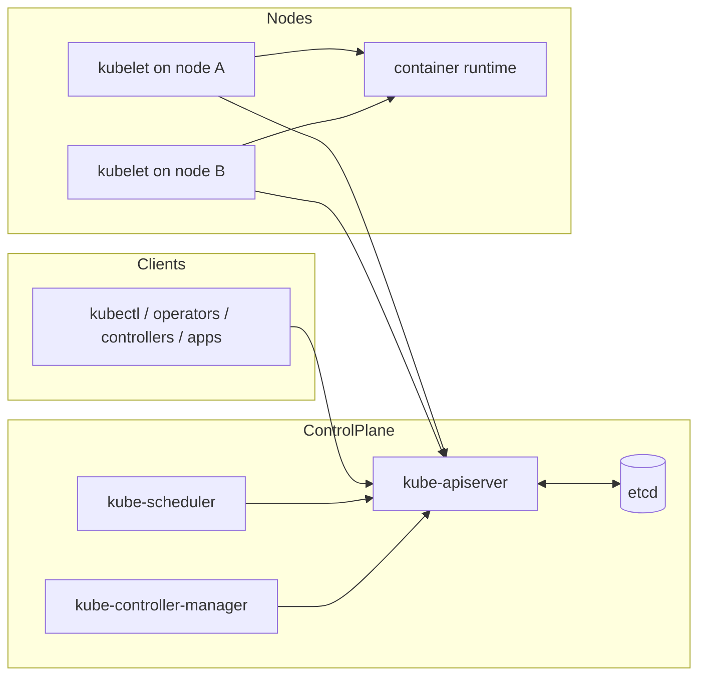
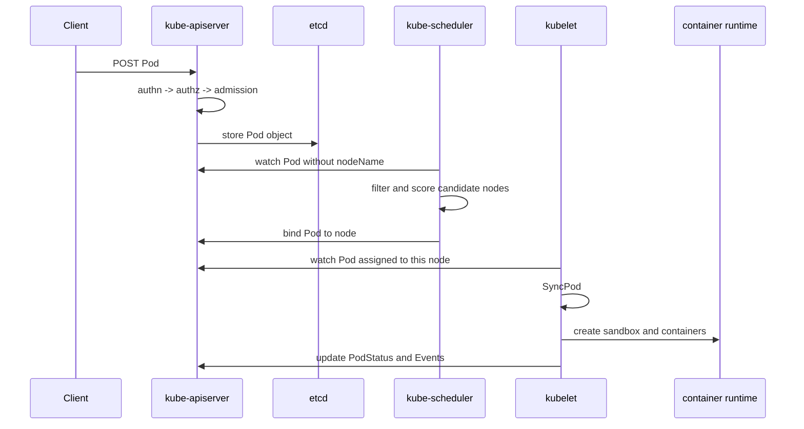
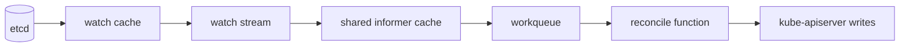
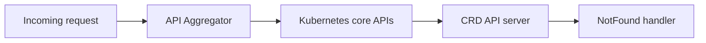

# Kubernetes Architecture: The Big Picture Before the Details

## Start with the real pain

Running distributed applications is hard for three reasons:

1. machines fail
2. desired state changes constantly
3. the cluster never stops moving while you are making decisions

Kubernetes solves this by turning the cluster into a **continuously reconciled system** rather than a one-shot deployment engine.

## The macro skeleton

## The most important architectural truth

The API server is not just a request router. It is the **shared coordination surface** for the whole system.

- clients write intent to it
- controllers watch it
- scheduler watches it
- kubelets watch it
- status flows back through it

This is why Kubernetes often feels API-first: the API server is the meeting point where decentralized components coordinate.

## One Pod from YAML to containers

## The three loops that define Kubernetes

### 1. Request loop

A client sends intent to the API server.

### 2. Reconciliation loop

Controllers and scheduler watch for objects whose current state is not good enough yet.

### 3. Execution loop

Kubelet continuously turns assigned PodSpecs into actual running containers.

If you compress Kubernetes to one sentence, it is this:

> request creates intent, watches spread change, reconcilers react, kubelet executes.

## Why watches matter so much

Polling every object repeatedly would be too expensive. Instead, Kubernetes leans on:

- etcd-backed storage
- watch streams from the API server
- local caches and informers
- workqueues that only process changed keys

This is the hidden bloodstream of the project.

## Why `CreateServerChain` matters

The API server path is not a single monolith. In `cmd/kube-apiserver/app/server.go`, `CreateServerChain()` wires a delegation chain that conceptually looks like this:

That is why a request can pass through multiple layers even though users experience it as one endpoint.

## The four source anchors behind the big picture

| Area | Best file to open | Why |
| --- | --- | --- |
| API server bootstrap | `cmd/kube-apiserver/app/server.go` | builds the server chain |
| Handler chain | `staging/src/k8s.io/apiserver/pkg/server/config.go` | shows authn/authz/audit/filter wrapping |
| Scheduler cycle | `pkg/scheduler/schedule_one.go` | shows the end-to-end node selection path |
| Kubelet execution | `pkg/kubelet/kubelet.go` | shows the node-side sync loop |

## A plain-language model for beginners

Imagine a supermarket warehouse:

- the API server is the central order board
- controllers check whether shelves match the orders
- the scheduler picks which loading dock should receive a shipment
- kubelet is the dock worker that actually unloads and places boxes
- etcd is the secure filing cabinet holding the official record

Nothing magical happens. The system just keeps comparing the board with reality and fixing the gap.

## Next step

Now that the macro skeleton is clear, move to [`control-plane.md`](control-plane.md) for the micro-level request path inside the API server and the actual scheduler cycle.
