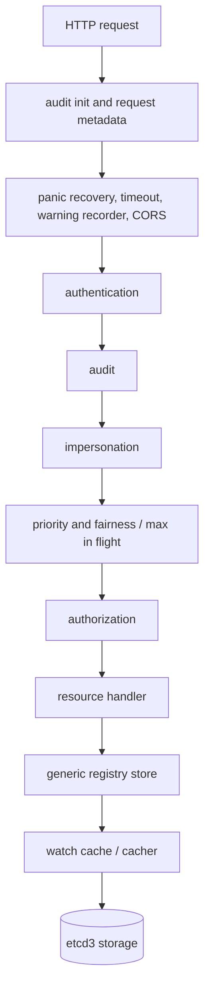
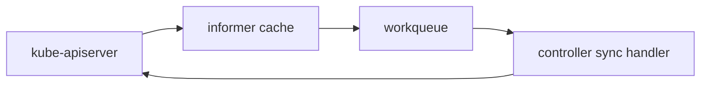

# Control Plane Deep Dive: API Server, Scheduler, and the Shared State Machine

## Why the control plane exists

The control plane answers one question over and over:

> Given the latest desired state and the latest observed state, what should happen next?

Different components answer different slices of that question, but they coordinate through the same API surface.

## 1. The API server handler chain

In `staging/src/k8s.io/apiserver/pkg/server/config.go`, `DefaultBuildHandlerChain()` wraps the core API handler with filters. The code is written inside-out, so the request path is easiest to understand as a pipeline.

### What each stage means in plain English

- **authentication**: who are you?
- **authorization**: are you allowed to do this?
- **admission**: even if you are allowed, should the object be mutated or rejected based on policy?
- **storage**: how is the object persisted and later watched efficiently?

## 2. From HTTP route to storage

The important source anchors are:

- `cmd/kube-apiserver/app/server.go` for server bootstrap and `CreateServerChain()`
- `staging/src/k8s.io/apiserver/pkg/server/handler.go` for API handler routing
- `staging/src/k8s.io/apiserver/pkg/endpoints/handlers/create.go` for create requests
- `staging/src/k8s.io/apiserver/pkg/endpoints/handlers/update.go` for updates
- `staging/src/k8s.io/apiserver/pkg/endpoints/handlers/watch.go` for streaming watch responses
- `staging/src/k8s.io/apiserver/pkg/registry/generic/registry/store.go` for generic persistence logic
- `staging/src/k8s.io/apiserver/pkg/storage/cacher/cacher.go` for the watch cache layer
- `staging/src/k8s.io/apiserver/pkg/storage/etcd3/store.go` for etcd-backed storage

## 3. Why the watch cache changes everything

Without a cache, each watcher would force the API server to hit storage too often. With the cacher layer:

- recent object history is buffered
- list and watch can often be served from cache
- watchers get streamed updates efficiently

This is one of the biggest reasons Kubernetes can keep so many controllers and kubelets synchronized.

## 4. The scheduler is a two-phase machine

`pkg/scheduler/schedule_one.go` is the best file for understanding the scheduler. The key pattern is:

1. **scheduling cycle**: decide *where* the Pod should go
2. **binding cycle**: make that decision real

```mermaid
flowchart LR
    Q[SchedulingQueue] --> N[NextPod]
    N --> PF[PreFilter]
    PF --> F[Filter candidate nodes]
    F --> PS[PreScore]
    PS --> SC[Score plugins + extenders]
    SC --> PICK[select best node]
    PICK --> ASSUME[assume in scheduler cache]
    ASSUME --> RESERVE[reserve plugins]
    RESERVE --> PERMIT[permit plugins]
    PERMIT --> PREBIND[pre-bind plugins]
    PREBIND --> BIND[bind plugin / default binder]
    BIND --> API[write Binding via API server]
```

### Why `assume` exists

The scheduler does not always wait for the real bind to finish before continuing. It **assumes** the Pod is on the chosen node in its own cache so it can keep scheduling other Pods.

This is an optimistic concurrency trick: it improves throughput without changing the API server's final authority.

## 5. What the default binder really does

The default binder is intentionally small. In `pkg/scheduler/framework/plugins/defaultbinder/default_binder.go`, it creates a `v1.Binding` and sends it through the API server.

That means the scheduler does not directly launch containers. It only records placement.

## 6. Where controllers fit into the control plane

The scheduler solves **placement**.

Controllers solve **state drift**.

- Deployment controller: desired ReplicaSets and Pods vs actual ones
- Service controller: desired endpoints vs actual backing Pods
- Namespace controller: cleanup and lifecycle transitions
- many more under `pkg/controller/`

The repeating pattern is always the same: watch, enqueue, reconcile, write back.

## 7. One request, many asynchronous consequences

A single Pod creation request can trigger all of these downstream effects:

1. object stored in etcd
2. scheduler notices a pending Pod
3. scheduler writes binding
4. kubelet notices an assigned Pod
5. kubelet starts containers
6. kubelet updates status
7. other controllers react to status or label changes

This is why Kubernetes feels event-driven even though each individual component is mostly a loop over caches and queues.

## 8. The most useful functions to open next

| Topic | Function / file |
| --- | --- |
| API server chain | `CreateServerChain()` in `cmd/kube-apiserver/app/server.go` |
| handler wrapping | `DefaultBuildHandlerChain()` in `staging/src/k8s.io/apiserver/pkg/server/config.go` |
| scheduler core loop | `ScheduleOne()` and `schedulingCycle()` in `pkg/scheduler/schedule_one.go` |
| score plugin execution | `RunScorePlugins()` in `pkg/scheduler/framework/runtime/framework.go` |
| default bind | `Bind()` in `pkg/scheduler/framework/plugins/defaultbinder/default_binder.go` |

## Next step

Continue with [`math-theory.md`](math-theory.md) to see how the scheduler turns resource pressure, balance, and retries into actual numbers.
