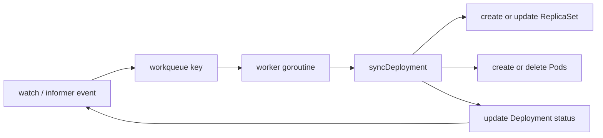
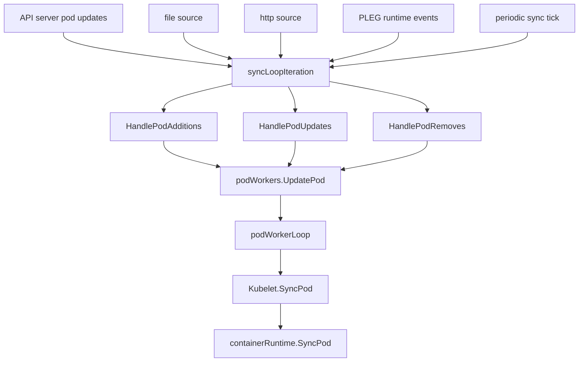
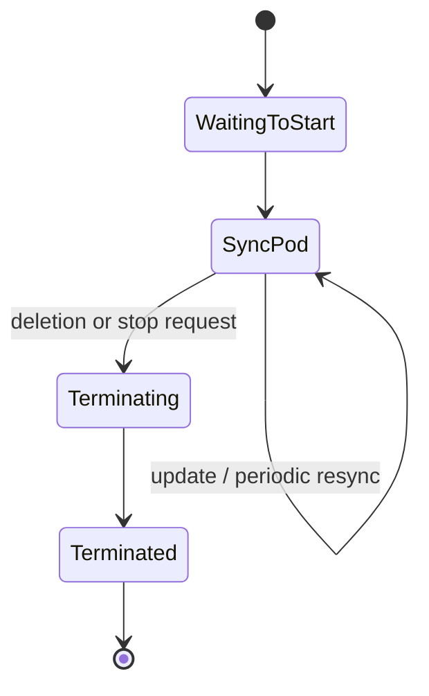

# Controllers and Kubelet: The Two Reconcilers That Keep Kubernetes Alive

## Why group these together?

Controllers and kubelet live at different layers, but they share the same philosophy:

- observe current state
- compare with desired state
- make one step toward convergence
- retry until the gap disappears

The difference is scope:

- controllers reconcile **cluster-level intent**
- kubelet reconciles **node-level execution**

## Part I. Deployment controller as the canonical cluster reconciler

Best source anchors:

- `pkg/controller/deployment/deployment_controller.go`
- `pkg/controller/deployment/sync.go`

### The standard controller pattern

### What `NewDeploymentController()` sets up

The controller wires informer event handlers for:

- Deployments
- ReplicaSets
- Pods

Every interesting change eventually enqueues the owning Deployment key.

### What the worker does

`processNextWorkItem()` in `deployment_controller.go` is beautifully simple:

1. get one key from the workqueue
2. call `syncHandler`
3. forget on success
4. `AddRateLimited()` on failure

That small shape is one of the most important patterns in Kubernetes.

### What `sync.go` actually reconciles

In `sync.go`, the controller:

- identifies the new and old ReplicaSets
- computes the next revision
- scales the right ReplicaSets
- cleans up paused or outdated state when needed
- updates Deployment status

This is not a one-shot rollout script. It is a convergence loop.

## A grandmother-friendly analogy

Imagine a restaurant manager.

- the menu says 10 bowls of noodle soup should be available
- the kitchen currently has only 7 ready
- the manager does not shout "done" once and leave
- the manager keeps counting and asking for more bowls until the front counter really has 10

That is exactly how a controller thinks.

## Controller retry math

`deployment_controller.go` documents a retry pattern that looks like:

$$
5ms \times 2^{n-1}
$$

with `maxRetries = 15`.

So the waits grow roughly like:

- `5ms`
- `10ms`
- `20ms`
- `40ms`
- ...
- up to tens of seconds

This prevents a broken object from causing a hot loop.

## Part II. Kubelet as the node-side reconciler

Best source anchors:

- `pkg/kubelet/kubelet.go`
- `pkg/kubelet/pod_workers.go`

### The kubelet sync loop

`syncLoop()` and `syncLoopIteration()` in `kubelet.go` listen to multiple event sources:

- API server updates
- file and HTTP pod sources
- PLEG runtime events
- periodic sync ticks
- housekeeping ticks
- health and probe related updates

### Why `podWorkers` matter

Kubelet does not let random goroutines mutate the same Pod at the same time. `podWorkers` serialize work per Pod.

That gives kubelet something like a **per-Pod state machine**.

### What `HandlePodAdditions()` really does

When kubelet gets a new Pod, it:

1. adds it to the pod manager
2. tracks certificates and mirror pod relationships if needed
3. runs admission / allocation checks
4. sends an `UpdatePod()` request into the pod worker system

So the addition handler is not "start container now". It is "update the local desired-state machinery so that the worker can reconcile safely".

### What `SyncPod()` really does

The kubelet's `SyncPod()` path is where node execution becomes real. It handles things like:

- Pod status generation
- mirror pod reconciliation
- cgroup setup
- volume attachment and mount waiting
- image pull secret lookup
- probe registration
- delegation to `containerRuntime.SyncPod(...)`

In other words, kubelet is the final translator from Kubernetes objects to runtime actions.

## Kubelet backoff in the main loop

The kubelet sync loop also uses exponential backoff when runtime errors occur.

In `kubelet.go`, the parameters are:

- base = `100ms`
- factor = `2`
- max = `5s`

That gives a sequence like:

- `100ms`
- `200ms`
- `400ms`
- `800ms`
- `1.6s`
- `3.2s`
- `5s` cap

This is the same design philosophy we saw in the scheduler and controllers: retry, but do not thrash.

## Cluster-level vs node-level reconciliation

| Dimension | Controllers | Kubelet |
| --- | --- | --- |
| Scope | whole cluster resources | one node's assigned Pods |
| Trigger | informer events + resync | API/file/http/PLEG/ticks |
| Unit of work | usually object key in workqueue | Pod update in pod worker |
| Main action | create/update/delete API objects | create/update/stop containers and sandboxes |
| Goal | make cluster objects converge | make node runtime converge |

## The big unifying insight

Controllers and kubelet are the same idea at different zoom levels.

- Deployment controller asks: "Do ReplicaSets and Pods match Deployment intent?"
- kubelet asks: "Do containers on this node match Pod intent?"

Kubernetes works because both layers keep answering that question forever.

## Where to go next

After this file, revisit [`architecture.md`](architecture.md) and [`control-plane.md`](control-plane.md). The system usually clicks hardest when you see that every component is just another reconciler standing at a different place in the pipeline.
