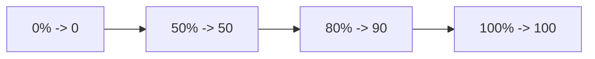
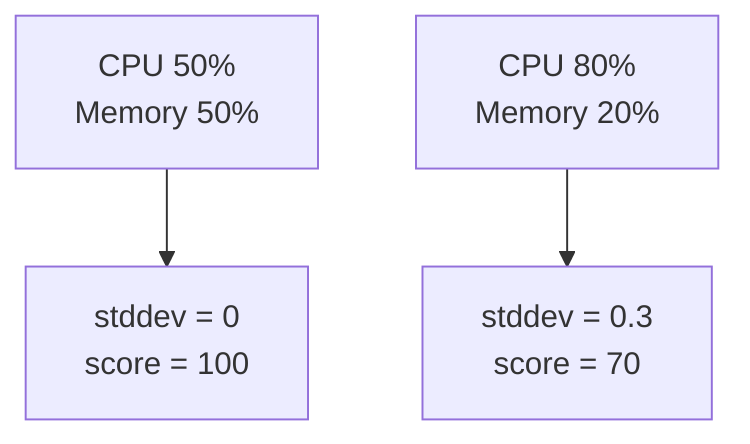
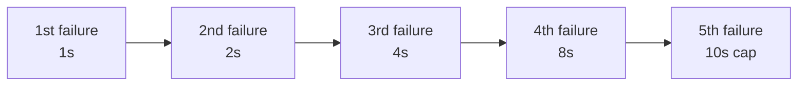

# Math Theory Made Friendly: Scheduler Scoring, Queue Order, and Backoff

## Why this file matters

Kubernetes scheduling looks mysterious until you notice that many key decisions are powered by very small formulas.

This file explains the formulas behind:

- resource fit
- least / most allocated scoring
- configurable utilization curves
- balanced allocation via standard deviation
- queue priority ordering
- exponential backoff

## 1. Fit check: can the Pod even fit?

Source anchor: `pkg/scheduler/framework/plugins/noderesources/fit.go`, especially `fitsRequest()`.

### Core idea

For each resource:

$$
\text{pod request} \le \text{node allocatable} - \text{already requested}
$$

### What the variables mean in real life

- `pod request`: what the incoming Pod asks for
- `node allocatable`: what the node can safely offer to Pods
- `already requested`: what other Pods already reserved on that node

### Grocery-bag example

Imagine a basket that can safely carry 10 kg.

- 6 kg is already inside
- you want to add 3 kg of fruit
- remaining room is `10 - 6 = 4`
- because `3 <= 4`, it fits

If you tried to add 5 kg instead, it would fail.

### Numeric scheduler example

- node allocatable CPU: `4000m`
- already requested CPU: `2500m`
- incoming Pod CPU request: `1800m`
- remaining CPU: `1500m`

Because `1800m > 1500m`, the plugin returns **Insufficient cpu**.

## 2. LeastAllocated: prefer emptier nodes

Source anchor: `pkg/scheduler/framework/plugins/noderesources/least_allocated.go`.

The code computes a score per resource and then takes a weighted average.

$$
\text{score}_r = \frac{\text{capacity}_r - \text{requested}_r}{\text{capacity}_r} \times 100
$$

Then:

$$
\text{node score} = \frac{\sum_r \text{weight}_r \times \text{score}_r}{\sum_r \text{weight}_r}
$$

### Intuition

More free space means a higher score.

### Example

Suppose the Pod would make a node look like this:

- CPU requested: `3/8` cores
- Memory requested: `10/16` GiB

Then:

- CPU score = `(8 - 3) / 8 * 100 = 62.5`
- Memory score = `(16 - 10) / 16 * 100 = 37.5`
- equal weights => node score ≈ `50`

That node is moderately empty, not extremely empty.

## 3. MostAllocated: prefer fuller nodes

Source anchor: `pkg/scheduler/framework/plugins/noderesources/most_allocated.go`.

This is the mirror image of LeastAllocated.

$$
\text{score}_r = \frac{\text{requested}_r}{\text{capacity}_r} \times 100
$$

### Intuition

Now a fuller node scores higher. This is useful when you want tighter packing and more untouched nodes left over.

### Example

- CPU used after placement: `6/8 = 75%`
- Memory used after placement: `12/16 = 75%`
- final score = `75`

This node is attractive when your policy prefers packing instead of spreading.

## 4. RequestedToCapacityRatio: policy as a curve

Source anchors:

- `pkg/scheduler/framework/plugins/noderesources/requested_to_capacity_ratio.go`
- `pkg/scheduler/framework/plugins/helper/shape_score.go`

The helper `BuildBrokenLinearFunction()` turns a list of points into a piecewise linear scoring function.

### Core idea

1. compute utilization percentage
2. map that percentage onto a configured line made of segments

$$
\text{utilization} = \frac{\text{requested}}{\text{capacity}} \times 100
$$

Then use linear interpolation between nearby shape points.

### Vegetable-market example

Suppose your rule is:

- empty stall: low value
- half-full stall: medium value
- almost-full stall: very high value

If the utilization lands at `60%`, it sits between `50% -> 50` and `80% -> 90`, so the score is interpolated between 50 and 90.

### Numeric example

Shape points:

- `(0, 0)`
- `(50, 50)`
- `(100, 100)`

If utilization is `60%`, the score becomes `60`.

This is powerful because cluster operators can express policy as a curve instead of hardcoding one formula.

## 5. BalancedAllocation: prefer balanced resource pressure

Source anchor: `pkg/scheduler/framework/plugins/noderesources/balanced_allocation.go`.

This plugin looks at how similar the usage fractions are across resources.

First compute fractions:

$$
f_i = \frac{\text{requested}_i}{\text{allocatable}_i}
$$

Then compute standard deviation:

$$
\sigma = \sqrt{\frac{1}{n} \sum_i (f_i - \bar f)^2}
$$

Then score approximately as:

$$
\text{score} = (1 - \sigma) \times 100
$$

### Intuition without the scary symbol

If CPU and memory are used at similar rates, the node is "balanced".

If one resource is almost full while the other is mostly empty, the node is "crooked".

### Simplified two-resource trick

When only CPU and memory matter, the code comments note that the standard deviation simplifies nicely.

If CPU fraction is `0.8` and memory fraction is `0.2`, then:

$$
\sigma = \frac{|0.8 - 0.2|}{2} = 0.3
$$

So:

$$
\text{score} = (1 - 0.3) \times 100 = 70
$$

If CPU and memory are both `0.5`, then `\sigma = 0` and the score becomes `100`.

That is the heart of the plugin: balanced usage is rewarded.

## 6. Queue sort: priority first, time second

Source anchor: `pkg/scheduler/framework/plugins/queuesort/priority_sort.go`.

The queue ordering rule is tiny but crucial:

- higher Pod priority wins
- if priorities tie, earlier timestamp wins

In formula-like form:

$$
A \text{ comes first if } priority(A) > priority(B)
$$

or, if equal:

$$
A \text{ comes first if } timestamp(A) < timestamp(B)
$$

### Example

- Pod X priority = `1000`, queued at `10:00`
- Pod Y priority = `5000`, queued at `10:05`

Pod Y still wins because priority dominates time.

## 7. Scheduler backoff: retry, but do not thrash

Source anchors:

- `pkg/scheduler/backend/queue/backoff_queue.go`
- `pkg/scheduler/backend/queue/scheduling_queue.go`

The queue uses exponential backoff with caps.

$$
\text{backoff}(n) = \min(\text{initial} \times 2^{n-1}, \text{max})
$$

Typical defaults in the scheduler queue are conceptually:

- initial backoff: `1s`
- max backoff: `10s`

### Example

Attempt counts produce:

- attempt 1 -> `1s`
- attempt 2 -> `2s`
- attempt 3 -> `4s`
- attempt 4 -> `8s`
- attempt 5 -> `10s` (cap reached)

### Why this is elegant

If the cluster is temporarily congested, the scheduler avoids hammering the same impossible decision over and over.

## 8. Bonus: the same mathematical style appears elsewhere

### Deployment controller retries

`pkg/controller/deployment/deployment_controller.go` documents retries based on approximately:

$$
5ms \times 2^{n-1}
$$

with `maxRetries = 15`.

### Kubelet runtime-error backoff

In `pkg/kubelet/kubelet.go`, the main sync loop uses:

- base = `100ms`
- factor = `2`
- max = `5s`

Same pattern, different subsystem: if the system is unhealthy, retry progressively instead of spinning wildly.

## Final takeaway

The scheduler is not magic. It is mostly a careful composition of:

- inequality checks
- weighted averages
- interpolation on simple curves
- standard deviation for balance
- exponential backoff for fairness and stability

Once you see that, the code becomes much less intimidating.
