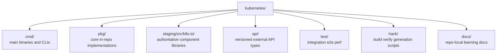
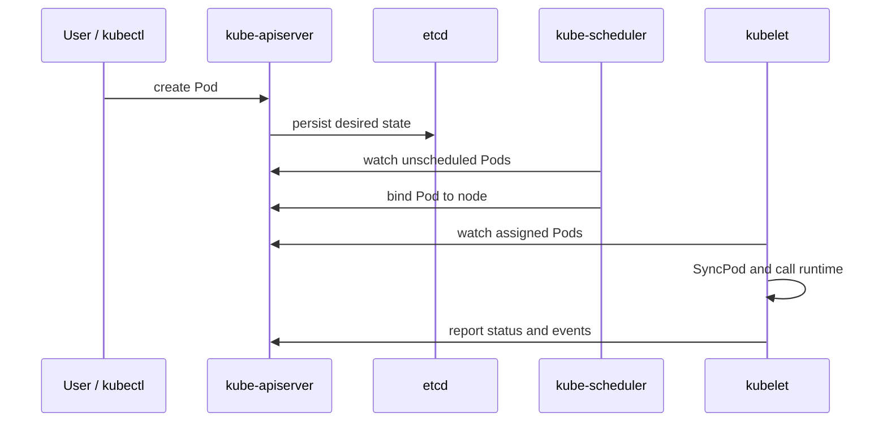

# Quick Start: How to Read the Kubernetes Repository Without Drowning

## Why the repository feels huge

The repository is not "just an orchestrator". It contains:

- the control plane entrypoints
- the reusable API machinery stack
- the scheduler framework
- the controller implementations
- the kubelet node agent
- generated APIs and clients
- build, release, and compatibility machinery

That is why the repo feels like a small operating system instead of a normal service.

## The 30-second mental model

Think of Kubernetes as a city:

- `kube-apiserver` is the **city hall ledger**
- etcd is the **vault that stores the ledger**
- controllers are **clerks** that keep rechecking whether reality matches the forms
- the scheduler is the **placement officer** that picks a node for each unscheduled Pod
- kubelet is the **local foreman** on every node that actually starts and monitors containers

## Repository map

## Which top-level directories matter most

| Path | Why it matters |
| --- | --- |
| `cmd/` | Process entrypoints: `kube-apiserver`, `kube-scheduler`, `kube-controller-manager`, `kubelet`, `kubectl`, `kubeadm` |
| `pkg/` | Core implementations that are specific to this repository |
| `staging/src/k8s.io/` | The published libraries and API machinery source of truth |
| `api/` | External versioned API types |
| `test/` | Integration and e2e truth serum |
| `hack/` | How the project verifies and generates things |

## The four binaries to learn first

| Binary | Entry path | What it really does |
| --- | --- | --- |
| `kube-apiserver` | `cmd/kube-apiserver/app/server.go` | accepts API requests, validates them, runs admission, persists them, and exposes watches |
| `kube-scheduler` | `cmd/kube-scheduler/app/server.go` | chooses nodes for unscheduled Pods |
| `kube-controller-manager` | `cmd/kube-controller-manager/app/controllermanager.go` | hosts many cluster-level control loops |
| `kubelet` | `cmd/kubelet/app/server.go` | runs on each node and makes PodSpecs real |

## The best first end-to-end story

Do not start by reading every subsystem independently. Start with one life cycle:

1. a client submits a Pod
2. the API server persists it
3. the scheduler assigns a node
4. kubelet sees the assigned Pod and starts containers
5. controllers and kubelet keep updating status

## The first files worth opening

If you only have one hour, open these files in roughly this order:

1. `cmd/kube-apiserver/app/server.go`
2. `staging/src/k8s.io/apiserver/pkg/server/config.go`
3. `pkg/scheduler/schedule_one.go`
4. `pkg/scheduler/framework/plugins/noderesources/fit.go`
5. `pkg/scheduler/framework/plugins/noderesources/least_allocated.go`
6. `pkg/controller/deployment/deployment_controller.go`
7. `pkg/controller/deployment/sync.go`
8. `pkg/kubelet/kubelet.go`
9. `pkg/kubelet/pod_workers.go`
10. `staging/src/k8s.io/client-go/tools/cache/shared_informer.go`

## A practical reading strategy

### Pass 1: build the skeleton

Only answer these questions:

- Where does each main process start?
- What shared state do they read?
- What shared state do they write?
- Which part is event-driven, and which part is periodic?

### Pass 2: follow one Pod

Trace a Pod from API creation to kubelet execution.

### Pass 3: study the numbers

Only after you understand the flow should you read scheduler scoring, backoff, and balancing formulas.

## A small warning that saves a lot of time

Much of the reusable machinery is in `staging/src/k8s.io/`, not just in `pkg/`. If something feels "missing" in `pkg/`, check the staged libraries before assuming the logic is elsewhere.

## Next step

Continue with [`architecture.md`](architecture.md) to build the macro picture before diving into the API handler chain and scheduler cycle.
