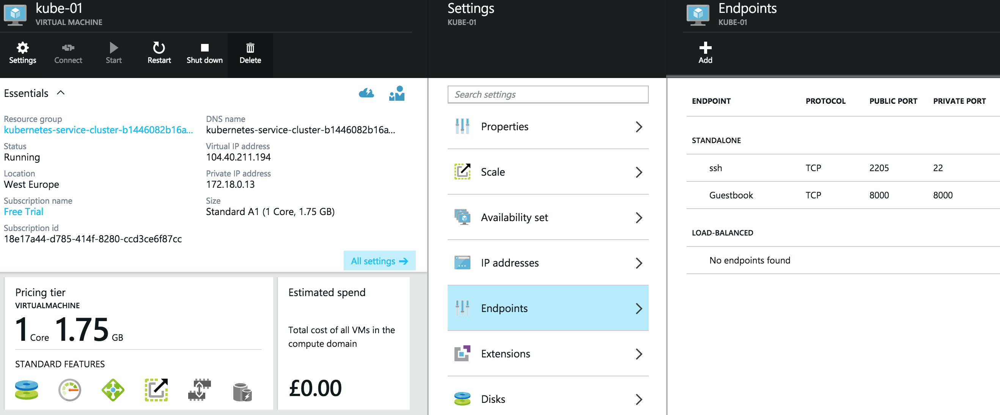

# LMKTFY on Azure with CoreOS and [Weave](http://weave.works)

## Introduction

In this guide I will demonstrate how to deploy a LMKTFY cluster to Azure cloud. You will be using CoreOS with Weave, which implements simple and secure networking, in a transparent, yet robust way. The purpose of this guide is to provide an out-of-the-box implementation that can ultimately be taken into production with little change. It will demonstrate how to provision a dedicated LMKTFY master and etcd nodes, and show how to scale the cluster with ease.

## Let's go!

To get started, you need to checkout the code:
```
git clone https://github.com/GoogleCloudPlatform/lmktfy
cd lmktfy/docs/getting-started-guides/coreos/azure/
```

You will need to have [Node.js installed](http://nodejs.org/download/) on you machine. If you have previously used Azure CLI, you should have it already.

First, you need to install some of the dependencies with

```
npm install
```

Now, all you need to do is:

```
./azure-login.js
./create-lmktfy-cluster.js
```

This script will provision a cluster suitable for production use, where there is a ring of 3 dedicated etcd nodes, LMKTFY master and 2 minions. The `lmktfy-00` VM will be the master, your work loads are only to be deployed on the minion nodes, `lmktfy-01` and `lmktfy-02`. Initially, all VMs are single-core, to ensure a user of the free tier can reproduce it without paying extra. I will show how to add more bigger VMs later.


Once the creation of Azure VMs has finished, you should see the following:

```
...
azure_wrapper/info: Saved SSH config, you can use it like so: `ssh -F  ./output/lmktfy_1c1496016083b4_ssh_conf <hostname>`
azure_wrapper/info: The hosts in this deployment are:
 [ 'etcd-00', 'etcd-01', 'etcd-02', 'lmktfy-00', 'lmktfy-01', 'lmktfy-02' ]
azure_wrapper/info: Saved state into `./output/lmktfy_1c1496016083b4_deployment.yml`
```

Let's login to the master node like so:
```
ssh -F  ./output/lmktfy_1c1496016083b4_ssh_conf lmktfy-00
```
> Note: config file name will be different, make sure to use the one you see.

Check there are 2 minions in the cluster:
```
core@lmktfy-00 ~ $ lmktfyctl get minions
NAME                LABELS                   STATUS
lmktfy-01             environment=production   Ready
lmktfy-02             environment=production   Ready
```

## Deploying the workload

Let's follow the Guestbook example now:
```
cd guestbook-example
lmktfyctl create -f redis-master.json
lmktfyctl create -f redis-master-service.json
lmktfyctl create -f redis-slave-controller.json
lmktfyctl create -f redis-slave-service.json
lmktfyctl create -f frontend-controller.json
lmktfyctl create -f frontend-service.json
```

You need to wait for the pods to get deployed, run the following and wait for `STATUS` to change from `Unknown`, through `Pending` to `Runnig`. 
```
lmktfyctl get pods --watch
```
> Note: the most time it will spend downloading Docker container images on each of the minions.

Eventually you should see:
```
POD                            IP             CONTAINER(S)    IMAGE(S)                                 HOST                  LABELS                                       STATUS
frontend-controller-0133o      10.2.1.14      php-redis       lmktfy/example-guestbook-php-redis   lmktfy-01/172.18.0.13   name=frontend,uses=redisslave,redis-master   Running
frontend-controller-ls6k1      10.2.3.10      php-redis       lmktfy/example-guestbook-php-redis   <unassigned>          name=frontend,uses=redisslave,redis-master   Running
frontend-controller-oh43e      10.2.2.15      php-redis       lmktfy/example-guestbook-php-redis   lmktfy-02/172.18.0.14   name=frontend,uses=redisslave,redis-master   Running
redis-master                   10.2.1.3       master          dockerfile/redis                         lmktfy-01/172.18.0.13   name=redis-master                            Running
redis-slave-controller-fplln   10.2.2.3       slave           brendanburns/redis-slave                 lmktfy-02/172.18.0.14   name=redisslave,uses=redis-master            Running
redis-slave-controller-gziey   10.2.1.4       slave           brendanburns/redis-slave                 lmktfy-01/172.18.0.13   name=redisslave,uses=redis-master            Running

```

## Scaling

Two single-core minions are certainly not enough for a production system of today, and, as you can see, there is one _unassigned_ pod. Let's resize the cluster by adding a couple of bigger nodes.

You will need to open another terminal window on your machine and go to the same working directory (e.g. `~/Workspace/weave-demos/coreos-azure`).

First, lets set the size of new VMs:
```
export AZ_VM_SIZE=Large
```
Now, run resize script with state file of the previous deployment and number of minions to add:
```
./resize-lmktfy-cluster.js ./output/lmktfy_1c1496016083b4_deployment.yml 2
...
azure_wrapper/info: Saved SSH config, you can use it like so: `ssh -F  ./output/lmktfy_8f984af944f572_ssh_conf <hostname>`
azure_wrapper/info: The hosts in this deployment are:
 [ 'etcd-00',
  'etcd-01',
  'etcd-02',
  'lmktfy-00',
  'lmktfy-01',
  'lmktfy-02',
  'lmktfy-03',
  'lmktfy-04' ]
azure_wrapper/info: Saved state into `./output/lmktfy_8f984af944f572_deployment.yml`
```
> Note: this step has created new files in `./output`.

Back on `lmktfy-00`:
```
core@lmktfy-00 ~ $ lmktfyctl get minions
NAME                LABELS                   STATUS
lmktfy-01             environment=production   Ready
lmktfy-02             environment=production   Ready
lmktfy-03             environment=production   Ready
lmktfy-04             environment=production   Ready
```

You can see that two more minions joined happily. Let's resize the number of Guestbook instances now.

First, double-check how many replication controllers there are:

```
core@lmktfy-00 ~ $ lmktfyctl get rc
CONTROLLER               CONTAINER(S)  IMAGE(S)                                 SELECTOR         REPLICAS
frontend-controller      php-redis     lmktfy/example-guestbook-php-redis   name=frontend    3
redis-slave-controller   slave         brendanburns/redis-slave                 name=redisslave  2
```
As there are 4 minions, let's resize proportionally:
```
core@lmktfy-00 ~ $ lmktfyctl resize --replicas=4 rc redis-slave-controller
resized
core@lmktfy-00 ~ $ lmktfyctl resize --replicas=4 rc frontend-controller
resized
```
Check what you have now:
```
lmktfyctl get rc
CONTROLLER               CONTAINER(S)  IMAGE(S)                                 SELECTOR         REPLICAS
frontend-controller      php-redis     lmktfy/example-guestbook-php-redis   name=frontend    4
redis-slave-controller   slave         brendanburns/redis-slave                 name=redisslave  4
```

You now will have more instances of front-end Guestbook apps and Redis slaves; and, if you look up all pods labled `name=frontend`, you should see one running on each node.

```
core@lmktfy-00 ~/guestbook-example $ lmktfyctl get pods -l name=frontend
POD                         IP         CONTAINER(S)  IMAGE(S)                                 HOST                  LABELS                                       STATUS
frontend-controller-0133o   10.2.1.19  php-redis     lmktfy/example-guestbook-php-redis   lmktfy-01/172.18.0.13   name=frontend,uses=redisslave,redis-master   Running
frontend-controller-i7hvs   10.2.4.5   php-redis     lmktfy/example-guestbook-php-redis   lmktfy-04/172.18.0.21   name=frontend,uses=redisslave,redis-master   Running
frontend-controller-ls6k1   10.2.3.18  php-redis     lmktfy/example-guestbook-php-redis   lmktfy-03/172.18.0.20   name=frontend,uses=redisslave,redis-master   Running
frontend-controller-oh43e   10.2.2.22  php-redis     lmktfy/example-guestbook-php-redis   lmktfy-02/172.18.0.14   name=frontend,uses=redisslave,redis-master   Running
```

## Exposing the app to the outside world

To makes sure the app is working, you probably want to load it in the browser. For accessing the Guesbook service from the outside world, an Azure endpoint needs to be created like shown on the picture below.



You then should be able to access it from anywhere via the Azure virtual IP for `lmktfy-01`, i.e. `http://104.40.211.194:8000/` as per screenshot.

## Next steps

You now have a full-blow cluster running in Azure, congrats!

You should probably try deploy other [example apps](https://github.com/GoogleCloudPlatform/lmktfy/tree/master/examples) or write your own ;)

## Tear down...

If you don't wish care about the Azure bill, you can tear down the cluster. It's easy to redeploy it, as you can see.

```
./destroy-cluster.js ./output/lmktfy_8f984af944f572_deployment.yml 
```

> Note: make sure to use the _latest state file_, as after resizing there is a new one.

By the way, with the scripts shown, you can deploy multiple clusters, if you like :)
