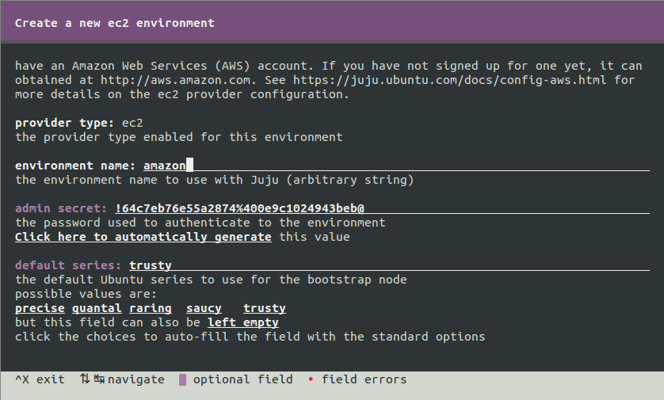
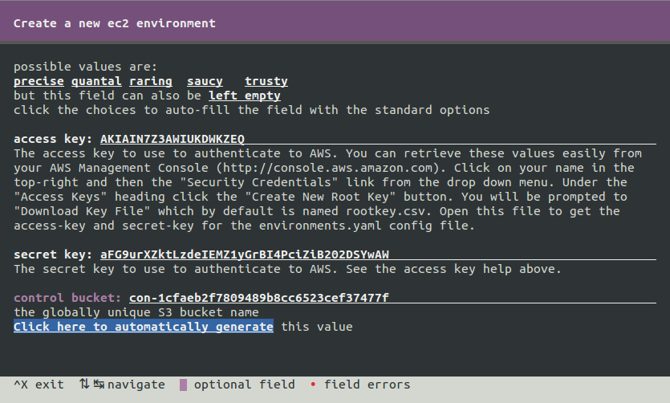
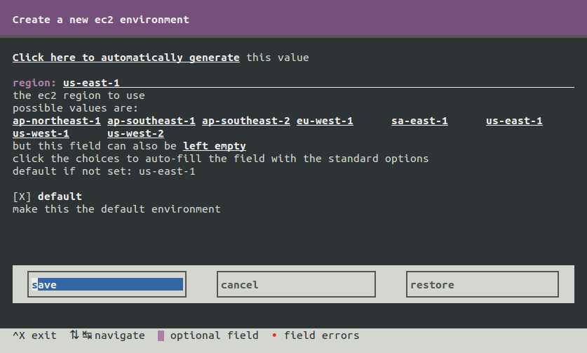

## Getting started with Juju

Juju handles provisioning machines and deploying complex systems to a
wide number of clouds, supporting service orchestration once the bundle of
services has been deployed.


### Prerequisites

> Note: If you plan on using the Kuberentes script `kube-up.sh`, on Ubuntu -
> all of the dependencies will be handled for you. You may safely skip to the
> section: [Launch Kubernetes Cluster](#launch-kubernetes-cluster).

#### Prerequisites using Docker

If you are not using Ubuntu or prefer the isolation of Docker, use the Docker
image that contains the all the Juju tools:

    mkdir ~/.juju
    sudo docker run -v ~/.juju:/home/ubuntu/.juju -ti whitmo/jujubox:latest

To enter the interactive mode for Quickstart use the `juju quickstart -i`
command.

### Quickstart
For Juju to manage the public clouds you must provide your cloud credentials.  
The Quickstart tool makes this easy with a text based curses interface. This
example will illustrate setting up the Amazon cloud environment, but the
concepts are the same for other cloud environments.

From the main Quickstart screen, create a `new Amazon EC2 environment`.

* Type "amazon" in the 'environment name' field.
* The 'admin secret' is the password for the Juju GUI, should you ever use it.



* Copy and paste your AWS 'access key' from the AWS control panel.
* Copy and paste your AWS 'secret key' from the AWS control panel.



- Make this the default environment.
- Select `save` and `use` to write the changes to your environments.yaml file.



The Juju client using Secure Shell (SSH) to interact with the servers in the
cloud. Quickstart will prompt you to create SSH keys if you do not already
have keys on this system.


## Launch Kubernetes cluster

You will need to set the Kuberentes provider to "juju" and run the `kube-up.sh`
script from the `kubernetes` directory:  

    export KUBERNETES_PROVIDER=juju
    cluster/kube-up.sh

If this is your first time running the `kube-up.sh` script, it will install
the required prerequisites to get started with Juju, additionally it will
launch [Quickstart](#quickstart) a curses based configuration utility allowing
you to select your cloud provider and enter the proper access credentials.

The script will deploy a four system Kubernetes cluster which consists of: one
kubernetes-master, two kubernetes nodes on a docker hosts with flannel-docker
Software Defined Networking (SDN), and one etcd key value store.


## Exploring the cluster

Juju status provides information about each unit in the cluster:

    juju status --format=oneline
    - docker/0: 52.4.92.78 (started)
      - flannel-docker/0: 52.4.92.78 (started)
      - kubernetes/0: 52.4.92.78 (started)
    - docker/1: 52.6.104.142 (started)
      - flannel-docker/1: 52.6.104.142 (started)
      - kubernetes/1: 52.6.104.142 (started)
    - etcd/0: 52.5.216.210 (started) 4001/tcp
    - kubernetes-master/0: 52.6.19.238 (started) 8080/tcp

You can use `juju ssh` to access any of the units:

    juju ssh kubernetes-master/0


## Run some containers!

`kubectl` is installed and available on the Kubernetes master node.  You can
ssh in to launch some containers, but one could use kubectl locally setting
KUBERNETES_MASTER to point at the ip of `kubernetes-master/0`.

No pods will be available before starting a container:

    kubectl get pods
    POD  CONTAINER(S)   IMAGE(S)   HOST  LABELS  STATUS

    kubectl get replicationcontrollers
    CONTROLLER  CONTAINER(S)  IMAGE(S)  SELECTOR  REPLICAS

We'll follow the aws-coreos example. Create a pod manifest: `pod.json`

```
{
  "apiVersion": "v1",
  "kind": "Pod",
  "metadata": {
    "name": "hello",
    "labels": {
      "name": "hello",
      "environment": "testing"
    }
  },
  "spec": {
    "containers": [{
      "name": "hello",
      "image": "quay.io/kelseyhightower/hello",
      "ports": [{
        "containerPort": 80,
        "hostPort": 80
      }]
    }]
  }
}
```

Create the pod with kubectl:

    kubectl create -f pod.json


Get info on the pod:

    kubectl get pods


To test the hello app, we need to locate which minion is hosting
the container. Better tooling for using juju to introspect container
is in the works but for we can use `juju run` and `juju status` to find
our hello app.

Exit out of our ssh session and run:

    juju run --unit kubernetes/0 "docker ps -n=1"
    ...
    juju run --unit kubernetes/1 "docker ps -n=1"
    CONTAINER ID        IMAGE                                  COMMAND             CREATED             STATUS              PORTS               NAMES
    02beb61339d8        quay.io/kelseyhightower/hello:latest   /hello              About an hour ago   Up About an hour                        k8s_hello....


We see `kubernetes/1` has our container, we can open port 80:

    juju run --unit kubernetes/1 "open-port 80"
    juju expose kubernetes
    sudo apt-get install curl
    curl $(juju status --format=oneline kubernetes/1 | cut -d' ' -f3)

Finally delete the pod:

    juju ssh kubernetes-master/0
    kubectl delete pods hello


## Scale out cluster

We can add minion units like so:

    juju add-unit docker # creates unit docker/2, kubernetes/2, docker-flannel/2

## Launch the "k8petstore" example app

The [k8petstore example](https://github.com/GoogleCloudPlatform/kubernetes/blob/master/examples/k8petstore) is available as a
[juju action](https://jujucharms.com/docs/devel/actions).

    juju action do kubernetes-master/0 petstore

> Note: this example includes 1000 curl statements to exercise the app.
> Action success to date takes approx. 30 minutes to complete.

## Tear down cluster

    cluster/kube-down.sh

or

    juju destroy-environment --force `juju env`

## More Info

Look in the `juju` directory in the
[kubernetes](https://github.com/GoogleCloudPlatform/kubernetes/) github project.

[Glossary of Juju terms](juju/user-glossary.html)


 - [Bundle File](https://github.com/GoogleCloudPlatform/kubernetes/blob/master/cluster/juju/bundles/local.yaml)
   * [Kubernetes master charm](https://github.com/GoogleCloudPlatform/kubernetes/tree/master/cluster/juju/charms/trusty/kubernetes-master)
   * [Kubernetes minion charm](https://github.com/GoogleCloudPlatform/kubernetes/tree/master/cluster/juju/charms/trusty/kubernetes)
 - [More about Juju](https://juju.ubuntu.com)

##### Developers 

If you wish to integrate with the Kubernetes Charm ecosystem in Juju, we have
documented the [relationships and interfaces](juju/dev-interfaces.md)


### Cloud compatibility

Juju runs natively against a variety of cloud providers and can be
made to work against many more using a generic manual provider.


Provider          | v0.15.0 | v0.8.1  
--------------    | ------- | -------
AWS               | TBD |[Pass](http://reports.vapour.ws/charm-test-details/charm-bundle-test-parent-136) 
HPCloud           | TBD | [Pass](http://reports.vapour.ws/charm-test-details/charm-bundle-test-parent-136)
OpenStack         | TBD | [Pass](http://reports.vapour.ws/charm-test-details/charm-bundle-test-parent-136) 
Joyent            | TBD | [Pass](http://reports.vapour.ws/charm-test-details/charm-bundle-test-parent-136) 
Azure             | TBD | TBD
MAAS (bare metal) | TBD | TBD
GCE               | TBD | TBD


[]()
