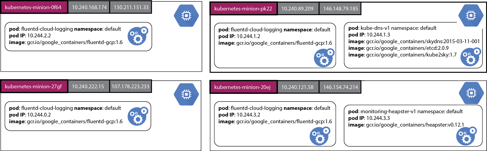
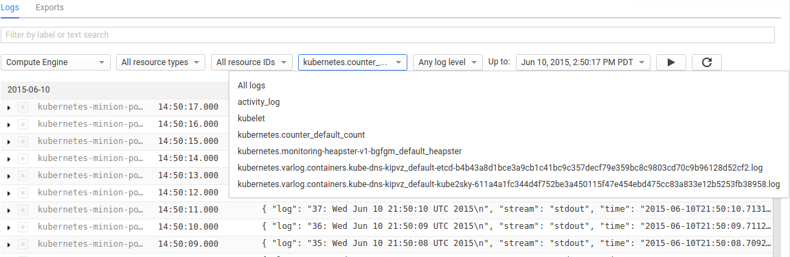
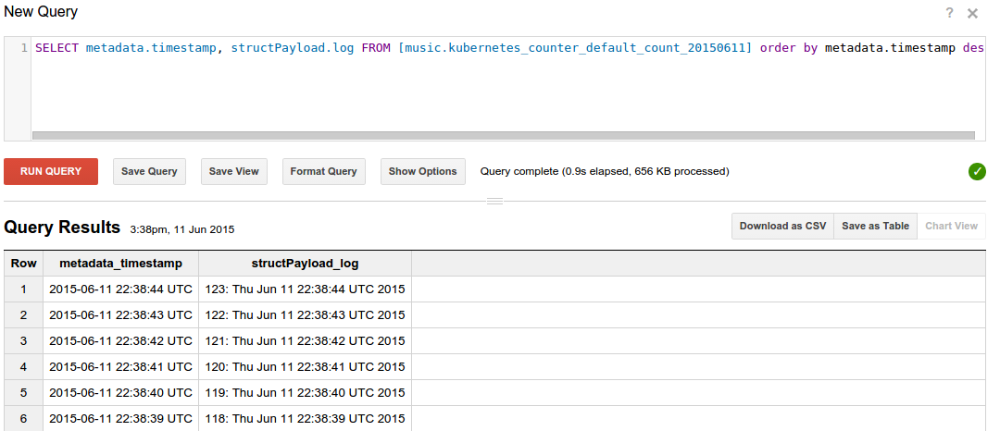

<!-- BEGIN MUNGE: UNVERSIONED_WARNING -->


<!-- END MUNGE: UNVERSIONED_WARNING -->

# Cluster Level Logging to Google Cloud Logging

A Kubernetes cluster will typically be humming along running many system and application pods. How does the system administrator collect, manage and query the logs of the system pods? How does a user query the logs of their application which is composed of many pods which may be restarted or automatically generated by the Kubernetes system? These questions are addressed by the Kubernetes **cluster level logging** services.

Cluster level logging for Kubernetes allows us to collect logs which persist beyond the lifetime of the pod’s container images or the lifetime of the pod or even cluster. In this article we assume that a Kubernetes cluster has been created with cluster level logging support for sending logs to Google Cloud Logging. After a cluster has been created you will have a collection of system pods running in the `kube-system` namespace that support monitoring,
logging and DNS resolution for names of Kubernetes services:

```console
$ kubectl get pods --namespace=kube-system
NAME                                           READY     REASON    RESTARTS   AGE
fluentd-cloud-logging-kubernetes-minion-0f64   1/1       Running   0          32m
fluentd-cloud-logging-kubernetes-minion-27gf   1/1       Running   0          32m
fluentd-cloud-logging-kubernetes-minion-pk22   1/1       Running   0          31m
fluentd-cloud-logging-kubernetes-minion-20ej   1/1       Running   0          31m
kube-dns-v3-pk22                               3/3       Running   0          32m
monitoring-heapster-v1-20ej                    0/1       Running   9          32m
```

Here is the same information in a picture which shows how the pods might be placed on specific nodes.



This diagram shows four nodes created on a Google Compute Engine cluster with the name of each VM node on a purple background. The internal and public IPs of each node are shown on gray boxes and the pods running in each node are shown in green boxes. Each pod box shows the name of the pod and the namespace it runs in, the IP address of the pod and the images which are run as part of the pod’s execution. Here we see that every node is running a fluentd-cloud-logging pod which is collecting the log output of the containers running on the same node and sending them to Google Cloud Logging. A pod which provides the
[cluster DNS service](../admin/dns.md) runs on one of the nodes and a pod which provides monitoring support runs on another node.

To help explain how cluster level logging works let’s start off with a synthetic log generator pod specification [counter-pod.yaml](../../examples/blog-logging/counter-pod.yaml):

<!-- BEGIN MUNGE: EXAMPLE ../../examples/blog-logging/counter-pod.yaml -->

```yaml
apiVersion: v1
kind: Pod
metadata:
  name: counter
spec:
  containers:
  - name: count
    image: ubuntu:14.04
    args: [bash, -c, 
           'for ((i = 0; ; i++)); do echo "$i: $(date)"; sleep 1; done']
```

[Download example](../../examples/blog-logging/counter-pod.yaml?raw=true)
<!-- END MUNGE: EXAMPLE ../../examples/blog-logging/counter-pod.yaml -->

This pod specification has one container which runs a bash script when the container is born. This script simply writes out the value of a counter and the date once per second and runs indefinitely. Let’s create the pod in the default
namespace.

```console
 $ kubectl create -f examples/blog-logging/counter-pod.yaml
 pods/counter
```

We can observe the running pod:

```console
$ kubectl get pods
NAME                                           READY     STATUS    RESTARTS   AGE
counter                                        1/1       Running   0          5m
```

This step may take a few minutes to download the ubuntu:14.04 image during which the pod status will be shown as `Pending`.

One of the nodes is now running the counter pod:


When the pod status changes to `Running` we can use the kubectl logs command to view the output of this counter pod.

```console
$ kubectl logs counter
0: Tue Jun  2 21:37:31 UTC 2015
1: Tue Jun  2 21:37:32 UTC 2015
2: Tue Jun  2 21:37:33 UTC 2015
3: Tue Jun  2 21:37:34 UTC 2015
4: Tue Jun  2 21:37:35 UTC 2015
5: Tue Jun  2 21:37:36 UTC 2015
...
```

This command fetches the log text from the Docker log file for the image that is running in this container. We can connect to the running container and observe the running counter bash script.

```console
$ kubectl exec -i counter bash
ps aux
USER       PID %CPU %MEM    VSZ   RSS TTY      STAT START   TIME COMMAND
root         1  0.0  0.0  17976  2888 ?        Ss   00:02   0:00 bash -c for ((i = 0; ; i++)); do echo "$i: $(date)"; sleep 1; done
root       468  0.0  0.0  17968  2904 ?        Ss   00:05   0:00 bash
root       479  0.0  0.0   4348   812 ?        S    00:05   0:00 sleep 1
root       480  0.0  0.0  15572  2212 ?        R    00:05   0:00 ps aux
```

What happens if for any reason the image in this pod is killed off and then restarted by Kubernetes? Will we still see the log lines from the previous invocation of the container followed by the log lines for the started container? Or will we lose the log lines from the original container’s execution and only see the log lines for the new container? Let’s find out. First let’s stop the currently running counter.

```console
$ kubectl stop pod counter
pods/counter
```

Now let’s restart the counter.

```console
$ kubectl create -f examples/blog-logging/counter-pod.yaml
pods/counter
```

Let’s wait for the container to restart and get the log lines again.

```console
$ kubectl logs counter
0: Tue Jun  2 21:51:40 UTC 2015
1: Tue Jun  2 21:51:41 UTC 2015
2: Tue Jun  2 21:51:42 UTC 2015
3: Tue Jun  2 21:51:43 UTC 2015
4: Tue Jun  2 21:51:44 UTC 2015
5: Tue Jun  2 21:51:45 UTC 2015
6: Tue Jun  2 21:51:46 UTC 2015
7: Tue Jun  2 21:51:47 UTC 2015
8: Tue Jun  2 21:51:48 UTC 2015
```

We’ve lost the log lines from the first invocation of the container in this pod! Ideally, we want to preserve all the log lines from each invocation of each container in the pod. Furthermore, even if the pod is restarted we would still like to preserve all the log lines that were ever emitted by the containers in the pod. But don’t fear, this is the functionality provided by cluster level logging in Kubernetes. When a cluster is created, the standard output and standard error output of each container can be ingested using a [Fluentd](http://www.fluentd.org/) agent running on each node into either [Google Cloud Logging](https://cloud.google.com/logging/docs/) or into Elasticsearch and viewed with Kibana.

When a Kubernetes cluster is created with logging to Google Cloud Logging enabled, the system creates a pod called `fluentd-cloud-logging` on each node of the cluster to collect Docker container logs. These pods were shown at the start of this blog article in the response to the first get pods command.

This log collection pod has a specification which looks something like this:

<!-- BEGIN MUNGE: EXAMPLE ../../cluster/saltbase/salt/fluentd-gcp/fluentd-gcp.yaml -->

```yaml
apiVersion: v1
kind: Pod
metadata:
  name: fluentd-cloud-logging
  namespace: kube-system
spec:
  containers:
  - name: fluentd-cloud-logging
    image: gcr.io/google_containers/fluentd-gcp:1.13
    resources:
      limits:
        cpu: 100m
        memory: 200Mi
    env:
    - name: FLUENTD_ARGS
      value: -q
    volumeMounts:
    - name: varlog
      mountPath: /var/log
    - name: varlibdockercontainers
      mountPath: /var/lib/docker/containers
      readOnly: true
  terminationGracePeriodSeconds: 30
  volumes:
  - name: varlog
    hostPath:
      path: /var/log
  - name: varlibdockercontainers
    hostPath:
      path: /var/lib/docker/containers
```

[Download example](../../cluster/saltbase/salt/fluentd-gcp/fluentd-gcp.yaml?raw=true)
<!-- END MUNGE: EXAMPLE ../../cluster/saltbase/salt/fluentd-gcp/fluentd-gcp.yaml -->

This pod specification maps the directory on the host containing the Docker log files, `/var/lib/docker/containers`, to a directory inside the container which has the same path. The pod runs one image, `gcr.io/google_containers/fluentd-gcp:1.6`, which is configured to collect the Docker log files from the logs directory and ingest them into Google Cloud Logging. One instance of this pod runs on each node of the cluster. Kubernetes will notice if this pod fails and automatically restart it.

We can click on the Logs item under the Monitoring section of the Google Developer Console and select the logs for the counter container, which will be called kubernetes.counter_default_count.  This identifies the name of the pod (counter), the namespace (default) and the name of the container (count) for which the log collection occurred. Using this name we can select just the logs for our counter container from the drop down menu:



When we view the logs in the Developer Console we observe the logs for both invocations of the container.


Note the first container counted to 108 and then it was terminated. When the next container image restarted the counting process resumed from 0. Similarly if we deleted the pod and restarted it we would capture the logs for all instances of the containers in the pod whenever the pod was running.

 Logs ingested into Google Cloud Logging may be exported to various other destinations including [Google Cloud Storage](https://cloud.google.com/storage/) buckets and [BigQuery](https://cloud.google.com/bigquery/). Use the Exports tab in the Cloud Logging console to specify where logs should be streamed to. You can also follow this link to the
 [settings tab](https://pantheon.corp.google.com/project/_/logs/settings).

 We could query the ingested logs from BigQuery using the SQL query which reports the counter log lines showing the newest lines first:

 ```console
 SELECT metadata.timestamp, structPayload.log
 FROM [mylogs.kubernetes_counter_default_count_20150611] 
 ORDER BY metadata.timestamp DESC
 ```

Here is some sample output:



We could also fetch the logs from Google Cloud Storage buckets to our desktop or laptop and then search them locally. The following command fetches logs for the counter pod running in a cluster which is itself in a Compute Engine project called `myproject`. Only logs for the date 2015-06-11 are fetched.


```console
$ gsutil -m cp -r gs://myproject/kubernetes.counter_default_count/2015/06/11 .
```

Now we can run queries over the ingested logs. The example below uses the [jq](http://stedolan.github.io/jq/) program to extract just the log lines.

```console
$ cat 21\:00\:00_21\:59\:59_S0.json | jq '.structPayload.log'
"0: Thu Jun 11 21:39:38 UTC 2015\n"
"1: Thu Jun 11 21:39:39 UTC 2015\n"
"2: Thu Jun 11 21:39:40 UTC 2015\n"
"3: Thu Jun 11 21:39:41 UTC 2015\n"
"4: Thu Jun 11 21:39:42 UTC 2015\n"
"5: Thu Jun 11 21:39:43 UTC 2015\n"
"6: Thu Jun 11 21:39:44 UTC 2015\n"
"7: Thu Jun 11 21:39:45 UTC 2015\n"
...
```

This page has touched briefly on the underlying mechanisms that support gathering cluster level logs on a Kubernetes deployment. The approach here only works for gathering the standard output and standard error output of the processes running in the pod’s containers. To gather other logs that are stored in files one can use a sidecar container to gather the required files as described at the page [Collecting log files within containers with Fluentd](http://releases.k8s.io/release-1.1/contrib/logging/fluentd-sidecar-gcp/README.md) and sending them to the Google Cloud Logging service.

Some of the material in this section also appears in the blog article [Cluster Level Logging with Kubernetes](http://blog.kubernetes.io/2015/06/cluster-level-logging-with-kubernetes.html).


<!-- BEGIN MUNGE: IS_VERSIONED -->
<!-- TAG IS_VERSIONED -->
<!-- END MUNGE: IS_VERSIONED -->


<!-- BEGIN MUNGE: GENERATED_ANALYTICS -->
[]()
<!-- END MUNGE: GENERATED_ANALYTICS -->
