Getting started on Mirantis OpenStack 6.1 with Murano Application Catalog
--------------------------

**Table of Contents**

- [Summary](#summary)
- [Prerequisites](#prerequisites)
- [Installing Kubernetes](#installing-kubernetes)
    - [Install Kubernetes Cluster from OpenStack Community App Catalog](#install-package)
    - [Create a New Environment, add Kubernetes and Configure](#create-env-and-configure)
    - [Deploy Kubernetes Cluster](#deploy-env) 
- [Prepare to access Kubernetes](#access-env)
- [Connect with cAdvisor and kubectl](#access-tools)
- [Tearing down the cluster](#tearing-down-the-cluster)
- [Further reading](#further-reading)

## Summary

This document explains how to install Kubernetes Cluster 0.15 on Mirantis OpenStack 6.1 using the Murano Application Catalog component of OpenStack. The Kubernetes Cluster Murano package and its dependencies (the Docker Interface Library package, and a preconfigured Ubuntu 14.04 image for use as guest OS on VMs comprising the Kubernetes cluster) are obtained from [OpenStack Community App Catalog](apps.openstack.org), an OpenStack community repository.

Mirantis OpenStack 6.1 is distributed as an .iso that includes Fuel, an open source deployment and management tool. You download the .iso, use it to create a Fuel Master Node (this is usually done on a VM), set local network-accessible hardware resources to PXE-boot and obtain IP addresses (DHCP) from the Fuel Master, then access Fuel's web UI or CLI to configure and deploy OpenStack (with optional components) on the available infrastructure. Infrastructure may be physical or virtual: the deployment has been tested to work on a single Linux machine with 32GB of RAM under Oracle VirtualBox, on VMs preconfigured by running Mirantis' VirtualBox Scripts. See [Running Mirantis OpenStack on VirtualBox](https://docs.mirantis.com/openstack/fuel/fuel-6.1/virtualbox.html) for more information.

Fuel enables configuration and deployment of Mirantis 6.1 with Murano Application Catalog preinstalled and ready for use. Fuel 6.1 also permits selection of a host OS (included with the distro) to use on nodes hosting OpenStack components: for purposes of this demo, we recommend selecting Ubuntu 14.04. 

## Prerequisites

1. Download the Mirantis OpenStack 6.1 .iso. Visit [http://software.mirantis.com](http://software.mirantis.com) to get started.
2. If you intend to deploy Mirantis OpenStack on VirtualBox, be advised that this deployment will require a minimum of 16GB RAM on the host machine. VirtualBox users should download the [VirtualBox Scripts](https://software.mirantis.com/load/6-1-vbox/). When run from the Linux command line (or on Windows, from the _Cygwin_ command line) with the Mirantis OpenStack .iso in a specific subdirectory, the scripts will set up VirtualBox host networking, create and launch a Fuel Master Node VM, plus additional slave VMs to host OpenStack nodes. For purposes of this project, we recommend installing OpenStack on VirtualBox in a non-HA configuration (single controller node) with a small Cinder node (1 GB RAM) and one or two Compute nodes, each with as much RAM as practical (e.g., two 4-6GB Computes on a 16GB host, or one 8-12GB Compute). You can set desired VM parameters by editing the _config.sh_ file, before launching the VirtualBox scripts.  
2. Alternatively, if you intend to deploy Mirantis OpenStack on another virtualization solution, or on bare metal, familiarize yourself with the [Mirantis OpenStack User Guide](https://docs.mirantis.com/openstack/fuel/fuel-6.1/user-guide.html#user-guide), then [follow these instructions](https://docs.mirantis.com/openstack/fuel/fuel-6.1/user-guide.html#download-and-install-fuel) to install Fuel on a VM to create a Fuel Master Node, then create or provide additional hardware, appropriately networked, to host OpenStack nodes.
4. Access Fuel's web interface and use the wizard to [create a new Mirantis 6.1 OpenStack environment](https://docs.mirantis.com/openstack/fuel/fuel-6.1/user-guide.html#create-a-new-openstack-environment), selecting Ubuntu 14.04 as the host OS for OpenStack nodes. Be sure to check the box to install **Murano Application Catalog** on the Environment Creation wizard's _Additional Services_ tab.
5. Finish configuring networks and other details (on VirtualBox, default network settings should work), and deploy your Mirantis OpenStack 6.1 cluster with Murano installed.
6. Once your OpenStack cluster has finished installing, optionally run cluster health checks from the cluster's _Health Check_ tab in Fuel.
7. Fuel will provide a URL for your new cluster's _Horizon Web UI_. Click this link to open Horizon. Unless you changed them, the default username/password for Horizon will be admin/admin.
8. Recommended: In Horizon's left-hand tabs, click on *Project>Access & Security* and on the *Key Pairs* tab. Click on *+Create Key Pair* to generate a new keypair, give it a name, and download the public key (.pem) to your desktop. This keypair will be used to secure access to component servers in your Kubernetes cluster.
9. If using VirtualBox or another desktop virtualization solution to deploy Mirantis OpenStack and Kubernetes, if resources are at all constrained, it may make sense to create a custom OpenStack VM flavor to host Kubernetes components. This can be done under the Admin account in OpenStack Horizon under *Admin>Flavors* by pressing the *+Create Flavor* button. A VM flavor with 1-2GB RAM, 1 vCPU, and 10GB of HDD is adequate.

## Installing Kubernetes

### Install the Kubernetes Cluster Murano Package from OpenStack Community App Catalog

1. In Horizon's left-hand tab pane, find *Murano>Manage>Package Definitions* and click the *+ Import Package* button.  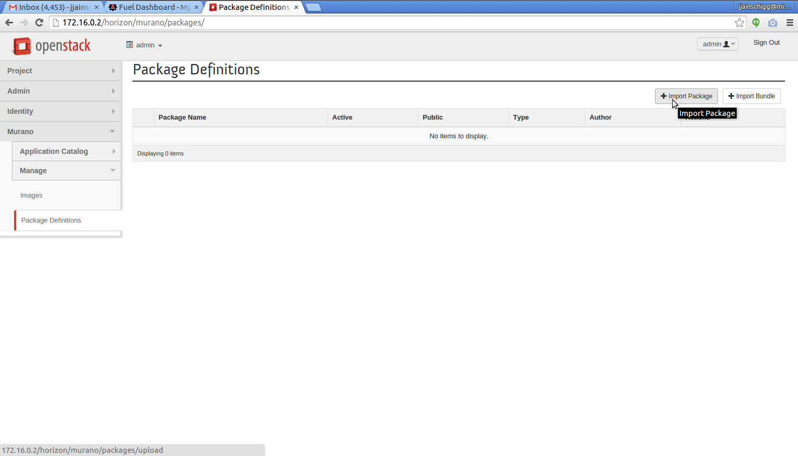  
2. In the Import Package dialog that opens, select *Repository* as the import source.  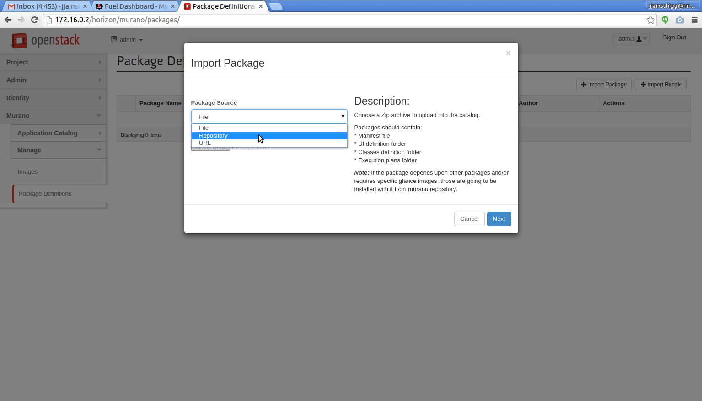  
3. Note that a link to the OpenStack Community Apps Catalog can now be seen in the dialog box. Click on this link to open the App Catalog in a new tab.  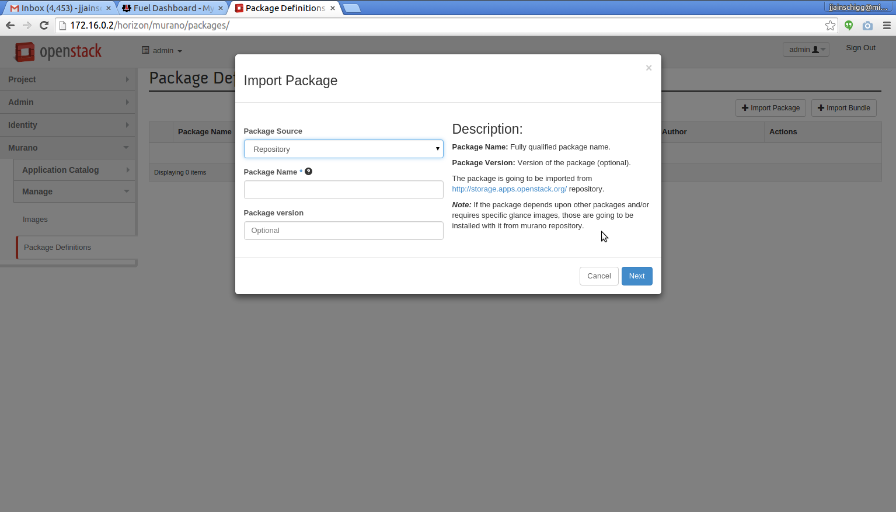  
4. In App Catalog, find the Kubernetes Cluster package and copy the name.  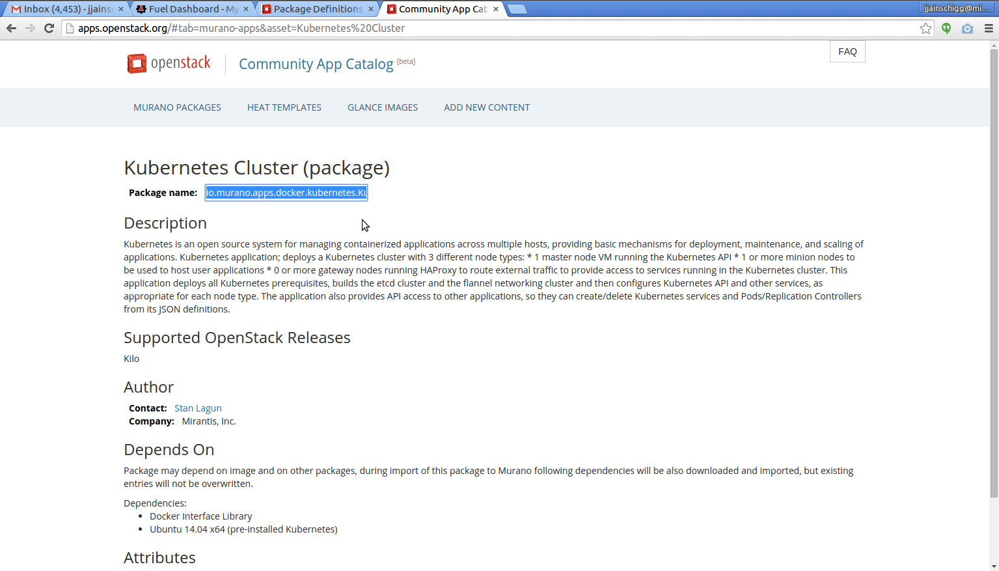  
5. Return to the Import Package dialog and insert the copied package name, then click *Next*.  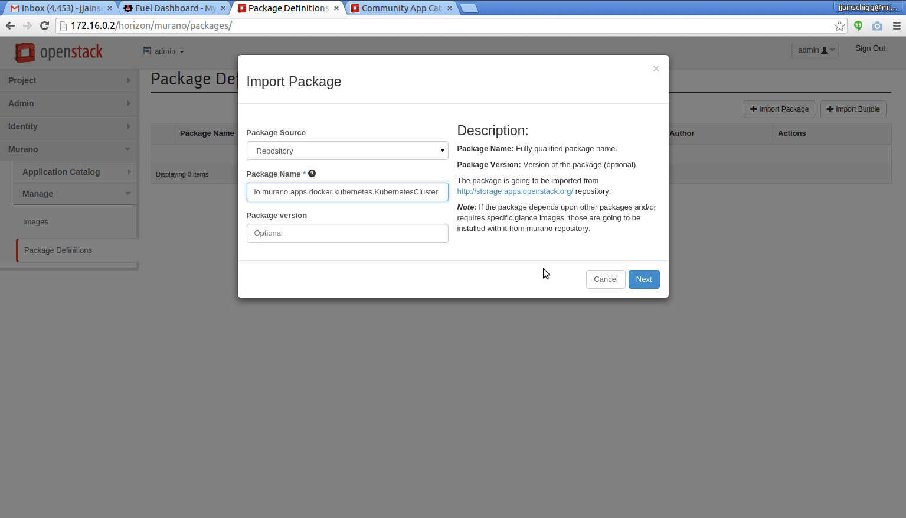  
6. Pick a Murano application category (e.g., Web) for your new Kubernetes Cluster package, optionally set it to Public, and click *Create*. The Kubernetes Cluster package and its dependencies are installed to Murano (packages) and Glance (Ubuntu guest OS image).  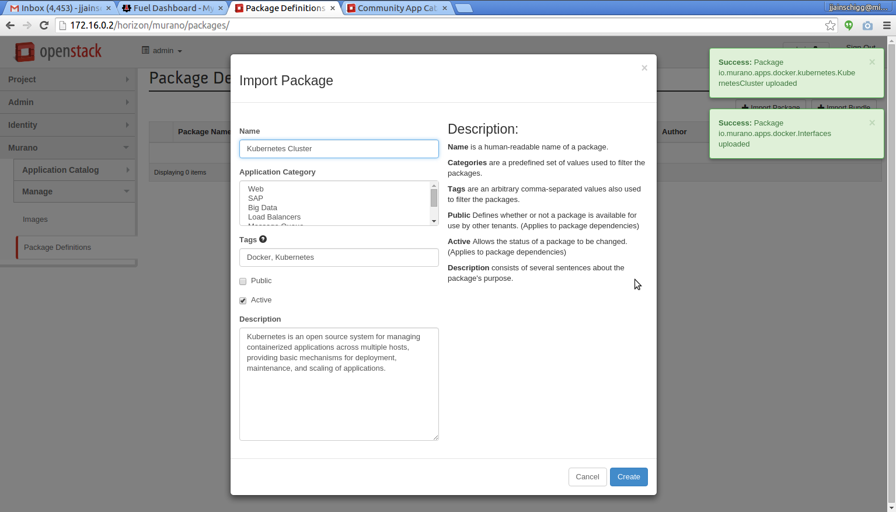  

### Create a new Murano environment, add the Kubernetes Cluster package, and configure

1. In Horizon's left-hand tab pane, find *Murano>Application Catalog>Environments* and click on *+ Create Environment*. Give your new Kubernetes environment a name and click *Create*.  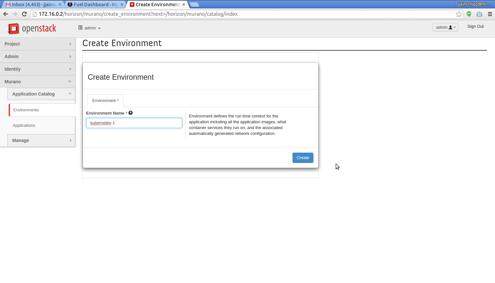  
2. Murano will show you a list of installed packages. Drag the Kubernetes Cluster package into the Component List of your new environment.  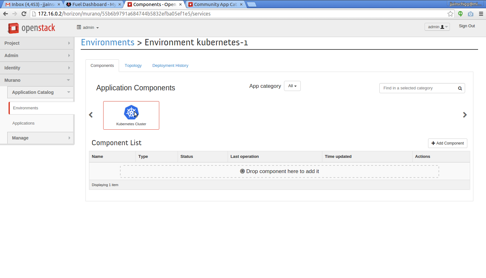  
3. A dialog box will appear to let you configure the deployed Kubernetes Cluster. You can set the maximum number of Gateway and Minion nodes, define naming prefixes, and can check to install cAdvisor monitoring support on Minions. Note that on resource-constrained platforms, it makes sense to install only a minimal set of Kubernetes Minion and Gateway nodes (e.g., one each) and use a minimal custom VM flavor for the installation (see above). Click *Next*.  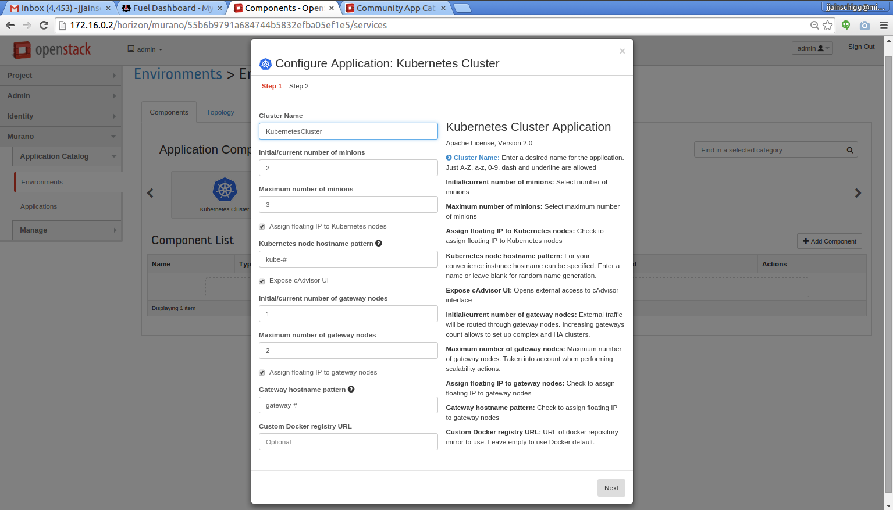  
4. A new dialog will appear, letting you choose the keypair you created above to secure access to Kubernetes cluster nodes. Click *Create*.  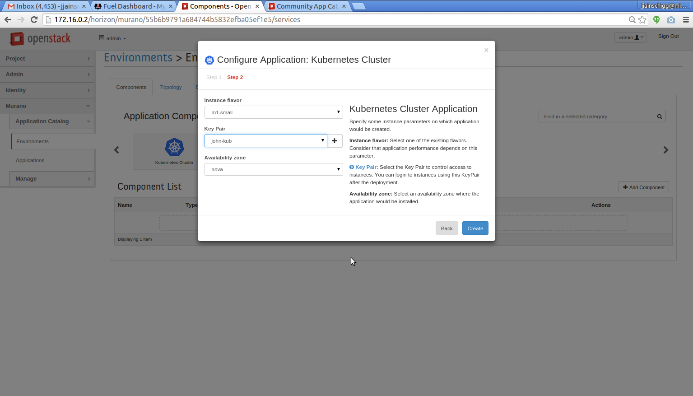  

### Deploy the environment

1. The app will be added to the component list of your new environment. Click *Deploy This Environment*. Deployment will proceed, progress and status will be displayed.  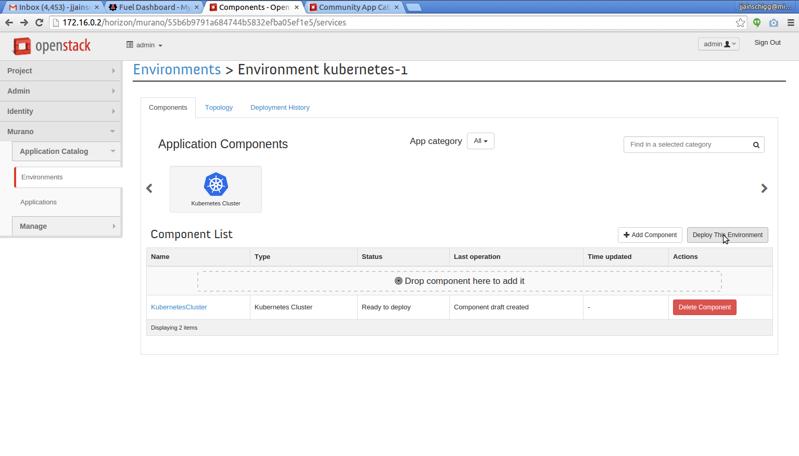  
2. When deployment is complete, click on the environment name to expose deployment details.  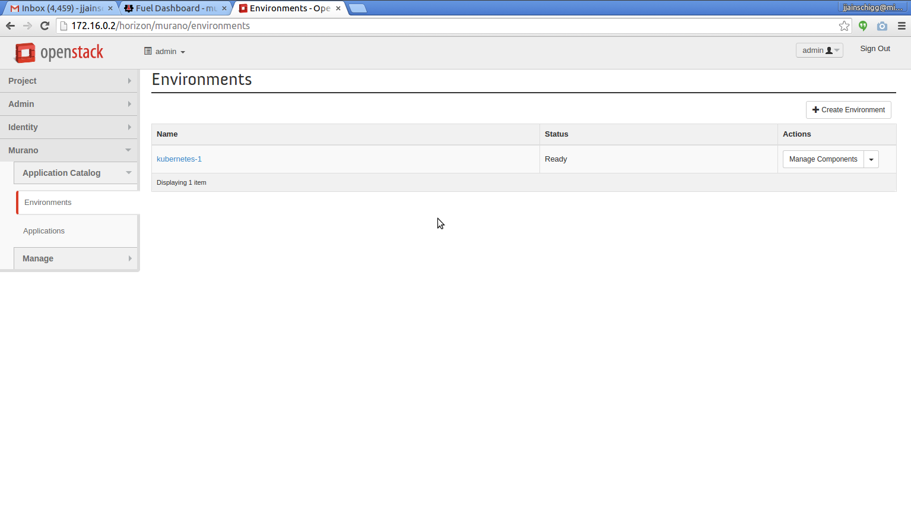  
3. Click on the *Topology* tab to examine the Kubernetes cluster's logical topology and virtualized infrastructure.  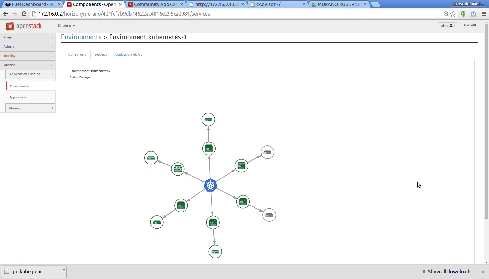  
4. Click on *Project>Compute>Instances* to examine the VMs deployed by Murano to support your Kubernetes Cluster.  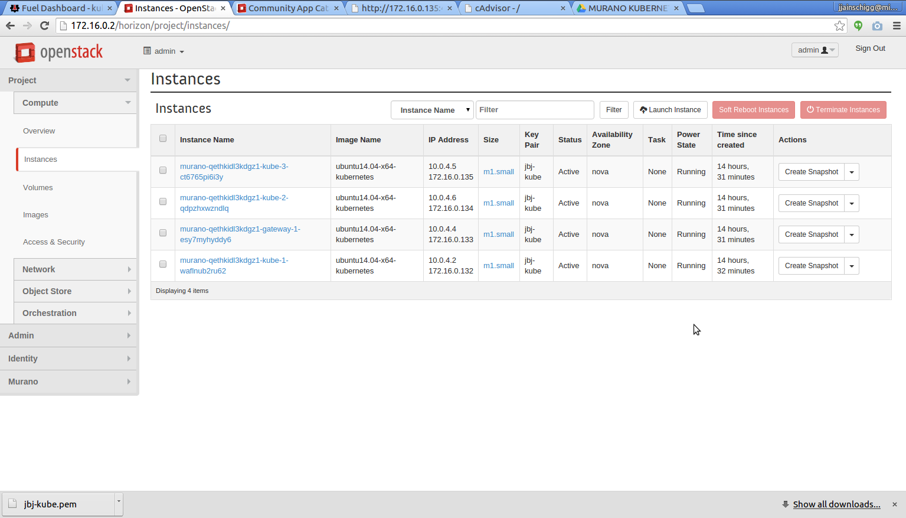  

### Prepare to access Kubernetes

1. Go to *Murano>Environments*, click on the name of your environment, and then click on the name of the Kubernetes Cluster component. Click on the *Logs* tab of the info screen that appears. This will show your cluster's deploy log. IP addresses and ports giving access to Kubernetes' API and to cAdvisor monitoring instances are shown. Make note of these.     
2. Click on *Project>Compute>Access & Security* and on the *Security Groups* tab, and note that Murano has created a security group with rules specific to your new cluster. Click the *Manage Rules* button, and add new Ingress rules (e.g., IPv4 TCP Allow All), enabling access by browser or CLI tooling to your cluster's cAdvisor instances and to the Kubernetes API.  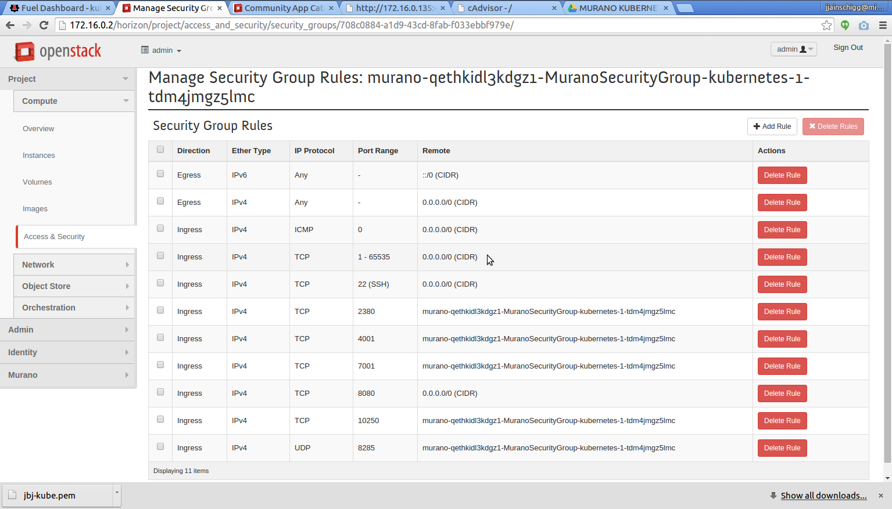  
3. To ssh into the VMs comprising your Kubernetes cluster, use your private key and the injected administrator username: _ec2-user_, plus the VM's floating IP address, as follows:  
    <code># ssh -i [path/mykey.pem] ec2-user@[floating_ip]</code>

### Access cAdvisor and kubectl

1. Opening a new browser tab on one of the cAdvisor IP:port links will show you the status of the associated Minion node.   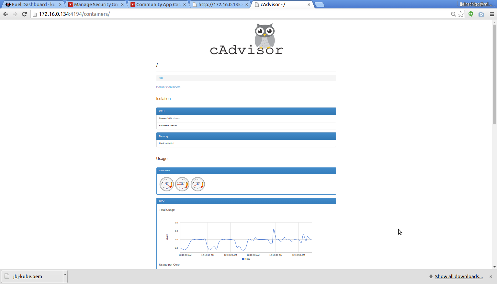  
2. To access the Kubernetes API remotely with kubectl (on Linux):
   1. Download kubectl 
       <code># wget https://storage.googleapis.com/kubernetes-release/release/v1.0.1/bin/linux/amd64/kubectl</code> 
   2. Copy to your path 
       <code># chmod +x kubectl</code> 
       <code># mv kubectl /usr/local/bin</code> 
   3. Create an ssh tunnel to the API entrypoint IP address on the cluster: 
       <code># ssh -i [path/mykey.pem] -f -nNT -L 8080:127.0.0.1:8080 ec2-user@[API-entrypoint-IP-only (do not add :8080)]</code> 
3. kubectl commands can be found [here](https://cloud.google.com/container-engine/docs/kubectl/). Sample output from a command might be: 
    <code># kubectl version Client Version: version.Info{Major:"0", Minor:"19", GitVersion:"v0.19.3", GitCommit:"3103c8ca0f24514bc39b6e2b7d909bbf46af8d11", GitTreeState:"clean"} Server Version: version.Info{Major:"0", Minor:"15", GitVersion:"v0.15.0", GitCommit:"831f3e60d7cd64c61a775d6c78acce1673dd8aa9", GitTreeState:"clean"}</code>

## Tearing down the Kubernetes Cluster

Go to *Murano>Environments*, click on the name of your environment, and select *Delete Environment* from the pop-down menu.

## Further reading

Please see the [Kubernetes docs](../../docs/) for more details on administering
and using a Kubernetes cluster.

Please see the [GitHub Repo for Kubernetes on Murano](https://github.com/openstack/murano-apps/tree/master/Docker/Kubernetes) for source code, and [the readme file](https://github.com/openstack/murano-apps/blob/master/Docker/Kubernetes/readme.md) for internal details and dependency notes.

Visit [mirantis.com](http://www.mirantis.com) for more information about Mirantis OpenStack, and [software.mirantis.com](http://software.mirantis.com) for downloads and documentation.

