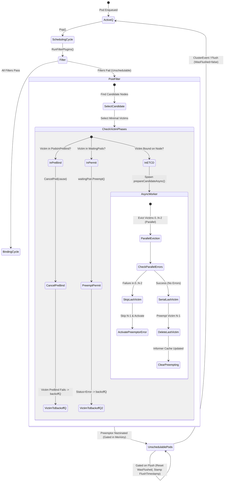

# Technical Report: Asynchronous Preemption, Scheduling Queue Invariants, and Preemptor Lifecycle Management

## Executive Summary

The Kubernetes scheduling framework operates under stringent throughput, latency, and correctness constraints. In high-density and resource-constrained clusters, preemption is the foundational mechanism ensuring high-priority workloads (e.g., critical system daemons, gang-coordinated batch jobs, in-place scaling pods) acquire placement even when cluster nodes are fully saturated. Historically, **synchronous preemption** executed in-band within the scheduling cycle, making synchronous API calls to delete victim pods or patch status conditions while holding critical scheduling locks. This serialized execution introduced severe scheduling head-of-line (HoL) blocking and degraded throughput under heavy preemption load.

To overcome these scalability bottlenecks, **Asynchronous Preemption (KEP-4832)** decoupled victim eviction and API server interactions from the active scheduling path by offloading preemption actuation to asynchronous goroutines. However, executing preemption asynchronously introduced complex distributed state machines and subtle race conditions across the `SchedulingQueue` (`activeQ`, `backoffQ`, `unschedulablePods`), the preemption `Evaluator`/`Executor`, the `WaitingPod` map, and the binding cycle (`PodsInPreBind`).

This report provides a comprehensive architectural analysis and reference documentation of the issues, bug fixes, state machines, queue invariants, and edge case resolutions governing:
1. **Unschedulable Queue Starvation & Gating Mechanics** (PR #139162, PR #139330, PR #139331).
2. **In-Memory & Non-Destructive Preemption in Prebind & Permit Phases** (PR #135502, PR #135719).
3. **Victim Deletion, Rollback Tracking, and Concurrency Invariants** (PR #135495, PR #134730, PR #134294, PR #135955, PR #139373).

---

## 1. Architectural Foundation: Synchronous vs. Asynchronous Preemption

### 1.1 The Synchronous Preemption Bottleneck
In the legacy synchronous preemption model, when a pod failed to find a node through filter plugins, `PostFilter` (specifically `DefaultPreemption`) was invoked synchronously:
1. **Candidate Evaluation**: Discovered nodes where evicting lower-priority pods made room for the preemptor.
2. **Victim Selection**: Selected the minimal, lowest-priority set of victims violating the fewest PodDisruptionBudgets (PDBs).
3. **Synchronous Eviction**: Sequentially or concurrently invoked API server delete/patch requests for every victim pod *before* the scheduling cycle could conclude.
4. **Head-of-Line Blocking**: While the scheduler blocked on network I/O and API server admission/etcd writes for victim deletions, no other pods in `activeQ` could be popped or evaluated on that scheduler profile.

```
[Traditional Synchronous Preemption Flow]
ScheduleOne() -> Filter() (Fail) -> PostFilter()
                                       |
                                       +--> Find Candidates
                                       |
                                       +--> Select Victims
                                       |
                                       +--> [BLOCKING API CALLS] Delete Victim 1..N
                                       |
                                       +--> Nominate Node & Return
[Entire scheduler thread blocked for hundreds of milliseconds per preemption cycle]
```

### 1.2 The Asynchronous Preemption Design (KEP-4832)
Asynchronous preemption moves victim eviction and cleanup out-of-band:
1. **Evaluation & Candidate Nomination**: During `PostFilter`, the scheduler identifies candidate nodes and victim pods in memory using a cache snapshot.
2. **Nomination & Gating**: The preemptor pod's `.status.nominatedNodeName` is set locally (and patched asynchronously or synchronously depending on plugin mode), and the preemptor is registered in the evaluator's `preempting` set.
3. **Asynchronous Eviction Worker**: An asynchronous goroutine is launched to actuate victim evictions via `prepareCandidateAsync()`.
4. **Immediate Scheduler Release**: `PostFilter` returns immediately with `fwk.NewStatus(fwk.Unschedulable, ...)`, allowing the scheduler to proceed immediately with scheduling subsequent pods from `activeQ`.
5. **Gating & Re-queueing**: The preemptor is placed into `unschedulablePods`. It is marked as **gated** by internal state tracking (`preempting` set and `lastVictimsPendingPreemption` mapping) so that it is not prematurely popped back to `activeQ` until its victim evictions actually finalize.

```
[Asynchronous Preemption Engine Architecture]
+-----------------------------------------------------------------------------------+
| kube-scheduler Main Loop (ScheduleOne)                                            |
|                                                                                   |
|  [Pop activeQ] -> [Filter Plugins] --(Fail)--> [PostFilter / DefaultPreemption]   |
|                                                        |                          |
|                                                        v                          |
|                                                SelectCandidate()                  |
|                                                        |                          |
|                                                        v                          |
|                                                prepareCandidateAsync()            |
|                                                  /             \                  |
|  [Returns immediately to schedule next pod] <---+               | (Spawns worker) |
+-----------------------------------------------------------------|-----------------+
                                                                  v
                                                 +----------------------------------+
                                                 | Asynchronous Preemption Worker   |
                                                 | (Goroutine)                      |
                                                 |                                  |
                                                 | 1. Parallelize victims 0..N-2:   |
                                                 |    - Check PodInPreBind/Waiting  |
                                                 |    - Or Patch & Delete via API   |
                                                 | 2. Register last victim N-1 in   |
                                                 |    lastVictimsPendingPreemption  |
                                                 | 3. Preempt last victim N-1       |
                                                 | 4. Remove from preempting map    |
                                                 | 5. Log & Record Metrics          |
                                                 +----------------------------------+
```

---

## 2. Unschedulable Queue Starvation & Gating Mechanics

### 2.1 Problem Statement: Preemptor Starvation in `unschedulablePods`
The Kubernetes scheduling queue (`PriorityQueue`) maintains three primary queues:
- `activeQ`: A heap sorted by pod priority and queue sort plugins, containing pods ready for immediate scheduling.
- `backoffQ`: A heap containing pods backing off after scheduling failures, sorted by backoff expiration timestamps.
- `unschedulablePods`: A keyed collection (`unschedulablePodsMap`) holding pods that cannot currently be scheduled.

Pods in `unschedulablePods` are moved to `activeQ` or `backoffQ` when relevant cluster events occur (e.g., node additions, pod terminations, storage volume updates). With the introduction of the **QueueingHint** framework, plugins register fine-grained `QueueingHintFn` callbacks to evaluate whether a specific `ClusterEvent` makes a pod schedulable, preventing wasteful retry cycles.

Additionally, pods can be **gated** via `PreEnqueuePlugin` interfaces. Gated pods are placed in `unschedulablePods` with `pInfo.Gated() == true`.

#### The Defect
Prior to PR #139162, PR #139330, and PR #139331:
1. When a preemptor was placed into `unschedulablePods` awaiting victim deletions, it was gated by preemption lifecycle mechanisms or pre-enqueue gates.
2. An optimization in `movePodsToActiveOrBackoffQueue` skipped re-evaluating gated pods if the incoming `ClusterEvent` did not match `pInfo.GatingPluginEvents`:
   ```go
   // Defective legacy check:
   if pInfo.Gated() && !framework.MatchAnyClusterEvent(event, pInfo.GatingPluginEvents) {
       continue
   }
   ```
3. If a cluster event (such as victim pod deletion) was missed, dropped, or returned `QueueSkip` due to an incomplete or buggy `QueueingHintFn` implementation in a third-party or in-tree plugin, the preemptor remained permanently marooned in `unschedulablePods`.
4. Periodic queue flushes (`EventUnschedulableTimeout`) were supposed to be safety-net fallback events. However, because `EventUnschedulableTimeout` is a wildcard event, it did not explicitly match the specific plugin names in `pInfo.GatingPluginEvents`, causing periodic flushes to completely ignore gated pods.
5. Consequently, preemptor pods became permanently stuck in `unschedulablePods` unless an unrelated event explicitly matching their specific gating plugin was received.

---

### 2.2 PR #139162: Wildcard Event Re-evaluation for Gated Pods

#### Solution Mechanics
PR #139162 introduced a check for wildcard events in `movePodsToActiveOrBackoffQueue`. Wildcard events (specifically `framework.EventUnschedulableTimeout` and `framework.EventForceActivate`) represent cluster-wide queue maintenance operations that bypass queueing hints and force a re-evaluation of all queued entities.

```go
// pkg/scheduler/backend/queue/scheduling_queue.go (PR #139162)
func (p *PriorityQueue) movePodsToActiveOrBackoffQueue(logger klog.Logger, podInfoList []*framework.QueuedPodInfo, event framework.ClusterEvent) {
    ...
    for _, pInfo := range podInfoList {
        // As an optimization, we avoid re-evaluating gated pods for events unrelated to their gating plugin.
        // However, wildcard events (e.g., periodic flushes) always trigger re-evaluation to ensure pods don't
        // get stuck due to incomplete or incorrect queueing hints.
        if pInfo.Gated() && !framework.ClusterEventIsWildCard(event) && !framework.MatchAnyClusterEvent(event, pInfo.GatingPluginEvents) {
            continue
        }
        ...
    }
}
```

#### Behavioral Invariant
- **Invariant 2.2.1**: *A wildcard cluster event (`ClusterEventIsWildCard(event) == true`) MUST force re-evaluation of all pods in `unschedulablePods`, regardless of gating state or registered gating plugin events.*

---

### 2.3 PR #139330: Lifecycle and Reset of `WasFlushedFromUnschedulable`

#### Problem Statement
When a pod is moved out of `unschedulablePods` by the periodic flush routine, the scheduler marks `WasFlushedFromUnschedulable = true` on `QueueingParams`. This boolean flag is critical for scheduler observability and queue diagnostics: it identifies pods that were not woken up by standard event-driven `QueueingHint` pathways and required a timer fallback.

In `moveToActiveQ` and `moveToBackoffQ`, if a pod was evaluated against `PreEnqueue` plugins upon being flushed and was found to *still be gated*, it was rejected and put immediately back into `unschedulablePods`. However, `WasFlushedFromUnschedulable` was left set to `true`.
When that pod was subsequently un-gated and moved to `activeQ` on a legitimate, non-flush cluster event, `WasFlushedFromUnschedulable` remained incorrectly `true`. This corrupted scheduling latency metrics and generated false-positive warnings regarding queueing hint bugs.

#### Solution Implementation
PR #139330 ensures that whenever a flushed entity is determined to still be gated and is returned to `unschedulableEntities`, `WasFlushedFromUnschedulable` is explicitly cleared:

```go
// pkg/scheduler/backend/queue/scheduling_queue.go (PR #139330)
func (p *PriorityQueue) moveToActiveQ(logger klog.Logger, entity framework.QueuedEntityInfo, event string) bool {
    ...
    if isGated, _ := p.runPreEnqueuePlugins(logger, entity); isGated {
        // Clearing WasFlushedFromUnschedulable is typically done on scheduling failure,
        // but in case the flushed pod was gated, it never attempts scheduling.
        // We clear it here to ensure it's not set the next time the pod is woken up by a non-flush event.
        entity.SetWasFlushedFromUnschedulable(false)
        p.unschedulableEntities.addOrUpdate(entity, gatedBefore, event)
        return false
    }
    ...
}
```
An identical reset was added to `moveToBackoffQ`.

---

### 2.4 PR #139331: Equal Flush Frequency Enforcement via `FlushTimestamp`

#### Problem Statement
Periodic queue flushes run at an interval defined by `podMaxInUnschedulablePodsDuration` (default 5 minutes). The flush routine scans `unschedulableEntities` and moves entities whose `currentTime - lastScheduleTime > podMaxInUnschedulablePodsDuration` to `activeQ` or `backoffQ`.

Prior to PR #139331:
1. Gated pods never executed a scheduling attempt, meaning their `entity.GetTimestamp()` (which records the last scheduling cycle timestamp) remained static at their initial enqueue time ($T_0$).
2. Once $T_0 + \text{duration} < \text{currentTime}$, the gated pod satisfied the flush condition on **every subsequent iteration** of the background flush loop.
3. If the background flush loop ran frequently (e.g., due to configuration or sub-interval wakeups), the gated pod was evaluated by `PreEnqueue` on every tick, causing CPU churn and thrashing between `unschedulablePods` and the queue sort evaluator.

#### Solution Implementation
PR #139331 introduced `FlushTimestamp` to `QueueingParams` and the `QueuedEntityInfo` interface (`QueuedPodInfo` and `QueuedPodGroupInfo`):
1. When an entity is flushed from `unschedulablePods`, its `FlushTimestamp` is stamped with `currentTime`.
2. The flush evaluation calculates the elapsed duration against the maximum of `entity.GetTimestamp()` and `entity.GetFlushTimestamp()`.
3. When an entity returns to the queue after an actual scheduling attempt, `FlushTimestamp` is reset to zero (`time.Time{}`).

```go
// pkg/scheduler/backend/queue/scheduling_queue.go (PR #139331)
func (p *PriorityQueue) flushUnschedulableEntitiesLeftover(logger klog.Logger) {
    p.lock.Lock()
    defer p.lock.Unlock()

    var entitiesToMove []framework.QueuedEntityInfo
    currentTime := p.clock.Now()
    for _, entity := range p.unschedulableEntities.entityInfoMap {
        lastScheduleTime := entity.GetTimestamp()
        if flushTime := entity.GetFlushTimestamp(); flushTime.After(lastScheduleTime) {
            lastScheduleTime = flushTime
        }
        if currentTime.Sub(lastScheduleTime) > p.podMaxInUnschedulablePodsDuration {
            entity.SetWasFlushedFromUnschedulable(true)
            entity.SetFlushTimestamp(currentTime)
            entitiesToMove = append(entitiesToMove, entity)
        }
    }
    ...
}
```

```
[Gated Pod Flush Frequency Timeline]
T = 0m        T = 5m (Flush 1)        T = 6m (Flush loop tick)   T = 10m (Flush 2)
  |                  |                          |                      |
  +-- Enqueued       +-- Flush timestamp set    +-- Skipped            +-- Flush timestamp set
      (Timestamp=0)      (FlushTimestamp=5m)        (Elapsed: 1m < 5m)     (FlushTimestamp=10m)
```

---

## 3. In-Memory & Non-Destructive Preemption (Prebind & Permit Phases)

### 3.1 The Architectural Need for In-Memory Preemption
In Kubernetes scheduling, a pod that has passed the `Filter` phase enters the **Binding Cycle**, consisting of:
1. `WaitOnPermit` (Permit Phase): Holds the pod for gang/coscheduling approval or rate limiting.
2. `PreBind`: Executes volume provisioning, network attachment, or DRA (Dynamic Resource Allocation) claim operations.
3. `Bind`: Sends the `Binding` subresource API request to the API server to atomically set `.spec.nodeName`.

If a higher-priority preemptor arrives and discovers that the resources it requires are currently reserved by a lower-priority pod in `WaitOnPermit` or `PreBind`, deleting the victim via an API server `DeletePod` call is highly suboptimal and destructive:
- The victim has not yet bound to a node in etcd (`spec.nodeName` is not yet permanently committed).
- Deleting the pod destroys the API object, increments controller restart counts, triggers replica recreation, and wastes all scheduling progress.
- API delete calls introduce unnecessary I/O overhead and latency.

---

### 3.2 PR #135502: Prebind-Phase Preemption via Context Cancellation

#### Mechanism: The `PodsInPreBind` Registry
PR #135502 introduced an in-memory coordination mechanism allowing preemption to cancel pods in the prebind phase without issuing API delete calls:

1. **Map Registration**: When `ScheduleOne()` begins the binding cycle for an assumed pod, it registers the pod's `context.CancelCauseFunc` into the thread-safe `podsInPreBindMap` via `framework.WithPodsInPreBind`:
   ```go
   // pkg/scheduler/framework/runtime/pods_in_prebind_map.go
   type podInPreBind struct {
       finished bool
       canceled bool
       cancel   context.CancelCauseFunc
       mu       sync.Mutex
   }
   ```
2. **Preemption Detection & Cancellation**: When `preemption.Executor` or `preemption.Evaluator` executes `PreemptPod()`, it inspects whether the victim is currently registered in `PodsInPreBind`:
   ```go
   // pkg/scheduler/framework/preemption/executor.go (PR #135502)
   if waitingPod := e.fh.GetWaitingPod(victim.UID); waitingPod != nil {
       ...
   } else if podInPreBind := e.fh.GetPodInPreBind(victim.UID); podInPreBind != nil {
       if podInPreBind.CancelPod(fmt.Sprintf("preempted by %s", pluginName)) {
           logger.V(2).Info("Preemptor pod rejected a pod in preBind", "preemptor", klog.KObj(preemptor), "podInPreBind", klog.KObj(victim), "node", c.Name())
           skipAPICall = true
       } else {
           logger.V(5).Info("Failed to reject a pod in preBind, falling back to deletion via api call", "preemptor", klog.KObj(preemptor), "podInPreBind", klog.KObj(victim), "node", c.Name())
       }
   }
   ```
3. **Execution Teardown**:
   - `CancelPod()` cancels the `ctx` passed to `RunPreBindPlugins()`.
   - Prebind plugins watching `ctx.Done()` terminate immediately with a cancellation error.
   - The scheduler's binding cycle detects the prebind failure, rolls back assumed cache reservations (`scheduler.unreserve`), and pushes the victim pod directly to `backoffQ`.
   - The victim remains completely intact in the API server and is seamlessly rescheduled onto another node in subsequent cycles.
4. **Event Emission Distinction**:
   - For in-memory preemption: `Eventf(victim, preemptor, v1.EventTypeNormal, "Preempted", "Preempting", "Preempted by pod %v on node %v (in kube-scheduler memory).")`.

```
[Prebind Preemption Sequence Flow]
Preemptor (ScheduleOne)                Victim Goroutine (PreBind Cycle)
       |                                             |
       |-- PostFilter() finds victim                 |-- In PreBind Plugin (e.g. DRA/Volume)
       |-- GetPodInPreBind(victim.UID)               |
       |-- CancelPod("preempted by...") -----------> |-- ctx.Done() triggered!
       |   (skipAPICall = true)                      |-- PreBind returns Error
       |                                             |-- scheduler.unreserve()
       |-- Emits Event (in kube-scheduler memory)    |-- Requeued to backoffQ
       |                                             |   (Ready for next scheduling cycle)
```

---

### 3.3 PR #135719: Permit-Waiting Preemption and Queue Routing

#### Problem Statement
When a pod was preempted while waiting in `WaitOnPermit` (e.g., waiting for gang members to assemble), the legacy implementation called `waitingPod.Reject(pluginName, "preempted")`.
Calling `Reject` returned a status code of `fwk.Unschedulable`. This caused the victim to be moved into `unschedulablePods` (purgatory), where it remained stuck until an external cluster event occurred, despite being perfectly valid and ready for rescheduling on another node.

#### Solution Implementation
PR #135719 enhanced the `WaitingPod` interface by decoupling **Rejection** from **Preemption**:

```go
// staging/src/k8s.io/kube-scheduler/framework/interface.go
type WaitingPod interface {
    GetPod() *v1.Pod
    GetPendingPlugins() []string
    Allow(pluginName string)
    Reject(pluginName, msg string) bool
    Preempt(pluginName, msg string) bool
}
```

1. **`Reject(pluginName, msg)`**:
   - Sends `fwk.NewStatus(fwk.Unschedulable, msg)` across the internal permit status channel.
   - Used when a permit plugin determines the pod cannot proceed due to policy or invariant failure (routes pod to `unschedulablePods`).
2. **`Preempt(pluginName, msg)`**:
   - Sends `fwk.NewStatus(fwk.Error, msg)` across the internal permit status channel.
   - Used when a preemptor evicts the waiting pod from memory.
   - Returning `fwk.Error` causes `handleSchedulingFailure` to route the victim directly to **`backoffQ`**, allowing it to be retried on alternate nodes as soon as its backoff timer expires.
3. **Atomic State Transition**:
   - `waitingPod.stopWithStatus()` uses an internal `done` flag under a mutex to ensure that concurrent `Allow`, `Reject`, or `Preempt` calls do not double-close channels or deliver conflicting statuses.

---

## 4. Victim Deletion, Rollback Tracking & Concurrency Invariants

### 4.1 PR #135495: Fast-Fail and Last-Victim Skipping in Async Preemption

#### Problem Statement
During async candidate preparation (`prepareCandidateAsync`), if multiple victim pods ($V_0, V_1, \dots, V_{N-1}$) must be preempted:
- Victims $0 \dots N-2$ are evicted concurrently in parallel via `ev.Handler.Parallelizer().Until()`.
- Victim $N-1$ (the last victim) is evicted serially after parallel evictions finish.

If any API call or deletion failed during the parallel eviction phase (e.g., due to an API server admission rejection, webhook failure, or network timeout), the preemption attempt as a whole could not succeed. However, the legacy code still proceeded to execute the API deletion for the last victim ($V_{N-1}$).
This caused:
1. Unnecessary disruption of the last victim pod when preemption was already doomed to fail.
2. Wasted API server latency, delaying the preemptor's activation and retry cycle.

#### Solution Implementation
PR #135495 introduced a failure guard `preemptLastVictim`:

```go
// pkg/scheduler/framework/preemption/preemption.go (PR #135495)
func (ev *Evaluator) prepareCandidateAsync(c Candidate, pod *v1.Pod, pluginName string) {
    ...
    preemptLastVictim := true
    if len(victimPods) > 1 {
        ev.Handler.Parallelizer().Until(ctx, len(victimPods)-1, preemptPod, ev.PluginName)
        if err := errCh.ReceiveError(); err != nil {
            utilruntime.HandleErrorWithContext(ctx, err, "Error occurred during async preemption")
            result = metrics.GoroutineResultError
            preemptLastVictim = false
        }
    }

    if preemptLastVictim {
        lastVictim := victimPods[len(victimPods)-1]
        ev.mu.Lock()
        ev.lastVictimsPendingPreemption[pod.UID] = pendingVictim{namespace: lastVictim.Namespace, name: lastVictim.Name}
        ev.mu.Unlock()

        if err := ev.PreemptPod(ctx, c, pod, lastVictim, pluginName); err != nil {
            utilruntime.HandleErrorWithContext(ctx, err, "Error occurred during async preemption of the last victim")
            result = metrics.GoroutineResultError
        }
    }
    ...
}
```

If any preceding victim preemption fails, the last victim is spared, the preemptor is immediately removed from `preempting`, and the pod activator reactivates the preemptor to retry candidate evaluation.

---

### 4.2 PR #134730: Ongoing Preemption Verification & Inter-Preemptor Race Resolution

#### Problem Statement
In dense scheduling environments, multiple preemptor pods may arrive in rapid succession. Consider the following race:
1. Preemptor $P_1$ (Priority 100) begins async preemption on Node $N_1$ targeting victim $V_1$.
2. While $V_1$'s deletion is in-flight in an async goroutine, a higher-priority Preemptor $P_2$ (Priority 200) arrives and evaluates Node $N_1$.
3. If $P_2$'s preemption logic does not recognize that $P_1$ is already in the middle of an asynchronous preemption sequence, $P_2$ might select additional non-overlapping victims on $N_1$ or mistakenly assume $V_1$'s resources are already fully reclaimed, leading to over-commitment and runtime thrashing.
4. Conversely, if $P_1$ is prematurely re-evaluated by the scheduler before $V_1$ has actually terminated, $P_1$ will fail filter plugins again and trigger redundant preemption goroutines.

#### Solution Implementation: `IsPodRunningPreemption`
PR #134730 established a robust, two-tier verification check:

```go
// pkg/scheduler/framework/preemption/preemption.go (PR #134730)
type Evaluator struct {
    ...
    preempting sets.Set[types.UID]
    lastVictimsPendingPreemption map[types.UID]pendingVictim
}

func (ev *Evaluator) IsPodRunningPreemption(podUID types.UID) bool {
    ev.mu.RLock()
    defer ev.mu.RUnlock()

    if !ev.preempting.Has(podUID) {
        return false
    }

    victim, ok := ev.lastVictimsPendingPreemption[podUID]
    if !ok {
        // Pod is in `preempting` but last victim is not registered yet (parallel eviction phase).
        return true
    }

    // Pod is waiting for preemption of the last victim. Verify cache status.
    victimPod, err := ev.PodLister.Pods(victim.namespace).Get(victim.name)
    if err != nil {
        // Victim already deleted from cache, preemption is done.
        return false
    }
    if victimPod.DeletionTimestamp != nil {
        // Victim deletion timestamp has been committed, preemption actuation is done.
        return false
    }
    // Preemption of the last pod is still actively pending.
    return true
}
```

This ensures that:
- During parallel eviction of victims $0 \dots N-2$, the preemptor is unconditionally tracked as running preemption.
- During serial eviction of victim $N-1$, the preemptor remains tracked until the victim is observed in the informer cache with `DeletionTimestamp != nil` or deleted entirely.

---

### 4.3 PR #134294: Binding Phase Lock-in & 404 Toleration

#### Problem Statement
When a victim pod was currently undergoing binding (`DefaultBinder`), attempting to patch its status with `DisruptionTarget` condition could race with pod completion or external deletion:
1. If the victim was deleted immediately prior to the patch, `PatchPodStatus` returned an HTTP 404 (`apierrors.IsNotFound`). The legacy evaluator treated this as a hard error, failing the entire preemption sequence.
2. If the victim took an extended duration in `Bind()` before deletion could complete, random cluster events could accidentally activate the preemptor from `unschedulablePods`. The preemptor would run through `ScheduleOne()`, fail filter plugins (because the victim had not yet released node capacity), and bounce repeatedly.

#### Solution Implementation
PR #134294 resolved both issues:
1. **404 Not Found Toleration**:
   ```go
   // pkg/scheduler/framework/preemption/preemption.go (PR #134294)
   if err := util.PatchPodStatus(ctx, ev.Handler.ClientSet(), victim.Name, victim.Namespace, &victim.Status, newStatus); err != nil {
       if !apierrors.IsNotFound(err) {
           logger.Error(err, "Could not add DisruptionTarget condition due to preemption", "preemptor", klog.KObj(preemptor), "victim", klog.KObj(victim))
           return err
       }
       logger.V(2).Info("Victim Pod is already deleted", "preemptor", klog.KObj(preemptor), "victim", klog.KObj(victim), "node", c.Name())
       return nil
   }
   ```
2. **Unschedulable Queue Guarding**: Verified via integration test `victim blocked in binding, preemptor pod gets activated randomly and returns to unschedulable queue until victim is bound and deleted`, proving that random queue activations safely return the preemptor to `unschedulablePods` while preemption is in-flight.

---

### 4.4 PR #135955 & PR #139373: Metrics Semantic Alignment & Workload Preemption Observability

#### Metric Semantic Alignment (PR #135955)
Historically, the `preemption_victims` metric had differing observation semantics:
- In **synchronous preemption**, `metrics.PreemptionVictims.Observe()` was called after successful preparation of all victims.
- In **asynchronous preemption**, it was called at candidate selection time before the async goroutine even began.

PR #135955 aligned both paths: `metrics.PreemptionVictims.Observe(float64(len(c.Victims().Pods)))` is recorded consistently across sync and async modes upon candidate preparation initiation.

#### Workload-Aware Preemption (WAP) Metrics Suite (PR #139373)
With the introduction of gang scheduling and Workload-Aware Preemption (KEP-5710), preemption can target entire `PodGroups` (with `DisruptionMode=all` or `DisruptionMode=single`). PR #139373 introduced a comprehensive suite of metrics and deprecated the legacy `preemption_goroutines_duration_seconds` in favor of more precise evaluation and execution latency histograms:

| Metric Name | Type | Labels | Description |
| :--- | :--- | :--- | :--- |
| `scheduler_preemption_evaluation_duration_seconds` | Histogram | `preemptor`, `result` | Latency for discovering candidate nodes and calculating minimal victim sets. |
| `scheduler_preemption_execution_duration_seconds` | Histogram | `preemptor`, `result` | Latency for executing victim preemption API calls (in async mode, non-blocking to other pods). |
| `scheduler_workload_preemption_attempts_total` | Counter | `result` | Total preemption attempts initiated by workload / PodGroup units. |
| `scheduler_workload_preemption_victims` | Histogram | - | Total pod preemption victims caused by workload preemption. |
| `scheduler_preemption_workload_disruptions` | Histogram | `preemptor` | Count of workload units disrupted (`DisruptionMode=all` or `single`). |
| `scheduler_preemption_pdb_violations_total` | Counter | `preemptor` | Count of PodDisruptionBudget violations caused by preemption decisions. |
| `scheduler_preemption_goroutines_duration_seconds` | Histogram | `result` | *(Deprecated in v1.37.0)* Superseded by `preemption_execution_duration_seconds`. |

---

## 5. Comprehensive State Machine & Invariant Catalog

### 5.1 Asynchronous Preemption & Queue Lifecycle State Machine



---

### 5.2 Formal Queue and Preemption Invariants

The following invariants are formally maintained and tested across the scheduler subsystem:

| Invariant ID | Subsystem | Formal Statement / Condition | Enforcing Code / PR |
| :--- | :--- | :--- | :--- |
| **INV-Q-01** | `SchedulingQueue` | A wildcard event (`ClusterEventIsWildCard(event) == true`) MUST force evaluation of all entities in `unschedulablePods`, regardless of gating plugin registration. | PR #139162 (`scheduling_queue.go:1199`) |
| **INV-Q-02** | `SchedulingQueue` | `WasFlushedFromUnschedulable` MUST be reset to `false` if a flushed entity remains gated upon pre-enqueue evaluation. | PR #139330 (`scheduling_queue.go:738, 765`) |
| **INV-Q-03** | `SchedulingQueue` | A permanently gated entity MUST NOT be flushed more frequently than once every `podMaxInUnschedulablePodsDuration`. | PR #139331 (`scheduling_queue.go:1160`) |
| **INV-PB-01** | `PreBind` | Preempting a pod in `PodsInPreBind` MUST cancel its prebind context without issuing an API server delete request. | PR #135502 (`executor.go:116`, `pods_in_prebind_map.go`) |
| **INV-PB-02** | `PreBind` | A pod preempted during `PreBind` MUST be routed to `backoffQ` upon unreserve rather than `unschedulablePods`. | PR #135502 (`schedule_one.go:386`) |
| **INV-WP-01** | `Permit` | Preempting a pod in `WaitOnPermit` MUST return `fwk.Error` to place the victim into `backoffQ` for immediate retry. | PR #135719 (`waiting_pods_map.go:160`) |
| **INV-EV-01** | `Evaluator` | If any victim eviction in $0 \dots N-2$ fails during async preemption, eviction of victim $N-1$ MUST be skipped. | PR #135495 (`preemption.go:617`) |
| **INV-EV-02** | `Evaluator` | `IsPodRunningPreemption(podUID)` MUST return `true` until the final victim has `DeletionTimestamp != nil` or is deleted in cache. | PR #134730 (`preemption.go:226`) |
| **INV-EV-03** | `Evaluator` | Preemption API calls MUST treat HTTP 404 (`apierrors.IsNotFound`) on status patch as non-fatal success. | PR #134294 (`preemption.go:187`) |

---

## 6. Integration Test Suite & Verification Matrix

The stability of asynchronous preemption and queue interactions is guarded by integration test suites located under `test/integration/scheduler/preemption/preemption_test.go`:

```
test/integration/scheduler/preemption/
├── preemption_test.go                  # Main async preemption scenarios & unit tests
│   ├── TestAsyncPreemption             # Tests gating, parallel evictions, and stuck preemptors
│   │   ├── "gated preemptor is eventually scheduled even if victim deletion doesn't raise queue hints" (PR #139162)
│   │   ├── "victim blocked in binding, preemptor pod gets activated randomly and returns to unschedulable" (PR #134294)
│   │   └── "basic async preemption with 1 victim, preemptor gated until API finishes" (PR #134730)
│   ├── TestPreemptionRespectsBindingPod # Verifies in-memory prebind preemption without delete calls (PR #135502)
│   └── TestPreemptionRespectsWaitingPod # Verifies permit-waiting preemption routing to backoffQ (PR #135719)
```

### Key Verification Test Patterns

1. **Simulating Faulty Queue Hints (`queueSkipFilterPlugin`)**:
   - Registers a filter plugin that returns `fwk.QueueSkip` on Pod `Delete` events.
   - Proves that `EventUnschedulableTimeout` flush properly frees the gated preemptor despite dropped event hints.

2. **Per-Pod Channel Synchronization (`blockingPreBindPlugin` & `blockingPermitPlugin`)**:
   - Simulates long-running prebind hooks and permit holds via Go channels.
   - Injects high-priority preemptor to verify that `CancelPod()` and `waitingPod.Preempt()` execute non-destructively and reschedule the victim on alternate test nodes (`small-node`).

3. **Fake Reactor Error Injection (`TestAsyncPreemptionFailure`)**:
   - Prepend `delete` reactors on fake clientsets to inject errors on specific victim names (`fail-victim*`).
   - Asserts that when victim 1 fails, victim 2 (last victim) is never touched, and the preemptor is promptly activated.

---

## 7. Operational & Troubleshooting Guide

### 7.1 Key Symptoms & Diagnostic Recipes

#### Symptom 1: High Priority Pod Stuck in Unschedulable Queue with `NominatedNodeName` Set
- **Potential Root Cause**: Preemptor is waiting on victim deletion, but victim pod deletion is blocked by a non-responsive finalizer or storage volume detach timeout.
- **Diagnostics**:
  1. Inspect preemptor status: `kubectl get pod <preemptor> -o jsonpath='{.status.nominatedNodeName}'`.
  2. Inspect node pods: `kubectl get pods --field-selector spec.nodeName=<nominatedNode>`. Look for pods in `Terminating` state with active `finalizers`.
  3. Check scheduler metric `scheduler_preemption_execution_duration_seconds`.

#### Symptom 2: Rapid Cycling / Churn in Unschedulable Queue Flushes
- **Potential Root Cause**: Gated pods being flushed on every leftover loop tick due to missing `FlushTimestamp`.
- **Diagnostics**:
  1. Monitor rate of metric `scheduler_queue_incoming_pods_total{event="UnschedulableTimeout"}`.
  2. Ensure scheduler version includes PR #139331.

#### Symptom 3: Victim Pods Frequently Restarting or Disrupted During In-Place Scaling / Gang Scheduling
- **Potential Root Cause**: Scheduler attempting destructive API preemption instead of in-memory prebind / permit cancellation.
- **Diagnostics**:
  1. Check pod events: `kubectl describe pod <victim>`.
  2. Look for message: `"Preempted by pod ... on node ... (in kube-scheduler memory)."`
  3. If API server `DeletePod` calls are logged in audit logs for pods in `PreBind`, verify plugin registration of `WithPodsInPreBind`.

---

## 8. Summary of Related Pull Requests

| PR Number | Author / Branch | Core Contribution & Impact |
| :--- | :--- | :--- |
| **#139162** | `brejman/fix-stuck-preemption` | Allowed wildcard cluster events (`EventUnschedulableTimeout`) to re-evaluate gated pods in `unschedulablePods`, eliminating permanent preemptor lockup. |
| **#139330** | `brejman/fix-stuck-preemption-followup` | Reset `WasFlushedFromUnschedulable` to `false` when flushed gated pods return to `unschedulablePods`, ensuring accurate queue telemetry. |
| **#139331** | `brejman/fix-stuck-preemption-followup-2` | Added `FlushTimestamp` to `QueueingParams` to enforce equal flush frequencies for gated and non-gated pods, preventing CPU thrashing. |
| **#135502** | `Argh4k/binding-pods` | Introduced `PodsInPreBind` map and context cancellation to preempt pods in the prebind phase without destructive API delete calls. |
| **#135719** | `Argh4k/waiting-pod-integration-test` | Added `waitingPod.Preempt()`, returning `fwk.Error` to route pods preempted in `WaitOnPermit` to `backoffQ` instead of unschedulable purgatory. |
| **#135495** | `tosi3k/skip-last-pod-deletion` | Optimized multi-victim async preemption to skip the last victim if any preceding victim deletion fails, expediting preemptor retry. |
| **#134730** | `ania-borowiec/verify_ongoing_preemption` | Added two-tier `IsPodRunningPreemption` checking `preempting` set and `lastVictimsPendingPreemption` against the informer cache. |
| **#134294** | `ania-borowiec/test_for_rollback` | Handled 404 Not Found in preemption status patching and prevented premature activation while victim deletion is in-flight. |
| **#135955** | `utam0k/async-metrics` | Aligned `preemption_victims` metric semantics between synchronous and asynchronous preemption paths. |
| **#139373** | `brejman/wap-metrics` | Added comprehensive metrics for Workload-Aware Preemption (WAP) and replaced deprecated goroutine metrics with evaluation and execution histograms. |
