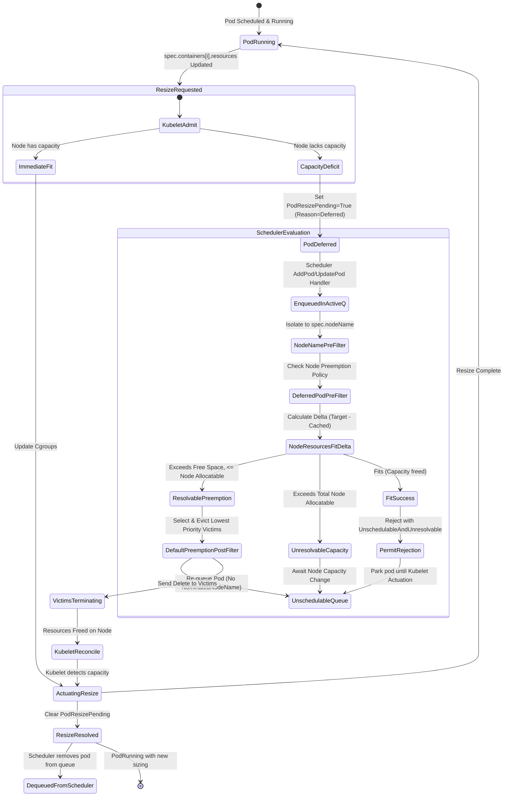

# In-Place Pod Vertical Scaling (IPPVS) Scheduler Preemption: Architectural Analysis & Technical Report

## Executive Summary

In-Place Pod Vertical Scaling (IPPVS / IPPR, KEP-1287) introduced dynamic CPU, memory, and ephemeral resource adjustments for running pods without container restarts. However, early implementations left a critical gap: when a high-priority pod requested an in-place resource expansion on a node lacking immediate allocatable capacity, the request was placed into a **Deferred** state (`PodResizePending=True`, `Reason=Deferred`). Without scheduler integration, deferred resize requests could not trigger preemption of lower-priority workloads running on the same node. Consequently, high-priority workloads remained resource-starved until lower-priority pods voluntarily completed or were terminated by external operators.

To resolve this limitation, **Scheduler Preemption for Pod Resize (KEP-5836 / PR #140000)** introduced end-to-end coordination between `kube-apiserver`, `kube-scheduler`, and `kubelet` under the feature gate `InPlacePodVerticalScalingSchedulerPreemption` (Alpha in Kubernetes v1.37).

This document provides a comprehensive technical investigation of the architecture, lifecycle state transitions, delta-based resource fit calculations, API validation rules, node preemption policies, Kubelet coordination mechanics, observability instrumentation, and failure handling modes.

---

## 1. Architectural Overview & Component Coordination

```
                                    +-----------------------+
                                    |     API Server        |
                                    | (Validation & Spec)   |
                                    +-----------+-----------+
                                                |
                   +----------------------------+----------------------------+
                   | (Pod Resource Patch)                                    | (Watch Events)
                   v                                                         v
        +----------------------+                                  +----------------------+
        |       Kubelet        |                                  |    kube-scheduler    |
        |                      |                                  |                      |
        | 1. Handle resize     |                                  | 1. Event Handlers    |
        | 2. Detect capacity   |                                  |    (Enqueue deferred)|
        |    deficit           |                                  | 2. NodeName PreFilter|
        | 3. Set Deferred      |==== (Pod Status Condition) =====>|    (Target node)     |
        |    condition         |                                  | 3. NodeResourcesFit  |
        | 4. Bypass local      |                                  |    (Delta fit calc)  |
        |    preemption        |                                  | 4. PostFilter        |
        |                      |                                  |    (Preempt victims) |
        | 5. Wait for victim   |                                  | 5. DeferredPodSched  |
        |    termination       |<=== (Victim Eviction Delete) ====|(Permit: park pod)  |
        | 6. Actuate resize    |                                  +----------------------+
        | 7. Clear condition   |
        +----------------------+
```

### Key Components & Responsibilities

| Subsystem / Plugin | Primary File Locations | Core Responsibilities |
| :--- | :--- | :--- |
| **Feature Gate** | `pkg/features/kube_features.go` | Defines `InPlacePodVerticalScalingSchedulerPreemption` (Alpha, v1.37, depends on `InPlacePodVerticalScaling`). |
| **API Server & Node Strategy** | `pkg/apis/core/types.go`<br>`pkg/registry/core/node/strategy.go` | Validates and drops `NodeSpec.PodPreemptionPolicy` when feature gate is disabled. |
| **Kubelet Preemption Handler** | `pkg/kubelet/preemption/preemption.go`<br>`pkg/kubelet/lifecycle/predicate.go` | Bypasses local Kubelet admission preemption during resize operations to defer preemption authority to the scheduler. |
| **Scheduler Event Handlers** | `pkg/scheduler/eventhandlers.go` | Enqueues assigned pods when transitioning to `Deferred` resize; removes them when resolved or deleted. |
| **Priority Queue** | `pkg/scheduler/backend/queue/scheduling_queue.go` | Forces individual queueing for deferred pods, isolating them from gang/workload scheduling groups. |
| **NodeName Plugin** | `pkg/scheduler/framework/plugins/nodename/node_name.go` | Implements `PreFilter` to restrict evaluation exclusively to the assigned node in `spec.nodeName`. |
| **NodeResourcesFit Plugin** | `pkg/scheduler/framework/plugins/noderesources/fit.go` | Applies delta arithmetic (`adjustDeltasToAccomodateCacheDiscrepancy`) to eliminate double-counting of cached allocations. |
| **DeferredPodScheduling Plugin** | `pkg/scheduler/framework/plugins/deferredpodscheduling/` | Enforces node-level preemption disablement policies, registers Queueing Hints, and parks fitting pods at `Permit`. |
| **Scheduler Core / Failure Handler**| `pkg/scheduler/schedule_one.go`<br>`pkg/scheduler/scheduler.go` | Re-queues deferred pods without setting `NominatedNodeName` or altering `PodScheduled` condition. |
| **Kubelet Status & Metrics** | `pkg/kubelet/metrics/metrics.go`<br>`pkg/kubelet/status/status_manager.go` | Tracks pending resize gauges and duration histograms bucketed by pod priority and resolution type. |

---

## 2. End-to-End Lifecycle & State Machine



### Detailed Lifecycle Phases

#### Phase 1: Resize Initiation and Kubelet Deferral
1. A client updates a running pod's `spec.containers[*].resources.requests/limits`.
2. Kubelet's `allocationManager` evaluates whether the new requests fit within node allocatable limits (`Allocatable - (Sum of Other Pod Requests + Pod's Current Allocation)`).
3. If capacity is missing, Kubelet skips local admission preemption (via `36e85e715eb`) and writes condition `PodResizePending: Status=True, Reason=Deferred` into pod status.
4. Kubelet increments the `kubelet_pod_pending_resizes{reason="deferred", priority_bucket="..."}` gauge and initializes the timer for `kubelet_pod_deferred_resize_duration_seconds`.

#### Phase 2: Scheduler Queue Injection & Isolation
1. Scheduler watches pod status updates. When an assigned pod transitions to `IsPodResizeDeferred(pod) == true`, `Scheduler.updatePod` intercepts the event.
2. Under `InPlacePodVerticalScalingSchedulerPreemption`, assigned deferred pods bypass the usual `assignedPod` ignore-rule and are inserted into the scheduling queue (`sched.addPodToSchedulingQueue(pod)`).
3. In `PriorityQueue.isPodGroupMember`, deferred pods are explicitly stripped of gang membership (`return false`). This guarantees they are evaluated individually rather than blocking or being blocked by unrelated group members.

#### Phase 3: Single-Node Filter Isolation & Delta Evaluation
1. **NodeName PreFilter**: The `NodeName` plugin inspects `pod.Spec.NodeName`. Because the pod is already bound to a node, `PreFilter` returns `PreFilterResult{NodeNames: sets.New(pod.Spec.NodeName)}`. All other nodes are excluded from consideration and marked `UnschedulableAndUnresolvable`.
2. **Filtering Skip Rules**: Non-applicable plugins (`DynamicResources`, `InterPodAffinity`, `PodTopologySpread`, `TaintToleration`) identify `IsPodResizeDeferred(pod)` and skip execution, returning `fwk.NewStatus(fwk.Skip)` in `PreFilter` and `nil` in `Filter`.
3. **Node Preemption Policy Check**: The `DeferredPodScheduling` plugin inspects `node.Spec.PodPreemptionPolicy.DisableResizePreemption`. If any disabling controller is listed, `Filter` immediately returns `UnschedulableAndUnresolvable` (`ErrReasonNodeDisablesResizePreemption = "node had resize preemption disabled"`).
4. **NodeResourcesFit Delta Calculation**:
   - The scheduler cache snapshot already includes the running pod. Evaluating target requests without adjustment would double-count the pod's existing footprint.
   - `adjustDeltasToAccomodateCacheDiscrepancy` calculates:
     $$\Delta \text{Resource} = \max(0, \text{podRequest} - \text{cachedPodAllocation})$$
   - If $\Delta \text{Resource} \le (\text{NodeAllocatable} - \text{NodeRequested})$, the delta fits.
   - If $\Delta \text{Resource} > (\text{NodeAllocatable} - \text{NodeRequested})$ but $\text{podRequest} \le \text{NodeAllocatable}$, the failure is marked `Unschedulable` (eligible for preemption).
   - If $\text{podRequest} > \text{NodeAllocatable}$, the failure is marked `UnschedulableAndUnresolvable` (cannot fit even if all other pods are evicted).

#### Phase 4: PostFilter Preemption Execution
1. If the node fails `NodeResourcesFit` with `Unschedulable`, the scheduler invokes `DefaultPreemption.PostFilter`.
2. Because all other nodes were rejected as `UnschedulableAndUnresolvable` by `NodeName.PreFilter`, victim search is strictly isolated to the pod's assigned host node.
3. Lower-priority victim pods on the host node are identified and evicted in order of priority, PDB compliance, and start time.

#### Phase 5: Permit Stage Parking Strategy
1. If preemption is unnecessary (e.g., node capacity became available) or after a dry-run fit evaluation, the pod reaches the `Permit` extension point.
2. `DeferredPodScheduling.Permit` intercepts the pod:
   - Deferred pods must **never** execute `Bind` (they are already bound to the node).
   - `Permit` returns `fwk.NewStatus(fwk.UnschedulableAndUnresolvable, "pod resize fits, waiting for Kubelet actuation")`.
   - This parks the pod in the `Unschedulable` queue without triggering invalid binding calls or mutating `pod.Status.NominatedNodeName`.

#### Phase 6: Failure Handler & State Preservation
1. `Scheduler.handleSchedulingFailure` handles the status returned from `schedulingCycle`.
2. For deferred pods (`isDeferredResize = true`):
   - The pod is added to the unschedulable queue via `AddUnschedulablePodIfNotPresent`.
   - The scheduler skips setting `pod.Status.NominatedNodeName`.
   - The scheduler preserves `PodScheduled=True` condition.
   - The function exits early, preventing race conditions with Kubelet actuation.

#### Phase 7: Kubelet Actuation & Resolution
1. Evicted victim pods terminate and release cgroups and node allocatable capacity.
2. Kubelet's periodic sync loop or allocation worker detects adequate capacity.
3. Kubelet updates container cgroup limits/requests in runtime (`runtimeService.UpdateContainerResources`).
4. Kubelet clears `PodResizePending` condition and updates `AllocatedResources`.
5. Kubelet emits metric `kubelet_pod_deferred_resize_duration_seconds{resolution="accepted", priority_bucket="..."}`.
6. The scheduler's `updatePod` event handler sees `!newDeferred` and deletes the pod from `SchedulingQueue`.

---

## 3. API Changes & Validation Rules

### 3.1 Node API: `NodeSpec.PodPreemptionPolicy`

Introduced in commit `9f663aa01a8`, `NodeSpec` gained an alpha configuration block for node-level preemption controls:

```go
// staging/src/k8s.io/api/core/v1/types.go
type NodeSpec struct {
    ...
    // PodPreemptionPolicy controls the node-level preemption behaviors for pods on this node.
    // This is an alpha field and requires enabling the InPlacePodVerticalScalingSchedulerPreemption feature gate.
    // +featureGate=InPlacePodVerticalScalingSchedulerPreemption
    // +optional
    PodPreemptionPolicy *NodePodPreemptionPolicy `json:"podPreemptionPolicy,omitempty" protobuf:"bytes,8,opt,name=podPreemptionPolicy"`
}

type NodePodPreemptionPolicy struct {
    // DisableResizePreemption lists the owners that have requested to disable scheduler and Kubelet preemption for in-place pod resize on this node.
    // This is an alpha field and requires enabling the InPlacePodVerticalScalingSchedulerPreemption feature gate.
    // +optional
    DisableResizePreemption []string `json:"disableResizePreemption,omitempty" protobuf:"bytes,1,rep,name=disableResizePreemption"`
}
```

### 3.2 APIServer Drop Strategy & Declarative Validation
- **Feature Gate Guarding**: `dropDisabledFields` in `pkg/registry/core/node/strategy.go`:
  ```go
  if !utilfeature.DefaultFeatureGate.Enabled(features.InPlacePodVerticalScalingSchedulerPreemption) && !nodePodPreemptionPolicyInUse(oldNode) {
      node.Spec.PodPreemptionPolicy = nil
  }
  ```
- **Declarative Validation**: `nodeStrategy.DeclarativeValidationConfig` registers the `InPlacePodVerticalScalingSchedulerPreemption` feature flag so OpenAPI schema enforcement respects feature gate enablement.

---

## 4. Kubelet Coordination Points & Preemption Bypass

### 4.1 Separation of Preemption Authorities
Prior to KEP-5836, Kubelet performed local admission preemption via `CriticalPodAdmissionHandler` whenever a cluster-critical pod failed predicate checks. 

For resize requests, allowing Kubelet to perform synchronous local eviction created race conditions and split-brain decisions against the centralized scheduler. In commit `36e85e715eb`, Kubelet's admission preemption was modified:

```go
// pkg/kubelet/preemption/preemption.go
func (c *CriticalPodAdmissionHandler) HandleAdmissionFailure(ctx context.Context, admitPod *v1.Pod, failureReasons []lifecycle.PredicateFailureReason, operation lifecycle.Operation) ([]lifecycle.PredicateFailureReason, error) {
    if !kubetypes.IsCriticalPod(admitPod) {
        return failureReasons, nil
    }
    if utilfeature.DefaultFeatureGate.Enabled(features.InPlacePodVerticalScalingSchedulerPreemption) {
        if operation == lifecycle.ResizeOperation {
            // For in-place pod resizes, the scheduler owns all preemption decisions.
            // When a resize cannot be accommodated immediately on the node, Kubelet defers the
            // resize request and relies on the scheduler to handle preemption asynchronously.
            return failureReasons, nil
        }
    }
    ...
}
```

### 4.2 Synchronization Invariants
1. **Admission Interface**: `AdmissionFailureHandler.HandleAdmissionFailure` accepts `lifecycle.Operation` (`CreateOperation` vs `ResizeOperation`).
2. **Kubelet Status Invariant**: Kubelet retains `PodResizePending: Status=True, Reason=Deferred` until cgroups are updated.
3. **No Local Kill**: Kubelet never initiates victim pod killing for resize operations when `InPlacePodVerticalScalingSchedulerPreemption` is active.

---

## 5. Scheduler Plugin Modifications & Delta Calculations

### 5.1 The Cache Discrepancy & Double-Counting Problem
When an assigned pod is queued for resize preemption, its current resource allocation is already stored in the scheduler's `NodeInfo` cache. If the scheduler evaluated `podRequest` directly:
$$\text{Evaluated Usage} = \text{NodeRequested} + \text{podRequest} = (\text{OtherPods} + \text{CurrentPod}) + \text{TargetPod}$$
This double-counts `CurrentPod` and causes false `Unschedulable` or `Unresolvable` rejections even when the expansion fits within free node headroom.

### 5.2 Delta Fit Calculation (`adjustDeltasToAccomodateCacheDiscrepancy`)
Implemented in `7322e27f406`, `pkg/scheduler/framework/plugins/noderesources/fit.go` resolves this by calculating delta demands:

```go
func adjustDeltasToAccomodateCacheDiscrepancy(opts ResourceRequestsOptions, podRequest *preFilterState, nodeInfo fwk.NodeInfo, pod *v1.Pod) (int64, int64, int64, map[v1.ResourceName]int64) {
    deltaMilliCPU := podRequest.MilliCPU
    deltaMemory := podRequest.Memory
    deltaEphemeralStorage := podRequest.EphemeralStorage
    deltaScalarResources := podRequest.ScalarResources

    if !opts.EnableInPlacePodVerticalScalingSchedulerPreemption || pod == nil || len(pod.Spec.NodeName) == 0 || pod.Spec.NodeName != nodeInfo.Node().Name {
        return deltaMilliCPU, deltaMemory, deltaEphemeralStorage, deltaScalarResources
    }

    var cachedPodInfo fwk.PodInfo
    for _, pInfo := range nodeInfo.GetPods() {
        if pInfo.GetPod().UID == pod.UID {
            cachedPodInfo = pInfo
            break
        }
    }
    if cachedPodInfo == nil {
        return deltaMilliCPU, deltaMemory, deltaEphemeralStorage, deltaScalarResources
    }

    cachedRes := cachedPodInfo.CalculateResource().Resource
    // We take max(0, ...) to prevent negative deltas when podRequest < cachedRes (e.g., during scale-down
    // or asynchronous cache lag). Allowing a negative delta would improperly reduce the node's requested
    // usage before the Kubelet has actually freed the resources.
    deltaMilliCPU = max(0, podRequest.MilliCPU-cachedRes.GetMilliCPU())
    deltaMemory = max(0, podRequest.Memory-cachedRes.GetMemory())
    deltaEphemeralStorage = max(0, podRequest.EphemeralStorage-cachedRes.GetEphemeralStorage())
    
    // Scalar resources handled similarly...
    return deltaMilliCPU, deltaMemory, deltaEphemeralStorage, deltaScalarResources
}
```

### 5.3 Negative Delta Clamping Invariant
If a pod scales down while cached requests are still high, `podRequest - cachedRes` is negative. Clamping to `max(0, ...)` ensures the scheduler does not prematurely grant phantom headroom on the node before Kubelet actuates the scale-down and updates the node cache.

---

## 6. Queueing Hints & Scheduler Event Reactivation

To avoid polling or spinning on unschedulable pods, the scheduler uses fine-grained **Queueing Hints** (`fwk.QueueingHintFn`) to reactivate deferred pods only on relevant cluster events:

```
+-----------------------------------+-----------------------------------+------------------------+
| Cluster Event                     | Extracted ActionType              | Queueing Hint Decision |
+-----------------------------------+-----------------------------------+------------------------+
| Node Preemption Policy Disabled   | fwk.UpdateNodePreemptionPolicy    | QueueSkip              |
| Node Preemption Policy Enabled    | fwk.UpdateNodePreemptionPolicy    | Queue (ActiveQ)        |
| Assigned Node Added (Enabled)     | fwk.Add (Node)                    | Queue (ActiveQ)        |
| Unrelated Node Changed            | *Any* (Other Node)                | QueueSkip              |
| Pod Terminated on Assigned Node   | fwk.Delete (Pod)                  | Queue (ActiveQ)        |
| Pod Scaled Down on Assigned Node  | fwk.UpdatePodScaleDown            | Queue (ActiveQ)        |
| Pod Scaled Down on Other Node     | fwk.UpdatePodScaleDown            | QueueSkip              |
| Non-Resource Label Change on Pod  | fwk.UpdatePodLabel                | QueueSkip              |
+-----------------------------------+-----------------------------------+------------------------+
```

### Registered Event Handlers (`2fa5a2eda68`, `dfa7ef998c5`)
- `DeferredPodScheduling.EventsToRegister`:
  - `{Resource: fwk.Node, ActionType: fwk.UpdateNodePreemptionPolicy}` -> `isSchedulableAfterNodeChange`
  - `{Resource: fwk.Node, ActionType: fwk.Add}` -> `isSchedulableAfterNodeAdd`
- `NodeSchedulingPropertiesChange`:
  - `extractNodePreemptionPolicyChange` detects changes in `Spec.PodPreemptionPolicy` and emits `fwk.UpdateNodePreemptionPolicy`.

---

## 7. Observability & Telemetry Metrics

Introduced in PR #140122 (`34e88daefeb`, `3b5ddbe4c0f`, `ccfdddd2c42`), Kubelet provides Prometheus metrics for monitoring deferred resizes:

### 7.1 Metrics Definitions

| Metric Name | Type | Labels | Description |
| :--- | :--- | :--- | :--- |
| `kubelet_pod_pending_resizes` | Gauge | `reason`, `priority_bucket` | Number of pods currently pending resize. `reason` is `deferred` or `infeasible`. |
| `kubelet_pod_deferred_resize_duration_seconds` | Histogram | `resolution`, `priority_bucket` | Latency (seconds) a pod spends deferred before completion. |

### 7.2 Label Definitions

#### Priority Buckets (`priority_bucket`)
- `system-critical`: Priority $\ge 2,000,000,000$ (`scheduling.SystemCriticalPriority`)
- `high`: $100,000 \le \text{Priority} < 2,000,000,000$
- `medium`: $1 \le \text{Priority} < 100,000$
- `normal`: Priority $== 0$ or unset (default)
- `low`: $-999 \le \text{Priority} \le -1$
- `very-low`: Priority $\le -1000$
- `unknown`: Pod pointer is `nil` during status removal

#### Resolutions (`resolution`)
- `accepted`: Kubelet successfully accommodated and actuated the resize.
- `reverted`: User or controller reverted the resize spec back to original allocation.
- `terminated`: Pod was deleted or entered terminal state (`Failed`/`Succeeded`) while deferred.

#### Histogram Bucketing
Exponential duration boundaries: `[5, 10, 15, 20, 30, 45, 60, 90, 120, 150, 180, 300, 600, 1200, 1800, 3600]` seconds.

---

## 8. Failure Modes & Edge Case Analysis

### 8.1 Extender Timeout & Extender Race Condition Handling
In traditional pod scheduling, if a pod in cache has `.spec.nodeName != ""`, the failure handler (`handleSchedulingFailure`) assumes an extender binding timeout and aborts adding the pod back to the scheduling queue.
For deferred resize pods, `.spec.nodeName` is **always** non-empty. Commit `86d356776e0` modified `handleSchedulingFailure`:
```go
if len(cachedPod.Spec.NodeName) != 0 && !isDeferredResize {
    logger.Info("Pod has been assigned to node. Abort adding it back to queue.", "pod", klog.KObj(pod), "node", cachedPod.Spec.NodeName)
} else {
    sched.SchedulingQueue.AddUnschedulableIfNotPresent(logger, podInfo, sched.SchedulingQueue.SchedulingCycle())
}
```

### 8.2 Prevention of PodGroup Gang Starvation
When `GenericWorkload` or `CompositePodGroup` is active, pods in a gang cannot schedule until the min-member threshold is satisfied.
If a running pod belonging to a gang requested an in-place resize and was deferred, treating it as a gang member would cause the scheduler to expect all gang members to re-schedule together, creating deadlock. Commit `50fdbbb3e54` forces `isPodGroupMember(pod) = false` for deferred pods, evaluating resize feasibility strictly as an independent atomic operation.

### 8.3 Node Preemption Policy Disabling
When a node operates in batch/HPC mode or holds critical non-restartable workloads, administrators or controllers can set `node.spec.podPreemptionPolicy.disableResizePreemption = ["cluster-autoscaler"]`.
- `DeferredPodScheduling` immediately fails filter checks with `UnschedulableAndUnresolvable`.
- The scheduler skips victim search on that node.
- When the disabling entry is cleared, Queueing Hints instantly re-enqueue the deferred pod into `activeQ`.

---

## 9. Test Suite Verification & Coverage Matrix

| Test Suite | Commit / File Path | Scenarios Covered |
| :--- | :--- | :--- |
| **Unit Tests (Scheduler Preemption)** | `929b1aa99f3`<br>`pkg/scheduler/framework/plugins/defaultpreemption/default_preemption_test.go` | - Delta fit calculation mitigating double counting.<br>- Verification that skipped plugins do not block preemption dry-runs.<br>- Victim search isolation to assigned host node (rejection when victims are on remote nodes). |
| **Unit Tests (Fit Delta Calculations)** | `7322e27f406`<br>`pkg/scheduler/framework/plugins/noderesources/fit_test.go` | - Delta fit when pod already exists in node cache.<br>- Double counting failure when feature gate is disabled.<br>- Resolvable vs Unresolvable resize requests against total allocatable. |
| **Unit Tests (Kubelet Bypass & Metrics)** | `36e85e715eb`, `34e88daefeb`, `3b5ddbe4c0f`<br>`pkg/kubelet/preemption/preemption_test.go`<br>`pkg/kubelet/status/status_manager_test.go` | - Critical pod admission preemption bypass on `ResizeOperation`.<br>- Metric emissions across priority buckets (`system-critical` down to `very-low`).<br>- Duration metric calculations on `accepted`, `reverted`, and `terminated`. |
| **Integration Tests** | `c2cbf69d015`<br>`test/integration/scheduler/preemption/deferred_resize_preemption_test.go` | - End-to-end preemption of single and multiple low-priority victims.<br>- Respect of `PreemptNever` preemption policy on preemptor.<br>- Enforcement of `NodePodPreemptionPolicy.DisableResizePreemption`.<br>- Queueing Hint validation on pod scale-down, pod deletion, node capacity expansion, and policy updates.<br>- Handler startup sync and queue cleanup. |
| **End-to-End (E2E) Tests** | `0253ded3f48`<br>`test/e2e/node/pod_resize.go` | - Full serial E2E test verifying deferred resize preemption in a live cluster.<br>- Verifies victim eviction, mid-priority pod preservation, and successful cgroup actuation on preemptor pod. |

---

## 10. Summary and Recommendations

The implementation of `InPlacePodVerticalScalingSchedulerPreemption` completes the design of KEP-1287 by establishing the scheduler as the single authoritative preemption controller for both initial placement and dynamic in-place resource resizing.

### Key Takeaways
1. **Delta Arithmetic**: The `NodeResourcesFit` delta calculation prevents cache double-counting while preserving strict non-negative clamping against stale cache lag.
2. **Strict Node Scoping**: `NodeName.PreFilter` ensures scheduler preemption algorithms never evict pods on remote nodes for an assigned pod's resize.
3. **Parking via Permit**: Rejection at `Permit` with `UnschedulableAndUnresolvable` cleanly halts the scheduling pipeline without invoking binding or dirtying nominated node states.
4. **Clean Decoupling**: Kubelet bypasses local admission preemption, delegating eviction decisions entirely to the scheduler while retaining sole ownership of cgroup actuation and status reporting.
