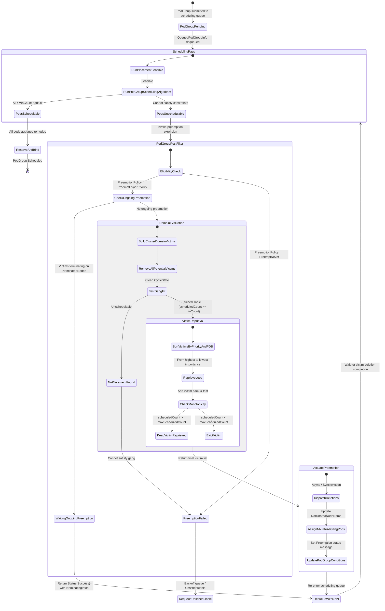

# Workload-Aware Preemption and PodGroup Gang Preemption: Architecture, Issues, and Resolutions

## Executive Summary

As Kubernetes workloads have evolved from independent, stateless microservices to tightly coupled, distributed batch jobs, AI/ML distributed training pipelines, and multi-tier applications, scheduling and preemption requirements have fundamentally transformed. Traditional Kubernetes preemption evaluates preemption on a **per-pod, per-node** basis: when a single high-priority pod cannot fit on any node, the scheduler finds a single node where evicting lower-priority pods allows that specific pod to schedule.

This model breaks down for gang-scheduled workloads and composite pod hierarchies:
1. **All-or-Nothing Gang Semantics (KEP-5710)**: Evicting lower-priority pods for some members of a gang while others remain unschedulable leads to cluster resource starvation, partial gang deadlocks, and wasted preemption disruptions.
2. **Composite Pod Groups & Hierarchical Workloads (KEP-6012)**: Modern multi-job workflows (e.g., driver + worker pools, parameter server architectures) consist of hierarchical `CompositePodGroup` structures requiring unified priority evaluation and disruption boundaries.
3. **Multi-Node Preemption Coordination**: Gang preemption decisions span the entire cluster rather than an isolated node, demanding cluster-wide domain evaluation, simultaneous multi-pod node nomination (`NominatedNodeName`), and atomic victim selection.

Over recent development cycles (Kubernetes v1.31–v1.33+ / 2025–2026), the Kubernetes scheduler preemption engine underwent major architectural overhauls and hardening. This technical report provides an exhaustive analysis of the issues, root causes, state transition models, and architectural resolutions across four core domains:

1. **API & Composite Pod Groups (KEP-6012 & KEP-5710)**
2. **Preemption Flow, Cycle Isolation & Extension Points**
3. **NominatedNodeName (NNN) Coordination & Status Tracking**
4. **Victim Reprieval & Schedulability Monotonicity Guarantees**

---

## 1. Architectural Overview & Component Foundations

### 1.1 Core Abstractions and Data Structures

```
                 +-----------------------------------+
                 |         CompositePodGroup         |
                 | (DisruptionMode, PreemptionPolicy)|
                 +-----------------+-----------------+
                                   |
                  +----------------+----------------+
                  |                                 |
                  v                                 v
        +-------------------+             +-------------------+
        |     PodGroup A    |             |     PodGroup B    |
        |  (Spec.Priority,  |             |  (Spec.Priority,  |
        |   DisruptionMode) |             |   DisruptionMode) |
        +---------+---------+             +---------+---------+
                  |                                 |
            +-----+-----+                     +-----+-----+
            v           v                     v           v
        +-------+   +-------+             +-------+   +-------+
        | Pod 1 |   | Pod 2 |             | Pod 3 |   | Pod 4 |
        +-------+   +-------+             +-------+   +-------+
```

To support both standalone `PodGroup` objects and multi-tier `CompositePodGroup` structures, the scheduling framework introduces unified abstractions:

* **`GenericPodGroup` (`fwk.PodGroupInfo`)**: An interface abstracting single `PodGroup` and `CompositePodGroup` instances. It exposes common metadata (`GetKey()`, `GetPriority()`, `GetPreemptionPolicy()`, `GetDisruptionMode()`, `GetAllUnscheduledPods()`, `GetChildGroups()`).
* **`WorkloadForest`**: An in-memory hierarchical tree maintained by the scheduler cache tracking parent-child relationships between composite groups and child groups.
* **`PodGroupPostFilter`**: The extension point invoked when a gang scheduling cycle fails (`rootStatus.Code() == Unschedulable`). It orchestrates cluster-domain preemption evaluation, victim selection, and node nomination across all gang members.

### 1.2 Feature Gate Consolidation (PR #139520)

Prior to consolidation, the codebase maintained separate feature gates: `GangScheduling` and `WorkloadAwarePreemption`. This split caused fragmented code paths, redundant storage strategy checks, and confusing configuration matrices:

```
[Legacy State]                                    [Unified State]
GangScheduling (Gate) ---------\
                                +---> GenericWorkload (Single Feature Gate)
WorkloadAwarePreemption (Gate) -/
```

* **PR #139520 (`macsko/merge_featuregates`)**: Consolidated `GangScheduling` and `WorkloadAwarePreemption` into a single `GenericWorkload` feature gate.
  - Removed duplicate validation and storage hooks across `pkg/registry/scheduling/podgroup` and `pkg/registry/scheduling/workload`.
  - Streamlined `pkg/scheduler/framework/plugins/defaultpreemption` and `pkg/scheduler/schedule_one_podgroup.go`.
  - Unified default plugin enablement in `pkg/scheduler/apis/config/v1/default_plugins.go`.

---

## 2. API & Composite Pod Groups (KEP-6012 & KEP-5710)

### 2.1 CompositePodGroups in Workload-Aware Preemption (PR #140634)

#### Root Cause & Architectural Challenge
In complex distributed training, jobs comprise heterogeneous components (e.g., a master coordinator pod group and a worker pod group). When preemption occurs, evicting an individual worker might leave the master running uselessly, or evicting an entire composite workload might be required if the child groups cannot make forward progress independently. 

Prior to PR #140634, Workload-Aware Preemption (WAP) only recognized standalone `PodGroup` objects. `CompositePodGroup` resources lacked first-class preemption controls and could not participate in cluster-domain victim evaluation.

#### Key Enhancements & Implementation
1. **API Extensions (`staging/src/k8s.io/api/scheduling/v1alpha3` & `v1beta1`)**:
   - Added `DisruptionMode` to `CompositePodGroupSpec`:
     * `DisruptionModeAll`: When any pod in the composite hierarchy is selected as a victim, all pods across all child pod groups in the hierarchy must be evicted atomically.
     * `DisruptionModePodGroup`: Evictions are scoped to individual child `PodGroup` boundaries.
     * `DisruptionModePod`: Individual pods can be evicted without evicting the entire group.
   - Added `PreemptionPolicy` (`PreemptLowerPriority` vs `PreemptNever`) to `CompositePodGroupSpec` and `CompositePodGroupTemplate`.
2. **Hierarchy Traversal (`traverseHierarchyUp`)**:
   - Implemented ancestor tree traversal starting from the victim pod's `SchedulingGroup`:
     ```go
     func getHighestAllAncestor(pod *v1.Pod, pgLister fwk.PodGroupLister, cpgLister fwk.CompositePodGroupLister) (fwk.EntityKey, bool) {
         startKey := fwk.PodGroupKey(pod.Namespace, *pod.Spec.SchedulingGroup.PodGroupName)
         var highestAllKey fwk.EntityKey
         var hasAll bool
         for gpg := range traverseHierarchyUp(pod.Namespace, startKey, pgLister, cpgLister) {
             if gpg.HasDisruptionModeAll() {
                 highestAllKey = gpg.GetKey()
                 hasAll = true
             }
         }
         return highestAllKey, hasAll
     }
     ```
   - When any ancestor specifies `DisruptionModeAll`, the preemption engine treats the entire composite subtree rooted at `highestAllKey` as a single atomic victim unit (`Victim`).
3. **`UnschedulablePlugins` Handling for CompositePodGroups**:
   - Fixed missing plugin status diagnostics for composite hierarchies during gang scheduling attempts.

---

### 2.2 Hierarchical Priority and Policy Consistency Validation (PR #141930)

#### Root Cause & Failure Mode
If a `CompositePodGroup` specifies priority `1000` with `PreemptionPolicy: PreemptLowerPriority`, but a child `PodGroup` or member pod specifies priority `100` or `PreemptionPolicy: PreemptNever`, the scheduler encounters severe semantic conflicts:
- Preemptor eligibility checks could pass at the root level but fail at the leaf level.
- Victim selection could evaluate a child group as lower priority than the root group's priority, causing self-preemption or inversion of scheduling order.
- Inconsistent scheduler names across child groups could cause split-brain scheduling across multiple scheduler instances.

#### Resolution & Algorithm
**PR #141930 (`macsko/validate_child_pod_groups_for_equal_priority`)** introduced strict recursive hierarchy validation in `pkg/scheduler/schedule_one_podgroup.go`:

```go
func (sched *Scheduler) validatePodGroup(rootInfo *framework.QueuedPodGroupInfo) error {
    rootPriority := rootInfo.GetPriority()
    var rootPreemptionPolicy v1.PreemptionPolicy
    if sched.podGroupPreemptionPolicyEnabled {
        rootPreemptionPolicy = rootInfo.GetPreemptionPolicy()
    }
    // ...
    if err := sched.validatePodGroupHierarchy(rootInfo.PodGroupInfo, validatePodGroup, validatePod); err != nil {
        return err
    }
    return nil
}
```

Validation invariants enforced:
1. **Scheduler Name Uniformity**: Every pod across all child groups must specify the exact same `.spec.schedulerName`.
2. **Priority Uniformity**: Every child `PodGroup`, `CompositePodGroup`, and individual member pod (both unscheduled and already scheduled) must match `rootPriority`.
3. **Preemption Policy Uniformity**: All entities in the hierarchy must share the exact same `PreemptionPolicy` (`PreemptLowerPriority` or `PreemptNever`).

---

### 2.3 Preemption Refactoring to `GenericPodGroup` (PR #141934)

#### Architectural Motivation
Before this refactoring, preemption execution maintained separate wrapper implementations: `podGroupExecutorPreemptor` and `compositePodGroupExecutorPreemptor`, with duplicated victim modeling, type checks, and metric conversions.

#### Changes in PR #141934
- Unified the preemptor representation around `fwk.PodGroupInfo` (`GenericPodGroup`):
  ```go
  type podGroupExecutorPreemptor struct {
      fwk.PodGroupInfo
      pods []*v1.Pod
  }
  ```
- Standardized `Type()` to return `fwk.EntityKeyType` (`PodKeyType`, `PodGroupKeyType`, `CompositePodGroupKeyType`).
- Unified metric observation functions (`observeVictims`) using `metrics.EntityTypeToLabel(preemptor.Type())`.
- Moved `GenericPodGroup` interfaces into staging (`staging/src/k8s.io/kube-scheduler/framework/types.go`) for consumption across in-tree and out-of-tree plugins.

---

## 3. Preemption Flow, Cycle Isolation & Extension Points

### 3.1 Preemption Extensions in `PodGroupPostFilter` (PR #141932)

#### Problem & Design Objective
In complex scheduling setups (such as Dynamic Resource Allocation / DRA, Topology-Aware Scheduling, or storage controllers), external plugins need to hook into the gang preemption lifecycle. For example:
- DRA must deallocate claims associated with victim pod groups before simulating placement.
- Custom placement engines need to influence victim selection or receive notifications prior to eviction actuation.

#### Architecture of `PreemptionManager` and Extension Interfaces

```
+-------------------------------------------------------------------------+
|                              Handle                                     |
|  +-------------------------------------------------------------------+  |
|  |              PreemptionManager() -> PreemptionManager             |  |
|  +-------------------------------------------------------------------+  |
+------------------------------------+------------------------------------+
                                     |
         +---------------------------+---------------------------+
         v                                                       v
+-------------------------------------+   +------------------------------------+
|          GenerateVictims()          |   |             Executor()             |
|  - Queries Snapshot Listers         |   |  - IsPodGroupRunningPreemption()   |
|  - Groups Pods by DisruptionMode    |   |  - IsPodGroupWaitingForVictims()   |
|  - Orders by Priority & PDB Status  |   |  - ActuatePodGroupPreemption()     |
|  - Returns []PreemptionVictim       |   |                                    |
+-------------------------------------+   +------------------------------------+
```

**PR #141932 (`brejman/pg-preemption-extensions`)** introduced formal preemption interfaces in `staging/src/k8s.io/kube-scheduler/framework/interface.go`:

1. **`PreemptionManager`**:
   ```go
   type PreemptionManager interface {
       GenerateVictims(ctx context.Context, pgInfo PodGroupInfo) ([]PreemptionVictim, *Status)
       Executor() PreemptionExecutor
   }
   ```
2. **`PreemptionVictim`**: Encapsulates an atomic eviction unit (single pod, pod group, or composite tree) and tracks PDB violation counts.
3. **`PreemptionExecutor`**: Provides async/sync preemption actuation, tracking of in-flight preemption goroutines, and victim deletion verification.
4. **`defaultPreemptionManager` (`pkg/scheduler/framework/preemption/manager.go`)**:
   - Implements candidate victim discovery (`getWorkloadPreemptionVictims`).
   - Implements `prepareDomainVictims`: Filters victims with `victim.Priority() < preemptorPriority`, sorts them using `MoreImportantVictim`, and partitions them into PDB non-violating and violating lists.

---

### 3.2 Cycle State Pollution and Isolation (PR #140871)

#### The State Pollution Bug
In gang scheduling, when `podGroupSchedulingAlgorithm` fails to find immediate placement, `PodGroupPostFilter` runs. To evaluate whether evicting a set of victims makes the gang schedulable, the preemption evaluator repeatedly invokes `podGroupSchedulingFunc(ctx)` to test candidate cluster states.

**Bug**: `podGroupCycle` was passing the **existing, dirty `podGroupCycleState`** from the failed scheduling attempt into `podGroupSchedulingFunc`:
```go
// BUGGY CODE:
results := sched.runRootSchedulingAlgorithm(ctx, schedFwk, podGroupCycleState, rootPodGroupInfo)
```

#### Impact
During the initial failed attempt, plugins (such as DRA, Topology Manager, NodeResources, and VolumeBinding) write intermediate state, cached node allocations, and rejection flags into `podGroupCycleState`. When `podGroupSchedulingFunc` was executed during victim reprieval simulations:
- Plugins read stale failure state and false negative caches from the earlier attempt.
- The preemption simulator falsely reported that the gang still did not fit, even when sufficient victims had been removed.
- Valid preemption candidates were rejected, leaving high-priority gangs unschedulable.

#### Resolution
**PR #140871 (`Argh4k/fix-podgroupcycle`)** ensured that every preemption simulation pass executes with a completely clean `CycleState`:
```go
// FIXED CODE:
results := sched.runRootSchedulingAlgorithm(ctx, schedFwk, framework.NewCycleState(), rootPodGroupInfo)
```
Each simulated evaluation starts with pristine plugin state, guaranteeing accurate schedulability checks.

---

### 3.3 Snapshot Consistency in Preemptor Eligibility (PR #140745)

#### Stale Cache vs. Frozen Snapshot Inconsistency
When evaluating whether a preemptor pod or pod group is eligible to preempt others (`PodEligibleToPreemptOthers`), the scheduler needs to determine if any lower-priority pods on target nodes are already terminating due to prior preemption.

**Bug**: The eligibility logic was reading pod group information directly from live informers/client caches rather than the frozen `SnapshotSharedLister().PodGroups()`:
```go
// Stale live informer access during preemption cycle
pg, err := ev.podGroupLister.PodGroups(pod.Namespace).Get(pgName)
```

#### Impact
1. **Data Race / Inconsistent Snapshot**: In high-throughput clusters, live informer caches can update mid-cycle while the node snapshot remains frozen.
2. **Ghost Preemption Invocations**: A pod group might be seen as having different priority or disruption mode during eligibility check versus victim removal, causing incorrect preemption decisions.

#### Resolution
**PR #140745 (`tosi3k/wap-snapshot`)** updated `PodEligibleToPreemptOthers` to strictly query the snapshot lister:
```go
podGroupSnapshot := ev.Handle.SnapshotSharedLister().PodGroups()
```
This guarantees point-in-time snapshot isolation across the entire preemption evaluation cycle.

---

### 3.4 Authoritative PodGroup Priority in Workload Preemption (PR #139030)

#### Root Cause: Pod-Level vs. Group-Level Priority Ambiguity
In Kubernetes, pods in a `PodGroup` have `.spec.priority`, while the parent `PodGroup` has `.spec.priority`. When `DisruptionMode` is set to `DisruptionModePod` (or not set), individual pods can be evicted without evicting the entire group.

**Bug**: In `newDomainForWorkloadPreemption`, when a pod belonged to a `PodGroup` with `DisruptionModePod`, the preemption engine fell back to reading `corev1helpers.PodPriority(p.GetPod())` rather than the `PodGroup`'s priority:
```go
// BUGGY CODE:
if !isDisruptionModePodGroup(pg) {
    victimMap[p.GetPod().UID] = newVictim([]fwk.PodInfo{p}, corev1helpers.PodPriority(p.GetPod()), []fwk.NodeInfo{node})
    continue
}
```

#### Impact
If member pods had default priority (e.g., `0`) while their `PodGroup` had high priority (e.g., `1000`), a low-priority preemptor could evict individual pods of a high-priority gang, destroying the high-priority job while it was running.

#### Resolution
**PR #139030 (`mm4tt/authoritative-podgroup-priority`)** established the **Priority Authoritativeness Invariant**:
> If a pod belongs to a `PodGroup`, its priority for all preemption and victim evaluation decisions is **strictly and authoritatively determined by `PodGroup.Spec.Priority`**, regardless of `DisruptionMode`.

```go
// FIXED CODE:
if !isDisruptionModePodGroup(pg) {
    victimMap[p.GetPod().UID] = newVictim([]fwk.PodInfo{p}, util.PodGroupPriority(pg), []fwk.NodeInfo{node})
    continue
}
```

---

### 3.5 Preemptor Eligibility Parity (PR #138710)

#### Inconsistency Between Pod and Gang Preemption
In single-pod preemption (`DefaultPreemption`), a pod is ineligible to preempt if:
1. Its `PreemptionPolicy` is `PreemptNever`.
2. It has already nominated a node and that node has terminating pods that were marked for preemption (`DisruptionTarget` condition with reason `PreemptionByScheduler`).

**PR #138710 (`mm4tt/fix-preemptor-eligibility`)** aligned `PodGroupEvaluator` with `DefaultPreemption`:
- Added `PodTerminatingByPreemption(pod *v1.Pod)` helper checking `v1.DisruptionTarget` with reason `PodReasonPreemptionByScheduler`.
- Validated that if a preemptor pod group's nominated nodes contain terminating pods from a prior preemption pass, the preemptor waits for those terminations rather than triggering redundant preemption rounds against other victims.

---

## 4. NominatedNodeName (NNN) Coordination & Status Tracking

### 4.1 Multi-Pod NNN Assignment Across Gang Members (PR #138967 & PR #139280)

In single-pod preemption, the post-filter returns a single `PostFilterResult` containing the nominated node for that pod. For a gang containing $N$ pods scheduled across multiple nodes:
1. `PodGroupPostFilterResult` returns a map: `map[types.NamespacedName]*fwk.NominatingInfo`.
2. Every unscheduled pod in the gang is assigned its corresponding `NominatedNodeName` in the scheduling queue and API server.
3. This prevents other pending pods in the cluster from stealing the reserved capacity on those nodes while victim pods undergo graceful termination.

---

### 4.2 Resolving NNN vs. SuggestedHost Overrides (PR #140590)

#### Root Cause of the NNN Overwrite Bug
When scheduling a pod group, some pods might find immediate placement on Node A, while other pods require preemption on Node B. During `submitPodGroupAlgorithmResult`:

**Bug**: For pods that were evaluated successfully in the scheduling pass prior to preemption, the scheduler constructed `nominatingInfo` using `podResult.scheduleResult.SuggestedHost`:
```go
// BUGGY CODE:
nominatingInfo := &fwk.NominatingInfo{
    NominatingMode:    fwk.ModeOverride,
    NominatedNodeName: podResult.scheduleResult.SuggestedHost,
}
// Passed to FailureHandler when podGroupResult.waitingOnPreemption == true
```

#### Impact
During the preemption evaluation, the gang preemption solver may have selected a completely different cluster placement to satisfy gang-wide topology constraints. Using `SuggestedHost` from the pre-preemption evaluation assigned pods to incorrect nodes, causing the gang to get stuck or fail on subsequent scheduling attempts.

#### Resolution
**PR #140590 (`Argh4k/nnn-small-fix`)** updated `submitPodGroupAlgorithmResult` to strictly use the `nominatingInfo` produced by the preemption algorithm:
```go
// FIXED CODE:
case podGroupResult.status.IsRejected():
    if podGroupResult.waitingOnPreemption {
        sched.FailureHandler(ctx, schedFwk, pInfo, podGroupResult.status, podResult.scheduleResult.nominatingInfo, podSchedulingStart)
    }
```

---

### 4.3 Ongoing Preemption Detection vs. Premature Rejection (PR #140641)

#### The Early Rejection Bug
When preemption is actuated, victim pods receive a `DeletionTimestamp` and graceful termination begins. On the subsequent scheduling cycle for the preemptor pod group, victims are still terminating.

**Bug**: In `preemptorEligibleToPreemptOthers`, if terminating pods existed on the nominated nodes, the function returned `(false, "not eligible due to a terminating pod on the nominated node.")`. This caused `Preempt()` to return `Status(Unschedulable)`.

#### Impact
Returning `Unschedulable` caused the scheduler to treat the gang preemption attempt as a hard failure:
- The pod group condition was set to `Unschedulable` without preserving preemption progress.
- In some scenarios, `NominatedNodeName` was cleared or pods were requeued with backoff delays, causing starvation and preemption flapping.

#### Resolution
**PR #140641 (`Argh4k/fix-wap-nnn`)** split eligibility from ongoing preemption tracking:
1. Preemptor eligibility checks general policy (`preemptionPolicy != PreemptNever`).
2. `isOngoingPreemption` specifically detects whether lower-priority pods on nominated nodes are terminating:
   ```go
   if ev.isOngoingPreemption(ctx, preemptor, domain.Nodes()) {
       return &fwk.PodGroupPostFilterResult{
           NominatingInfos: buildCurrentNominatingInfos(preemptor),
       }, fwk.NewStatus(fwk.Success, "ongoing preemption on nominated nodes")
   }
   ```
3. Returning `Status(Success)` with existing `NominatingInfos` signals to the scheduler pipeline that preemption is proceeding normally and the gang is awaiting victim termination.

---

### 4.4 Status Propagation to `PodGroupStatus` Conditions (PR #140180 & PR #140311)

#### Lack of Observability in Gang Preemption
Before PR #140180 and #140311, when a pod group triggered preemption, the `PodGroup` resource status condition `PodGroupInitiallyScheduled` remained `ConditionFalse` with generic messages like `"minCount (N) cannot be satisfied"`. Users and automated controllers had no visibility into:
- Whether preemption was attempted.
- Whether a valid placement was found.
- How many victims were marked for eviction.

#### Resolution
1. **PR #140180 (`Argh4k/preemption-message`)**: Added structured preemption messages in `DefaultPreemption` and `PodGroupPreemption`:
   ```go
   fwk.NewStatus(fwk.Success, fmt.Sprintf("found a potential placement for pod on node %v, preempting %d victims", nodeName, count))
   ```
2. **PR #140311 (`Argh4k/podgroup-preemption-status`)**: Propagated preemption status messages into `PodGroupStatus`:
   ```go
   if status.IsSuccess() {
       status = fwk.NewStatus(fwk.Success, fmt.Sprintf("found a placement for podgroup, preempting %d victims", len(res.victims.Pods)))
   }
   ```
   The `PodGroupInitiallyScheduled` condition message now explicitly states:
   `"minCount (1) cannot be satisfied; pod group preemption: found a placement for podgroup, preempting 1 victims"`.

---

## 5. Reprieval & Schedulability Monotonicity Guarantees

### 5.1 The Victim Reprieval Algorithm

The WAP preemption algorithm operates in two phases:
1. **Phase 1 (Tentative Removal)**: Remove all lower-priority pods in the cluster domain until the preemptor gang becomes schedulable.
2. **Phase 2 (Victim Reprieval)**: Iterate over the removed victims in descending order of importance (highest priority and least PDB violations first) and try adding each victim back. If the preemptor gang remains schedulable, that victim is **reprieved** (spared from eviction).

```
[All Potential Lower-Priority Victims in Cluster Domain]
                         |
                         v (Phase 1: Remove all lower-priority victims)
         [Cluster Domain with All Victims Removed]
                         |
                         v (Verify Gang Schedulability: scheduledCount >= minCount)
         [Phase 2: Reprieve victims from highest to lowest priority]
                         |
           +-------------+-------------+
           | For each victim V:        |
           | 1. Temporarily add V back |
           | 2. Run gang simulation    |
           | 3. Check Monotonicity     |
           +-------------+-------------+
                         |
        +----------------+----------------+
        |                                 |
        v (scheduledCount >= maxScheduledCount)   v (scheduledCount < maxScheduledCount)
[Reprieve Success: Keep V in node]       [Reprieve Failed: Re-remove V (Evict)]
```

---

### 5.2 The Monotonicity Bug & Root Cause (PR #138757 & PR #138886)

#### Problem Statement
For gang workloads where `len(pods) > minCount`, or where complex topology/affinity constraints exist, the placement algorithm is greedy. 

Consider a scenario where:
- Gang has `minCount = 3` and `totalPods = 4`.
- Removing all victims allowed `3` pods to schedule (`scheduledCount = 3`).
- When attempting to reprieve victim $V_1$ on Node A, Node A's capacity changes. The placement solver reroutes pod placements, and because of pod affinity / zone spreading, it is now able to schedule **all 4 pods** (`scheduledCount = 4`).
- Next, the algorithm evaluates victim $V_2$. Adding $V_2$ back causes placement to drop back to `3` pods.

**Bug in Prior Logic**: Prior to PR #138757, the reprieval loop only checked if `status.IsSuccess()` (i.e. `scheduledCount >= minCount`):
```go
// BUGGY LOGIC:
status := podGroupSchedulingFunc(ctx)
fits := status.IsSuccess() // True as long as scheduledCount >= minCount!
if !fits {
    removePods(v) // Victim evicted
}
```
Under this buggy logic:
- When $V_2$ was reprieved, `scheduledCount` dropped from `4` to `3`. Because `3 >= minCount`, `fits` evaluated to `true`, and $V_2$ was reprieved!
- The gang ended up scheduled with only `3` pods instead of `4`, needlessly degrading the gang's scheduling yield!

#### Resolution: Monotonic `maxScheduledCount` Tracking
**PR #138757 (`jdzikowski/mincount-preemption`)** and **PR #138886 (`jdzikowski/mincount-preemption2`)** enforced the **Schedulability Monotonicity Invariant**:

```go
// Schedulability Monotonicity Implementation (pkg/scheduler/framework/preemption/podgrouppreemption.go)
assignments, status := podGroupSchedulingFunc(ctx)
if !status.IsSuccess() {
    return nil, status
}
maxScheduledCount := len(assignments.ProposedAssignments)

for _, v := range potentialVictims {
    if err := addPods(v); err != nil {
        return false, err
    }

    assignments, status := podGroupSchedulingFunc(ctx)
    fits := status.IsSuccess()
    scheduledCount := 0
    if assignments != nil {
        scheduledCount = len(assignments.ProposedAssignments)
    }

    // Monotonicity update: Track the highest observed scheduled count
    maxScheduledCount = max(maxScheduledCount, scheduledCount)

    // Reject reprieval if adding this victim reduces the number of schedulable gang pods
    if scheduledCount < maxScheduledCount {
        fits = false
    }

    if !fits {
        if err := removePods(v); err != nil {
            return false, err
        }
    }
}
```

#### Why Monotonicity is Essential
1. **Maximizes Gang Yield**: Ensures that if any intermediate victim removal enabled more gang pods to schedule ($> \text{minCount}$), subsequent victim reprievals cannot shrink the gang size.
2. **Deterministic Victim Selection**: Eliminates non-deterministic victim selection where arbitrary victim ordering could degrade gang placement quality.

---

## 6. Comprehensive State Transition Model & Invariants

### 6.1 Gang Preemption State Transition Diagram



---

### 6.2 Preemption Subsystem Invariants Summary

| Invariant | Description | Governing PR / File |
| :--- | :--- | :--- |
| **Hierarchical Priority Uniformity** | All child `PodGroup`s, `CompositePodGroup`s, and member pods must share identical `.spec.priority`. | PR #141930 (`schedule_one_podgroup.go`) |
| **Hierarchical Policy Uniformity** | All entities across a composite hierarchy must share the exact same `PreemptionPolicy`. | PR #141930 (`schedule_one_podgroup.go`) |
| **Authoritative Priority** | When evaluating victim pods belonging to any `PodGroup`, the `PodGroup` priority is strictly authoritative. | PR #139030 (`types.go`) |
| **Cycle State Cleanliness** | Every simulated scheduling pass during preemption reprieval must use a fresh `framework.NewCycleState()`. | PR #140871 (`schedule_one_podgroup.go`) |
| **Snapshot Isolation** | Preemption eligibility and victim generation must strictly read from the frozen `SnapshotSharedLister`. | PR #140745 (`default_preemption.go`) |
| **Schedulability Monotonicity** | Victim reprieval cannot reduce `scheduledCount` below the highest observed `maxScheduledCount`. | PR #138757 & PR #138886 (`podgrouppreemption.go`) |
| **Multi-Pod NNN Preservation** | All gang members receive their corresponding `NominatedNodeName` via `PodGroupPostFilterResult`. | PR #138967, PR #139280, PR #140590 |
| **Ongoing Preemption Liveness** | Ongoing victim termination on nominated nodes returns `Success` with current `NominatingInfos`. | PR #140641 (`podgrouppreemption.go`) |
| **Observability Transparency** | Preemption candidate findings and victim counts must be surfaced in `PodGroupStatus.Conditions`. | PR #140180 & PR #140311 (`podgrouppreemption.go`) |

---

## 7. Metrics, Observability & Diagnostic Reference

### 7.1 Prometheus Metrics

| Metric Name | Type | Labels | Purpose |
| :--- | :--- | :--- | :--- |
| `scheduler_workload_preemption_victims` | Histogram | None | Number of victims selected during a workload/gang preemption cycle. |
| `scheduler_preemption_workload_disruptions` | Histogram | `preemptor_type` (`PodGroup`, `CompositePodGroup`) | Number of distinct pod groups disrupted by preemption. |
| `scheduler_preemption_pdb_violations` | Counter | `preemptor_type` (`PodGroup`, `CompositePodGroup`) | Number of PodDisruptionBudget violations incurred during preemption. |
| `scheduler_preemption_evaluation_duration_seconds` | Histogram | `preemptor_type`, `status` | Latency breakdown of the preemption evaluation algorithm. |
| `scheduler_preemption_execution_duration_seconds` | Histogram | `preemptor_type`, `result` | Latency breakdown of victim eviction actuation. |

### 7.2 Inspecting PodGroup Preemption Conditions

When diagnosing gang scheduling delays, inspect the `PodGroupInitiallyScheduled` condition in the `PodGroup` status:

```yaml
status:
  conditions:
  - type: PodGroupInitiallyScheduled
    status: "False"
    reason: Unschedulable
    message: "minCount (4) cannot be satisfied; pod group preemption: found a placement for podgroup, preempting 2 victims"
    lastTransitionTime: "2026-09-29T19:40:00Z"
```

---

## 8. Conclusion and Future Directions

The integration of Workload-Aware Preemption (WAP) and CompositePodGroup gang scheduling establishes Kubernetes as a first-class orchestrator for complex, multi-tiered batch and AI/ML workloads. By resolving edge cases surrounding cycle state pollution, snapshot consistency, hierarchical validation, NNN coordination, and victim reprieval monotonicity, the preemption subsystem guarantees high scheduling throughput, minimal workload disruption, and deterministic cluster state transitions.
