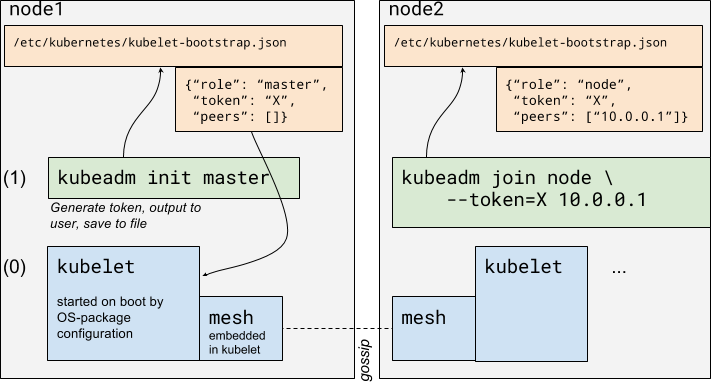

# Draft Proposal: Cluster Bootstrap with Gossip

Luke Marsden, Ilya Dmitrichenko @ Weaveworks

4th August 2016

*This is a sub-proposal of [Proposal: Dramatically Simplify Kubernetes Cluster Creation](https://github.com/kubernetes/kubernetes/pull/30360)*. Where "Phase I" and "Phase II" are referred to below, they refer to the phases defined in the parent proposal.

## Motivation

As part of the dramatically simplified cluster creation UX described in the above linked proposal, it is desirable to have a mechanism for discovery which enables the desired UX without depending on an external network service, such as a discovery service, so that we don’t have to operate one, and users don’t have to leave their firewall to provision a cluster.

The proposed implementation strategy for this is to have the kubelets initiate a secure gossip network to discover API server URLs and create and distribute a root CA certificate, which can feed into the TLS bootstrapping mechanism.

## Goals

Quickly establish feasibility of complete Kubernetes cluster bootstrap by embedding [a simple gossip protocol library](https://github.com/weaveworks/mesh) in the kubelet, plus a new kubeadm command.

The gossip network would be extremely low-traffic, and would only be used for simplified bootstrapping when adding new nodes or (in future) reconfiguring the set of masters.

Servers joining in "master" roles should stay connected to the gossip network, however “node” role machines might eventually not need to – for performance/scalability reasons (although they may do in Phase I for simplicity). It’s only necessary that new nodes can find the masters.

## Assumptions

* User has installed kubelet + kubeadm from an OS package, which started the kubelet in e.g. systemd with default (or no) arguments

## Design



### kubeadm binary (green)

There exists a separate kubeadm binary, which is the binary that the user interacts with. It implements the UX [described in the parent proposal](https://github.com/kubernetes/kubernetes/pull/30360).

### kubelet state machine


When the kubelet starts up, it first looks for its component config and TLS certificates in a well-known location on disk (NB: we need to configure the OS packages to do this). If it finds these, it assumes that it belongs to an already-bootstrapped cluster, and goes into **running** state.

If it doesn’t find its TLS certificates but knows an API server URL and cacert, it goes into **bootstrapping** mode (aka "tls-bootstrapping" mode), in which it attempts to do TLS bootstrap so that it can securely communicate with an API server.

If it doesn’t know an API server URL and cacert, it looks for a *bootstrap config* file (/etc/kubernetes/kubelet-bootstrap.json). If it finds one, it goes into **gossip** state.

If it finds neither file, it goes into **pending** mode, where it waits for instructions from the kubeadm command.

### Pending mode

So, when the user (or the config management system of their choice) installs the OS packages, kubelet first starts and before any user has typed any kubeadm commands, it is in **pending** mode.

The user then types kubeadm init master on the first server, the kubeadm binary writes a JSON representation of its arguments to /etc/kubernetes/kubelet-bootstrap.json.

### Generic kubeadm functionality

In the kubeadm command, in general:

1. If --discovery flag is "gossip", which is the default:

    1. If --token has been provided, remember it.

    2. If --token has not been provided, generate a random string and print it to the user.

    3. Write the following to /etc/kubernetes/kubelet-bootstrap.json:

```
{
    "apiVersion": "v1alpha1",
    "kind": "Discovery",
    "role": "<role>",
    "discovery": {
        "type": "Gossip",
        "token": "<token>",
        "peers": []
    }
}
```

2. If --discovery flag is "out-of-band", require --apiserver-urls and --cacert arguments to also be passed.

    4. In this case, disable the gossip server, and go straight into **bootstrapping** mode.

    5. Write the following to /etc/kubernetes/kubelet-bootstrap.json:

```
{
    "apiVersion": "v1alpha1",
    "kind": "Discovery",
    "role": "<role>",
    "discovery": {
        "type": "OutOfBand",
        "apiserverURLs": ["https://foo/"],
        "cacertFile": "/path/to/cacert.pem"
    }
}
```

In future, there could be other --discovery implementations, such as DNS- or discovery service-based.

The Golang Discovery interface should be:

```
type Discovery interface {
    Start()
    Discover() (apiServerUrls []string, cacert x509.Certificate, err error)
}
```

Start should be called every time the kubelet starts up, and it should return immediately, in case the discovery mechanism needs to run a persistent service (like a gossip socket).

### Kubelet awakens

The kubelet waits in **pending** mode for the bootstrap file to show up. When it does, it unmarshals the Discovery object from JSON depending on the "kind" field, and calls `Start()` and then `Discover()` on it.

When it does, it's the Discovery implementation's job to move into **bootstrapping**.

#### Masters

Initializing a new master shouldn't require TLS bootstrap, because the master already has privileged access to the API server. New masters have to add their own address into the API server URL list in the mesh case.

#### Nodes

For the out-of-band implementation it should be pretty obvious how to satisfy that interface with an implementation. The gossip implementation is slightly more clever...

### Gossip implementation

As soon as has Discover called on it, it attempts to form a secure mesh network using the token and the peers, using [a simple gossip protocol library](https://github.com/weaveworks/mesh). For more information on the library, see [this talk](http://infoq.com/presentations/weave-mesh) by the authors.

When that happens, kubelet uses [CRDTs](https://github.com/weaveworks/kubelet-mesh/blob/master/state.go) to support gossiping CA certs and lists of URLs of API servers. As soon as a kubelet learns of both of these pieces of information, it returns from the Discover method, and kubelet proceeds to attempt to perform TLS bootstrap against the API server running on the master.

The Discover() method should spin off a goroutine which continues to listen on the mesh network – at least in the case of the master(s) – so that nodes have something to connect to the gossip network on.

### Static pods

If "role" is "master", kubelet runs some static pods to get things started:

* etcd
* api server
* controller manager
* scheduler

Multi-master is out of scope for Phase I, so this only has to work on a single master for now.

### Integration with TLS bootstrap

[TLS bootstrap](https://github.com/kubernetes/features/issues/43) is required in this scheme. (Fortunately, most of it has landed already).

The *output* of the discovery process is a set of URLs for API server(s) and a CA cert, and the cluster’s shared secret (which can be reused from the one that the user distributed out-of-band).

In TLS bootstrap, the shared secret is used as the bearer token for the initial API request. Kubelet makes an API request to post a CSR to the API server. It’s able to trust that the API server is the API server because it has the CA cert which was passed down through discovery. And it knows where it is because discovery passes it a URL (the IP address of the master, to begin with, or perhaps optionally a DNS name which the user can provide).

### Implementing kubeadm user

kubeadm user can do the same CSR dance that the kubelet does as part of its TLS bootstrap: it has all the same required inputs.
