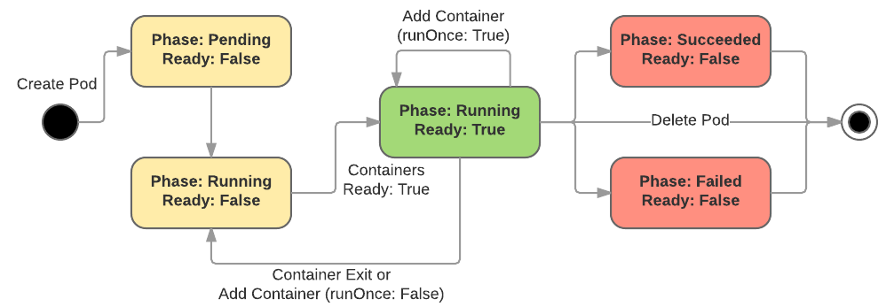

<!-- BEGIN MUNGE: UNVERSIONED_WARNING -->

<!-- BEGIN STRIP_FOR_RELEASE -->


<h2>PLEASE NOTE: This document applies to the HEAD of the source tree</h2>

If you are using a released version of Kubernetes, you should
refer to the docs that go with that version.

Documentation for other releases can be found at
[releases.k8s.io](http://releases.k8s.io).
</strong>
--

<!-- END STRIP_FOR_RELEASE -->

<!-- END MUNGE: UNVERSIONED_WARNING -->

# Troubleshooting Running Pods

This proposal seeks to create a mechanism to execute a shell or other
troubleshooting tools inside a running Kubernetes pod, without requiring that
the associated container images include such tools.

## Motivation

Many developers of native Kubernetes applications wish to treat Kubernetes as an
execution platform for custom binaries produced by a build system. These users
can forgo the scripted OS install of traditional Dockerfiles and instead `COPY`
the output of their build system into a container image built `FROM scratch`.
This confers several advantages:

1.  **Minimal images** lower operational burden and reduce attack vectors.
1.  **Immutable images** improve correctness and reliability.
1.  **Smaller image size** reduces resource usage and speeds deployments.

The disadvantage of using containers built `FROM scratch` is the lack of system
binaries provided a base Operation System image makes it difficult to
troubleshoot running containers. Kubernetes should enable troubleshooting pods
regardless of the contents of the container image.

## Goals and Non-Goals

Goals include:

*   Enable troubleshooting of minimal container images
*   Allow troubleshooting of containers in `CrashLoopBackoff`
*   Improve supportability of native Kubernetes applications
*   Enable novel uses of `exec` by providing a pod-level abstraction
*   Discuss what modifications to a pod spec would be required for minimal
    container troubleshooting

Non-Goals of this proposal are:

*   Fully design the ability to add a container to a pod spec of a running pod.
    This is complex and should be covered in a separate doc if it's the agreed
    upon solution.

## Requirements

A solution to troubleshoot minimal container images MUST:

*   troubleshoot arbitrary running containers with minimal prior configuration
*   allow access to all namespaces shared by containers in a pod and the mount
    namespaces of individual containers
*   fetch troubleshooting utilities at debug time rather than at the time of pod
    initialization
*   respect admission restrictions
*   allow introspection of pod state (no hidden containers)
*   support arbitrary runtimes via the CRI (possibly with reduced feature set)

A good solution SHOULD:

*   have an excellent user experience (i.e. should be a feature of the platform
    rather than a config-time solution)
*   require no direct access to the node
*   have no inherent side effects to the running container image
*   re-use existing container image distribution channels
*   enable detection of pods that have been modified by an exec ("tainted" pods)

## Implementation

To troubleshoot a single container, one executes a process inside the container
namespaces using `kubectl exec`. Since a pod is a collection of containers, it
follows that to debug a pod we could execute a container inside the pod
namespaces. This could be a logical extension of `kubectl exec` by adding a new
flag to specify the name of the container image to run inside the pod namespace.

The user would specify a debug image of her choice (e.g. `kubectl exec -it -m
gcr.io/myproj/debugimage podname`) and be connected to a process running inside
the pod. The processes of all other containers would be visible through the
shared PID namespace. Network connections are visible through the shared net
namespace. File systems are available via volume bind mounts, potentially
read-only.

### Prerequisites

We'll have to complete several independent prerequisites to realize this
functionality, including a few long standing feature requests. These would be
fully described in separate proposals.

#### Shared PID Namespace

Tracked in [#1615](https://issues.k8s.io/1615), a shared PID namespace became
available in Docker 1.12 and requires plumbing through the docker drivers,
extending the infra container to reap orphaned zombies, and [rolling
out](https://pr.k8s.io/37404).

#### Adding a Container to a Pod Spec

Tracked in [#37838](https://issues.k8s.io/37838), Kubernetes disallows almost
all modification to a pod spec as a conservative default and because arbitrary
changes could have complex repercussions on resource accounting and quality of
service. The most straightforward way to add a container to a running pod is to
modify the pod spec.

We will enable a container to be added to the list of containers in a pod spec
so long as the new container does not specify resource requirements. Removing a
container is not allowed.

A prohibition on changing resources simplifies scheduling, but it means a pod's
QoS class could drop from *Guaranteed* to *Burstable*. This is an acceptable
consequence of modifying a running pod. It means a pod could potentially be
evicted during debugging, particularly if there are insufficient resources to
allow for the troubleshooting process.

Admission controllers will watch for this operation in order to approve the
images from the modified pod spec. Containers can be added regardless of pod
status to allow for troubleshooting containers in states like
`CrashLoopBackoff`.

##### Alternative: Create a New Container Type

Rather than modifying the default list of containers, we could create an
additional list of containers in the spec similar to `InitContainers`. This
would reduce the complexity of modifying the default containers list, but we
should avoid a proliferation of container types unless there's a compelling
reason. A mutable container list is a better long-term goal even if it is more
difficult.

#### Container Volumes

Covered by [#831](https://issues.k8s.io/831), we'll want to be able to make
volumes and eventually root filesystems of the other containers in the pod
available to the troubleshooting container. This is a complex issue and covered
in a separate proposal.

When `kubectl` generates a patch to add a container to the pod spec, it will
include configuration to do the equivalent of a "volumes from" the other
containers in the pod, depending on how [#831](https://issues.k8s.io/831) is
implemented.

#### Container runOnce

In order to support short-lived processes (e.g. troubleshooting sessions,
automation) from the general pod spec container list we need to be able to
override the pod's `restartPolicy` for the newly added container so it is not
restarted when it exits. When a "run once" container exits, it will transition
to the Terminated state, not be restarted, and continue to assert the `Ready`
condition.



The container will continue to be part of the pod spec, allowing automation to
inspect the pod, but its resources could be freed by the container runtime. The
container could be started again manually by performing an update on the pod
that re-adds the container.

### `kubectl exec` a Container

Once these other features have been implemented, we will add an additional
option to `kubectl exec` which will cause it to patch a running pod, wait for
the new container to start and attach to its console. This means it will be able
to reattach to the troubleshooting session using a standard `kubectl attach`.

```
% kubectl exec -it -m gcr.io/proj/debug nginx bash
Reattach to this session using: kubectl attach -it -c debug nginx
If you don't see a command prompt, try pressing enter.
root@nginx:/#
```

#### Alternative: Create New `debug` Command

Rather than extending `kubectl exec` we could create `kubectl debug` to handle
this use case (and others?). This would be similar to things like `oc debug` and
could fit into longer term troubleshooting strategy, but it's not technically
necessary. A new command might be less confusing for someone expecting `kubectl
exec` to mirror `docker exec` exactly.

## User Stories

### Debugging

Samantha has a service that consists of a statically compiled Go binary running
in a minimal container that is suddenly having trouble connecting to an internal
service. Her troubleshooting session might resemble:

```
% kubectl get pods
NAME          READY     STATUS    RESTARTS   AGE
neato-5thn0   1/1       Running   0          1d
% kubectl exec -it -m gcr.io/neato/debug-image neato-5thn0 bash
root@debug-image-neato-5thn0:/# cat /etc/resolv.conf
search default.svc.cluster.local svc.cluster.local cluster.local
nameserver 10.155.240.10
options ndots:5
root@debug-image-neato-5thn0:/# dig @10.155.240.10 neato.svc.cluster.local.

; <<>> DiG 9.9.5-9+deb8u6-Debian <<>> @10.155.240.10 neato.svc.cluster.local.
; (1 server found)
;; global options: +cmd
;; connection timed out; no servers could be reached
```

This leads Samantha to discover that the cluster's DNS service isn't responding.

### Automation

Abe is a security engineer tasked with running security audits across all of his
company's running containers. Even though his company has no standard base
image, he's able to audit all containers using:

```
% for pod in $(kubectl get -o name pod); do
    kubectl exec -m gcr.io/neato/security-audit $pod /security-audit.sh
  done
```

## Alternatives Considered

### Ephemeral container

An earlier version of this proposal suggested running an ephemeral container in
the pod namespaces. The container would not be added to the pod spec and would
exist only as long as the process it ran. This has the advantage of behaving
similarly to the current kubectl exec, but it is opaque and likely violates
design assumptions. We could add constructs to track and report on both
traditional exec process and exec containers, but this would probably be more
work than adding to the pod spec. Both are generally useful, and neither
precludes the other in the future, so we chose mutating the pod spec for
expedience.

### Attaching Container Type Volume

Combining container volumes ([#831](https://issues.k8s.io/831)) with the ability
to add volumes to the pod spec would get us most of the way there. One could
mount a volume of debug utilities at debug time. Docker does not allow adding a
volume to a running container, however, so this would require a container
restart. A restart doesn't meet our requirements for troubleshooting.

### Inactive container

If Kubernetes supported the concept of an "inactive" container, we could
configure it as part of a pod and activate it at debug time. In order to avoid
coupling the debug tool versions with those of the running containers, we would
need to ensure the debug image was pulled at debug time. The container could
then be run with a TTY and attached using kubectl. We would need to figure out a
solution that allows access the filesystem of other containers.

The downside of this approach is that it requires prior configuration. In
addition to requiring prior consideration, it would increase boilerplate config.
A requirement for prior configuration makes it feel like a workaround rather
than a feature of the platform.

### Implicit Empty Volume

Kubernetes could implicitly create an EmptyDir volume for every pod which would
then be available as target for either the kubelet or a sidecar to extract a
package of binaries.

Users would have to be responsible for hosting a package build and distribution
infrastructure or rely on a public one. The complexity of this solution makes it
undesirable.

### Standalone Pod in Shared Namespace

Kubernetes could support starting a standalone pod that shares the namespace of
an existing pod.

This would be a small change to Kubernetes, but it would create edge cases in
the pod lifecycle that would have to be considered. For example, what happens to
the debugging pod when the target pod is destroyed?

### Exec from Node

The kubelet could support executing a troubleshooting binary from the node in
the namespaces of the container. Once executed this binary would lose access to
other binaries from the node, making it of limited utility and a confusing user
experience.

This couples the debug tools with the lifecycle of the node, which is worse than
coupling it with container images.

## References

*   [Pod Troubleshooting Tracking Issue](https://issues.k8s.io/27140)
*   [CRI Tracking Issue](https://issues.k8s.io/28789)
*   [CRI: expose optional runtime features](https://issues.k8s.io/32803)
*   [Resource QoS in
    Kubernetes](https://github.com/kubernetes/kubernetes/blob/master/docs/design/resource-qos.md)


<!-- BEGIN MUNGE: GENERATED_ANALYTICS -->
[]()
<!-- END MUNGE: GENERATED_ANALYTICS -->
