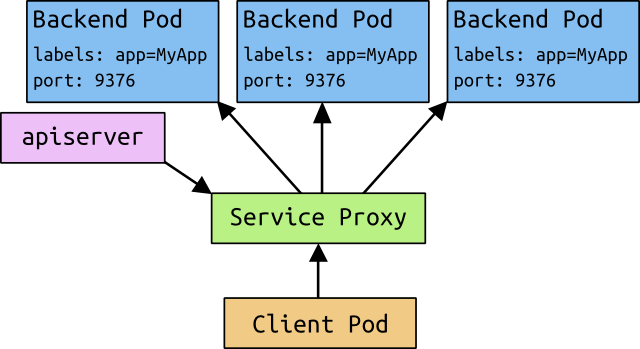
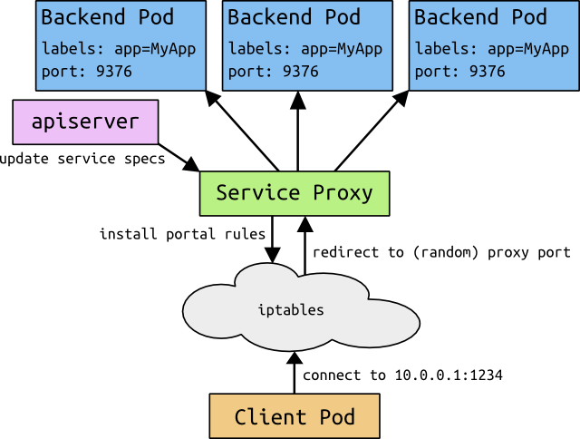

# Services in Kubernetes

## Overview

Kubernetes [`Pods`](pods.md) are mortal. They are born and they die, and they
are not resurrected.  [`ReplicationControllers`](replication-controller.md) in
particular create and destroy `Pods` dynamically (e.g. when scaling up or down
or when doing rolling updates).  While each `Pod` gets its own IP address, even
those IP addresses can not be relied upon to be stable over time. This leads to
a problem: if some set of `Pods` (let's call them backends) provides
functionality to other `Pods` (let's call them frontends) inside the Kubernetes
cluster, how do those frontends find out and keep track of which backends are
in that set?

Enter `Services`.

A Kubernetes `Service` is an abstraction which defines a logical set of `Pods`
and a policy by which to access them - sometimes called a micro-service.  The
set of `Pods` targeted by a `Service` is determined by a [`Label
Selector`](labels.md).

As an example, consider an image-processing backend which is running with 3
replicas.  Those replicas are fungible - frontends do not care which backend
they use.  While the actual `Pods` that compose the backend set may change, the
frontend clients should not need to manage that themselves.  The `Service`
abstraction enables this decoupling.

For Kubernetes-native applications, Kubernetes offers a simple `Endpoints` API
that is updated whenever the set of `Pods` in a `Service` changes.  For
non-native applications, Kubernetes offers a virtual-IP-based bridge to Services
which redirects to the backend `Pods`.

## Defining a Service

A `Service` in Kubernetes is a REST object, similar to a `Pod`.  Like all of the
REST objects, a `Service` definition can be POSTed to the apiserver to create a
new instance.  For example, suppose you have a set of `Pods` that each expose
port 9376 and carry a label "app=MyApp".


```json
{
    "kind": "Service",
    "apiVersion": "v1beta3",
    "metadata": {
        "name": "my-service"
    },
    "selector": {
        "app": "MyApp"
    },
    "spec": {
        "ports": [
            {
                "protocol": "TCP",
                "port": 80,
                "targetPort": 9376
            }
        ]
    }
}
```

This specification will create a new `Service` object named "my-service" which
targets TCP port 9376 on any `Pod` with the "app=MyApp" label.  Every `Service`
is also assigned a virtual IP address (called the "portal IP"), which is used by
the service proxies (see below).  The `Service`'s selector will be evaluated
continuously and the results will be posted in an `Endpoints` object also named
"my-service".

### Services without selectors

Services, in addition to providing abstractions to access `Pods`, can also
abstract any kind of backend.  For example:
  - you want to have an external database cluster in production, but in test
    you use your own databases.
  - you want to point your service to a service in another
    [`Namespace`](namespaces.md) or on another cluster.
  - you are migrating your workload to Kubernetes and some of your backends run
    outside of Kubernetes.

In any of these scenarios you can define a service without a selector:

```json
{
    "kind": "Service",
    "apiVersion": "v1beta3",
    "metadata": {
        "name": "my-service"
    },
    "spec": {
        "ports": [
            {
                "protocol": "TCP",
                "port": 80,
                "targetPort": 9376
            }
        ]
    }
}
```

Then you can manually map the service to a specific endpoint(s):

```json
{
    "kind": "Endpoints",
    "apiVersion": "v1beta3",
    "metadata": {
        "name": "my-service"
    },
    "subsets": [
        {
            "addresses": [
                { "IP": "1.2.3.4" }
            ],
            "ports": [
                { "port": 80 }
            ]
        }
    ]
}
```

Accessing a `Service` without a selector works the same as if it had selector.
The traffic will be routed to endpoints defined by the user (`1.2.3.4:80` in
this example).

## Portals and service proxies

Every node in a Kubernetes cluster runs a `kube-proxy`.  This application
watches the Kubernetes master for the addition and removal of `Service`
and `Endpoints` objects. For each `Service` it opens a port (random) on the
local node.  Any connections made to that port will be proxied to one of the
corresponding backend `Pods`.  Which backend to use is decided based on the
AffinityPolicy of the `Service`.  Lastly, it installs iptables rules which
capture traffic to the `Service`'s `Port` on the `Service`'s portal IP (which
is entirely virtual) and redirects that traffic to the previously described
port.

The net result is that any traffic bound for the `Service` is proxied to an
appropriate backend without the clients knowing anything about Kubernetes or
`Services` or `Pods`.



By default, the choice of backend is random.  Client-IP-based session affinity
can be selected by setting `service.spec.sessionAffinity` to  `"ClientIP"`.

As of Kubernetes 1.0, `Service`s are a "layer 3" (TCP/UDP over IP) construct.  We do not
yet have a concept of "layer 7" (HTTP) services.

### Why not use round-robin DNS?

A question that pops up every now and then is why we do all this stuff with
portals rather than just use standard round-robin DNS.  There are a few reasons:

   * There is a long history of DNS libraries not respecting DNS TTLs and
     caching the results of name lookups.
   * Many apps do DNS lookups once and cache the results.
   * Even if apps and libraries did proper re-resolution, the load of every
     client re-resolving DNS over and over would be difficult to manage.

We try to discourage users from doing things that hurt themselves.  That said,
if enough people ask for this, we may implement it as an alternative to portals.

## Discovering services

Kubernetes supports 2 primary modes of finding a `Service` - environment
variables and DNS.

### Environment variables

When a `Pod` is run on a `Node`, the kubelet adds a set of environment variables
for each active `Service`.  It supports both [Docker links
compatible](https://docs.docker.com/userguide/dockerlinks/) variables (see
[makeLinkVariables](https://github.com/GoogleCloudPlatform/kubernetes/blob/master/pkg/kubelet/envvars/envvars.go#L49))
and simpler `{SVCNAME}_SERVICE_HOST` and `{SVCNAME}_SERVICE_PORT` variables,
where the Service name is upper-cased and dashes are converted to underscores.

For example, the Service "redis-master" which exposes TCP port 6379 and has been
allocated portal IP address 10.0.0.11 produces the following environment
variables:

```
REDIS_MASTER_SERVICE_HOST=10.0.0.11
REDIS_MASTER_SERVICE_PORT=6379
REDIS_MASTER_PORT=tcp://10.0.0.11:6379
REDIS_MASTER_PORT_6379_TCP=tcp://10.0.0.11:6379
REDIS_MASTER_PORT_6379_TCP_PROTO=tcp
REDIS_MASTER_PORT_6379_TCP_PORT=6379
REDIS_MASTER_PORT_6379_TCP_ADDR=10.0.0.11
```

*This does imply an ordering requirement* - any `Service` that a `Pod` wants to
access must be created before the `Pod` itself, or else the environment
variables will not be populated.  DNS does not have this restriction.

### DNS

An optional (though strongly recommended) cluster add-on is a DNS server.  The
DNS server watches the Kubernetes API for new `Services` and creates a set of
DNS records for each.  If DNS has been enabled throughout the cluster then all
`Pods` should be able to do name resolution of `Services` automatically.

For example, if you have a `Service` called "my-service" in Kubernetes
`Namespace` "my-ns" a DNS record for "my-service.my-ns" is created.  `Pods`
which exist in the "my-ns" `Namespace` should be able to find it by simply doing
a name lookup for "my-service".  `Pods` which exist in other `Namespaces` must
qualify the name as "my-service.my-ns".  The result of these name lookups is the
virtual portal IP.

## Headless Services

Sometimes you don't need or want a single virtual IP.  In this case, you can
create "headless" services by specifying "None" for the PortalIP.  For such
services, a virtual IP is not allocated, DNS is not configured (this will be
fixed), and service-specific environment variables for pods are not created.
Additionally, the kube proxy does not handle these services and there is no
load balancing or proxying done by the platform for them. The endpoints
controller will still create endpoint records in the API for such services.
These services also take advantage of any UI, readiness probes, etc. that are
applicable for services in general.

The tradeoff for a developer would be whether to couple to the Kubernetes API
or to a particular discovery system. Applications can still use a
self-registration pattern and adapters for other discovery systems could be
built upon this API, as well.

## External Services

For some parts of your application (e.g. frontends) you may want to expose a
Service onto an external (outside of your cluster, maybe public internet) IP
address.

On cloud providers which support external load balancers, this should be as
simple as setting the `createExternalLoadBalancer` flag of the `Service` spec
to `true`.  This sets up a cloud-specific load balancer and populates the
`publicIPs` field (see below).  Traffic from the external load balancer will be
directed at the backend `Pods`, though exactly how that works depends on the
cloud provider.

For cloud providers which do not support external load balancers, there is
another approach that is a bit more "do-it-yourself" - the `publicIPs` field.
Any address you put into the `publicIPs` array will be handled the same as the
portal IP - the kube-proxy will install iptables rules which proxy traffic
through to the backends.  You are then responsible for ensuring that traffic to
those IPs gets sent to one or more Kubernetes `Nodes`.  As long as the traffic
arrives at a Node, it will be be subject to the iptables rules.

An common situation is when a `Node` has both internal and an external network
interfaces.  If you put that `Node`'s external IP in `publicIPs`, you can
then aim traffic at the `Service` port on that `Node` and it will be proxied to
the backends.  If you set all `Node`s' external IPs as `publicIPs` you can then
reach a `Service` through any `Node`, which means you can build your own
load-balancer or even just use DNS round-robin.  The downside to this approach
is that all such `Service`s share a port space - only one of them can have port
80, for example.

## Choosing your own PortalIP address

A user can specify their own `PortalIP` address as part of a service creation
request.  For example, if they already have an existing DNS entry that they
wish to replace, or legacy systems that are configured for a specific IP
address and difficult to re-configure.  The `PortalIP` address that a user
chooses must be a valid IP address and within the portal net CIDR range that is
specified by flag to the API server.  If the PortalIP value is invalid, the
apiserver returns a 422 HTTP status code to indicate that the value is invalid.

## Shortcomings

We expect that using iptables and userspace proxies for portals will work at
small to medium scale, but may not scale to very large clusters with thousands
of Services.  See [the original design proposal for
portals](https://github.com/GoogleCloudPlatform/kubernetes/issues/1107) for more
details.

Using the kube-proxy obscures the source-IP of a packet accessing a `Service`.
This makes some kinds of firewalling impossible.

## Future work

In the future we envision that the proxy policy can become more nuanced than
simple round robin balancing, for example master elected or sharded.  We also
envision that some `Services` will have "real" load balancers, in which case the
portal will simply transport the packets there.

There's a
[proposal](https://github.com/GoogleCloudPlatform/kubernetes/issues/3760) to
eliminate userspace proxying in favor of doing it all in iptables.  This should
perform better and fix the source-IP obfuscation, though is less flexible than
arbitrary userspace code.

We hope to make the situation around external load balancers and public IPs
simpler and easier to comprehend.

We intend to have first-class support for L7 (HTTP) `Service`s.

## The gory details of portals

The previous information should be sufficient for many people who just want to
use `Services`.  However, there is a lot going on behind the scenes that may be
worth understanding.

### Avoiding collisions

One of the primary philosophies of Kubernetes is that users should not be
exposed to situations that could cause their actions to fail through no fault
of their own.  In this situation, we are looking at network ports - users
should not have to choose a port number if that choice might collide with
another user.  That is an isolation failure.

In order to allow users to choose a port number for their `Services`, we must
ensure that no two `Services` can collide.  We do that by allocating each
`Service` its own IP address.

### IPs and Portals

Unlike `Pod` IP addresses, which actually route to a fixed destination,
`Service` IPs are not actually answered by a single host.  Instead, we use
`iptables` (packet processing logic in Linux) to define virtual IP addresses
which are transparently redirected as needed.  We call the tuple of the
`Service` IP and the `Service` port the `portal`.  When clients connect to the
`portal`, their traffic is automatically transported to an appropriate
endpoint.  The environment variables and DNS for `Services` are actually
populated in terms of the portal IP and port.

As an example, consider the image processing application described above.
When the backend `Service` is created, the Kubernetes master assigns a portal
IP address, for example 10.0.0.1.  Assuming the `Service` port is 1234, the
portal is 10.0.0.1:1234.  The master stores that information, which is then
observed by all of the `kube-proxy` instances in the cluster.  When a proxy
sees a new portal, it opens a new random port, establishes an iptables redirect
from the portal to this new port, and starts accepting connections on it.

When a client connects to the portal the iptables rule kicks in, and redirects
the packets to the `Service proxy`'s own port.  The `Service proxy` chooses a
backend, and starts proxying traffic from the client to the backend.

This means that `Service` owners can choose any `Service` port they want without
risk of collision.  Clients can simply connect to an IP and port, without
being aware of which `Pods` they are actually accessing.



