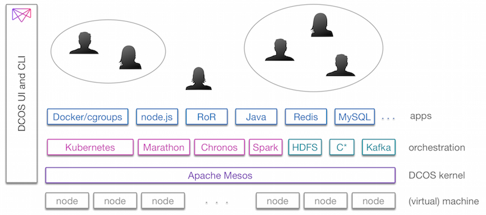
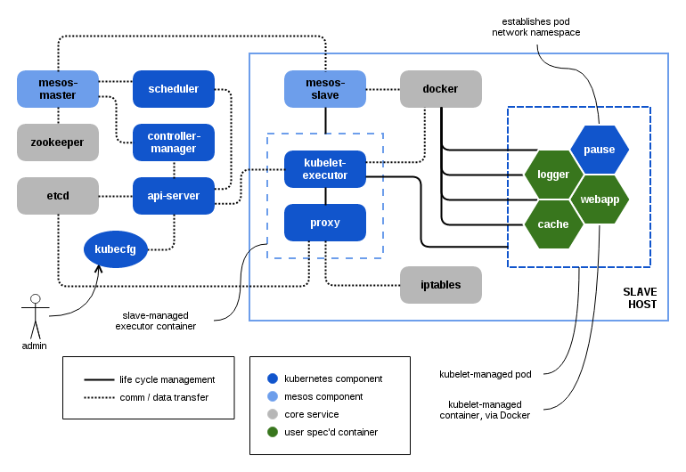

# Blueprint - Kubernetes on the Mesosphere DCOS

## Contents

1. [Terminology](#1-terminology)
1. [Use Cases](#2-use-cases)
 1. Case study 1: Financial Industry
 1. Case study 2: Gaming
1. [Solution](#3-solution)
1. [Components](#4-components)
 1. Prerequisites
 1. Bill of Materials
1. [Example Deployment](#5-example-deployment)
1. [Resources](#6-resources)

[Kubernetes on DCOS](http://mesosphere.com/kubernetes) adds Kubernetes to Mesosphere’s Datacenter Operating System (DCOS) in order to help enterprises unlock the next generation of datacenter scale, efficiency and automation. [Kubernetes](http://kubernetes.io/) and the Mesosphere [DCOS](http://mesosphere.com/learn/) together provide a powerful platform for building and deploying microservice-based applications and operate containerized (e.g., using Docker) applications in a scalable, elastic and secure manner. The Mesosphere DCOS, which is based on Apache Mesos, is integrating Kubernetes as a standard component which will be made available as part of the Mesosphere DCOS Community Edition (free) and the Mesosphere DCOS Enterprise Edition (paid).

In this document, you'll learn how to use Kubernetes on the Mesosphere DCOS in order to build scalable, resilient and secure application architectures. You'll see how these principles apply to real-world scenarios through an example deployment.

## 1. Terminology

**Docker**, [docker.com](https://www.docker.com/): is a popular container solution that enables deployable apps to be quickly assembled from components and eliminates the friction between development, QA and production environments. It consists of 1. the Docker Engine, a portable, lightweight runtime and packaging tool, and 2. Docker Hub, a cloud service for sharing applications and automating workflows. For on-premise deployments, a private registry can be used to serve the Docker images.

**Kubernetes**, [kubernetes.io](http://kubernetes.io/): is an open source orchestration system for Docker containers. It actively manages workloads to ensure that their state matches the users declared intentions. Kubernetes provides declarative primitives—such as pods, labels and services—to group the Docker containers that make up an application into logical units, for easy management and discovery.

**Mesosphere DCOS**, [mesosphere.com](http://mesosphere.com/product/): provides a highly-portable, operations-driven environment that is fault-tolerant, scalable, elastic and supports multi-service deployments. It seamlessly supports both Docker (isolation-level) and Kubernetes (service-level) in an enterprise-grade, [multi-services](http://www.slideshare.net/timothysc/apache-coneu) environment.

**Multi-service**. The ability of a platform to run multiple operational and analytical workloads on the same cluster, resulting in resource-efficiency, while providing elasticity and isolation capabilities. For example, Web servers (like nginx), App servers (such as node.js) using relational databases (e.g., MySQL) for the operational part can be used together with Hadoop/HDFS, Spark, Kafka, etc. for the analytics part, in one cluster.

## 2. Use Cases

Kubernetes on DCOS delivers the most value for those use cases that share one or more of the following characteristics:

* Production systems employing very large clusters, in the 1000s of nodes.
* Applications that run on-premise, in a private datacenter.
* The need for a multi-service setup, on the same cluster, is a given.
* A requirement to easily migrate parts or all of the distributed application from a private cloud to a public cloud setup, including Amazon Web Services, Google Compute and Microsoft Azure.
* Run apps in a highly-automated environment in order to reduce operational burden.
* Reliability and fault-tolerance for all workloads.
* Enterprise-grade security.
* Elastic scaling of resources between Kubernetes and other apps.

In the following we will have a look at two real-world case studies in greater detail.

### 2.1 Case study 1: Financial Industry

A leading, multi-national investment bank has a number of applications—from fraud detection to trading and marketing—running on the Mesosphere DCOS and decides to leverage Kubernetes on DCOS in order to better manage their workloads. The majority of the datasets reside on-premise due to various legislative requirements (Sarbanes-Oxley, Dodd-Frank, etc.). However, especially for targeted marketing and sentiment analysis use cases, said investment bank has a 500 node cluster in a public cloud, in addition to their on-premise machines. Kubernetes on DCOS in this scenario is used to enable them to build and run multiple services—stream processing of public news and social media feeds, machine learning to detect fraudulent behavior, recommendations for customers and reaching out to prospects—on both  their private and public cloud machines.

### 2.2 Case study 2: Gaming

In this case study, we look at a Web 2.0 property which has its main line of business in online games deployed through Web sites and mobile applications. The two main challenges the gaming company faced was to ensure a high utilization of their on-premise cluster and being flexible concerning deployment options. Essentially, they wanted to have game engines built in Kubernetes and also run analytics (Spark, Hadoop, Storm) together on the same cluster in order to lower their TCO (Total Cost of Ownership) and increase their RoI (Return on Investment). As they rolled out the system, Kubernetes on DCOS helped them to create a reliable and flexible architecture, allowing them to triple their compute utilization.

## 3. Solution

Let us now have a look at how Kubernetes is integrated with the Mesosphere DCOS from a 50,000 ft. view:



Kubernetes on DCOS begins with a Mesosphere DCOS cluster built atop bare metal or virtual machines running any modern version of Linux. The nodes can either be on-premise or in a public cloud/IaaS setting, such as Google Compute Platform. The Mesosphere DCOS is built around Apache Mesos forms the distributed systems kernel that abstracts away all of the underlying nodes so that they combine to form what looks like one big machine.

The orchestration of apps and services can be done using Kubernetes installed on the DCOS. These Kubernetes workloads can run on the same cluster, and even co-reside on the same machines, as other DCOS workloads, such as those launched with the Marathon or Chronos services.

The DCOS UI and CLI offer a broad range of functionality for end-to-end application lifecycle management and operations including monitoring, upgrading, decommissioning and SLA-related service tasks.

From a technical point of view the [Kubernetes on DCOS](https://github.com/mesosphere/kubernetes-mesos/blob/master/docs/README.md) integration looks as follows:



Comparing the standard Kubernetes deployment with the Kubernetes on DCOS deployment gives the following:

| Aspect                  | Standard Kubernetes | Kubernetes on DCOS |
| ----------------------- | ------------------- | ------------------ |
| **multi-service**       | Kubernetes only     | Yes. Kubernetes co-exists with multiple services on the same cluster, including Spark, Cassandra, Marathon, Chronos, Hadoop, Kafka, Jenkins and many others. |
| **hybrid cloud**        | via workload portability | via workload portability and multi-datacenter scheduling |
| **business continuity** | fault-tolerance | fault-tolerance, High Availability, SLAs guaranteed |
| **container**           | Docker | pluggable incl. Docker and cgroups |
| **scheduler**           | monolithic | pluggable two-level, multi-services resource arbitration |
| **support**             | community, on a best effort basis| community and premium (SLA-based) through Mesosphere |
| **security**            | basic | extended |

Note that the Mesosphere DCOS comes in two versions: a **Community Edition** (CE), which is available (today) for cloud-only deployments, and the **Enterprise Edition** (EE), which can be used in a cloud setup, on-premise or in a hybrid setup. Some of the above listed features, incl. premium support, extended security and monitoring are exclusively available through the EE.

## 4. Components

### 4.1  Prerequisites

The only prerequisite to use Kubernetes on DCOS is one of the following environments (physical and/or VM):

1. Instances in a public-cloud, IaaS infrastructure such as [Google Compute](http://cloud.google.com/), AWS [EC2](http://aws.amazon.com/ec2/), and Microsoft [Azure](https://azure.microsoft.com/).
1. An on-premise cluster of machines.
1. A combination of 1. and 2., above.

In **any case** above the physical or virtual machines **must not** be pre-installed with a local operating system—such as from the GNU/Linux or Windows family—as during the setup phase Mesosphere DCOS will install [CoreOS](https://coreos.com/). In future, other GNU/Linux flavors will be supported.

### 4.2 Bill of Materials

Core:

* Cloud provisioning (AWS, Azure, GCE)
* CoreOS
* Mesos
* Zookeeper, Exhibitor
* Mesos-DNS
* DCOS Distribution Package
* DCOS Package Repository
* DCOS CLI
* DCOS GUI

Included Services:

* Kubernetes
* Marathon
* Chronos

Installable Services:

* HDFS
* Kafka
* Jenkins
* Spark
* Cassandra
* Hadoop
* YARN (via Myriad)
* and many others

## 5. Example Deployment

In order to try out the example deployment described in the following, you first want to visit [mesosphere.com/install](http://mesosphere.com/install) and set up a cluster of machines with the Mesosphere DCOS installed.

*Note that in the example deployment below you can use the native Kubernetes CLI commands and the respective DCOS sub-commands interchangeably. This means that the following two commands are semantically equivalent:* 

```bash
$ bin/kubectl get pods
```

and

```bash
$ dcos k8s get pods
```

Install Kubernetes on DCOS:

```bash
$ dcos package install kubernetes
```

Now, start the kubernetes-mesos API server, controller manager, and scheduler on a Mesos master node:

```bash
$ ./bin/km apiserver \
  --address=${servicehost} \
  --mesos_master=${mesos_master} \
  --etcd_servers=http://${servicehost}:4001 \
  --portal_net=10.10.10.0/24 \
  --port=8888 \
  --cloud_provider=mesos \
  --v=1 >apiserver.log 2>&1 &

$ ./bin/km controller-manager \
  --master=$servicehost:8888 \
  --mesos_master=${mesos_master} \
  --v=1 >controller.log 2>&1 &

$ ./bin/km scheduler \
  --address=${servicehost} \
  --mesos_master=${mesos_master} \
  --etcd_servers=http://${servicehost}:4001 \
  --mesos_user=root \
  --api_servers=$servicehost:8888 \
  --v=2 >scheduler.log 2>&1 &
```

Also on the master node, start up a proxy instance to act as a public-facing service router:

```bash
$ sudo ./bin/km proxy \
  --bind_address=${servicehost} \
  --etcd_servers=http://${servicehost}:4001 \
  --logtostderr=true >proxy.log 2>&1 &
```

Disown your background jobs so that they'll stay running if you log out.

```bash
$ disown -a
```

Now you can interact with the Kubernetes via `kubectl`:

```bash
$ bin/kubectl get pods
POD        IP        CONTAINER(S)        IMAGE(S)        HOST        LABELS        STATUS
```

```bash
$ bin/kubectl get services       # your service IPs will likely differ
NAME            LABELS                                    SELECTOR            IP             PORT
kubernetes      component=apiserver,provider=kubernetes   <none>              10.10.10.2     443
kubernetes-ro   component=apiserver,provider=kubernetes   <none>              10.10.10.1     80
```
Lastly, use the Mesos CLI tool to validate the Kubernetes scheduler framework has been registered and running:

```bash
$ mesos state | grep "Kubernetes"
         "name": "Kubernetes",
```
Alternatively you can find Kubernetes in the DCOS GUI, under the services tab.

In order to spin up a pod, you write a JSON pod description to a local file:

```bash
$ cat <<EOPOD >nginx.json
{ "kind": "Pod",
"apiVersion": "v1beta1",
"id": "nginx-id-01",
"desiredState": {
  "manifest": {
    "version": "v1beta1",
    "containers": [{
      "name": "nginx-01",
      "image": "nginx",
      "ports": [{
        "containerPort": 80,
        "hostPort": 31000
      }],
      "livenessProbe": {
        "enabled": true,
        "type": "http",
        "initialDelaySeconds": 30,
        "httpGet": {
          "path": "/index.html",
          "port": "8081"
        }
      }
    }]
  }
},
"labels": {
  "name": "foo"
} }
EOPOD
```

Then, send the pod description to Kubernetes using the `kubectl` CLI:

```bash
$ bin/kubectl create -f nginx.json
nginx-id-01
```

Wait a minute or two while `dockerd` downloads the image layers from the internet. You can again use the `kubectl` interface to monitor the status of your pod:

```bash
$ bin/kubectl get pods
POD          IP           CONTAINER(S)  IMAGE(S)  HOST                       LABELS                STATUS
nginx-id-01  172.17.5.27  nginx-01      nginx     10.72.72.178/10.72.72.178  cluster=gce,name=foo  Running
```

Last but not least you may want to verify that the pod task is running, through the DCOS UI. 

## 6. Resources

* Kubernetes blog: [Kubernetes and the Mesosphere DCOS](http://blog.kubernetes.io/2015/04/kubernetes-and-mesosphere-dcos.html)
* Mesosphere blog: [Making Kubernetes a first-class citizen on the DCOS](https://mesosphere.com/blog/2015/04/22/making-kubernetes-a-first-class-citizen-on-the-dcos/)
* [Getting started with Kubernetes on Mesos](https://github.com/GoogleCloudPlatform/kubernetes/blob/master/docs/getting-started-guides/mesos.md)
* Via Mesosphere:
 * [DCOS getting started](https://docs.mesosphere.com/getting-started/)
 * [Kubernetes on Mesos tutorial](https://mesosphere.com/blog/2014/12/12/kubernetes-on-mesos/) 

[1]: http://mesosphere.com/docs/tutorials/run-hadoop-on-mesos-using-installer
