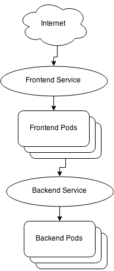

<!-- BEGIN MUNGE: UNVERSIONED_WARNING -->


<!-- END MUNGE: UNVERSIONED_WARNING -->
Environment Guide Example
=========================
This example demonstrates running pods, replication controllers, and
services. It shows two types of pods: frontend and backend, with
services on top of both. Accessing the frontend pod will return
environment information about itself, and a backend pod that it has
accessed through the service. The goal is to illuminate the
environment metadata available to running containers inside the
Kubernetes cluster. The documentation for the Kubernetes environment
is [here](../../../docs/user-guide/container-environment.md).



Prerequisites
-------------
This example assumes that you have a Kubernetes cluster installed and
running, and that you have installed the `kubectl` command line tool
somewhere in your path.  Please see the [getting
started](../../../docs/getting-started-guides/) for installation instructions
for your platform.

Optional: Build your own containers
-----------------------------------
The code for the containers is under
[containers/](containers/)

Get everything running
----------------------

    kubectl create -f ./backend-rc.yaml
    kubectl create -f ./backend-srv.yaml
    kubectl create -f ./show-rc.yaml
    kubectl create -f ./show-srv.yaml

Query the service
-----------------
Use `kubectl describe service show-srv` to determine the public IP of
your service.

> Note: If your platform does not support external load balancers,
  you'll need to open the proper port and direct traffic to the
  internal IP shown for the frontend service with the above command

Run `curl <public ip>:80` to query the service. You should get
something like this back:

```
Pod Name: show-rc-xxu6i
Pod Namespace: default
USER_VAR: important information

Kubernetes environment variables
BACKEND_SRV_SERVICE_HOST = 10.147.252.185
BACKEND_SRV_SERVICE_PORT = 5000
KUBERNETES_RO_SERVICE_HOST = 10.147.240.1
KUBERNETES_RO_SERVICE_PORT = 80
KUBERNETES_SERVICE_HOST = 10.147.240.2
KUBERNETES_SERVICE_PORT = 443
KUBE_DNS_SERVICE_HOST = 10.147.240.10
KUBE_DNS_SERVICE_PORT = 53

Found backend ip: 10.147.252.185 port: 5000
Response from backend
Backend Container
Backend Pod Name: backend-rc-6qiya
Backend Namespace: default
```

First the frontend pod's information is printed. The pod name and
[namespace](../../../docs/design/namespaces.md) are retrieved from the
[Downward API](../../../docs/user-guide/downward-api.md). Next, `USER_VAR` is the name of
an environment variable set in the [pod
definition](show-rc.yaml). Then, the dynamic Kubernetes environment
variables are scanned and printed. These are used to find the backend
service, named `backend-srv`. Finally, the frontend pod queries the
backend service and prints the information returned. Again the backend
pod returns its own pod name and namespace.

Try running the `curl` command a few times, and notice what
changes. Ex: `watch -n 1 curl -s <ip>` Firstly, the frontend service
is directing your request to different frontend pods each time. The
frontend pods are always contacting the backend through the backend
service. This results in a different backend pod servicing each
request as well.

Cleanup
-------
    kubectl delete rc,service -l type=show-type
    kubectl delete rc,service -l type=backend-type


<!-- BEGIN MUNGE: IS_VERSIONED -->
<!-- TAG IS_VERSIONED -->
<!-- END MUNGE: IS_VERSIONED -->


<!-- BEGIN MUNGE: GENERATED_ANALYTICS -->
[]()
<!-- END MUNGE: GENERATED_ANALYTICS -->
