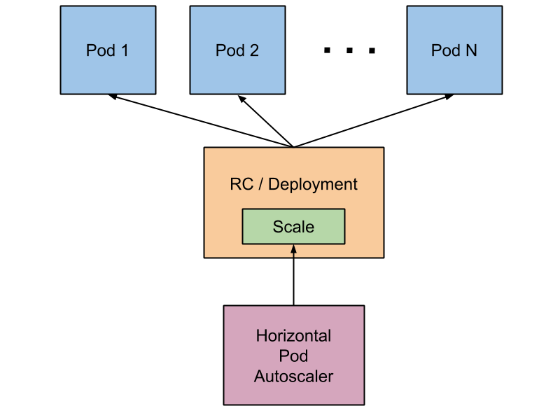

<!-- BEGIN MUNGE: UNVERSIONED_WARNING -->

<!-- END MUNGE: UNVERSIONED_WARNING -->

# Horizontal Pod Autoscaler

This document describes the current state of Horizontal Pod Autoscaler in Kubernetes.

<!-- BEGIN MUNGE: GENERATED_TOC -->

- [Horizontal Pod Autoscaler](#horizontal-pod-autoscaler)
  - [What is Horizontal Pod Autoscaler?](#what-is-horizontal-pod-autoscaler)
  - [How does Horizontal Pod Autoscaler work?](#how-does-horizontal-pod-autoscaler-work)
  - [API Object](#api-object)
  - [Support for horizontal pod autoscaler in kubectl](#support-for-horizontal-pod-autoscaler-in-kubectl)
  - [Autoscaling during rolling update](#autoscaling-during-rolling-update)
  - [Further reading](#further-reading)

<!-- END MUNGE: GENERATED_TOC -->

## What is Horizontal Pod Autoscaler?

Horizontal pod autoscaling allows the number of pods in a replication controller or deployment
to scale automatically based on observed CPU utilization.
It is a [beta](../api.md#api-versioning) feature in Kubernetes 1.1.

The autoscaler is implemented as a Kubernetes API resource and a controller.
The resource describes behavior of the controller.
The controller periodically adjusts the number of replicas in a replication controller or deployment
to match the observed average CPU utilization to the target specified by user.

## How does Horizontal Pod Autoscaler work?

The autoscaler is implemented as a control loop.
It periodically queries CPU utilization for the pods it targets.
(The period of the autoscaler is controlled by `--horizontal-pod-autoscaler-sync-period` flag of controller manager.
The default value is 30 seconds).
Then, it compares the arithmetic mean of the pods' CPU utilization with the target and adjust the number of replicas if needed.

CPU utilization is the recent CPU usage of a pod divided by the sum of CPU requested by the pod's containers.
Please note that if some of the pod's containers do not have CPU request set,
CPU utilization for the pod will not be defined and the autoscaler will not take any action.
Further details of the autoscaling algorithm are given [here](../design/horizontal-pod-autoscaler.md#autoscaling-algorithm).

Autoscaler accesses corresponding replication controller or deployment by scale sub-resource.
Scale is an interface which allows to dynamically set the number of replicas and to learn the current state of them.
More details on scale sub-resource can be found [here](../design/horizontal-pod-autoscaler.md#scale-subresource).

## API Object

Horizontal pod autoscaler is a top-level resource in the Kubernetes REST API (currently in [beta](../api.md#api-versioning)).
More details about the API object can be found at
[HorizontalPodAutoscaler Object](../design/horizontal-pod-autoscaler.md#horizontalpodautoscaler-object).

## Support for horizontal pod autoscaler in kubectl

Horizontal pod autoscaler, like every API resource, is supported in a standard way by `kubectl`.
We can create a new autoscaler using `kubectl create` command.
We can list autoscalers by `kubectl get hpa` and get detailed description by `kubectl describe hpa`.
Finally, we can delete an autoscaler using `kubectl delete hpa`.

In addition, there is a special `kubectl autoscale` command that allows for easy creation of horizontal pod autoscaler.
For instance, executing `kubectl autoscale rc foo --min=2 --max=5 --cpu-percent=80`
will create an autoscaler for replication controller *foo*, with target CPU utilization set to `80%`
and the number of replicas between 2 and 5.
The detailed documentation of `kubectl autoscale` can be found [here](kubectl/kubectl_autoscale.md).

## Autoscaling during rolling update

Currently in Kubernetes, it is possible to perform a rolling update by managing replication controllers directly,
or by using the deployment object, which manages the underlying replication controllers for you.
Horizontal pod autoscaler only supports the latter approach: the horizontal pod autoscaler is bound to the deployment object,
it sets the size for the deployment object, and the deployment is responsible for setting sizes of underlying replication controllers.

Horizontal pod autoscaler does not work with rolling update using direct manipulation of replication controllers,
i.e. you cannot bind a horizontal pod autoscaler to a replication controller and do rolling update (e.g. using `kubectl rolling-update`).
The reason this doesn't work is that when rolling update creates a new replication controller,
the horizontal pod autoscaler will not be bound to the new replication controller.

## Further reading

* Design documentation: [Horizontal Pod Autoscaling](../design/horizontal-pod-autoscaler.md).
* Manual of autoscale command in kubectl: [kubectl autoscale](kubectl/kubectl_autoscale.md).
* Usage example of [Horizontal Pod Autoscaler](horizontal-pod-autoscaling/README.md).

<!-- BEGIN MUNGE: IS_VERSIONED -->
<!-- TAG IS_VERSIONED -->
<!-- END MUNGE: IS_VERSIONED -->

<!-- BEGIN MUNGE: GENERATED_ANALYTICS -->

<!-- END MUNGE: GENERATED_ANALYTICS -->
