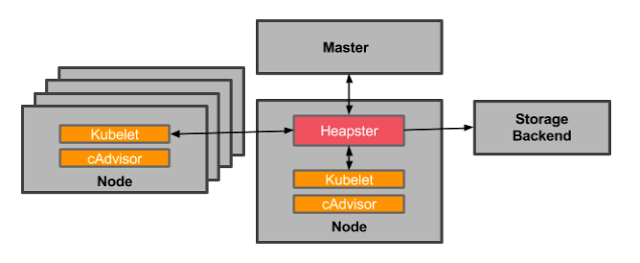

<!-- BEGIN MUNGE: UNVERSIONED_WARNING -->

<!-- BEGIN STRIP_FOR_RELEASE -->

<h2>PLEASE NOTE: This document applies to the HEAD of the source tree</h2>

If you are using a released version of Kubernetes, you should
refer to the docs that go with that version.

<strong>
The latest 1.0.x release of this document can be found
[here](http://releases.k8s.io/release-1.0/docs/user-guide/monitoring.md).

Documentation for other releases can be found at
[releases.k8s.io](http://releases.k8s.io).
</strong>
--

<!-- END STRIP_FOR_RELEASE -->

<!-- END MUNGE: UNVERSIONED_WARNING -->

# Resource Usage Monitoring in Kubernetes

Understanding how an application behaves when deployed is crucial to scaling the application and providing a reliable service. In a Kubernetes cluster, application performance can be examined at many different levels: containers, [pods](pods.md), [services](services.md), and whole clusters. As part of Kubernetes we want to provide users with detailed resource usage information about their running applications at all these levels. This will give users deep insights into how their applications are performing and where possible application bottlenecks may be found. In comes [Heapster](https://github.com/GoogleCloudPlatform/heapster), a project meant to provide a base monitoring platform on Kubernetes.

### Overview

Heapster is a cluster-wide aggregator of monitoring and event data. It currently supports Kubernetes natively and works on all Kubernetes setups. Heapster runs as a pod in the cluster, similar to how any Kubernetes application would run. The Heapster pod discovers all nodes in the cluster and queries usage information from the nodes’ [Kubelet](../../DESIGN.md#kubelet)s, the on-machine Kubernetes agent. The Kubelet itself fetches the data from [cAdvisor](https://github.com/google/cadvisor). Heapster groups the information by pod along with the relevant labels. This data is then pushed to a configurable backend for storage and visualization. Currently supported backends include [InfluxDB](http://influxdb.com/) (with [Grafana](http://grafana.org/) for visualization) and [Google Cloud Monitoring](https://cloud.google.com/monitoring/). The overall architecture of the service can be seen below:

Let’s look at some of the other components in more detail.

### cAdvisor

cAdvisor is an open source container resource usage and performance analysis agent. It is purpose built for containers and supports Docker containers natively. In Kubernetes, cadvisor is integrated into the Kubelet binary. cAdvisor auto-discovers all containers in the machine and collects CPU, memory, filesystem, and network usage statistics. cAdvisor also provides the overall machine usage by analyzing the “root” container on the machine.

On most Kubernetes clusters, cAdvisor exposes a simple UI for on-machine containers on port 4194. Here is a snapshot of part of cAdvisor’s UI that shows the overall machine usage:

### Kubelet

The Kubelet acts as a bridge between the Kubernetes master and the nodes. It manages the pods and containers running on a machine. Kubelet translates each pod into its constituent containers and fetches individual container usage statistics from cAdvisor. It then exposes the aggregated pod resource usage statistics via a REST API.

## Storage Backends

### InfluxDB and Grafana

A Grafana setup with InfluxDB is a very popular combination for monitoring in the open source world. InfluxDB exposes an easy to use API to write and fetch time series data. Heapster is setup to use this storage backend by default on most Kubernetes clusters. A detailed setup guide can be found [here](https://github.com/GoogleCloudPlatform/heapster/blob/master/docs/influxdb.md). InfluxDB and Grafana run in Pods. The pod exposes itself as a Kubernetes service which is how Heapster discovers it.

The Grafana container serves Grafana’s UI which provides an easy to configure dashboard interface. The default dashboard for Kubernetes contains an example dashboard that monitors resource usage of the cluster and the pods inside of it. This dashboard can easily be customized and expanded. Take a look at the storage schema for InfluxDB [here](https://github.com/GoogleCloudPlatform/heapster/blob/master/docs/storage-schema.md#metrics).

Here is a video showing how to monitor a Kubernetes cluster using heapster, InfluxDB and Grafana:

Here is a snapshot of the default Kubernetes Grafana dashboard that shows the CPU and Memory usage of the entire cluster, individual pods and containers:

### Google Cloud Monitoring

Google Cloud Monitoring is a hosted monitoring service that allows you to visualize and alert on important metrics in your application. Heapster can be setup to automatically push all collected metrics to Google Cloud Monitoring. These metrics are then available in the [Cloud Monitoring Console](https://app.google.stackdriver.com/). This storage backend is the easiest to setup and maintain. The monitoring console allows you to easily create and customize dashboards using the exported data.

Here is a video showing how to setup and run a Google Cloud Monitoring backed Heapster:

Here is a snapshot of the a Google Cloud Monitoring dashboard showing cluster-wide resource usage.

## Try it out!

Now that you’ve learned a bit about Heapster, feel free to try it out on your own clusters! The [Heapster repository](https://github.com/GoogleCloudPlatform/heapster) is available on GitHub. It contains detailed instructions to setup Heapster and its storage backends. Heapster runs by default on most Kubernetes clusters, so you may already have it! Feedback is always welcome. Please let us know if you run into any issues. Heapster and Kubernetes developers hang out in the [#google-containers](http://webchat.freenode.net/?channels=google-containers) IRC channel on freenode.net. You can also reach us on the [google-containers Google Groups mailing list](https://groups.google.com/forum/#!forum/google-containers).

***
*Authors: Vishnu Kannan and Victor Marmol, Google Software Engineers.*
*This article was originally posted in [Kubernetes blog](http://blog.kubernetes.io/2015/05/resource-usage-monitoring-kubernetes.html).*

<!-- BEGIN MUNGE: GENERATED_ANALYTICS -->

<!-- END MUNGE: GENERATED_ANALYTICS -->
