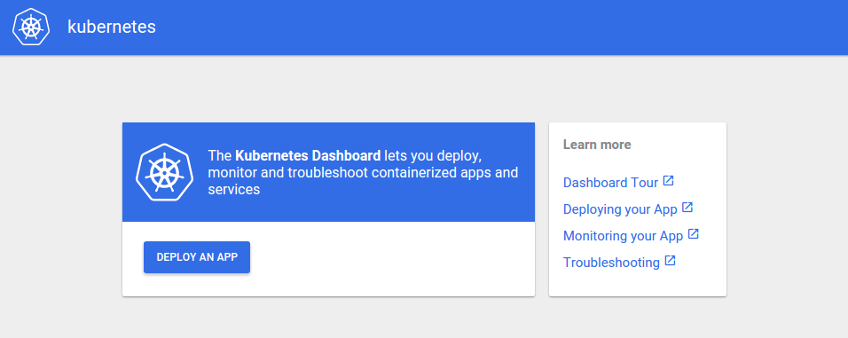
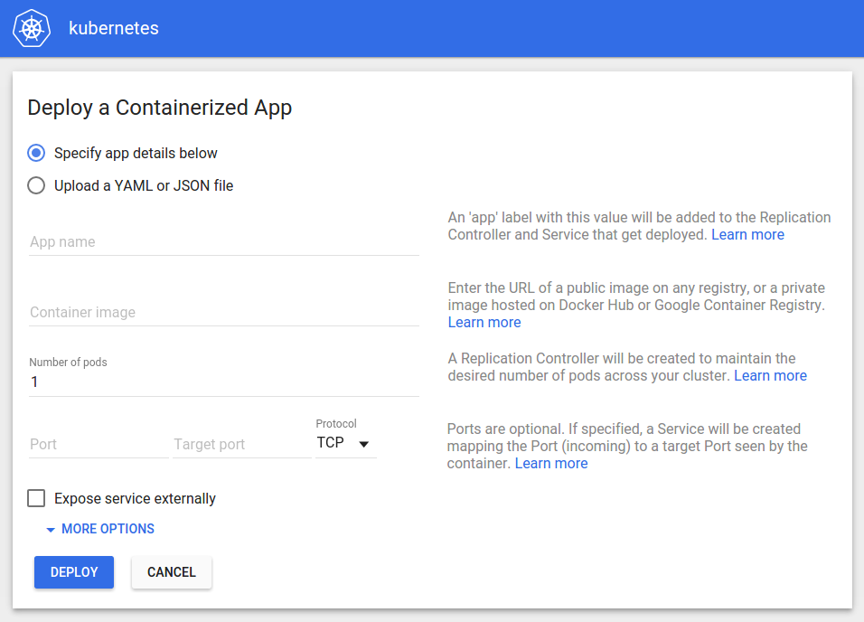
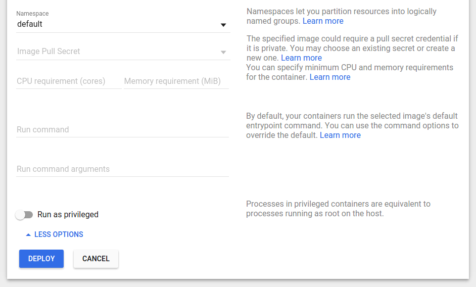
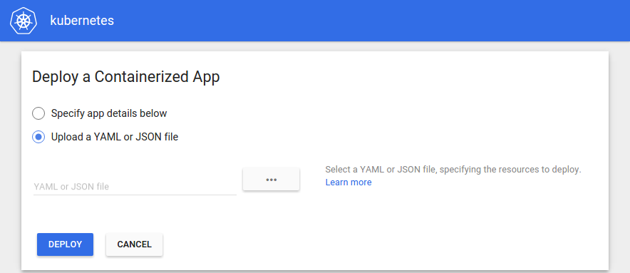
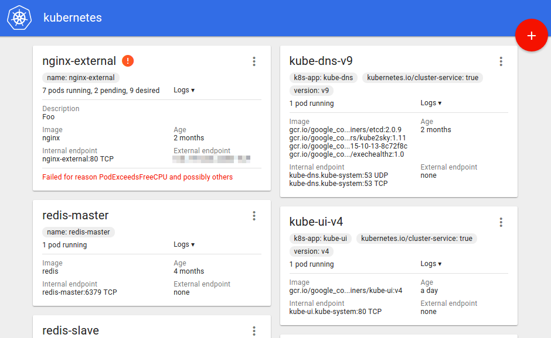
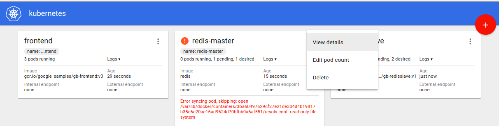
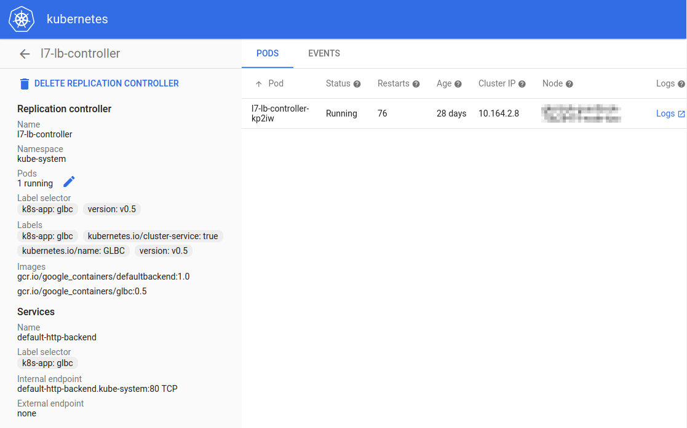

<!-- BEGIN MUNGE: UNVERSIONED_WARNING -->

<!-- BEGIN STRIP_FOR_RELEASE -->


<h2>PLEASE NOTE: This document applies to the HEAD of the source tree</h2>

If you are using a released version of Kubernetes, you should
refer to the docs that go with that version.

<!-- TAG RELEASE_LINK, added by the munger automatically -->
<strong>
The latest release of this document can be found
[here](http://releases.k8s.io/release-1.1/docs/user-guide/ui.md).

Documentation for other releases can be found at
[releases.k8s.io](http://releases.k8s.io).
</strong>
--

<!-- END STRIP_FOR_RELEASE -->

<!-- END MUNGE: UNVERSIONED_WARNING -->

# The Kubernetes Dashboard User Interface

Kubernetes has a web-based user interface that allows you to deploy containerized
applications to a Kubernetes cluster, troubleshoot them, and manage the cluster itself.

## Accessing the Dashboard

By default, the Kubernetes Dashboard is deployed as a cluster addon. To access it, visit
`https://<kubernetes-master>/ui`, which redirects to
`https://<kubernetes-master>/api/v1/proxy/namespaces/kube-system/services/kubernetes-dashboard`.

If you find that you're not able to access the Dashboard, it may be because the
`kubernetes-dashboard` service has not been started on your cluster. In that case,
you can start it manually as follows:

```sh
kubectl create -f cluster/addons/dashboard/dashboard-controller.yaml --namespace=kube-system
kubectl create -f cluster/addons/dashboard/dashboard-service.yaml --namespace=kube-system
```

Normally, this should be taken care of automatically by the
[`kube-addons.sh`](http://releases.k8s.io/HEAD/cluster/saltbase/salt/kube-addons/kube-addons.sh)
script that runs on the master. Release notes and development versions of the Dashboard can be
found at https://github.com/kubernetes/dashboard/releases.

## Using the Dashboard

The Dashboard can be used to get an overview of applications running on the cluster, and to provide information on any errors that have occurred. You can also inspect your replication controllers and corresponding services, change the number of replicated Pods, and deploy new applications using a deploy wizard.

When accessing the Dashboard on an empty cluster for the first time, the Welcome page is displayed. This page contains a link to this document as well as a button to deploy your first application.



### Deploying applications

The Dashboard lets you create and deploy a containerized application as a Replication Controller with a simple wizard:



#### Specifying application details

The wizard expects that you provide the following information:

- **App name** (mandatory): Name for your application. A [label](http://kubernetes.io/v1.1/docs/user-guide/labels.html) with the name will be added to the Replication Controller and Service, if any, that will be deployed.

  The application name must be unique within the selected Kubernetes namespace. It must start with a lowercase character, and contain only lowercase letters, numbers and dashes (-). It is limited to 24 characters.

- **Container image** (mandatory): The URL of a public Docker [container image](http://kubernetes.io/v1.1/docs/user-guide/images.html) on any registry, or a private image (commonly hosted on the Google Container Registry or Docker Hub).

- **Number of pods** (mandatory): The target number of Pods you want your application to be deployed in. The value must be a positive integer.

  A [Replication Controller](http://kubernetes.io/v1.1/docs/user-guide/replication-controller.html) will be created to maintain the desired number of Pods across your cluster.

- **Ports** (optional): If your container listens on a port, you can provide a port and target port. The wizard will create a corresponding Kubernetes [Service](http://kubernetes.io/v1.1/docs/user-guide/services.html) which will route to your deployed Pods. Supported protocols are TCP and UDP. In case you specify ports, the internal DNS name for this Service will be the value you specified as application name above.

  Be aware that if you specify ports, you need to provide both port and target port.

- For some parts of your application (e.g. frontends), you can expose the Service onto an external, maybe public IP address by selecting the **Expose service externally** option. You may need to open up one or more ports to do so. Find more details [here](http://kubernetes.io/v1.1/docs/user-guide/services-firewalls.html).

If needed, you can expand the **Advanced options** section where you can specify more settings:



- **Description**: The text you enter here will be added as an [annotation](http://kubernetes.io/v1.1/docs/user-guide/annotations.html) to the Replication Controller and displayed in the application's details.

- **Labels**: Default [labels](http://kubernetes.io/v1.1/docs/user-guide/labels.html) to be used for your application are application name and version. You can specify additional labels to be applied to the Replication Controller, Service (if any), and Pods, such as release, environment, tier, partition, and release track.

  Example:

  ```
release=1.0
tier=frontend
environment=pod
track=stable
```

- **Kubernetes namespace**: Kubernetes supports multiple virtual clusters backed by the same physical cluster. These virtual clusters are called [namespaces](http://kubernetes.io/v1.1/docs/admin/namespaces.html). They let you partition resources into logically named groups.

  The Dashboard offers all available namespaces in a dropdown list and allows you to create a new namespace. The namespace name may contain alphanumeric characters and dashes (-).

- **Image pull secrets**: In case the Docker container image is private, it may require [pull secret](http://kubernetes.io/v1.1/docs/user-guide/secrets.html) credentials.

  The Dashboard offers all available secrets in a dropdown list, and allows you to create a new secret. The secret name must follow the DNS domain name syntax, e.g. `new.image-pull.secret`. The content of a secret must be base24-encoded and specified in a  [`.dockercfg`](http://kubernetes.io/v1.1/docs/user-guide/images.html#specifying-imagepullsecrets-on-a-pod) file.

- **CPU requirement** and **Memory requirement**: You can specify the minimum [resource limits](http://kubernetes.io/v1.1/docs/admin/limitrange/README.html) for the container. By default, Pods run with unbounded CPU and memory limits.

- **Run command** and **Run command arguments**: By default, your containers run the selected Docker image's default [entrypoint command](http://kubernetes.io/v1.1/docs/user-guide/containers.html/containers-and-commands). You can use the command options and arguments to override the default.

- **Run as privileged**: This setting determines whether processes in [privileged containers](http://kubernetes.io/v1.1/docs/user-guide/pods.html#privileged-mode-for-pod-containers) are equivalent to processes running as root on the host. Privileged containers can make use of capabilities like manipulating the network stack and accessing devices.

- **Environment variables**: Kubernetes exposes Services through [environment variables](http://kubernetes.io/v1.1/design/expansion.html). You can compose environment variable or pass arguments to your commands using the values of environnment variables. They can be used in applications to find a Service. Environment variables are also useful for decreasing coupling and the use of workarounds. Values can reference other variables using the `$(VAR_NAME)` syntax.

#### Uploading a YAML or JSON file

Kubernetes supports declarative configuration. In this style, all configuration is stored in YAML or JSON configuration files using the Kubernetes' [API](http://kubernetes.io/v1.1/docs/api.html) resource schemas as the configuration schemas.

As an alternative to specifying application details in the deploy wizard, you can define your Replication Controllers and Services in YAML or JSON files, and upload the files to your Pods:



### Applications view

As soon as applications are running on your cluster, the initial view of the Dashboard defaults to showing an overview of them, for example:



Individual applications are shown as cards - where an application is defined as a Replication Controller and its corresponding Services. Each card shows the current number of running and desired replicas, along with errors reported by Kubernetes, if any.

You can view application details (**View details**), make quick changes to the number of replicas (**Edit pod count**) or delete the application directly (**Delete**) from the menu in each card's corner:



#### View details

Selecting this option from the card menu will take you to the following page where you can view more information about the Pods that make up your application:



The **EVENTS** tab can be useful for debugging flapping applications.

Clicking the plus sign in the right corner of the screen leads you back to the page for deploying a new application.

#### Edit pod count

If you choose to change the number of Pods, the respective Replication Controller will be updated to reflect the newly specified number.

#### Delete

Deleting a Replication Controller also deletes the Pods managed by it. It is currently not supported to leave the Pods running.

You have the option to also delete Services related to the Replication Controller if the label selector targets only the Replication Controller to be deleted.

## More Information

For more information, see the
[Kubernetes Dashboard repository](https://github.com/kubernetes/dashboard).

<!-- BEGIN MUNGE: GENERATED_ANALYTICS -->
[]()
<!-- END MUNGE: GENERATED_ANALYTICS -->
