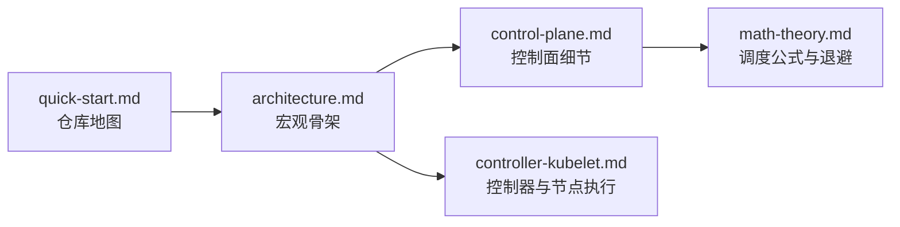

# Kubernetes 源码深潜教程

这套文档不是教你“怎么用 Kubernetes”，而是带你看懂 `kubernetes/kubernetes` 这个仓库本身是如何组织、如何运转、以及为什么会这样设计。

如果你第一次打开这个仓库就感到压迫感，这很正常。Kubernetes 不是一个普通服务，它同时承载了：

- API server
- scheduler
- controller host
- node agent
- API machinery 通用框架
- 客户端生成代码
- 测试、构建、兼容层

真正高效的学习方式，不是把文件全扫一遍，而是先建立正确的“骨架感”。

## 这套文档会帮你拿到什么

- 一个稳定的仓库结构脑图
- 一张从源码视角出发的控制面地图
- 一条从 `kubectl apply` 到容器落地运行的完整链路
- 一份把 scheduler 数学公式讲成直觉的解释
- 一份把 controller 与 kubelet 的对账循环讲透的教程

## 阅读地图

| 文件 | 主要回答什么问题 | 推荐顺序 |
| --- | --- | --- |
| [`quick-start.md`](quick-start.md) | 这么大的仓库，我到底从哪里开始？ | 第一篇 |
| [`architecture.md`](architecture.md) | Kubernetes 的宏观架构骨架是什么？ | 第二篇 |
| [`control-plane.md`](control-plane.md) | API server 和 scheduler 内部到底在干什么？ | 第三篇 |
| [`math-theory.md`](math-theory.md) | scheduler 的打分、排队、退避公式到底怎么理解？ | 第四篇 |
| [`controller-kubelet.md`](controller-kubelet.md) | controller 和 kubelet 是怎么持续对账的？ | 第五篇 |

## 推荐阅读路径

## 先把这五句话记住

1. **API server 是全系统共享事实源。** 几乎所有关键组件都在读它、写它、或者持续 watch 它。
2. **Kubernetes 的核心不是“一次性执行”，而是“持续对账”。** 它不断比较“想要什么”和“现在是什么”。
3. **控制面更像决策层，节点更像执行层。** 调度和大部分协调动作发生在中心，容器真正启动发生在 kubelet 所在节点。
4. **watch 是整个系统的血液循环。** informer、cache、workqueue、watch cache 共同承担变化传播。
5. **很多所谓的“智能”，本质上都是小公式。** fit check、加权平均、标准差、指数退避，都是非常朴素的数学。

## 关键源码锚点

- `cmd/kube-apiserver/app/server.go`
- `staging/src/k8s.io/apiserver/pkg/server/config.go`
- `pkg/scheduler/schedule_one.go`
- `pkg/scheduler/framework/plugins/noderesources/*.go`
- `pkg/controller/deployment/deployment_controller.go`
- `pkg/controller/deployment/sync.go`
- `pkg/kubelet/kubelet.go`
- `pkg/kubelet/pod_workers.go`

## 一句话总纲

如果你只记住一句话，那就记住这个：

> Kubernetes 本质上是一个巨大的分布式状态机，不同组件不断从 API server 读状态、基于缓存做判断、再把修正写回去，直到现实逼近期望。
