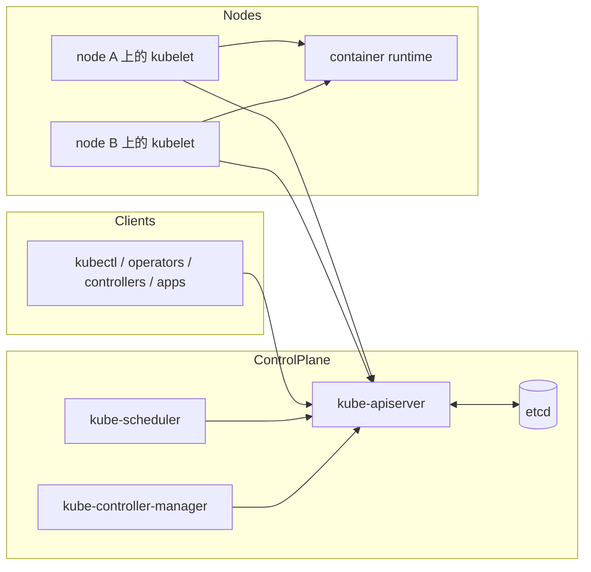
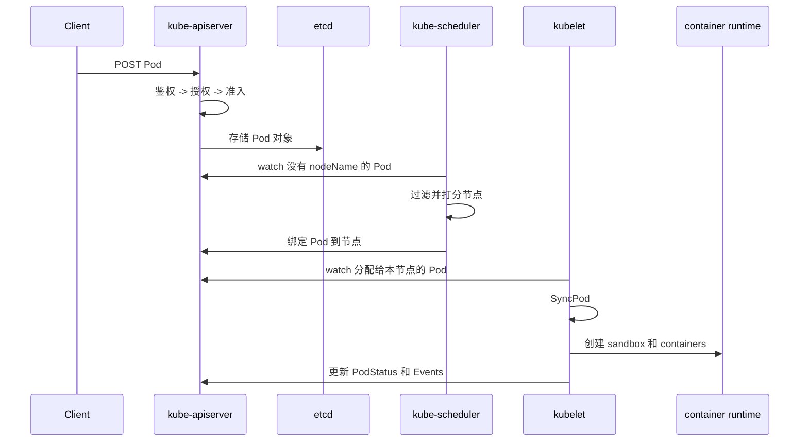
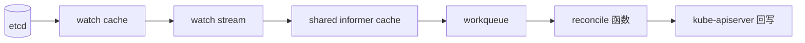
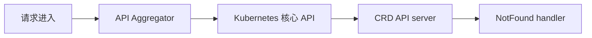

# Kubernetes 架构总览：先看大骨架，再下钻细节

## 先看它到底在解决什么痛点

分布式系统难，难在三件事：

1. 机器会坏
2. 期望状态一直在变
3. 你做决策的时候，系统本身也还在动

Kubernetes 的核心解法不是“一次部署成功”，而是把整个集群变成一个**持续对账系统**。

## 宏观骨架

## 架构里最关键的一条真相

API server 不只是一个 HTTP 路由器，它是整个系统的**共享协调平面**。

- 客户端把期望写进去
- controller 持续 watch 它
- scheduler 持续 watch 它
- kubelet 持续 watch 它
- 状态更新最终也回写到它

所以 Kubernetes 的很多设计天然带有一种“API first”的气质，因为所有组件都通过它汇合。

## 一颗 Pod 从 YAML 到容器的旅程

## 定义 Kubernetes 的三种循环

### 1. 请求循环

客户端把“想要什么”送进 API server。

### 2. 对账循环

controller 和 scheduler 持续观察哪些对象“还没达成目标”。

### 3. 执行循环

kubelet 把分配到本节点的 PodSpec 一次次逼近成真实运行状态。

把 Kubernetes 压成一句话就是：

> 请求产生期望，watch 传播变化，reconciler 响应偏差，kubelet 执行落地。

## 为什么 watch 如此重要

如果所有组件都不停轮询，那代价太高了。Kubernetes 更偏爱这套组合：

- etcd 持久化
- API server 提供 watch 流
- 各组件使用 informer + 本地 cache
- workqueue 只处理真正变更过的 key

这就是整个项目真正的“血液循环系统”。

## 为什么 `CreateServerChain()` 值得你专门记住

API server 不是一个单层大块头。在 `cmd/kube-apiserver/app/server.go` 里，`CreateServerChain()` 把多个 server 串成委托链，大致可以理解成：

所以用户看起来像在访问“一个 API server”，但内部其实经过了多层委派结构。

## 最值得记住的四个源码入口

| 领域 | 最佳入口文件 | 原因 |
| --- | --- | --- |
| API server 启动 | `cmd/kube-apiserver/app/server.go` | 看 server 链如何拼起来 |
| handler 链 | `staging/src/k8s.io/apiserver/pkg/server/config.go` | 看 authn/authz/audit/filter 如何包裹请求 |
| scheduler 核心循环 | `pkg/scheduler/schedule_one.go` | 看节点选择全过程 |
| kubelet 执行逻辑 | `pkg/kubelet/kubelet.go` | 看节点侧同步主循环 |

## 用超生活化类比再压一遍

把 Kubernetes 想成一个大型仓库：

- API server 是总调度台白板
- controller 是巡视仓库的管理员
- scheduler 是安排货物去哪条传送带的人
- kubelet 是现场装卸工
- etcd 是上锁的总账档案柜

它并不神秘，只是在反复对比“白板上写的”与“仓库里真实发生的”，然后不断修正差距。

## 下一步

接下来请看 [`control-plane.md`](control-plane.md)，我们开始拆 API server 的请求链和 scheduler 的调度链。
