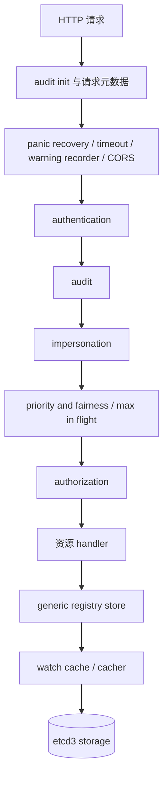
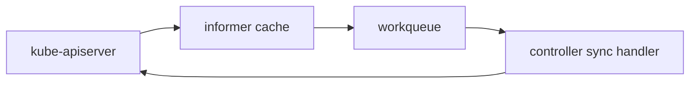

# 控制面深潜：API Server、Scheduler 与共享状态机

## 控制面到底在干什么

控制面其实一直在重复回答一个问题：

> 给定最新的期望状态和最新的观察状态，下一步应该做什么？

不同组件只负责这个问题的一部分，但它们都通过同一个 API 平面协作。

## 1. API server 的 handler 链

在 `staging/src/k8s.io/apiserver/pkg/server/config.go` 里，`DefaultBuildHandlerChain()` 会把核心 API handler 一层层包起来。代码写法是“从里往外包”，所以理解时最好把它翻译成请求流水线。

### 每一层用大白话怎么理解

- **authentication**：你是谁？
- **authorization**：你有权这么干吗？
- **admission**：就算你有权，这个对象是否还要被策略修改或拒绝？
- **storage**：对象怎么高效持久化、又怎么高效被 watch？

## 2. 请求如何从 HTTP 路由走到存储

最关键的源码锚点：

- `cmd/kube-apiserver/app/server.go`：看 server 启动与 `CreateServerChain()`
- `staging/src/k8s.io/apiserver/pkg/server/handler.go`：看 API handler 如何分发
- `staging/src/k8s.io/apiserver/pkg/endpoints/handlers/create.go`：看 create 请求
- `staging/src/k8s.io/apiserver/pkg/endpoints/handlers/update.go`：看 update 请求
- `staging/src/k8s.io/apiserver/pkg/endpoints/handlers/watch.go`：看 watch 流式响应
- `staging/src/k8s.io/apiserver/pkg/registry/generic/registry/store.go`：看通用持久化逻辑
- `staging/src/k8s.io/apiserver/pkg/storage/cacher/cacher.go`：看 watch cache
- `staging/src/k8s.io/apiserver/pkg/storage/etcd3/store.go`：看 etcd 后端

## 3. 为什么 watch cache 这么关键

如果没有 cacher 层，每个 watcher 都会把 API server 拖向更重的存储读取压力。有了它以后：

- 最近对象历史可以缓存在内存中
- list 与 watch 很多时候可以直接从缓存服务
- watcher 可以更平滑地拿到事件流

这就是为什么 Kubernetes 能同时维持大量 controller 与 kubelet 的同步，而不至于把底层存储打爆。

## 4. Scheduler 是一个“两段式机器”

理解 scheduler，最该看的文件就是 `pkg/scheduler/schedule_one.go`。它最重要的结构是：

1. **scheduling cycle**：决定 Pod 应该去哪
2. **binding cycle**：把这个决定正式写实

```mermaid
flowchart LR
    Q[SchedulingQueue] --> N[NextPod]
    N --> PF[PreFilter]
    PF --> F[过滤候选节点]
    F --> PS[PreScore]
    PS --> SC[Score plugins + extenders]
    SC --> PICK[挑出最佳节点]
    PICK --> ASSUME[在 scheduler cache 中假定落位]
    ASSUME --> RESERVE[reserve plugins]
    RESERVE --> PERMIT[permit plugins]
    PERMIT --> PREBIND[pre-bind plugins]
    PREBIND --> BIND[bind plugin / default binder]
    BIND --> API[经 API server 写入 Binding]
```

### 为什么要有 `assume`

scheduler 不想每次都傻等真正 bind 完才继续调度，它会先在自己的缓存里**乐观假设**这颗 Pod 已经占用了目标节点资源，然后继续处理下一颗 Pod。

这是一种非常典型的吞吐优化：最终权威仍然在 API server，但调度器先把自己脑内模型推进一步。

## 5. default binder 真实干了什么

default binder 非常克制。在 `pkg/scheduler/framework/plugins/defaultbinder/default_binder.go` 中，它只是构造一个 `v1.Binding`，再通过 API server 发送出去。

也就是说，scheduler 不负责启动容器，它只负责**记录“该去哪”**。

## 6. controller 在控制面里的位置

scheduler 主要解决的是**放在哪**。

controller 主要解决的是**差多少、怎么补**。

- Deployment controller：期望的 ReplicaSet/Pod 数量和实际是否一致
- Service controller：期望的 endpoints 与实际后端是否一致
- Namespace controller：生命周期与清理
- 更多实现都在 `pkg/controller/`

模式永远很像：watch -> enqueue -> reconcile -> write back。

## 7. 一个请求会引发很多异步后果

一次 Pod 创建请求，背后可能依次触发：

1. 对象写入 etcd
2. scheduler 发现有 pending Pod
3. scheduler 写 binding
4. kubelet 发现有分给自己的 Pod
5. kubelet 启动容器
6. kubelet 回写状态
7. 其他 controller 因状态变化继续反应

所以 Kubernetes 给人的感觉很“事件驱动”，但每个单独组件内部其实往往就是 cache + queue + loop 的组合。

## 8. 最值得继续点开的函数

| 主题 | 函数 / 文件 |
| --- | --- |
| API server 串链 | `cmd/kube-apiserver/app/server.go` 中的 `CreateServerChain()` |
| handler 包裹顺序 | `staging/src/k8s.io/apiserver/pkg/server/config.go` 中的 `DefaultBuildHandlerChain()` |
| scheduler 核心循环 | `pkg/scheduler/schedule_one.go` 中的 `ScheduleOne()`、`schedulingCycle()` |
| score plugin 执行 | `pkg/scheduler/framework/runtime/framework.go` 中的 `RunScorePlugins()` |
| 默认绑定 | `pkg/scheduler/framework/plugins/defaultbinder/default_binder.go` 中的 `Bind()` |

## 下一步

继续看 [`math-theory.md`](math-theory.md)，我们把 scheduler 的打分、排队和退避公式彻底讲通。
