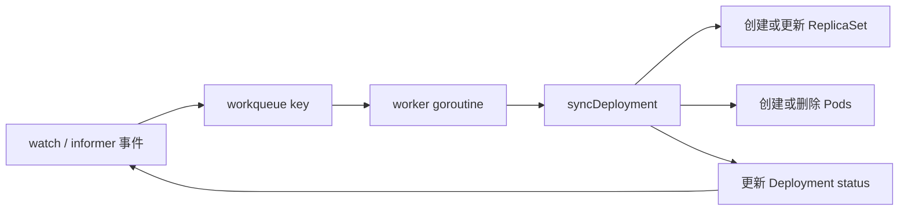
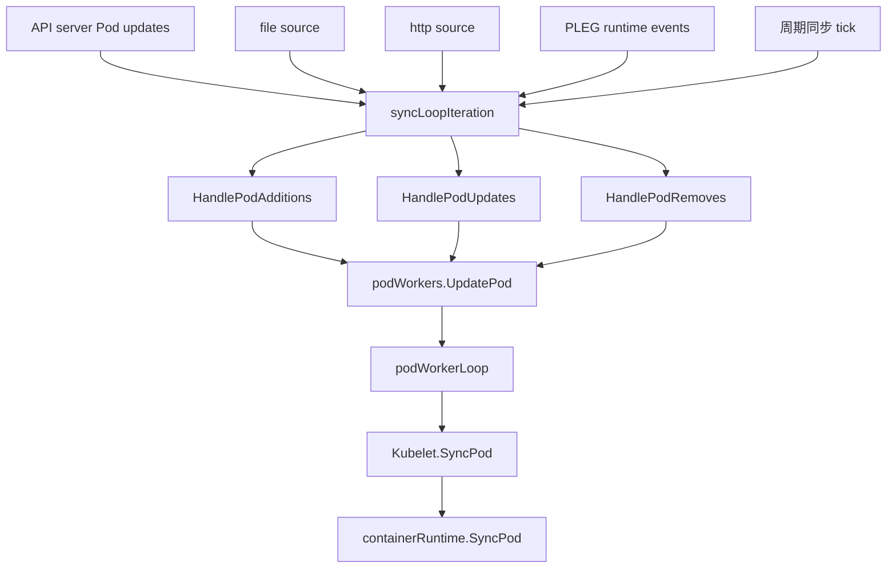
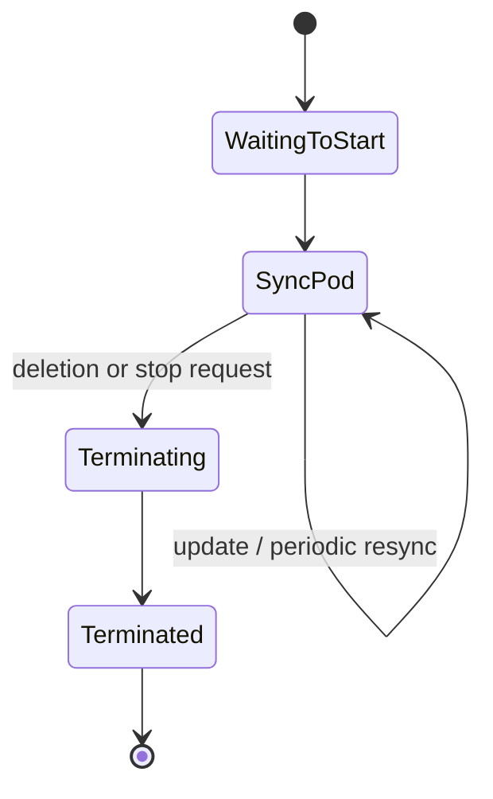

# Controllers 与 Kubelet：让 Kubernetes 活起来的两类对账器

## 为什么把这两者放在一起讲

controller 和 kubelet 所在层级不同，但它们共享同一种世界观：

- 先观察当前状态
- 再对比期望状态
- 做一步朝收敛方向的修正
- 如果还没收敛，就继续重试

区别只在作用域：

- controller 对账的是 **集群级意图**
- kubelet 对账的是 **节点级执行**

## 第一部分：Deployment controller 作为集群级 reconciler 的典型代表

最佳源码锚点：

- `pkg/controller/deployment/deployment_controller.go`
- `pkg/controller/deployment/sync.go`

### controller 的经典工作流

### `NewDeploymentController()` 做了什么

它为这些对象注册了 informer handler：

- Deployment
- ReplicaSet
- Pod

任何重要变化，最后都会被归并成一个 Deployment key 入队。

### worker 真正做的事情

`deployment_controller.go` 里的 `processNextWorkItem()` 非常经典：

1. 从 workqueue 里拿出一个 key
2. 调用 `syncHandler`
3. 成功就 `Forget`
4. 失败就 `AddRateLimited()`

这四步几乎就是 Kubernetes controller 模式的缩影。

### `sync.go` 到底在对什么账

在 `sync.go` 里，这个 controller 会：

- 找出新的和旧的 ReplicaSet
- 计算下一个 revision
- 伸缩正确的 ReplicaSet
- 在合适的时候清理旧状态
- 更新 Deployment status

它不是一次性 rollout 脚本，而是一个持续逼近目标的收敛循环。

## 给菜市场大妈也能听懂的类比

想象你经营一家面馆：

- 菜单上要求前台始终有 10 碗招牌面可卖
- 厨房现在只备好了 7 碗
- 你不会喊一句“做面”然后永远不看了
- 你会不断去看，直到前台真的有 10 碗

controller 的脑回路就是这样：**盯着“应该有多少”和“现在有多少”的差值，直到差值归零。**

## controller 的重试数学

`deployment_controller.go` 注释里给出的退避节奏近似是：

$$
5ms \times 2^{n-1}
$$

并且 `maxRetries = 15`。

所以等待时间大致是：

- `5ms`
- `10ms`
- `20ms`
- `40ms`
- ...
- 最后会上升到几十秒

这样做的目的，是避免有问题的对象把 controller 拉进高频空转。

## 第二部分：Kubelet 作为节点侧 reconciler

最佳源码锚点：

- `pkg/kubelet/kubelet.go`
- `pkg/kubelet/pod_workers.go`

### kubelet 的主同步循环

`kubelet.go` 里的 `syncLoop()` 与 `syncLoopIteration()` 会同时监听多种事件源：

- API server 下发的 Pod 更新
- file / HTTP pod source
- PLEG runtime 事件
- 周期性同步 tick
- housekeeping tick
- 健康检查和探针相关更新

### 为什么 `podWorkers` 如此关键

kubelet 不允许多个 goroutine 随便同时改同一颗 Pod。`podWorkers` 的职责就是为每颗 Pod 提供串行化处理。

这让 kubelet 拥有了一个近似于**每 Pod 独立状态机**的执行模型。

### `HandlePodAdditions()` 真正干了什么

当 kubelet 收到一颗新 Pod 时，它会：

1. 把 Pod 加入 pod manager
2. 处理证书与 mirror pod 关系
3. 做 admission / allocation 检查
4. 把一次 `UpdatePod()` 请求送入 pod worker 体系

所以这里并不是“立刻起容器”，而是“把本地期望状态体系更新好，让后续 worker 安全地收敛”。

### `SyncPod()` 真正做了什么

`SyncPod()` 才是节点侧落地动作最密集的地方。它会处理：

- Pod status 生成
- mirror pod 对齐
- cgroup 建立
- volume attach / mount 等待
- image pull secret 获取
- probe 注册
- 最后委托给 `containerRuntime.SyncPod(...)`

也就是说，kubelet 是 Kubernetes 对象世界到容器 runtime 世界的最终翻译器。

## kubelet 主循环里的错误退避

kubelet 主循环遇到 runtime error 时，也会做指数退避。

在 `kubelet.go` 里，参数是：

- base = `100ms`
- factor = `2`
- max = `5s`

所以序列会像这样：

- `100ms`
- `200ms`
- `400ms`
- `800ms`
- `1.6s`
- `3.2s`
- `5s` 封顶

这和 scheduler、controller 的风格完全一致：**允许重试，但拒绝失控。**

## 集群级对账 vs 节点级对账

| 维度 | Controllers | Kubelet |
| --- | --- | --- |
| 作用范围 | 整个集群资源 | 单节点上被分配到的 Pods |
| 触发源 | informer 事件 + resync | API/file/http/PLEG/ticks |
| 工作单元 | 通常是对象 key | Pod update |
| 主要动作 | 创建/更新/删除 API 对象 | 创建/更新/停止容器与 sandbox |
| 目标 | 让集群对象收敛 | 让节点运行态收敛 |

## 最重要的统一洞察

controller 和 kubelet，其实是同一个思想在不同放大倍数下的体现。

- Deployment controller 问的是：“ReplicaSet 和 Pod 是否匹配 Deployment 的意图？”
- kubelet 问的是：“这个节点上的容器是否匹配 Pod 的意图？”

Kubernetes 能成立，就是因为这两层都在不停地问这个问题，并不停地把答案往正确方向推进。

## 看完这一篇后建议怎么回看

再回去看 [`architecture.md`](architecture.md) 和 [`control-plane.md`](control-plane.md)，你会更强烈地意识到：

> 整个 Kubernetes 里，几乎每个组件都只是站在不同位置上的 reconciler。
