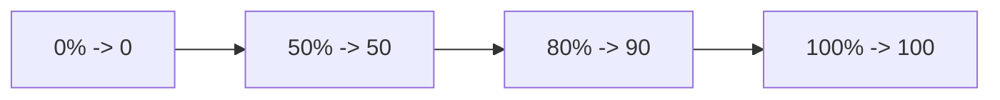
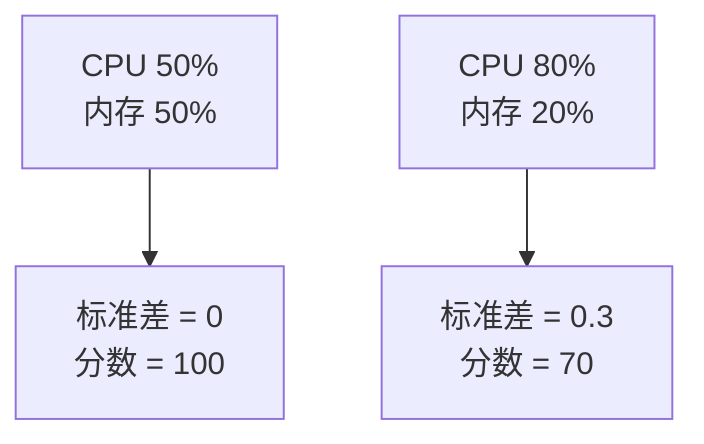

# 数学理论降维打击：把 Scheduler 打分、排队与退避讲成人话

## 为什么这一篇很重要

Kubernetes scheduler 看起来神秘，往往只是因为大家先被术语吓到了。真把代码扒开，会发现很多关键决策就是几个非常朴素的小公式。

这一篇会讲透：

- 资源 fit 检查
- LeastAllocated / MostAllocated 打分
- 可配置利用率曲线
- 用标准差表达平衡度
- 队列优先级排序
- 指数退避

## 1. Fit check：这颗 Pod 到底塞不塞得下？

源码锚点：`pkg/scheduler/framework/plugins/noderesources/fit.go`，重点看 `fitsRequest()`。

### 核心公式

对每种资源，都在检查：

$$
\text{Pod 请求量} \le \text{节点可分配量} - \text{已被请求量}
$$

### 公式里的字母在现实里是什么意思

- `Pod 请求量`：这颗新 Pod 想要多少 CPU / 内存 / 存储
- `节点可分配量`：节点真正能拿出来给 Pod 用的资源
- `已被请求量`：节点上已有 Pod 已经占走的那部分请求量

### 买菜篮子类比

你有一个最多能装 10 公斤的篮子：

- 里面已经有 6 公斤菜
- 现在还想塞 3 公斤水果
- 剩余空间是 `10 - 6 = 4`
- 因为 `3 <= 4`，所以能塞下

如果你现在想再塞 5 公斤，那就超了。

### 调度器数字例子

- 节点可分配 CPU：`4000m`
- 已被请求 CPU：`2500m`
- 新 Pod 请求 CPU：`1800m`
- 剩余 CPU：`1500m`

因为 `1800m > 1500m`，所以调度器会给出 **Insufficient cpu**。

## 2. LeastAllocated：偏爱“更空”的节点

源码锚点：`pkg/scheduler/framework/plugins/noderesources/least_allocated.go`

它先对每种资源算分，再按权重求平均。

$$
\text{score}_r = \frac{\text{capacity}_r - \text{requested}_r}{\text{capacity}_r} \times 100
$$

最后：

$$
\text{node score} = \frac{\sum_r \text{weight}_r \times \text{score}_r}{\sum_r \text{weight}_r}
$$

### 直觉解释

空余越多，得分越高。

### 例子

假设某节点在放下新 Pod 后会变成：

- CPU 已请求：`3/8`
- 内存已请求：`10/16`

那么：

- CPU 分数 = `(8 - 3) / 8 * 100 = 62.5`
- 内存分数 = `(16 - 10) / 16 * 100 = 37.5`
- 若权重相同，则综合分大约是 `50`

这说明它不算特别空，但也不算特别满。

## 3. MostAllocated：偏爱“更满”的节点

源码锚点：`pkg/scheduler/framework/plugins/noderesources/most_allocated.go`

它是 LeastAllocated 的镜像：

$$
\text{score}_r = \frac{\text{requested}_r}{\text{capacity}_r} \times 100
$$

### 直觉解释

现在不是“越空越好”，而是“越满越好”。这适合想要更紧凑装箱、保留更多空节点的策略。

### 例子

- CPU 使用率：`6/8 = 75%`
- 内存使用率：`12/16 = 75%`
- 综合分就是 `75`

也就是：这个节点很“满”，因此在打包型策略里反而更受欢迎。

## 4. RequestedToCapacityRatio：把调度策略写成一条曲线

源码锚点：

- `pkg/scheduler/framework/plugins/noderesources/requested_to_capacity_ratio.go`
- `pkg/scheduler/framework/plugins/helper/shape_score.go`

辅助函数 `BuildBrokenLinearFunction()` 会把一组点拼成折线函数。

### 核心思想

第一步，先算利用率：

$$
\text{utilization} = \frac{\text{requested}}{\text{capacity}} \times 100
$$

第二步，把这个利用率投到一条管理员预先配置好的折线函数上。

### 菜市场摊位类比

你可以想象一条规则：

- 空摊位价值低
- 半满摊位价值中等
- 快满的摊位价值很高

如果某节点利用率落在 `60%`，那它就位于 `50% -> 50` 和 `80% -> 90` 之间，因此分数也在这两点之间线性插值。

### 数字例子

如果折线点是：

- `(0, 0)`
- `(50, 50)`
- `(100, 100)`

那利用率是 `60%` 时，得分就是 `60`。

这类策略的妙处在于：管理员不是写死一个公式，而是画一条“偏好曲线”。

## 5. BalancedAllocation：用标准差衡量“是否均衡”

源码锚点：`pkg/scheduler/framework/plugins/noderesources/balanced_allocation.go`

这个插件关注的是：CPU、内存等资源的使用比例是否接近。

先算各资源分数：

$$
f_i = \frac{\text{requested}_i}{\text{allocatable}_i}
$$

再算标准差：

$$
\sigma = \sqrt{\frac{1}{n} \sum_i (f_i - \bar f)^2}
$$

最后近似得分：

$$
\text{score} = (1 - \sigma) \times 100
$$

### 把标准差讲成人话

如果 CPU 和内存的使用比例很接近，那么节点就“平衡”。

如果 CPU 快满了、内存却还很空，或者反过来，那节点就“不平衡”。

### 两资源场景下的极简理解

代码里特别指出：当只关心 CPU 和内存时，标准差可以被大幅简化。

如果：

- CPU 比例 = `0.8`
- 内存比例 = `0.2`

那么：

$$
\sigma = \frac{|0.8 - 0.2|}{2} = 0.3
$$

于是：

$$
\text{score} = (1 - 0.3) \times 100 = 70
$$

如果 CPU 和内存都恰好是 `0.5`，那 `\sigma = 0`，得分就是 `100`。

这就是这个插件的灵魂：**越均衡，越高分。**

## 6. 队列排序：优先级第一，时间第二

源码锚点：`pkg/scheduler/framework/plugins/queuesort/priority_sort.go`

这个排序规则非常短，但非常重要：

- Pod 优先级高的先来
- 如果优先级相同，先进入队列的先来

写成“类公式”就是：

$$
A \text{ 排在前面，当且仅当 } priority(A) > priority(B)
$$

如果优先级相等，则看：

$$
A \text{ 排在前面，当且仅当 } timestamp(A) < timestamp(B)
$$

### 例子

- Pod X：priority = `1000`，入队时间 `10:00`
- Pod Y：priority = `5000`，入队时间 `10:05`

尽管 Y 更晚进队，但它还是先被考虑，因为优先级压过时间。

## 7. Scheduler backoff：失败了要重试，但不能发疯重试

源码锚点：

- `pkg/scheduler/backend/queue/backoff_queue.go`
- `pkg/scheduler/backend/queue/scheduling_queue.go`

队列使用的是带上限的指数退避：

$$
\text{backoff}(n) = \min(\text{initial} \times 2^{n-1}, \text{max})
$$

直觉上的默认值通常可以理解为：

- 初始退避：`1s`
- 最大退避：`10s`

### 数字例子

如果连续失败：

- 第 1 次：`1s`
- 第 2 次：`2s`
- 第 3 次：`4s`
- 第 4 次：`8s`
- 第 5 次：`10s`（到顶）

### 这背后的系统直觉

如果集群一时拥塞，调度器不应该疯狂地对同一颗一时无法调度的 Pod 进行高频重试，否则只会制造更多噪音和负担。

## 8. 同样的数学风格也出现在别处

### Deployment controller 的重试

在 `pkg/controller/deployment/deployment_controller.go` 中，注释给出的重试节奏大致是：

$$
5ms \times 2^{n-1}
$$

并且 `maxRetries = 15`。

### kubelet 主循环的错误退避

在 `pkg/kubelet/kubelet.go` 中，主同步循环碰到 runtime error 时，也使用：

- base = `100ms`
- factor = `2`
- max = `5s`

你会发现整个 Kubernetes 的很多地方都在重复一个成熟思想：

> 出错了要重试，但不能把系统打进空转风暴。

## 最后的总领悟

Scheduler 一点都不神秘，它大量依赖的只是：

- 不等式判断
- 加权平均
- 折线插值
- 标准差衡量平衡
- 指数退避保证稳定

一旦你看穿这一层，很多“高深感”会瞬间蒸发，剩下的就是把代码与直觉一一对应。
