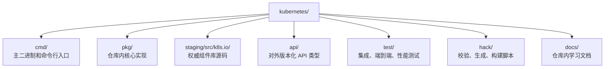
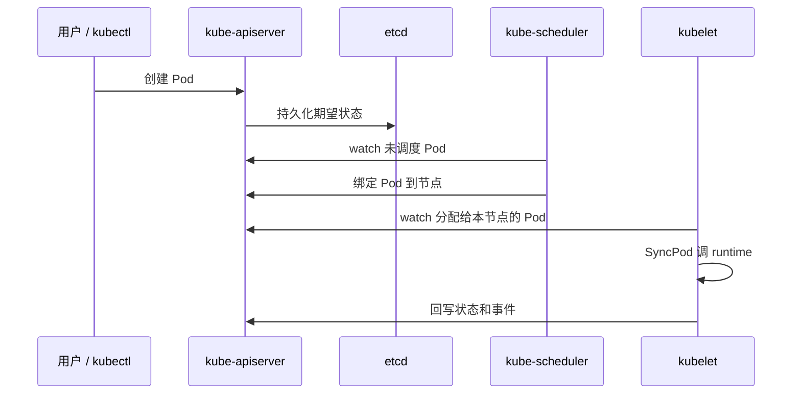

# 快速上手：如何阅读 Kubernetes 仓库而不被淹没

## 为什么这个仓库看起来像天书

因为它真的不只是一个“容器编排器”项目。这个仓库里同时装着：

- 控制面主二进制入口
- API machinery 通用基础设施
- scheduler framework
- 大量 controller 实现
- kubelet 节点代理
- 生成出来的 API 与 client
- 构建、发布、兼容性维护工具链

所以它给人的感觉更像一个“小型分布式操作系统”，而不是普通后端服务。

## 30 秒建立直觉

你可以把 Kubernetes 想成一座城市：

- `kube-apiserver` 是 **市政总账本**
- etcd 是 **存放总账本的保险柜**
- controllers 是 **反复核对账目的办事员**
- scheduler 是 **负责分配工位/地块的调度员**
- kubelet 是 **每个节点上的现场工头**

## 仓库地图

## 最该优先理解的顶层目录

| 路径 | 意义 |
| --- | --- |
| `cmd/` | 主进程入口：`kube-apiserver`、`kube-scheduler`、`kube-controller-manager`、`kubelet`、`kubectl`、`kubeadm` |
| `pkg/` | 该仓库特有的核心实现 |
| `staging/src/k8s.io/` | 被拆分发布出去的公共组件库源码真身 |
| `api/` | 对外版本化 API 类型定义 |
| `test/` | 真正用来揭穿理解偏差的测试区域 |
| `hack/` | 项目如何生成、校验、维护自身 |

## 先学哪四个二进制

| 二进制 | 入口文件 | 本质职责 |
| --- | --- | --- |
| `kube-apiserver` | `cmd/kube-apiserver/app/server.go` | 接收 API 请求、鉴权、准入、持久化、提供 watch |
| `kube-scheduler` | `cmd/kube-scheduler/app/server.go` | 给未调度 Pod 选节点 |
| `kube-controller-manager` | `cmd/kube-controller-manager/app/controllermanager.go` | 托管大量集群级控制循环 |
| `kubelet` | `cmd/kubelet/app/server.go` | 在节点上把 PodSpec 真正落成容器 |

## 最值得先追的一条主线

不要一开始就把所有子系统分开硬啃。先跟一条主线：

1. 客户端提交 Pod
2. API server 存下对象
3. scheduler 选出节点
4. kubelet 看到分配给自己的 Pod
5. kubelet 启动容器并持续上报状态

## 最值得先打开的文件

如果你现在只有一小时，建议按这个顺序打开：

1. `cmd/kube-apiserver/app/server.go`
2. `staging/src/k8s.io/apiserver/pkg/server/config.go`
3. `pkg/scheduler/schedule_one.go`
4. `pkg/scheduler/framework/plugins/noderesources/fit.go`
5. `pkg/scheduler/framework/plugins/noderesources/least_allocated.go`
6. `pkg/controller/deployment/deployment_controller.go`
7. `pkg/controller/deployment/sync.go`
8. `pkg/kubelet/kubelet.go`
9. `pkg/kubelet/pod_workers.go`
10. `staging/src/k8s.io/client-go/tools/cache/shared_informer.go`

## 一套实战阅读法

### 第一遍：只搭骨架

只回答四个问题：

- 每个主进程从哪里启动？
- 它读什么共享状态？
- 它写什么共享状态？
- 它是事件驱动还是周期驱动？

### 第二遍：只追一颗 Pod

从创建到运行，把一颗 Pod 的生命线完整走通。

### 第三遍：再看公式

先理解流程，再看 scheduler 的打分、退避、平衡度，效率最高。

## 一个极其重要的提醒

很多通用逻辑并不在 `pkg/`，而是在 `staging/src/k8s.io/`。如果你感觉 `pkg/` 里“缺了点什么”，先去 staged 组件里找，不要急着怀疑自己没搜对。

## 下一步

继续看 [`architecture.md`](architecture.md)，先把宏观骨架打牢，再进控制面与调度细节。
