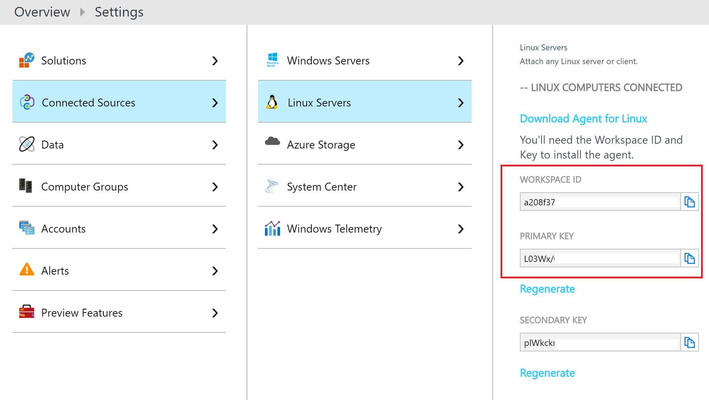
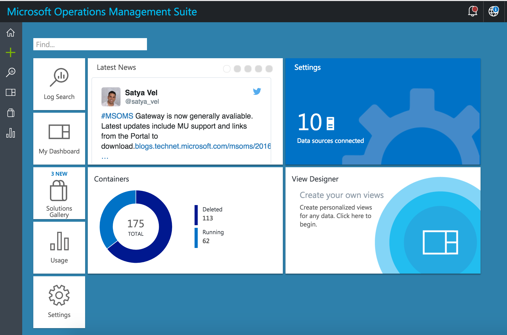
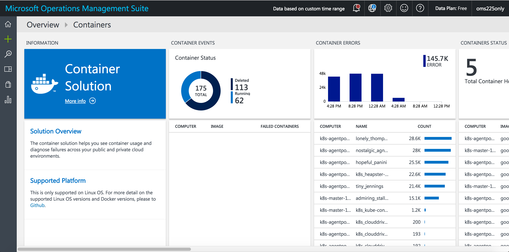

# Microsoft Operations Management Suite (OMS) Container Monitoring Example

The [Microsoft Operations Management Suite (OMS)](https://www.microsoft.com/en-us/cloud-platform/operations-management-suite) is a software-as-a-service offering from Microsoft that allows Enterprise IT to manage any hybrid cloud.

This example will create a DaemonSet to deploy the OMS Linux agents running as containers to every node in the Kubernetes cluster.

### Supported Linux Operating Systems & Docker
- Docker 1.10 thru 1.12.1

- An x64 version of the following:
	- Ubuntu 14.04 LTS, 16.04 LTS
	- CoreOS (stable)
	- Amazon Linux 2016.09.0
	- openSUSE 13.2
	- CentOS 7
	- SLES 12
	- RHEL 7.2

## Step 1

If you already have a Microsoft Azure account, you can quickly create a free OMS account by following the steps [here](https://docs.microsoft.com/en-us/azure/log-analytics/log-analytics-get-started#sign-up-quickly-using-microsoft-azure).

If you don't have a Microsoft Azure account, you can create a free OMS account by following the guide [here](https://docs.microsoft.com/en-us/azure/log-analytics/log-analytics-get-started#sign-up-in-3-steps-using-oms).

## Step 2

You will need to edit the [omsagent-daemonset.yaml](./omsagent-daemonset.yaml) file to add your Workspace ID and Primary Key of your OMS account.

```
- env:
        - name: WSID
          value: <your workspace ID>
        - name: KEY
          value: <your key>
```

The Workspace ID and Primary Key can be found inside the OMS Portal under Settings in the connected sources tab (see below screenshot).


## Step 3

Run the following command to deploy the OMS agent to your Kubernetes nodes:

```
kubectl -f omsagent-daemonset.yaml 
```

## Step 4

Add the Container solution to your OMS workspace:

1. Log in to the OMS portal.
2. Click the Solutions Gallery tile.
3. On the OMS Solutions Gallery page, click on Containers.
4. On the page for the Containers solution, detailed information about the solution is displayed. Click Add.

A new tile for the Container solution that you added appears on the Overview page in OMS. It would take 5 minutes for your data to appear in OMS.



