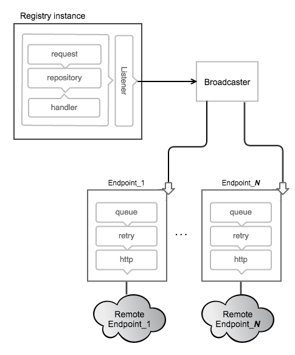

<!--[metadata]>
+++
title = "Working with notifications"
description = "Explains how to work with registry notifications"
keywords = ["registry, on-prem, images, tags, repository, distribution, notifications, advanced"]
[menu.main]
parent="smn_registry"
weight=5
+++
<![end-metadata]-->

# Notifications

The Registry supports sending webhook notifications in response to events
happening within the registry. Notifications are sent in response to manifest
pushes and pulls and layer pushes and pulls. These actions are serialized into
events. The events are queued into a registry-internal broadcast system which
queues and dispatches events to [_Endpoints_](#endpoints).



## Endpoints

Notifications are sent to _endpoints_ via HTTP requests. Each configured
endpoint has isolated queues, retry configuration and http targets within each
instance of a registry. When an action happens within the registry, it is
converted into an event which is dropped into an inmemory queue. When the
event reaches the end of the queue, an http request is made to the endpoint
until the request succeeds. The events are sent serially to each endpoint but
order is not guaranteed.

## Configuration

To setup a registry instance to send notifications to endpoints, one must add
them to the configuration. A simple example follows:

      notifications:
        endpoints:
          - name: alistener
            url: https://mylistener.example.com/event
            headers:
              Authorization: [Bearer <your token, if needed>]
            timeout: 500ms
            threshold: 5
            backoff: 1s

The above would configure the registry with an endpoint to send events to
`https://mylistener.example.com/event`, with the header "Authorization: Bearer
<your token, if needed>". The request would timeout after 500 milliseconds. If
5 failures happen consecutively, the registry will backoff for 1 second before
trying again.

For details on the fields, please see the [configuration documentation](configuration.md#notifications).

A properly configured endpoint should lead to a log message from the registry
upon startup:

```
INFO[0000] configuring endpoint alistener (https://mylistener.example.com/event), timeout=500ms, headers=map[Authorization:[Bearer <your token if needed>]]  app.id=812bfeb2-62d6-43cf-b0c6-152f541618a3 environment=development service=registry
```

## Events

Events have a well-defined JSON structure and are sent as the body of
notification requests. One or more events are sent in a structure called an
envelope. Each event has a unique id that can be used to uniquely identify incoming
requests, if required. Along with that, an _action_ is provided with a
_target_, identifying the object mutated during the event.

The fields available in an `event` are described below.

Field | Type | Description
----- | ----- | -------------
id | string |ID provides a unique identifier for the event.
timestamp | Time | Timestamp is the time at which the event occurred.
action |  string |  Action indicates what action encompasses the provided event.
target | distribution.Descriptor | Target uniquely describes the target of the event.
length | int | Length in bytes of content. Same as Size field in Descriptor.
repository | string | Repository identifies the named repository.
fromRepository | string |  FromRepository identifies the named repository which a blob was mounted from if appropriate.
url | string | URL provides a direct link to the content.
tag | string | Tag identifies a tag name in tag events
request | [RequestRecord](https://godoc.org/github.com/docker/distribution/notifications#RequestRecord) | Request covers the request that generated the event.
actor | [ActorRecord](https://godoc.org/github.com/docker/distribution/notifications#ActorRecord). |  Actor specifies the agent that initiated the event. For most situations, this could be from the authorization context of the request.
source | [SourceRecord](https://godoc.org/github.com/docker/distribution/notifications#SourceRecord) |  Source identifies the registry node that generated the event. Put differently, while the actor "initiates" the event, the source "generates" it.


The following is an example of a JSON event, sent in response to the push of a
manifest:

```json
{
   "events": [
      {
         "id": "320678d8-ca14-430f-8bb6-4ca139cd83f7",
         "timestamp": "2016-03-09T14:44:26.402973972-08:00",
         "action": "pull",
         "target": {
            "mediaType": "application/vnd.docker.distribution.manifest.v2+json",
            "size": 708,
            "digest": "sha256:fea8895f450959fa676bcc1df0611ea93823a735a01205fd8622846041d0c7cf",
            "length": 708,
            "repository": "hello-world",
            "url": "http://192.168.100.227:5000/v2/hello-world/manifests/sha256:fea8895f450959fa676bcc1df0611ea93823a735a01205fd8622846041d0c7cf",
            "tag": "latest"
         },
         "request": {
            "id": "6df24a34-0959-4923-81ca-14f09767db19",
            "addr": "192.168.64.11:42961",
            "host": "192.168.100.227:5000",
            "method": "GET",
            "useragent": "curl/7.38.0"
         },
         "actor": {},
         "source": {
            "addr": "xtal.local:5000",
            "instanceID": "a53db899-3b4b-4a62-a067-8dd013beaca4"
         }
      }
   ]
}
```


The target struct of events which are sent when manifests and blobs are deleted
will contain a subset of the data contained in Get and Put events.  Specifically,
only the digest and repository will be sent.

```json
"target": {
            "digest": "sha256:d89e1bee20d9cb344674e213b581f14fbd8e70274ecf9d10c514bab78a307845",
            "repository": "library/test"
},
```

> __NOTE:__ As of version 2.1, the `length` field for event targets
> is being deprecated for the `size` field, bringing the target in line with
> common nomenclature. Both will continue to be set for the foreseeable
> future. Newer code should favor `size` but accept either.

## Envelope

The envelope contains one or more events, with the following json structure:

```json
{
	"events": [ ... ],
}
```

While events may be sent in the same envelope, the set of events within that
envelope have no implied relationship. For example, the registry may choose to
group unrelated events and send them in the same envelope to reduce the total
number of requests.

The full package has the mediatype
"application/vnd.docker.distribution.events.v1+json", which will be set on the
request coming to an endpoint.

An example of a full event may look as follows:

```json
GET /callback
Host: application/vnd.docker.distribution.events.v1+json
Authorization: Bearer <your token, if needed>
Content-Type: application/vnd.docker.distribution.events.v1+json

{
   "events": [
      {
         "id": "asdf-asdf-asdf-asdf-0",
         "timestamp": "2006-01-02T15:04:05Z",
         "action": "push",
         "target": {
            "mediaType": "application/vnd.docker.distribution.manifest.v1+json",
            "length": 1,
            "digest": "sha256:fea8895f450959fa676bcc1df0611ea93823a735a01205fd8622846041d0c7cf",
            "repository": "library/test",
            "url": "http://example.com/v2/library/test/manifests/sha256:c3b3692957d439ac1928219a83fac91e7bf96c153725526874673ae1f2023f8d5"
         },
         "request": {
            "id": "asdfasdf",
            "addr": "client.local",
            "host": "registrycluster.local",
            "method": "PUT",
            "useragent": "test/0.1"
         },
         "actor": {
            "name": "test-actor"
         },
         "source": {
            "addr": "hostname.local:port"
         }
      },
      {
         "id": "asdf-asdf-asdf-asdf-1",
         "timestamp": "2006-01-02T15:04:05Z",
         "action": "push",
         "target": {
            "mediaType": "application/vnd.docker.container.image.rootfs.diff+x-gtar",
            "length": 2,
            "digest": "sha256:c3b3692957d439ac1928219a83fac91e7bf96c153725526874673ae1f2023f8d5",
            "repository": "library/test",
            "url": "http://example.com/v2/library/test/blobs/sha256:c3b3692957d439ac1928219a83fac91e7bf96c153725526874673ae1f2023f8d5"
         },
         "request": {
            "id": "asdfasdf",
            "addr": "client.local",
            "host": "registrycluster.local",
            "method": "PUT",
            "useragent": "test/0.1"
         },
         "actor": {
            "name": "test-actor"
         },
         "source": {
            "addr": "hostname.local:port"
         }
      },
      {
         "id": "asdf-asdf-asdf-asdf-2",
         "timestamp": "2006-01-02T15:04:05Z",
         "action": "push",
         "target": {
            "mediaType": "application/vnd.docker.container.image.rootfs.diff+x-gtar",
            "length": 3,
            "digest": "sha256:c3b3692957d439ac1928219a83fac91e7bf96c153725526874673ae1f2023f8d5",
            "repository": "library/test",
            "url": "http://example.com/v2/library/test/blobs/sha256:c3b3692957d439ac1928219a83fac91e7bf96c153725526874673ae1f2023f8d5"
         },
         "request": {
            "id": "asdfasdf",
            "addr": "client.local",
            "host": "registrycluster.local",
            "method": "PUT",
            "useragent": "test/0.1"
         },
         "actor": {
            "name": "test-actor"
         },
         "source": {
            "addr": "hostname.local:port"
         }
      }
   ]
}
```

## Responses

The registry is fairly accepting of the response codes from endpoints. If an
endpoint responds with any 2xx or 3xx response code (after following
redirects), the message will be considered delivered and discarded.

In turn, it is recommended that endpoints are accepting of incoming responses,
as well. While the format of event envelopes are standardized by media type,
any "pickyness" about validation may cause the queue to backup on the
registry.

## Monitoring

The state of the endpoints are reported via the debug/vars http interface,
usually configured to `http://localhost:5001/debug/vars`. Information such as
configuration and metrics are available by endpoint.

The following provides an example of a few endpoints that have experienced
several failures and have since recovered:

```json
"notifications":{
   "endpoints":[
      {
         "name":"local-5003",
         "url":"http://localhost:5003/callback",
         "Headers":{
            "Authorization":[
               "Bearer \u003can example token\u003e"
            ]
         },
         "Timeout":1000000000,
         "Threshold":10,
         "Backoff":1000000000,
         "Metrics":{
            "Pending":76,
            "Events":76,
            "Successes":0,
            "Failures":0,
            "Errors":46,
            "Statuses":{

            }
         }
      },
      {
         "name":"local-8083",
         "url":"http://localhost:8083/callback",
         "Headers":null,
         "Timeout":1000000000,
         "Threshold":10,
         "Backoff":1000000000,
         "Metrics":{
            "Pending":0,
            "Events":76,
            "Successes":76,
            "Failures":0,
            "Errors":28,
            "Statuses":{
               "202 Accepted":76
            }
         }
      }
   ]
}
```

If using notification as part of a larger application, it is _critical_ to
monitor the size ("Pending" above) of the endpoint queues. If failures or
queue sizes are increasing, it can indicate a larger problem.

The logs are also a valuable resource for monitoring problems. A failing
endpoint will lead to messages similar to the following:

```
ERRO[0340] retryingsink: error writing events: httpSink{http://localhost:5003/callback}: error posting: Post http://localhost:5003/callback: dial tcp 127.0.0.1:5003: connection refused, retrying
WARN[0340] httpSink{http://localhost:5003/callback} encountered too many errors, backing off
```

The above indicates that several errors have led to a backoff and the registry
will wait before retrying.

## Considerations

Currently, the queues are inmemory, so endpoints should be _reasonably
reliable_. They are designed to make a best-effort to send the messages but if
an instance is lost, messages may be dropped. If an endpoint goes down, care
should be taken to ensure that the registry instance is not terminated before
the endpoint comes back up or messages will be lost.

This can be mitigated by running endpoints in close proximity to the registry
instances. One could run an endpoint that pages to disk and then forwards a
request to provide better durability.

The notification system is designed around a series of interchangeable _sinks_
which can be wired up to achieve interesting behavior. If this system doesn't
provide acceptable guarantees, adding a transactional `Sink` to the registry
is a possibility, although it may have an effect on request service time.
Please see the
[godoc](http://godoc.org/github.com/docker/distribution/notifications#Sink)
for more information.
