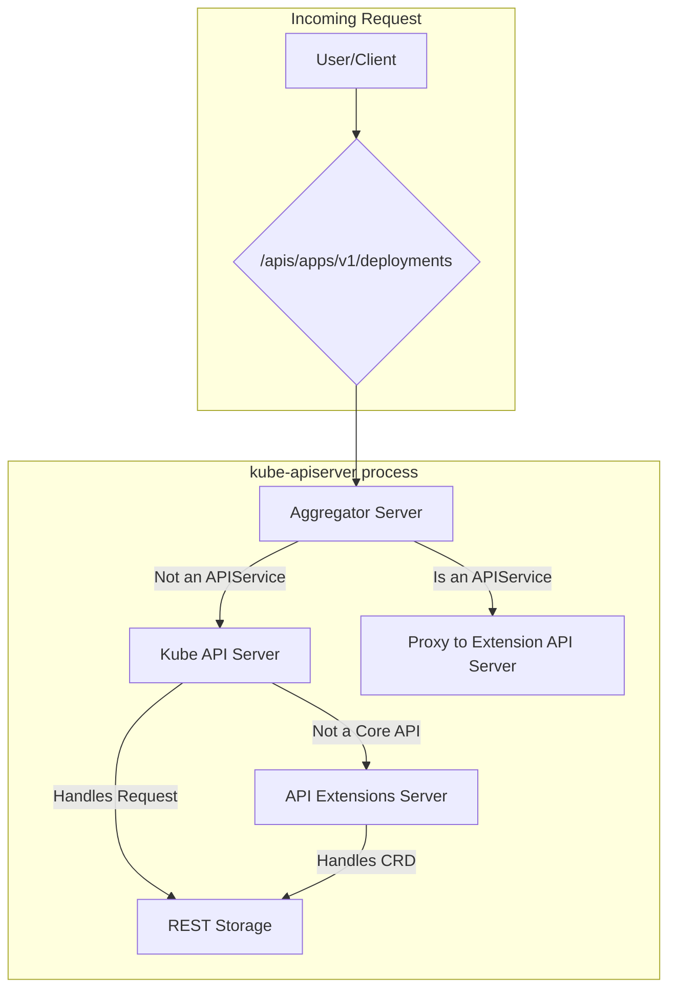
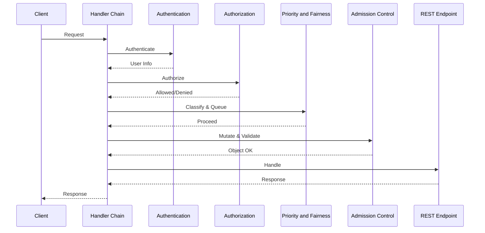
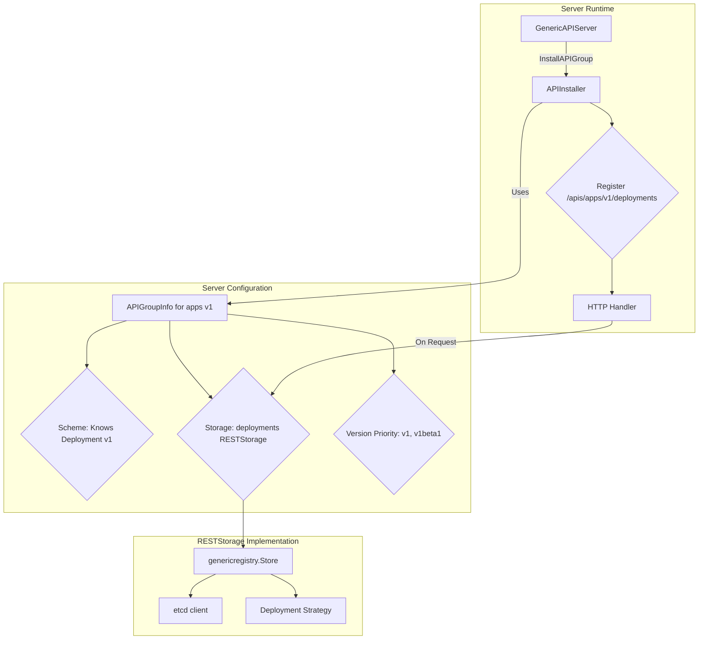

# apiserver Architecture

## 1. Server Composition

The `kube-apiserver` binary is not one server, but a **server chain** of three distinct
`GenericAPIServer` instances: the core Kubernetes API, API extensions (CRDs), and the aggregation
layer.

This composition is managed by a layered configuration system, starting with command-line
flags parsed by `options` structs (e.g., `RecommendedOptions` in `pkg/server/options`), which
populate a `Config` object that is then used to instantiate the `GenericAPIServer`
instances. The construction of this delegation chain can be found in the `CreateServerChain`
function in `cmd/kube-apiserver/app/server.go`.

1.  **Aggregator Server (`kube-aggregator`):**
    *   **Purpose:** Handles the `apiregistration.k8s.io` API and acts as a reverse proxy for
        extension API servers. This functionality was designed to allow third-party APIs to be
        "aggregated" into the main Kubernetes API server seamlessly.
    *   **Mechanism:** It watches `APIService` objects. When a request arrives (e.g., for
        `/apis/mycompany.com/v1/myresources`), it checks if an `APIService` has "claimed"
        that path. If so, it uses a `ServiceResolver` to find the IP of the backing
        `Service` and proxies the request.
    *   **Use Case:** This pattern is for programmatic, high-control extensions that require
        custom business logic (e.g., non-CRUD subresources like `/logs`) or alternative
        storage backends.
    *   **Delegation:** If no `APIService` matches, it delegates the request to the next
        server in the chain.

2.  **Kube API Server (Core):**
    *   **Purpose:** Serves all the built-in Kubernetes APIs (`core/v1`, `apps/v1`, etc.).
    *   **Mechanism:** This is the main server, configured with all the core REST storage
        strategies.
    *   **Delegation:** If a request is for a path that is not a core API (e.g., for a CRD),
        it delegates the request to the next server in the chain.

3.  **API Extensions Server (`apiextensions-apiserver`):**
    *   **Purpose:** Handles the `apiextensions.k8s.io` API, which manages
        `CustomResourceDefinition` objects (CRDs). The evolution of CRDs from a simple extension
        mechanism to a feature-rich system with validation, versioning, and defaulting is
        documented in a series of KEPs, starting with the graduation to GA in Kubernetes v1.16.
    *   **Mechanism:** When a CRD is created, this server dynamically creates and installs a
        new REST storage handler for the new resource, making it immediately available.
    *   **Use Case:** CRDs are the most common extension pattern, offering a declarative,
        schema-based way to define new resource types that are stored in etcd and require no
        custom API server code.
    *   **Delegation:** It is the end of the chain. If it cannot handle a request, a `404 Not
        Found` is returned.

## 2. Handler Chain

Every request flows through a standard chain of HTTP handlers (filters). The request body
is not deserialized until it has passed authentication and authorization. The default handler
chain is constructed by the `DefaultBuildHandlerChain` function in
`staging/src/k8s.io/apiserver/pkg/server/config.go`.

The handler chain consists of the following stages:

1.  **Authentication (`pkg/authentication`):** This filter identifies the user. The system is
    pluggable and composed of multiple authenticators (e.g., client certs, bearer tokens, OIDC).
    The identity of the user is determined by the first authenticator in the chain that successfully
    identifies the user.
2.  **Authorization (`pkg/authorization`):** This filter checks if the user is permitted to
    perform the action. This system is also pluggable and composed of multiple authorizers
    (e.g., RBAC, Node, Webhook). Each authorizer may respond with either allow, deny, or no opinion.
    If the response is no opinion, the request is passed to the next authorizer in the chain.
3.  **Priority and Fairness (`pkg/util/flowcontrol`):** This subsystem manages request
    concurrency, classifying requests into `FlowSchema`s and `PriorityLevel`s to prevent
    overload. This feature was introduced to prevent high traffic from overwhelming the API
    server and to ensure that critical cluster operations are not starved.
4.  **Admission Control (`pkg/admission`):** This is the primary mechanism for policy
    enforcement. It is only at this stage that the request body is deserialized into an
    object. It is a chain of plugins that can mutate or validate an object. The built-in Pod
    Security admission controller is a key example of this, enforcing Pod Security Standards
    at the namespace level.
5.  **REST Endpoint Handling (`pkg/endpoints`):** The request is finally dispatched to the
    appropriate REST handler, which is installed by the `APIInstaller`.

## 3. API Group Registration

The high-level steps for introducing an API are:

1.  **Define Types:** Create or modify the Go structs in the `types.go` file for the API group.
2.  **Generate Code:** Use the code generators provided by the Kubernetes project to create the required
    boilerplate methods for deep-copy, conversion, and defaulting.
3.  **Implement the `Strategy`:** Write the custom business logic and validation for the
    resource in its `Strategy` object.
4.  **Register and Install:** Create the `APIGroupInfo` struct, bundling the `Scheme` and the
    `Strategy`-configured storage, and pass it to the `GenericAPIServer`'s `InstallAPIGroup`
    method.

### The API Group Registry

The `runtime.Scheme` acts as a central registry for an API group's type information. A single
`Scheme` object is created for each API group and is responsible for the following key
capabilities:

*   **Type Registration and Mapping:** The `Scheme`'s primary role is to map a GroupVersionKind
    (GVK) to its corresponding Go type and back. This process also relies on the `deepcopy-gen`
    tool to create `DeepCopy()` methods for each type, which is critical for ensuring that
    objects returned from caches are never modified directly.

*   **API Conversion:** The `Scheme` stores the conversion functions that translate objects
    between different API versions. These functions are typically generated by the
    `conversion-gen` tool and enable the **hub-and-spoke** model.

*   **Defaulting:** The `Scheme` registers defaulting functions that populate optional fields in
    an object. These are usually generated by the `defaulter-gen` tool.

*   **Declarative Validation:** The `Scheme` can store and execute code-generated validation
    functions, providing a baseline level of validation. This is distinct from the primary,
    handwritten business logic validation, which is handled by the `Strategy` object.

### The `APIGroupInfo` Struct and `Strategy` Object

With a populated `Scheme`, the API group is registered with the `GenericAPIServer` by bundling
the `Scheme` with the storage backend and versioning information into an `APIGroupInfo` struct.

The registration process follows these steps:

1.  **`APIGroupInfo` Construction:** For each API group, an `APIGroupInfo` struct is created,
    which contains the populated `Scheme`, a map of resources to their storage
    implementations, and an ordered list of **Version Priority**.

2.  **REST Storage Instantiation:** For each resource, a `genericregistry.Store` is created. It
    is configured with a resource-specific `Strategy` object that contains the core business
    logic (e.g., handwritten validation).

3.  **API Group Installation:** The `GenericAPIServer`'s `InstallAPIGroup` method takes the
    `APIGroupInfo` and uses an `APIInstaller` to expose the resources as HTTP endpoints.

## 4. Watch Cache

To handle the high volume of watch requests from controllers without overwhelming etcd, the
apiserver uses a **watch cache**. The implementation can be found in
`staging/src/k8s.io/apiserver/pkg/storage/cacher/`.

*   **Initialization:** The cacher first performs a `LIST` to get the current state of all
    objects and a `ResourceVersion` for that point-in-time. It then starts a `WATCH` from
    that version to ensure a consistent stream of events.
*   **Serving from Cache:** Most list and watch requests are served from this in-memory cache, which
    dramatically reduces the load on etcd. Consistent reads are also served from the
    cache. This is achieved by first fetching the revision number of the latest write from
    etcd. The server then ensures the cache is at least that recent—waiting for it to
    refresh if necessary—before serving the request.
*   **Fallback to Storage:** If a client request cannot be served from the
    cache's buffer, the request "falls through" to the underlying etcd storage.
*   **Bookmarks:** The cacher uses bookmark events to track the latest `ResourceVersion` for
    unchanged objects. This prevents the cache's `ResourceVersion` from becoming too old,
    which avoids the need for expensive relist operations from etcd when the objects have
    not been modified.

## 5. Conflict Resolution

*   **Optimistic Concurrency via `resourceVersion`:** Clients are expected to perform updates using a
    read-modify-write workflow. The apiserver uses the `resourceVersion` field of every
    object to enforce optimistic concurrency. This `resourceVersion` is not an arbitrary number;
    it maps directly to etcd's globally consistent `mod_revision`. When a client submits an
    update (`PUT` or `PATCH`), it must provide the `resourceVersion` of the object it based its
    modifications on. If the `resourceVersion` on the server does not match the current
    `mod_revision` in etcd, the server rejects the request with a `409 Conflict` error. This
    forces the client to re-read the object, resolve the conflict, and resubmit with the new
    `resourceVersion`.
*   **Server-Side Apply:** A declarative, "intent-based" patch. The server maintains a
    `managedFields` section in the object's metadata to track which "manager" (e.g., a
    controller) owns each field. This allows multiple actors to manage different parts of the
    same object without overwriting each other's changes.

## 6. Discovery and OpenAPI

Apiservers serve the `/apis` discovery endpoints and the `/openapi/v2` and `/openapi/v3`
specifications. The generation of the OpenAPI specification is a multi-stage process.

*   **`openapi-gen`**: This tool reflects on Go structs, reads godoc comments, and looks at
    validation struct tags to generate a map of all API definitions.
*   **`zz_generated.openapi.go`**: The output is a large Go file containing a
    `GetOpenAPIDefinitions` function.
*   **Runtime**: The `GenericAPIServer` calls this generated function to build the final OpenAPI
    JSON spec that it serves to clients.

## 7. Security & Observability

*   **Audit (`pkg/audit`):** The apiserver has a policy-driven event logging pipeline. The audit
    policy controls what is logged and at which stage of a request.
*   **Security:**
    *   **mTLS:** The primary authentication mechanism for system components.
    *   **Service Account Token Issuance:** The `kube-apiserver` acts as an OIDC provider,
        issuing and validating JWTs for `ServiceAccount`s.

## 8. Streaming Protocols

*   **Websockets:** The apiserver uses websockets to upgrade HTTP
    connections for interactive, streaming protocols like `exec`, `attach`, and
    `port-forward`. The `UpgradeAwareProxyHandler` manages this process.
