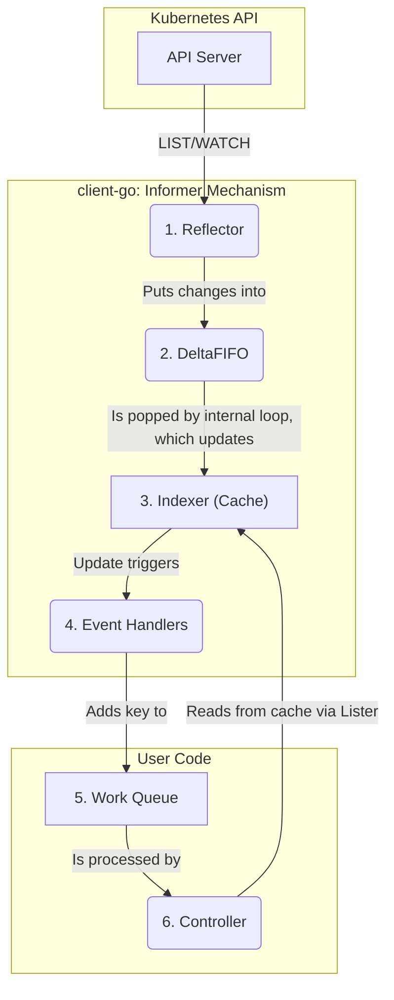

# `client-go` Architecture

This document explains the internal architecture of `client-go` for contributors. It describes the
major components, how they interact, and the key design decisions that shape the library.

## Client Configuration

There is an architectural separation between loading client configuration and using it. The
`rest.Config` object is the in-memory representation of this configuration. The
`tools/clientcmd` package is the standard factory for producing it. `clientcmd` handles the
complex logic of parsing `kubeconfig` files, merging contexts, and handling external
authentication providers (e.g., OIDC).

## REST Client

The `rest.Client` is the foundational HTTP client that underpins all other clients. It separates
the low-level concerns of HTTP transport, serialization, and error handling from higher-level,
Kubernetes-specific object logic.

The `rest.Config` object is used to build the underlying HTTP transport, which is typically a
chain of `http.RoundTripper` objects. Each element in the chain is responsible for a specific
task, such as adding an `Authorization` header. This is the mechanism by which all authentication
is injected into requests.

The client uses a builder pattern for requests (e.g., `.Verb()`, `.Resource()`), deferring
response processing until a method like `.Into(&pod)` is called. This separation is key to
supporting different client models from a common base.

### Endpoint Interactions

*   **Content Negotiation:** The client uses HTTP `Accept` headers to negotiate the wire format
    (JSON or Protobuf). A key performance optimization using this mechanism is the ability to
    request metadata-only objects via the `as=PartialObjectMetadata;g=meta.k8s.io;v=v1` Accept custom parameter.
    Also the `as=Table;g=meta.k8s.io;v=v1` Accept custom parameters may be used to request lists as tables. 
*   **Subresources:** The client can target standard subresources like `/status` or `/scale` for
    object mutations, and it can also handle action-oriented subresources like `/logs` or
    `/exec`, which often involve streaming data.
*   **List Pagination:** For `LIST` requests, the client can specify a `limit`. The server will
    return up to that many items and, if more exist, a `continue` token. The client is
    responsible for passing this token in a subsequent request to retrieve the next page.
    Higher-level tools like the `Reflector`'s `ListerWatcher` handle this logic automatically.
*   **Streaming Watches:** A `WATCH` request returns a `watch.Interface` (from
    `k8s.io/apimachinery/pkg/watch`), which provides a channel of structured `watch.Event`
    objects (`ADDED`, `MODIFIED`, `DELETED`, `BOOKMARK`). This decouples the watch consumer from
    the underlying streaming protocol.

### Errors, Warnings, and Rate Limiting

*   **Structured Errors:** The client deserializes non-2xx responses into a structured
    `errors.StatusError`, enabling programmatic error handling (e.g., `errors.IsNotFound(err)`).
*   **Warnings:** It processes non-fatal `Warning` headers from the API server via a
    `WarningHandler`.
*   **Client-Side Rate Limiting:** The `QPS` and `Burst` settings in `rest.Config` are the
    client's half of the contract with the server's API Priority and Fairness system.
*   **Server-Side Throttling:** The client's default transport automatically handles HTTP `429`
    responses by reading the `Retry-After` header, waiting, and retrying the request.

## Typed and Dynamic Clients

To handle the extensible nature of the Kubernetes API, `client-go` provides two primary client
models.

The **`kubernetes.Clientset`** provides compile-time, type-safe access to core, built-in APIs.

The **`dynamic.DynamicClient`** represents all objects as `unstructured.Unstructured`, allowing it
to interact with any API resource, including CRDs. It relies on two discovery mechanisms:
1.  The **`discovery.DiscoveryClient`** determines *what* resources exist. The
    **`CachedDiscoveryClient`** is an optimization that caches this data on disk to solve.
2.  The **OpenAPI schema** (fetched from `/openapi/v3`) describes the *structure* of those
    resources, providing the schema awareness needed by the dynamic client.

## Code Generation

A core architectural principle of `client-go` is the use of code generation to provide a
strongly-typed, compile-time-safe interface for specific API GroupVersions. This makes
controller code more robust and easier to maintain. The tools in `k8s.io/code-generator` produce
several key components:

*   **Typed Clientsets:** The primary interface for interacting with a specific GroupVersion.
*   **Typed Listers:** The read-only, cached accessors used by controllers.
*   **Typed Informers:** The machinery for populating the cache for a specific type.
*   **Apply Configurations:** The type-safe builders for Server-Side Apply.

A contributor modifying a built-in API type **must** run the code generation scripts to update all
of these dependent components. For the Kubernetes project, `hack/update-codegen.sh` runs code generation.

`sample-controller` shows how code generate can be configured to build custom controllers.

## Controller Infrastructure

The `tools/cache` package provides the core infrastructure for controllers, replacing a high-load,
request-based pattern with a low-load, event-driven, cached model.

The data flow is as follows:

A **`Reflector`** performs a `LIST` to get a consistent snapshot of a resource, identified by a
`resourceVersion`. It then starts a `WATCH` from that `resourceVersion` to receive a continuous
stream of subsequent changes. The `Reflector`'s relist/rewatch loop is designed to solve the
**"too old" `resourceVersion` error** by re-listing. To make this recovery more efficient, the
`Reflector` consumes **watch bookmarks** from the server, which provide a more recent
`resourceVersion` to restart from.

The **`Lister`** is the primary, read-only, thread-safe interface for a controller's business
logic to access the `Indexer`'s cache.

## Controller Patterns

The controller infrastructure is architecturally decoupled from the controller's business logic to
ensure resiliency.

The **`util/workqueue`** creates a critical boundary between event detection (the informer's job)
and reconciliation (the controller's job). Informer event handlers only add an object's key to the
work queue. This allows the controller to retry failed operations with exponential backoff without
blocking the informer's watch stream.

For high availability, the **`tools/leaderelection`** package provides the standard architectural
solution to ensure single-writer semantics by having replicas compete to acquire a lock on a
shared `Lease` object.

## Server-Side Apply

`client-go` provides a distinct architectural pattern for object mutation that aligns with the
server's declarative model. This is a separate workflow from the traditional `get-modify-update`
model that allows multiple controllers to safely co-manage the same object. The
**`applyconfigurations`** package provides the generated, type-safe builder API used to
construct the declarative patch.

## Versioning and Compatibility

`client-go` has a strict versioning relationship with the main Kubernetes repository. A `client-go`
version `v0.X.Y` corresponds to the Kubernetes version `v1.X.Y`.

The Kubernetes API has strong backward compatibility guarantees: a client built with an older
version of `client-go` will work with a newer API server. However, the reverse is not guaranteed.
A contributor must not break compatibility with supported versions of the Kubernetes API server.
