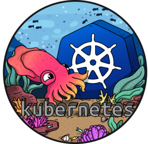

# Kubectl

 

The `k8s.io/kubectl` repo is used to track issues for the kubectl cli distributed
with `k8s.io/kubernetes`. It also contains packages intended for use by client
programs. E.g. these packages are vendored into `k8s.io/kubernetes` for use in
the [kubectl](https://github.com/kubernetes/kubernetes/tree/master/cmd/kubectl)
cli client. That client will eventually move here too.

## Contribution Requirements

- Full unit-test coverage.

- Go tools compliant (`go get`, `go test`, etc.). It needs to be vendorable
  somewhere else.

- No dependence on `k8s.io/kubernetes`. Dependence on other repositories is fine.

- Code must be usefully [commented](https://golang.org/doc/effective_go.html#commentary).
  Not only for developers on the project, but also for external users of these packages.

- When reviewing PRs, you are encouraged to use Golang's [code review
  comments](https://github.com/golang/go/wiki/CodeReviewComments) page.

- Packages in this repository should aspire to implement sensible, small
  interfaces and import a limited set of dependencies.

## Community, discussion, contribution, and support

See [this document](https://github.com/kubernetes/community/tree/master/sig-cli) for how to reach the maintainers of this project.

### Code of conduct

Participation in the Kubernetes community is governed by the [Kubernetes Code of Conduct](code-of-conduct.md).
