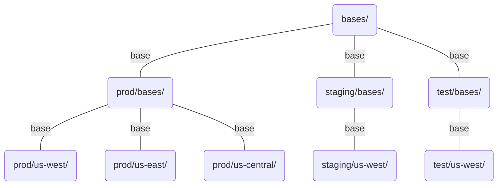


**Provide feedback at the [survey](https://www.surveymonkey.com/r/JH35X82)**



**Content in this chapter is experimental and will evolve based on user feedback.**

Leave feedback on the conventions by creating an issue in the [kubectl](https://github.com/kubernetes/kubectl/issues)
GitHub repository.

Also provide feedback on new kubectl docs at the [survey](https://www.surveymonkey.com/r/JH35X82)



- Use **directory hierarchy to structure Resource Config**
  - Separate directories for separate Environment and Cluster [Config Variants](../app_customization/bases_and_variants.md)


# Directory Structure Based Layout

## Motivation


While this chapter is focused on conventions when using Directories, Branches and
Repositories should be used with Directories as needed.



The techniques and conventions in this Chapter work regardless of whether or not the Resource Config
exists in the same Repository as the source code that is being deployed.


## Directory Structure

| Dir Type       | Deployed to a Cluster            | Contains | Example Names |
|----------------|----------------------------------|----------|---------------|
| Base           | **No** - Used as base | Shared Config. | `base/` |
| Env            | **No** - Contains other dirs | Base and Cluster dirs.  | `test/`, `staging/`, `prod/` |
| Cluster        | **Yes** - Manually or Continuously  | Deployable Config. | `us-west1`, `us-east1`, `us-central1` |


### Bases

A Kustomize Base (e.g. `bases:`) provides shared Config that is customized by some consuming `kustomization.yaml`.

The directory structure outlined in this chapter organizes Bases into a hierarchy as:
`app-bases/environment-bases/cluster`
 
## Workflow Example

- Changes made to *env/cluster/* roll out to **only that specific env-cluster**
- Changes made to *env>/bases/* roll out to **all clusters for that env**
- Changes made to *bases/* roll out to **all clusters in all envs**

## Diagram



### Scenario

1. Alice modifies prod/us-west1 with change A
  - Change gets pushed to prod us-west1 cluster by continuous deployment
1. Alice modifies prod/bases with change B
  - Change gets pushed to all prod clusters by continuous deployment
1. Alice modifies bases with change C
  - Change gets pushed to all clusters by continuous deployment



participant Config in Git as B
participant Test Cluster as TC
participant Staging Cluster as SC
participant US West Prod Cluster as WC
participant US East Prod Cluster as EC

Note over B: Alice modifies prod/us-west1 with change A
B-->WC: A deployed

Note over B: Alice modifies prod/bases with change B
B-->EC: B deployed
B-->WC: B deployed

Note over B: Alice modifies bases/ with change C
B-->EC: C deployed
B-->TC: C deployed
B-->WC: C deployed
B-->SC: C deployed





Techniques:
 
- Each Layer adds a [namePrefix](../app_management/namespaces_and_names.md#setting-a-name-prefix-or-suffix-for-all-resources) and [commonLabels](../app_management/labels_and_annotations.md#setting-labels-for-all-resources).
- Each Layer adds labels and annotations.
- Each deployable target sets a [namespace](../app_management/namespaces_and_names.md#setting-the-namespace-for-all-resources).
- Override [Pod Environment Variables and Arguments](../app_customization/customizing_pod_templates.md) using `configMapGenerator`s with `behavior: merge`.
- Perform Last-mile customizations with [patches / overlays](../app_customization/customizing_arbitrary_fields.md)

Structure:

- Put reusable bases under `*/bases/`
  - `<project-name>/bases/`
  - `<project-name>/<environment>/bases/`
- Put deployable targets under `<project-name>/<environment>/<cluster>/`



```bash
tree
.
├── bases # Used as a Base only
│   ├── kustomization.yaml
│   ├── backend
│   │   ├── deployment.yaml
│   │   └── service.yaml
│   ├── frontend
│   │   ├── deployment.yaml
│   │   ├── ingress.yaml
│   │   └── service.yaml
│   └── storage
│       ├── service.yaml
│       └── statefulset.yaml
├── prod # Production
│   ├── bases 
│   │   ├── kustomization.yaml # Uses bases: ["../../bases"]
│   │   ├── backend
│   │   │   └── deployment-patch.yaml # Production Env specific backend overrides
│   │   ├── frontend
│   │   │   └── deployment-patch.yaml # Production Env specific frontend overrides
│   │   └── storage
│   │       └── statefulset-patch.yaml # Production Env specific storage overrides
│   ├── us-central
│   │   ├── kustomization.yaml # Uses bases: ["../bases"]
│   │   └── backend
│   │       └── deployment-patch.yaml # us-central cluster specific backend overrides
│   ├── us-east 
│   │   └── kustomization.yaml # Uses bases: ["../bases"]
│   └── us-west 
│       └── kustomization.yaml # Uses bases: ["../bases"]
├── staging # Staging
│   ├── bases 
│   │   ├── kustomization.yaml # Uses bases: ["../../bases"]
│   └── us-west 
│       └── kustomization.yaml # Uses bases: ["../bases"]
└── test # Test
    ├── bases 
    │   ├── kustomization.yaml # Uses bases: ["../../bases"]
    └── us-west 
        └── kustomization.yaml # Uses bases: ["../bases"]
```




Though the directory structure contains the cluster in the path, this won't be used by
Apply to determine the cluster context.  To Apply a specific cluster, add that cluster to the 
kubectl config`, and specify the corresponding context when running Apply.

For more information see [Multi-Cluster](accessing_multiple_clusters.md).



Some git hosting services provide the concept of *Code Owners* for providing a finer grain permissions model.
*Code Owners* may be used to provide separate permissions for separate environments - e.g. dev, test, prod.


## Rollback Diagram



participant Config in Git as B
participant Test Cluster as TC
participant Staging Cluster as SC
participant US West Prod Cluster as WC
participant US East Prod Cluster as EC

Note over B: Bob modifies bases/ with change B
B-->EC: B deployed
B-->SC: B deployed
B-->WC: B deployed
Note over B,EC: Prod Outage caused by B
B-->TC: B deployed
Note over B: Bob rolls back bases/ git commits to A
B-->WC: A deployed
B-->TC: A deployed
B-->EC: A deployed
Note over B,EC: Prod Outage resolved
B-->SC: A deployed


