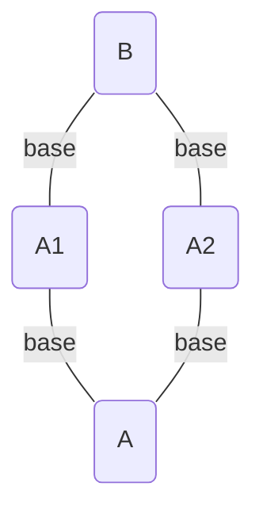


**Provide feedback at the [survey](https://www.surveymonkey.com/r/JH35X82)**



**Content in this chapter is experimental and will evolve based on user feedback.**

Leave feedback on the conventions by creating an issue in the [kubectl](https://github.com/kubernetes/kubectl/issues)
GitHub repository.

Also provide feedback on new kubectl docs at the [survey](https://www.surveymonkey.com/r/JH35X82)



- The same Base may be used multiple times for different Applications within the same project.


# Composition with Shared Bases

## Motivation

Users may want to reuse the **same base multiple times within the same Apply Project**.  Examples:

- Define a very generic base (e.g. "Java Application") used by multiple Applications within a Project.
- Define multiple Environments (e.g. Staging, Canary, Prod) within a Project.

## Composition With A Shared Base





It is possible to reuse the same base multiple times within the same project by using a 3-tier
structure to compose multiple Variants of the base.

1. Generic Base in a `kustomization.yaml`.
1. Variants of the Generic Base in multiple `kustomization.yaml`'s.
1. Compose Variants as Bases to a single `kustomization.yaml`.

Each layer may add customizations and resources to the preceding layers.

Generic Base Layer: **../base/java**

- define the java app base Deployment
- define the java app base Service

Variant Layers: **../app1/ + ../app2/**

- inherit the generic base
- set a namePrefix
- set labels and selectors
- overlay an image on the base
- set the image tag

Composition Layer: **kustomization.yaml**

- compose the 2 apps as bases
- set the namespace for Resources in the project
- set a namePrefix for Resources in the project


**Generic Base Layer:**

```yaml
# base/java/kustomization.yaml
resources:
- deployment.yaml
- service.yaml
```

```yaml
# base/java/deployment.yaml
apiVersion: apps/v1
kind: Deployment
metadata:
  labels:
    app: java
  name: java
spec:
  selector:
    matchLabels:
      app: java
  template:
    metadata:
      labels:
        app: java
    spec:
      containers:
      - image: java
        name: java
        ports:
        - containerPort: 8010
        livenessProbe:
          httpGet:
            path: /health
            port: 8010
          initialDelaySeconds: 30
          timeoutSeconds: 1
        readinessProbe:
          httpGet:
            path: /ready
            port: 8010
          initialDelaySeconds: 30
          timeoutSeconds: 1
```

```yaml
# base/java/service.yaml
kind: Service
apiVersion: v1
metadata:
  name: java
spec:
  selector:
    app: app
  ports:
  - protocol: TCP
    port: 8080
    targetPort: 8080
```

**Variant Layers 1 and 2:**

```yaml
# app1/kustomization.yaml
namePrefix: 1-
commonLabels:
  app: app1
bases:
- ../base/java
patchesStrategicMerge:
- overlay.yaml
images:
  - name: myapp1
    newTag: v2
```

```yaml
# app1/overlay.yaml
apiVersion: apps/v1
kind: Deployment
metadata:
  name: java
spec:
  template:
    spec:
      containers:
      - image: myapp1
        name: java
```

```yaml
# ../app2/kustomization.yaml
namePrefix: 2-
commonLabels:
  app: app2
bases:
- ../base/java
patchesStrategicMerge:
- overlay.yaml
images:
  - name: myapp2
    newTag: v1
```

```yaml
# app2/overlay.yaml
apiVersion: apps/v1
kind: Deployment
metadata:
  name: java
spec:
  template:
    spec:
      containers:
      - image: myapp2
        name: java
```

**Composition Layer:**

```yaml
# kustomization.yaml
namePrefix: app-
namespace: app
bases:
- app1
- app2
```




**Result**:

- 2 Deployments are created
- Each Deployment has a different images
- Each Deployment has different labels / selectors
- Each Deployment has a different name
- 2 Services are created
- Each Service has different selectors, matching the corresponding Deployment
- All Resource names share the same prefix
- All Resources share the same namespace

**Summary**

- Most of the complexity lives in the shared common base
- Cross Team or Cross Org conventions can be canonized in the common base
- Variations of the Base are much simpler and can modify pieces bespoke to the Variation - e.g. images, args, etc
- Variations may be Composed to form a Project where project-wide conventions are applied

**Benefits**

- Reduced maintenance through propagating updates to Base downstream
- Reduced complexity in Variations through separation of concerns


**Applied:**

```yaml
apiVersion: v1
kind: Service
metadata:
  # name has both app1 and project kustomization.yaml namePrefixes
  name: app-1-java
  # namespace updated by namespace in project kustomization.yaml
  namespace: app
  # labels updated by commonLabels in app1 kustomization.yaml
  labels:
    app: app1
spec:
  ports:
  - port: 8080
    protocol: TCP
    targetPort: 8080
  # selector updated by commonLabels in app1 kustomization.yaml
  selector:
    app: app1
---
apiVersion: v1
kind: Service
metadata:
  # name has both app2 and project kustomization.yaml namePrefixes
  name: app-2-java
  # namespace updated by namespace in project kustomization.yaml
  namespace: app
  # labels updated by commonLabels in app2 kustomization.yaml
  labels:
    app: app2
spec:
  ports:
  - port: 8080
    protocol: TCP
    targetPort: 8080
  # selector updated by commonLabels in app2 kustomization.yaml
  selector:
    app: app2
---
apiVersion: apps/v1
kind: Deployment
metadata:
  # namespace updated by namespace in project kustomization.yaml
  namespace: app
  # name has both app1 and project kustomization.yaml namePrefixes
  name: app-1-java
  # labels updated by commonLabels in app1 kustomization.yaml
  labels:
    app: app1
spec:
  # selector updated by commonLabels in app1 kustomization.yaml
  selector:
    matchLabels:
      app: app1
  template:
    metadata:
      # labels updated by commonLabels in app1 kustomization.yaml
      labels:
        app: app1
    spec:
      containers:
      # Image is updated by Overlay
      # ImageTag is updated by images in app1 kustomization.yaml
      - image: myapp1:v2
        name: java
        # ports and probes inherited from the base
        ports:
        - containerPort: 8010
        livenessProbe:
          httpGet:
            path: /health
            port: 8010
          initialDelaySeconds: 30
          timeoutSeconds: 1
        readinessProbe:
          httpGet:
            path: /ready
            port: 8010
          initialDelaySeconds: 30
          timeoutSeconds: 1
---
apiVersion: apps/v1
kind: Deployment
metadata:
  # namespace updated by namespace in project kustomization.yaml
  namespace: app
  # name has both app2 and project kustomization.yaml namePrefixes
  name: app-2-java
  # labels updated by commonLabels in app2 kustomization.yaml
  labels:
    app: app2
spec:
  # selector updated by commonLabels in app2 kustomization.yaml
  selector:
    matchLabels:
      app: app2
  template:
    metadata:
      # labels updated by commonLabels in app2 kustomization.yaml
      labels:
        app: app2
    spec:
      containers:
      # Image is updated by Overlay
      # ImageTag is updated by images in app2 kustomization.yaml
      - image: myapp2:v1
        name: java
        # ports and probes inherited from the base
        ports:
        - containerPort: 8010
        livenessProbe:
          httpGet:
            path: /health
            port: 8010
          initialDelaySeconds: 30
          timeoutSeconds: 1
        readinessProbe:
          httpGet:
            path: /ready
            port: 8010
          initialDelaySeconds: 30
          timeoutSeconds: 1
```



- Defining Generic Per-Application Archetype Bases
- Composing multiple Projects pushed together into a meta-Project

