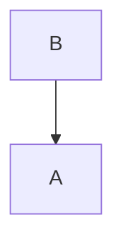
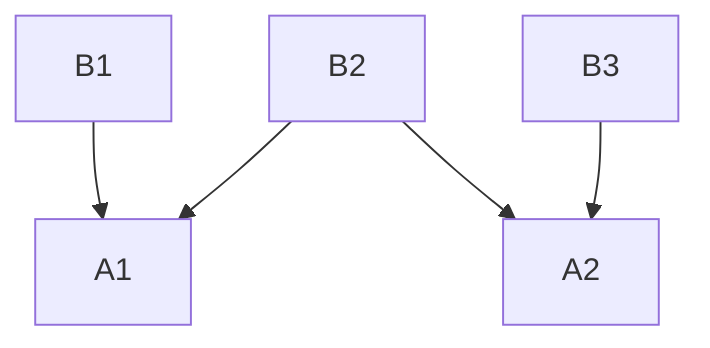
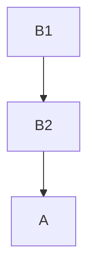


**Provide feedback at the [survey](https://www.surveymonkey.com/r/C855WZW)**



- Reuse Resource Config as Bases to `kustomization.yaml`'s.
- Customize Base for different Environments.
- Reuse a Base across multiple Projects.



# Bases and Variations

## Motivation

It is common for users to deploy several **Variants of the same Resource Config**, or for different projects
to **reuse the same Resource Config**.  The Resource Config produced by a `kustomization.yaml` can be
reused across multiple project using the `kustomization.yaml` as a *Base*.

Examples:

- a project may be deployed to **dev, test, staging, canary and production environments**,
  but with variants between the environments.
- a project may be deployed to **different clusters** that are tuned differently or running
  different versions of the project.


 - [bases](../reference/kustomize.md#bases)
 

## Bases

Bases are shared Resource Config in a `kustomization.yaml` to be used and customized by another `kustomization.yaml`.

Examples of Bases:

- Common Java Base
  - Used in multiple Apps (e.g. Guest Book, Calendar, Auth)
- Common Guest Book App Base
  - Used in multiple Environments (e.g. Test, Staging, Prod)
- Common Prod Guest Book App Base
  - Used in multiple clusters (e.g. us-west, us-east, us-canary)

## Referring to a Base

A project can add a Base by adding a path (relative to the `kustomization.yaml`) to **`base` that
points to a directory** containing another `kustomization.yaml` file.  This will automatically
add and kustomize all of the Resources from the base project to the current project.

Bases can be:

- Relative paths from the `kustomization.yaml` - e.g. `../base`
- Urls - e.g. `github.com/kubernetes-sigs/kustomize/examples/multibases?ref=v1.0.6`

### Diagrams

Single Base inheritted by single Application



Shared Bases inheritted by different Applications





**Example:** Add a `kustomization.yaml` as a Base.


**Input:** The kustomization.yaml file

```yaml
# kustomization.yaml
bases:
- ../base
```

**Base: kustomization.yaml and Resource Config**

```yaml
# ../base/kustomization.yaml
configMapGenerator:
- name: my-java-server-env-vars
  literals:	
  - JAVA_HOME=/opt/java/jdk
  - JAVA_TOOL_OPTIONS=-agentlib:hprof
resources:
- deployment.yaml
```

```yaml
# ../base/deployment.yaml
apiVersion: apps/v1
kind: Deployment
metadata:
  labels:
    app: nginx
  name: nginx-deployment
spec:
  selector:
    matchLabels:
      app: nginx
  template:
    metadata:
      labels:
        app: nginx
    spec:
      containers:
      - image: nginx
        name: nginx
        volumeMounts:
        - mountPath: /etc/config
          name: config-volume
      volumes:
      - configMap:
          name: my-java-server-env-vars
        name: config-volume
```

**Applied:** The Resource that is Applied to the cluster

```yaml
# Unmodified Generated Base Resource
apiVersion: v1
kind: ConfigMap
metadata:
  name: my-java-server-env-vars-k44mhd6h5f
data:
  JAVA_HOME: /opt/java/jdk
  JAVA_TOOL_OPTIONS: -agentlib:hprof
---
# Unmodified  Config Resource
apiVersion: apps/v1
kind: Deployment
metadata:
  labels:
    app: nginx
  name: nginx-deployment
spec:
  selector:
    matchLabels:
      app: nginx
  template:
    metadata:
      labels:
        app: nginx
    spec:
      containers:
      - image: nginx
        name: nginx
        volumeMounts:
        - mountPath: /etc/config
          name: config-volume
      volumes:
      - configMap:
          name: my-java-server-env-vars-k44mhd6h5f
        name: config-volume
```



Bases themselves may also be Variants and have their own Bases. See [Advanced Composition](../app_composition_and_deployment/structure_multi_tier_apps.md)
for more information.




