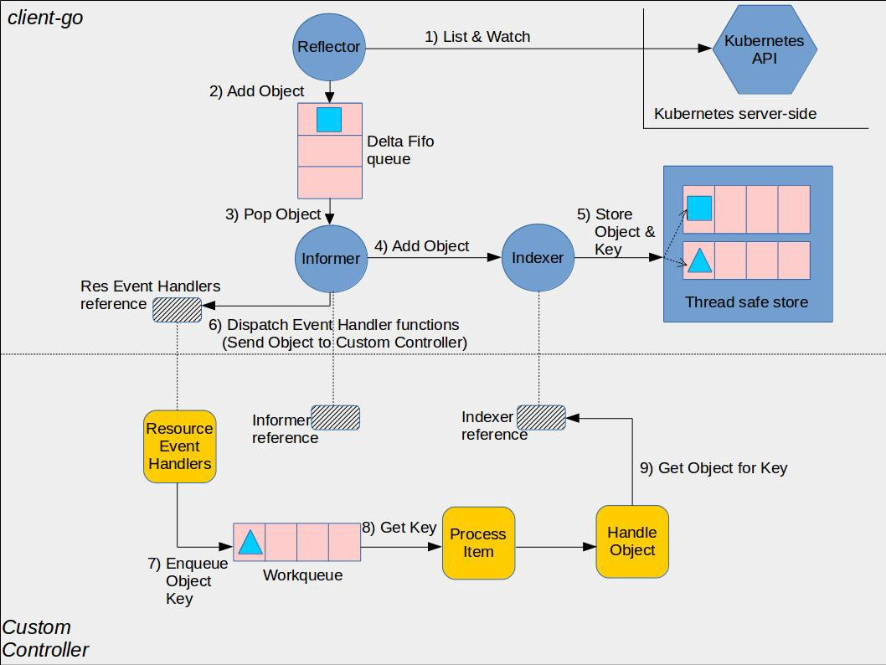

# client-go under the hood

The [client-go](https://github.com/kubernetes/client-go/) library contains various mechanisms that you can use when
developing your custom controllers. These mechanisms are defined in the
[tools/cache folder](https://github.com/kubernetes/client-go/tree/master/tools/cache) of the library.

Here is a pictorial representation showing how the various components in
the client-go library work and their interaction points with the custom
controller code that you will write.

  

## client-go components

* Reflector: A reflector, which is defined in [type *Reflector* inside package *cache*](https://github.com/kubernetes/client-go/blob/master/tools/cache/reflector.go),
watches the Kubernetes API for the specified resource type (kind).
The function in which this is done is *ListAndWatch*.
The watch could be for an in-built resource or it could be for a custom resource.
When the reflector receives notification about existence of new
resource instance through the watch API, it gets the newly created object
using the corresponding listing API and puts it in the Delta Fifo queue
inside the *watchHandler* function.

* Informer: An informer defined in the [base controller inside package *cache*](https://github.com/kubernetes/client-go/blob/master/tools/cache/controller.go) pops objects from the Delta Fifo queue.
The function in which this is done is *processLoop*. The job of this base controller
is to save the object for later retrieval, and to invoke our controller passing it the object.

* Indexer: An indexer provides indexing functionality over objects.
It is defined in [type *Indexer* inside package *cache*](https://github.com/kubernetes/client-go/blob/master/tools/cache/index.go). A typical indexing use-case is to create an index based on object labels. Indexer can
maintain indexes based on several indexing functions.
Indexer uses a thread-safe data store to store objects and their keys.
There is a default function named *MetaNamespaceKeyFunc* defined in [type Store inside package cache](https://github.com/kubernetes/client-go/blob/master/tools/cache/store.go)
that generates an object’s key as `<namespace>/<name>` combination for that object.

## Custom Controller components

* Informer reference: This is the reference to the Informer instance that knows
how to work with your custom resource objects. Your custom controller code needs
to create the appropriate Informer.

* Indexer reference: This is the reference to the Indexer instance that knows
how to work with your custom resource objects. Your custom controller code needs
to create this. You will be using this reference for retrieving objects for
later processing.

The base controller in client-go provides the *NewIndexerInformer* function to create Informer and Indexer.
In your code you can either [directly invoke this function](https://github.com/kubernetes/client-go/blob/master/examples/workqueue/main.go#L174) or [use factory methods for creating an informer.](https://github.com/kubernetes/sample-controller/blob/master/main.go#L61)

* Resource Event Handlers: These are the callback functions which will be called by
the Informer when it wants to deliver an object to your controller. The typical
pattern to write these functions is to obtain the dispatched object’s key
and enqueue that key in a work queue for further processing.

* Work queue: This is the queue that you create in your controller code to decouple
delivery of an object from its processing. Resource event handler functions are written
to extract the delivered object’s key and add that to the work queue.

* Process Item: This is the function that you create in your code which processes items
from the work queue. There can be one or more other functions that do the actual processing.
These functions will typically use the [Indexer reference](https://github.com/kubernetes/client-go/blob/master/examples/workqueue/main.go#L73), or a Listing wrapper to retrieve the object corresponding to the key.